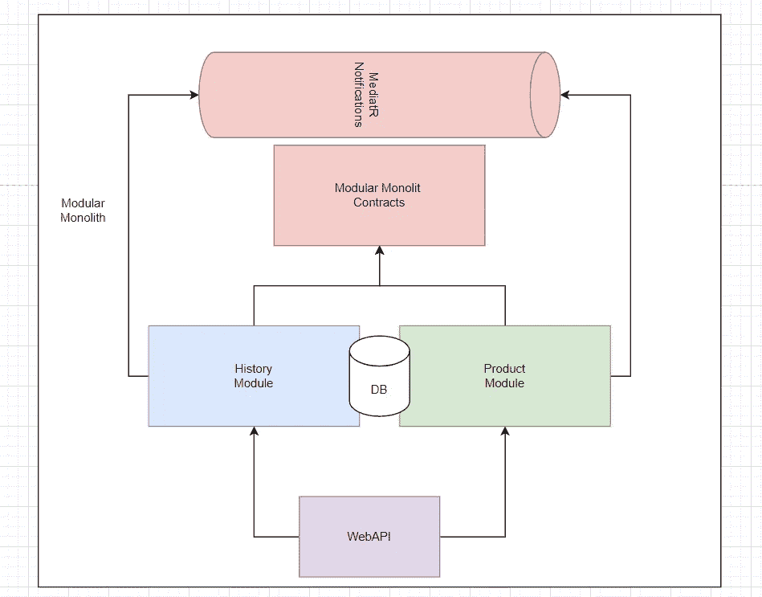
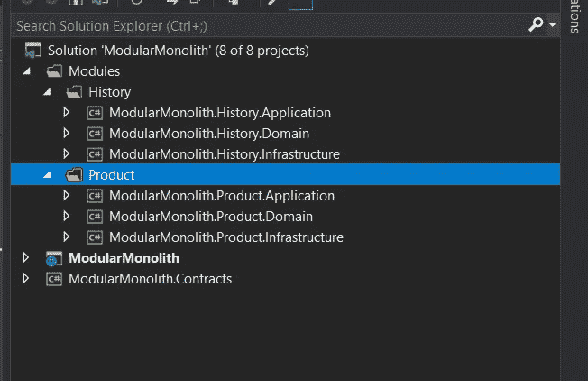
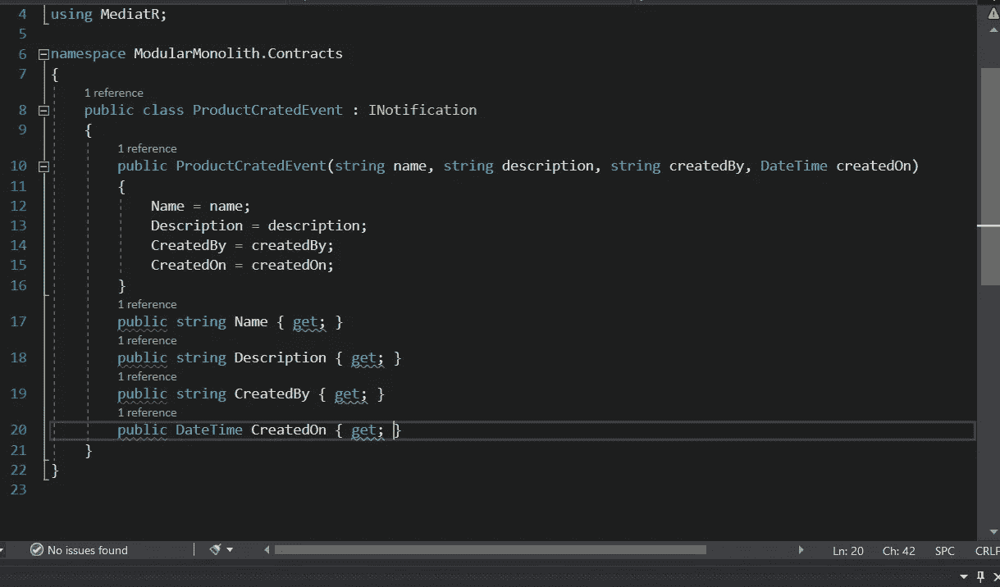
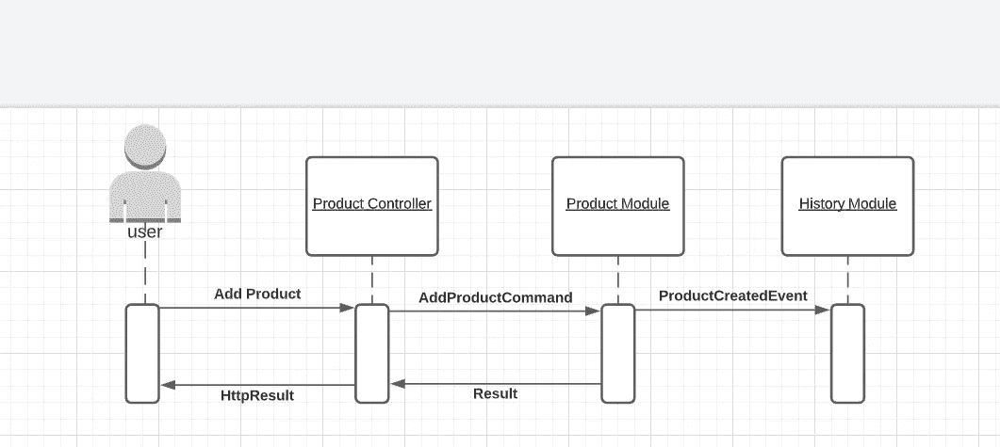
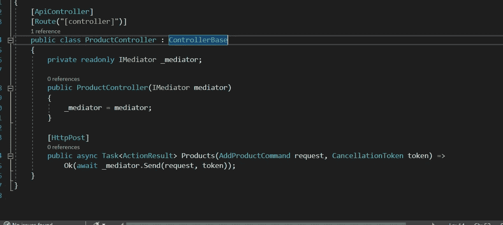
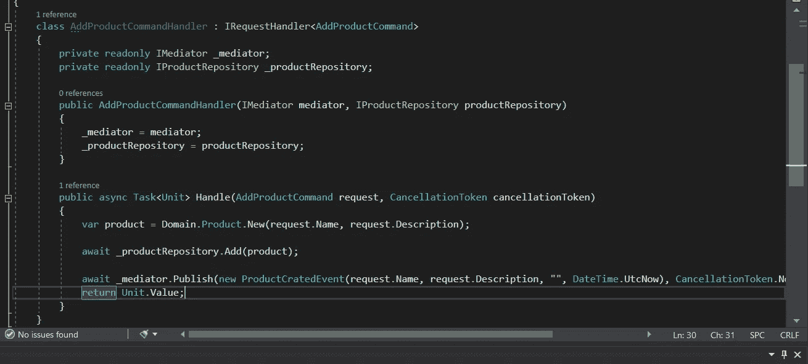
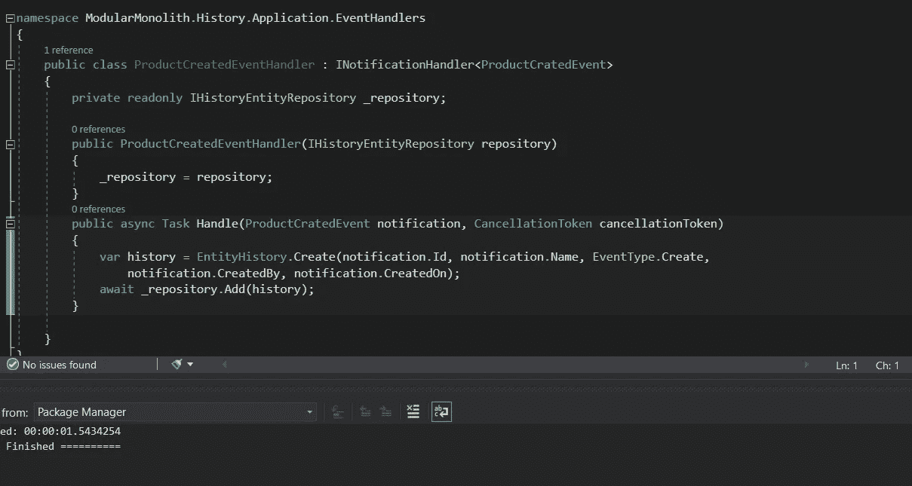

# 简易模块化整体结构—第 1 部分— MVP

> 原文：<https://itnext.io/easy-modular-monolith-part-1-mvp-d57f47935e24?source=collection_archive---------2----------------------->

如今，模块化整体架构方法越来越受欢迎。不是没有原因的。它允许更容易地开始一个项目，更“抗坏设计”，更容易部署和维护。
更重要的是，这是进入微服务世界的第一步！

如何使用**实现这样的架构。网芯**和**联发科**带着 **CQRS*** 引擎盖下？

# 第一步——分析

创建一个复杂系统最重要也是最关键的一步是分析所有的功能性和非功能性需求！这可以通过多种方式实现，但所有方式都有一个共同点——与企业/利益相关者沟通。当我们试图创建一个模块化的整体系统时，我们需要理解到底什么可以并且应该被分割成模块。

本文不会关注这一部分，但我认为这是值得一提的，因为这是创建工作产品的最重要的步骤之一。
进行这种分析的一个很好的工具是使用 ***事件风暴研讨会**** *。*

# 系统结构

## 第一个问题——什么是模块？

让我们问问维基百科:

> **模块化编程**是一种[软件设计](https://en.wikipedia.org/wiki/Software_design)技术，它强调将一个[程序](https://en.wikipedia.org/wiki/Computer_program)的功能分成独立的、可互换的**模块**，这样每个模块都包含执行所需功能的一个方面所需的一切。

# 语境

假设我们试图创建一个“历史”功能，负责跟踪和存储系统中发生的数据/事件。
在第一步(**分析**)之后，我们决定我们应该有两个模块——一个负责“产品”(产品的 CRUD 所有业务规则)，另一个负责存储产品模块中发生的变化的信息。

## 上述设计如何符合“模块”的定义？

*   这两个模块都包含它们自己的基础设施/域/应用层，它们封装了执行功能所需的全部逻辑。
*   尽管它们共享一个 MVP 版本的数据库，但是它们被“模式”分开。
*   模块之间的必要通信由事件以及(将来)由这些模块公开的入口点接口来保证。
*   模块不共享任何可以将它们相互耦合的逻辑。

## 流程:

我们的**产品模块**将成为事件生产者。它将使用 MediatR 发布事件。我们将在 **ModularMonolith 中存储我们所有的事件契约。合同**项目。
**ModularMonolith。合同**项目将被用作历史和产品模块中的参考。它不应该包含任何外部 NuGet 包，而应该包含 MediatR。

合同示例

现在，当我们有一份合同时，让我们看看如何使用它:

执行顺序如下所示:

这个怎么翻译成代码？
在 API 项目中，让我们创建一个产品控制器:

ProductController 包含执行“命令”的简单逻辑。该动作的命令和命令处理程序存储在**产品模块**本身中。
让我们来看看:

上述命令处理程序最重要的部分是包含 _mediator.Publish 的那一行。mediator 现在发布的事件将由所有订阅者处理。在我们的例子中——模块历史**。
让我们来看看:**

我们在**产品模块**中产生的事件由**历史模块**处理！

## 共享数据库—唯一模式

为了简单起见，在 MVP 版本中，我共享一个数据库实例。我通过将每个模块表分成一个单独的模式来保证数据的独立性。这可以通过 EF 内核轻松实现。

设置模式

警告是每个模块不应该直接使用来自其他模式的表！

# 总结:

*   WebApi 项目是应用程序的入口点。
*   每个模块都封装了执行功能所需的全部逻辑。
*   模块使用 MediatR 事件相互通信。
*   数据库是共享的，但是我们通过用模式分隔表来保证独立性。

## **优点:**

*   非常灵活——允许非常快速地更改模块限制的上下文。
*   更容易测试(集成测试)。
*   更容易添加可观察性(日志/度量)。
*   开发和维护“分布式事务”要容易得多。
*   简单的基础设施。
*   简单的部署/发布。

## 缺点:

*   可扩展性问题—所有模块都作为单个实例托管。
*   数据库可伸缩性的问题—共享数据库实例。
*   可能违反数据独立性。
*   数据一致性的潜在问题(如果多个通知使用者中的一个失败)。

# 在下一部分:

*   发件箱模式—保证事件传递。

 [## 简易模块化整体结构—第 2 部分—发件箱模式

ridikk12.medium.com](https://ridikk12.medium.com/easy-modular-monolith-part-2-the-outbox-pattern-b4566724fb68) 

# **未来(此列表可以更改):**

*   可观察性。
*   数据库方法(多个数据源)。
*   准备微服务(用 RabbitMq 代替 MediatR)。
*   迁移到微服务。

# 完整代码可在此处获得:

[https://github.com/Ridikk12/ModularMonolith](https://github.com/Ridikk12/ModularMonolith)

# 参考

*   [https://en . Wikipedia . org/wiki/Event _ storming #:~:text = Event % 20 storming % 20 is % 20a % 20 workshop，notes % 20 on % 20a % 20 wide % 20 wall](https://en.wikipedia.org/wiki/Event_storming#:~:text=Event%20storming%20is%20a%20workshop,notes%20on%20a%20wide%20wall)。
*   [https://en . Wikipedia . org/wiki/Event-driven _ architecture #:~:text = Event % 2d driven % 20 architecture % 20(EDA)，sale % 22 % 20to % 20 % 22sold % 22。](https://en.wikipedia.org/wiki/Event-driven_architecture#:~:text=Event%2Ddriven%20architecture%20(EDA),sale%22%20to%20%22sold%22.)
*   [https://Martin fowler . com/bliki/cqrs . html #:~:text = CQRS % 20 stands % 20 for % 20 command % 20 query，you % 20 use % 20 to % 20 read % 20 information](https://martinfowler.com/bliki/CQRS.html#:~:text=CQRS%20stands%20for%20Command%20Query,you%20use%20to%20read%20information)。