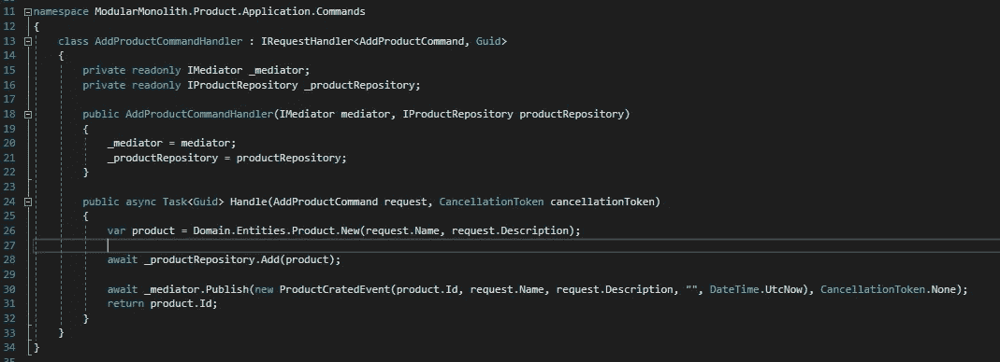
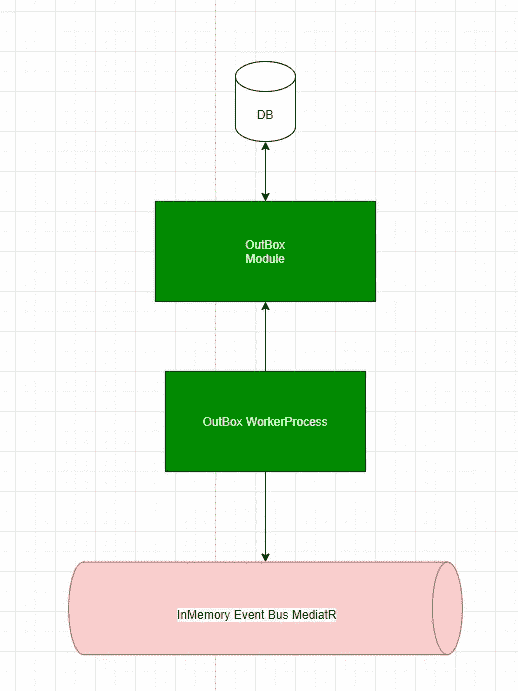
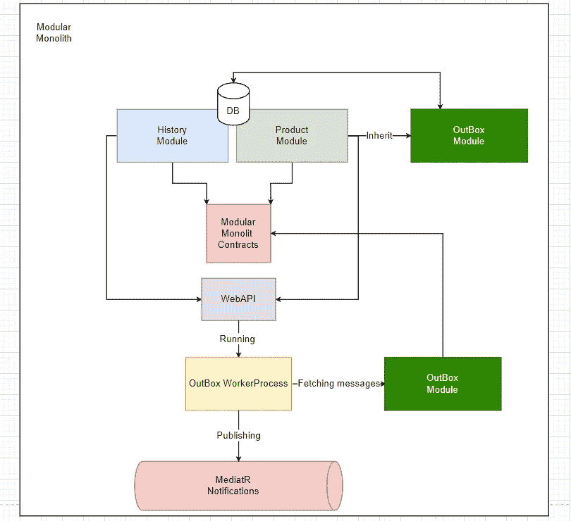
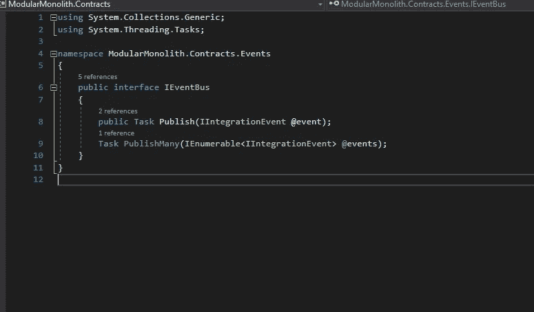
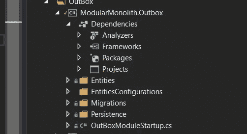
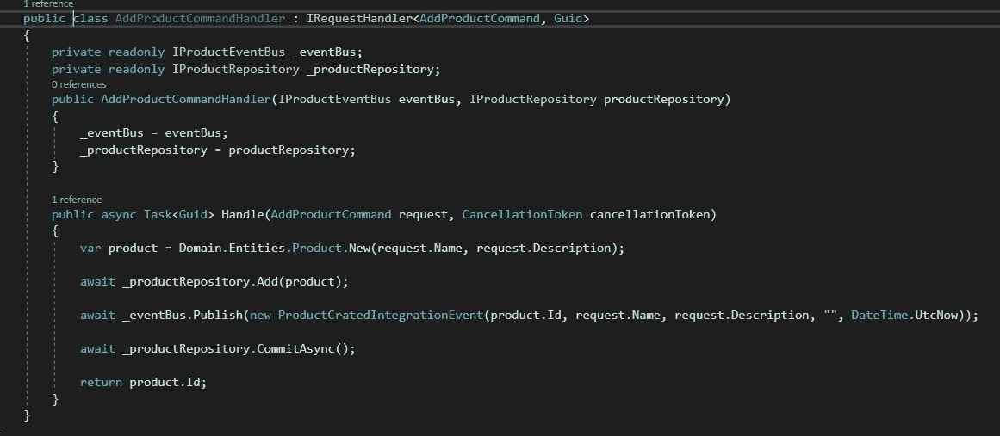
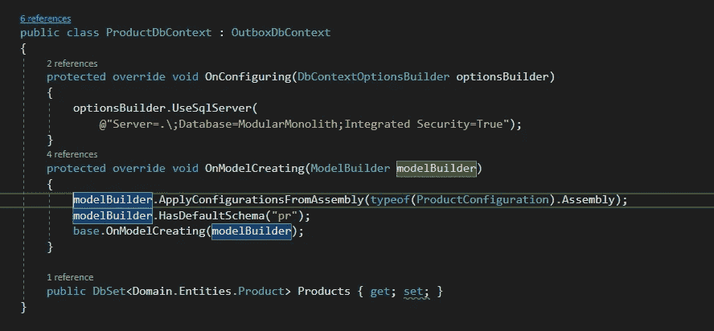
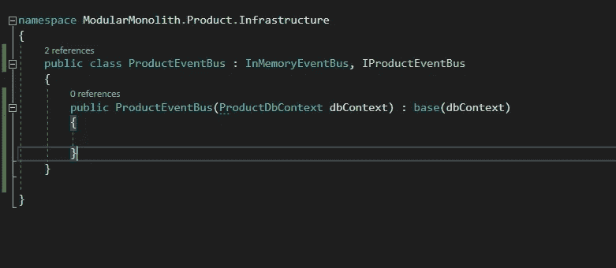
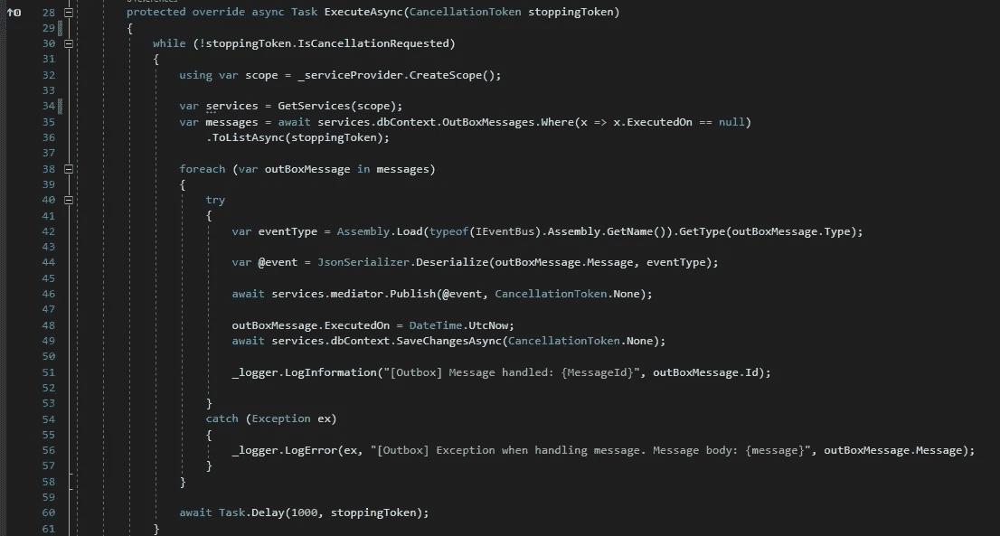

# 简易模块化整体结构—第 2 部分—发件箱模式

> 原文：<https://itnext.io/easy-modular-monolith-part-2-the-outbox-pattern-b4566724fb68?source=collection_archive---------1----------------------->

在第一部分中，我们以模块化的方式准备了一个简单应用程序的 MVP 版本。有了框架，我们就可以实现进一步的改进。

在本文中，我们将尝试实现一个发件箱模式，它将为我们处理消息传递，更重要的是，确保消息的消费者能够收到消息。

在 IT 系统领域，有一件事是肯定的——如果某个东西可能会失败，它迟早会失败。让我们来看看我们的**addproductcommandler**。

我们可以看到的是，在我们将数据保存到我们的数据库后，我们产生了一个应该由其他“模块”消费的事件。在一个完美的世界里，发送这个事件永远不会失败，消费者总是能够处理它——但在我们的世界里不会:)

没有搜索很远—mediator 可能由于某种原因无法发布事件—配置错误/基础设施失败等。即使在成功发布之后，事件处理程序仍然会因为一些内部规则/验证/问题而抛出异常。MVP 版本不能很好地处理这种情况——在失败的情况下，我们将以不一致的数据结束——更何况我们没有存储关于失败的信息，我们缺乏上下文，无法做出反应。

# 体系结构

为了防止这种情况，我们将实现一种叫做“发件箱模式”的东西。这种模式背后的整个想法是，不要立即发布消息，而是将它存储在某个地方，并将发布的责任转移给其他人。

**重要的警告是记住保存消息和 CommandHandler 中的更改应该发生在一个事务中！**

看一下上面的图片——看起来非常简单——我们有 OutBox 模块，它处理将消息存储到 DB 中，还有 WorkerProcess，它使用 OutBox 模块获取消息，并通过 MediatR 通知发布它们。

让我们试着将它连接到我们的 ModularMonolith 应用程序——它看起来有点不同，也更复杂，但整体思想是相同的。

Web Api 项目是我们进入应用程序的入口点。它注册所有其他依赖项，因此可以访问任何模块。这里最大的变化是它将注册两个新的东西。

*   发件箱模块—从数据库中迁移和获取存储的消息。它包含一个 OutboxDbContext，用于将发件箱数据集传递给其他模块。
*   发件箱工作进程—后台进程，将分派所有未处理的消息，并将它们发布到 MediatR 通知。

这个想法是将所有发件箱消息(来自我们的任何模块)存储到同一个数据库和表中的一个单独的模式中— **out.OutBoxMessages.**

# 履行

## 契约

首先，我们需要在消息发布接口上创建一个抽象。这将允许我们在将来实现多种处理消息发布的方式。现在它将有如下两种方法:

正如你所看到的，也有一个新的界面。**iintegratineven**接口将是所有应该在模块间发布的事件的标记接口。

## 发件箱模块

发件箱模块会比历史或者产品简单很多。让我们把它弄平。

如你所见，这里的大部分代码属于基础设施层。从实用的角度来看，没有理由像在产品和历史模块中那样进行拆分。这里没有任何与域/应用相关的东西的计划，即使这样，我们也可以通过按文件夹而不是小项目划分层来扩展这种方法。

此外，该模块的使用方式也有所不同。它包含了发件箱模式的基本逻辑，因此它将被任何想要启用发件箱支持的模块引用。

这里最重要的部分是我们的 OutBoxDbContext，它用于交付负责保存/获取发件箱消息的代码。

OutBoxMessage 实体如下所示:

在 Type 属性中，我们将存储关于消息类型的信息(例如 ProductCreatedEvent)。
在消息属性中——“类型”的整个序列化对象。
这两个属性稍后将在 WorkerProcess 中用于反序列化消息。

## ModularMonolith。基础设施

在这个项目中，我们将实现横切功能*——在这种情况下，它将是一个处理发布消息的 **InMemoryEventBus** 。在这个版本中，我们将只处理**iintegratinevent。**

如您所见，MediatR 不会立即发布消息，而是将它们存储在我们的数据库中。由于这一点，我们将能够在以后获取并处理所有这些消息。

这个 EventBus 实现中最棘手的部分是如何在不违反 DRY 原则的情况下实现它。正如我前面提到的，警告是命令处理程序的改变和保存消息必须在一个事务中发生。

再来看看我们的 **AddProductCommandHandler** 。正如您所看到的，这里有几行新代码:
第一行调用 EventBus 上的 Publish(第 27 行)，第二行调用存储库上的 Commit()(第 29 行)。

Ef Core 的工作方式是，在其生命周期中添加到上下文的所有更改都不会提交到数据库，直到调用 SaveChange。

在本系列的第 1 部分中，我们的存储库在“Add”方法中调用 SaveChanges，立即提交事务。在这个版本中，我们将稍后调用 commit 在调用 EventBus 上的“Publish”之后。

## 那么这里有什么棘手的呢？

我们可以有多个模块，它们都将使用同一个实体- **OutBoxMessage** 。我们不希望创建多个数据库上下文，并在它们之间共享一个数据库连接，以允许在一个事务中提交—当我们将来想要将我们的模块移动到单独的微服务*时，这将使我们的生活变得更加困难。

让我们再来看看我们的内存事件总线:

如您所见，作为输入参数，它接受 OutBoxDbContext。
整个想法是——在我们想要应用发件箱的模块中——通过 OutBoxDbContext 继承“模块”DbContext，如下所示:

然后，我们应该创建一个独立的、具体的模块 EventBus，它将从我们的基础 InMemoryEventBus 继承——它将允许我们在运行时解析正确的 EventBus:

## 好的——那么这里发生了什么？

这允许我们在 InMemoryEventBus 和 CommandHandler 之间共享 DbContext 的一个实例(因为它注册为 scoped)——因此 Commit()将保存来自命令处理程序的所有更改，并在一个事务中“发布”。

## 工作进程

worker 进程是我们的特殊人员，负责从数据库中获取所有消息，并使用 MediatR 发布它们。
我们来看看:

首先，我们需要从 DI 容器中获取两个服务。(第 34 行)
OutBoxDbContext 用于 DB 访问，MediatR 用于发布。

最重要的部分发生在循环中(第 38 行)。
首先，我们需要确定信息的类型。由于我们的模块化整体是一个应用程序，我们能够加载一个包含所有契约(Modular Monolith)的 DLL。合同项目)并从那里解决类型。(第 42 行)
有了契约类型，我们就能够反序列化消息。(第 44 行)。

接下来，我们使用 MediatR 发布一个消息。如果一切正常，我们更新 ExecutionData，记录关于处理消息的信息，并转移到下一个。
如果出现错误，记录错误信息并尝试处理下一条消息。重要的是，在这个版本中，我们不会实现任何更复杂的错误处理方式(重试/有害消息/通知)。这是将会发生的事情，并且已经放在路线图中:)

这种方法的缺点是工作进程在循环中处理消息。在我们的例子中，它每 1 秒执行一次消息。如果我们被迫处理大量的消息，那么这个地方将成为我们的瓶颈。我们将来会更仔细地研究这个问题。

## 没错。

我们有一个可行的解决方案，可以保证我们的信息得到存储和处理。在最近的功能中，我们将改进发件箱中处理异常的方式，使解决方案更能抵抗失败。

# 总结:

*   OutBoxPattern 是一种模式，它通过将消息持久化(在一个事务中)并将分派委托给外部“应用程序”来保证将消息传递给消费者。
*   OutBoxModule 提供了一个 OutBoxDbContext，可以在其他模块中使用它来提供发件箱支持。要为下一个模块添加对 Outbox 的支持，我们只需要通过 OutBoxDbContext 继承 DBContext，并通过继承 InMemoryEventBus 创建一个模块 EventBus。

# 完整代码可在此处获得:

[https://github . com/ridikk 12/ModularMonolith/tree/outbox pattern](https://github.com/Ridikk12/ModularMonolith/tree/OutBoxPattern)

# 上一个:

 [## 简易模块化整体结构—第 1 部分— MVP

ridikk12.medium.com](https://ridikk12.medium.com/easy-modular-monolith-part-1-mvp-d57f47935e24) 

# 在下一部分:

 [## 简易模块化整体式设备—第 3 部分—测井

### 在一个完美的世界里，IT 系统中没有漏洞和维护的位置。作为开发人员，我们更喜欢提供新的…

ridikk12.medium.com](https://ridikk12.medium.com/easy-modular-monolith-part-3-logging-57caceac1ff5) 

# 将来(此列表可能会更改):

*   发件箱改进。
*   域事件。
*   单元/集成测试。
*   存储配置。
*   模块之间的直接通信。
*   数据库方法(多个数据源)。
*   准备微服务(用 RabbitMq 代替 MediatR)。
*   迁移到微服务。

## 参考资料:

https://docs . Microsoft . com/en-us/ef/core/saving/transactions
https://micro services . io/patterns/data/transactional-outbox . html
[https://en . Wikipedia . org/wiki/Cross-cutting _ concern #:~:text = Cross % 2d cutting % 20 concerns % 20 are % 20 parts，面向% 20 编程% 20 或% 20 程序性% 20 编程](https://en.wikipedia.org/wiki/Cross-cutting_concern#:~:text=Cross%2Dcutting%20concerns%20are%20parts,oriented%20programming%20or%20procedural%20programming)。