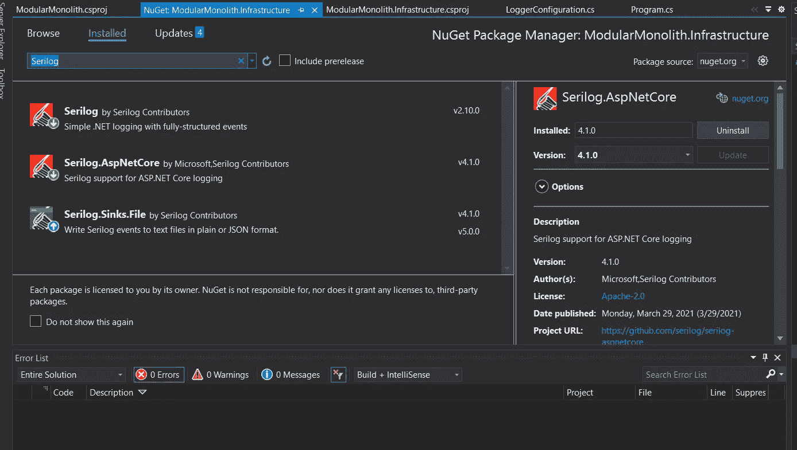
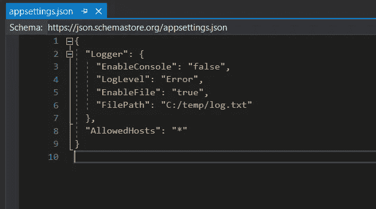
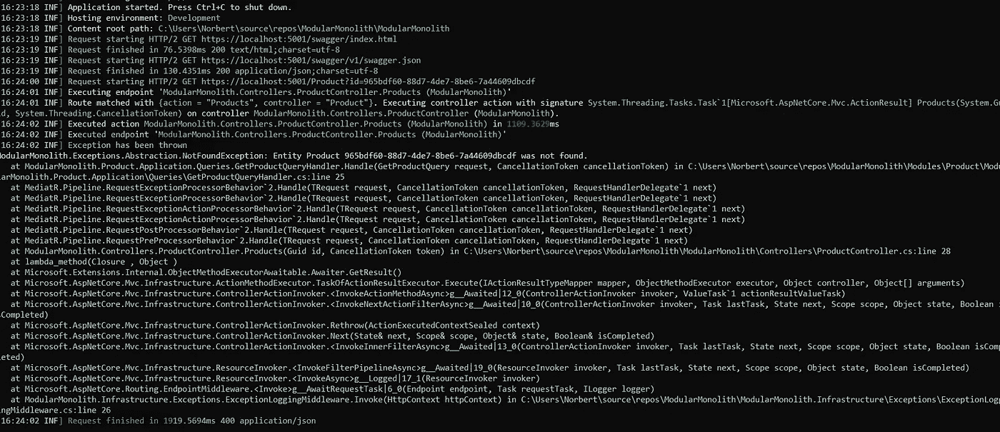
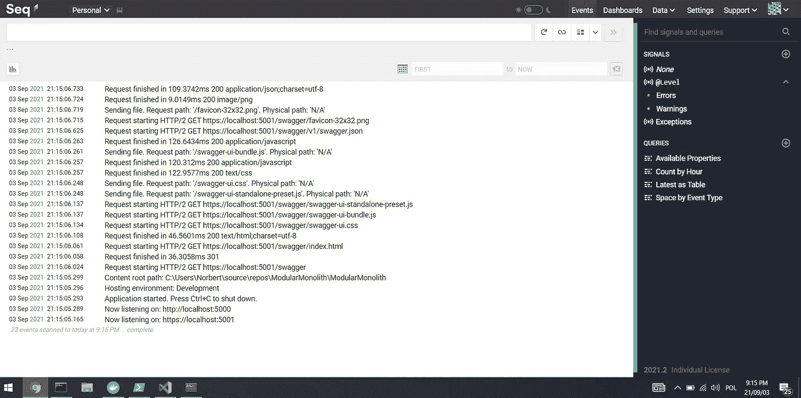
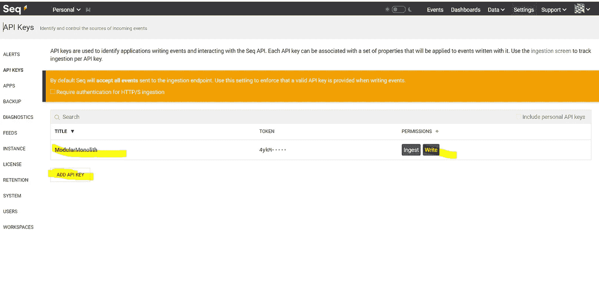

# 简易模块化整体式测井仪—第 3 部分—测井(Serilog 及以下)

> 原文：<https://itnext.io/easy-modular-monolith-part-3-logging-57caceac1ff5?source=collection_archive---------6----------------------->

在一个完美的世界里，IT 系统中没有漏洞和维护的位置。作为开发人员，我们更喜欢交付新东西，而不是维护旧代码和修复错误。但是在大多数软件系统中，我们必须维护一些东西，修复一些问题或者改变当前实现的逻辑。

如何让我们的生活更轻松，让我们做上面的事情快很多？
从**开始实施测井！**

## 什么是日志记录？

日志记录是存储有关系统中发生的事件的信息的操作。存储的信息称为日志。
日志记录是可观察性的三大支柱之一，与跟踪和指标并列。
由于它提供了事件的上下文数据，因此我们可以节省大量故障排除时间。

来自 ModularMonolith 应用程序的示例日志

## 我们应该记录什么？

实现日志记录最关键的部分是它应该主要用作诊断工具。
日志记录不应包含任何敏感数据，如密码、令牌和任何被视为隐私和机密的东西。

## 在我们的示例中，我们将重点关注日志记录:

*   请求流—能够跟踪执行流。
*   性能统计—对缓慢的请求进行故障排除。
*   例外—为了更容易维护和修复错误。

# 履行

## 要求:

*   至少在两个地方记录信息——我们应该能够在控制台(对于开发环境)和文件(对于生产环境)中看到日志。
*   我们应该能够从 appsettings.json 文件中更改配置。
*   实现应该是灵活的，允许我们很容易地添加更多的“接收器”(保存日志的地方)。

记住这些要求，让我们实现一个解决方案。

## 测井工具

首先，我们应该选择测井工具。有几个选项值得考虑，但根据我的经验 **Serilog*** 是正确的选择。

## 为什么是 Serilog？

*   使用方便
*   灵活的
*   出色的文档
*   接收器插件(MsSql，Seq 等)。

## 代码:

让我们在我们的**模块中安装 Serilog NuGet 包。基础设施**项目:

接下来，让我们创建一个新的扩展方法，它将为我们注册一个日志记录器。

上面的代码试图从 appsettings . JSON(14–16)中解析变量，然后用相应的“接收器”注册一个日志记录器。

配置文件如下所示:

*   **EnableConsole** 和 **EnableFile** 将告诉日志记录器哪个 sink log
*   **文件路径** —启用 EnableFile 时文件的路径。该路径将包含我们的日志文件。
*   **日志级别** —告诉记录器哪些日志应该写入“接收器”。只会记录所选级别及以上级别的日志。

在 **WebApi** 项目中，让我们添加新的扩展——这将在应用程序中启用 logger。

让我们看看，如果我们运行应用程序并尝试向某个端点发出请求，现在会发生什么:

控制台中的记录器输出

正如您在上面的图像中所看到的，控制台输出中列出了所有重要的消息。相同的输出被保存到服务器硬盘上的文件中，这样我们就可以在应用程序关闭的情况下恢复它。如果需要，我们可以在应用程序中添加新的接收器。取决于我们到底想要实现什么有多个 Serilog sinks 扩展。

你可以在这里找到所有可用的水槽:
[https://github.com/serilog/serilog/wiki/Provided-Sink](https://github.com/serilog/serilog/wiki/Provided-Sinks)

## SEQ

[Seq](https://datalust.co/seq) 是专为现代结构化日志数据构建的智能搜索、分析和警报服务器。它将允许我们以非常方便的方式查看日志。
让我们看看如何轻松地将其添加到 ModularMonolith 解决方案中。

首先，为 seri log:
[https://github.com/serilog/serilog-sinks-seq](https://github.com/serilog/serilog-sinks-seq)
安装一个额外的接收器，然后我们将更新我们的 LoggerConfiguration 类。

在第 32 行我们看到了一个新的部分——我们需要做的就是调用新的 WriteTo 方法。
作为参数，我们应该传递 Seq 服务器的 URL 地址和 API 键。

如何设置序列服务器

*   将其安装在您的计算机/服务器上。
*   通过使用 Docker。

我们将在本文中使用第二种方法:

首先在你的机器上安装 docker:
[https://www.docker.com/products/docker-desktop](https://www.docker.com/products/docker-desktop)
然后你需要做的就是在你的控制台中调用它:

现在，当我们转到 [http://localhost:5341/](http://localhost:5341/) 时，我们应该会看到一个 seq 页面:

为了让我们的日志出现在这个页面上，我们还需要做一件事。
导航到:[http://localhost:5341/#/settings/api-keys](http://localhost:5341/#/settings/api-keys)并创建一个在我们的应用程序中用于配置 sink 的 API 密钥:

# 摘要

日志提供了关于请求流、完成请求所需的时间以及应用程序中发生的所有异常的信息。有了这些信息，我们能够更快地解决问题。

使用 Seq 这样的工具可以更快更有效地处理日志，特别是当我们是支持团队的时候:)

在下一篇文章中，我们将看看全局异常处理，以及如何记录来自任何模块的信息。

# 完整代码可在此处获得:

[https://github.com/Ridikk12/ModularMonolith/tree/Logging](https://github.com/Ridikk12/ModularMonolith/tree/Logging)

# 上一个:

 [## 简易模块化整体结构—第 2 部分—发件箱模式

ridikk12.medium.com](https://ridikk12.medium.com/easy-modular-monolith-part-2-the-outbox-pattern-b4566724fb68) 

## 在下一部分:

*   异常处理—可观察性

# 将来(此列表可能会更改):

*   认证/授权
*   发件箱改进。
*   域事件。
*   单元/集成测试。
*   存储配置。
*   模块之间的直接通信。
*   数据库方法(多个数据源)。
*   准备微服务(用 RabbitMq 代替 MediatR)。
*   迁移到微服务。

# 参考资料:

 [## Serilog -简单。具有完全结构化事件的. NET 日志记录

### Serilog 消息模板是一个简单的 DSL 扩展。NET 格式字符串。参数可以被命名，它们的值是…

serilog.net](https://serilog.net/)  [## Docker 入门

### 序列在 Docker 上可作为 datalust/seq 获得。Seq 的基于 Linux 的 Docker 映像非常适合部署到 Linux 主机和…

docs.datalust.co](https://docs.datalust.co/docs/getting-started-with-docker) 

## 值得检查:

https://github.com/serilog/serilog-settings-configuration[—作为我们定制代码的替代方案，整个 Serilog 配置可以通过 appsettings.json 文件使用这个包来完成。](https://github.com/serilog/serilog-settings-configuration)