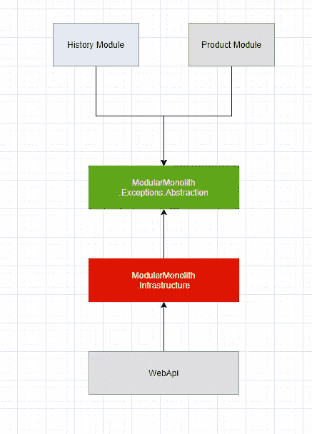
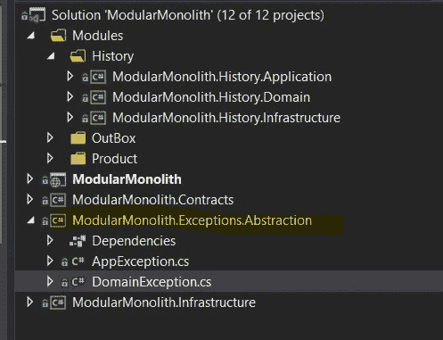
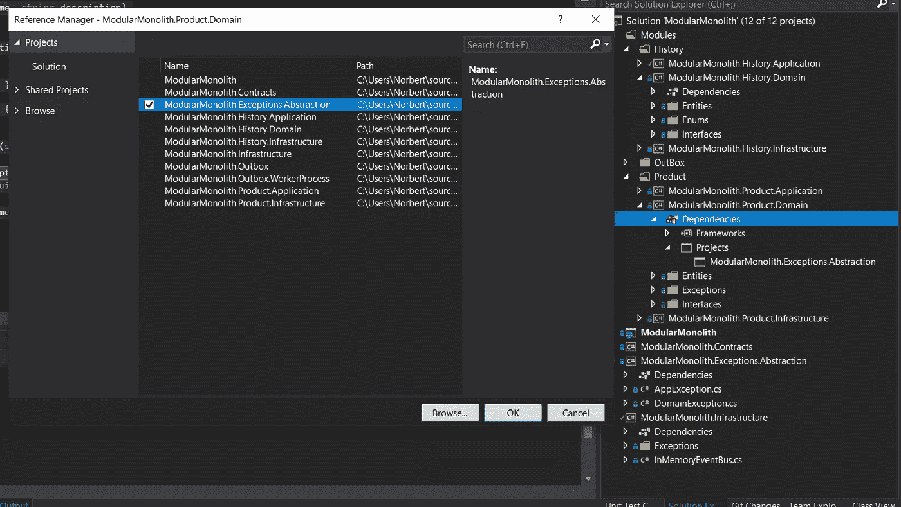
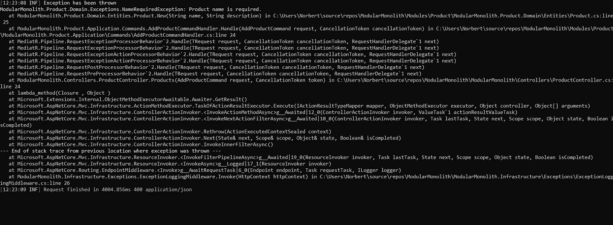
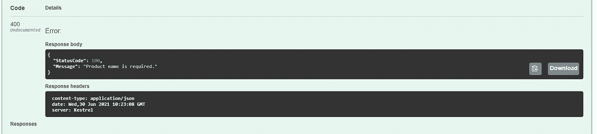

# 简易模块化整体结构—第 4 部分—全局异常处理

> 原文：<https://itnext.io/easy-modular-monolith-part-4-global-exception-handling-8355cc4905d4?source=collection_archive---------1----------------------->

**全局异常处理**是我们将在模块化应用中实现的下一个特性。它将允许我们处理系统中所有不可预测和可预测的异常，并处理它们——记录它们并向客户端返回一条用户友好的消息。

# 体系结构

让我们建立一些要求。

*   我们希望有一个单一的地方，可以捕捉任何模块的异常。
*   我们应该能够将异常转换成用户友好的消息。

## 在一个地方抓住他们

获取. net 核心应用程序中任何请求的上下文的最简单方法是使用中间件。对我们的应用程序的每个请求都需要访问中间件，因此我们将能够采取行动——在我们的例子中，记录异常并准备一条用户友好的消息返回给客户端。
这将是“一个抓到所有人的地方”。
让我们来看看:

将 try/catch 语句中的第 26 行换行将保证，如果任何(几乎)未处理的异常将在管道中的任何地方抛出，我们将在这里捕获它。
功能的核心在于“捕捉”语句。

*   首先，基于异常类型，我们解析一个日志记录级别—所有域和应用程序异常都将被记录为“ ***信息*** ”，因为这些异常是我们预测可能发生的。如果有任何其他异常，我们会将其记录为错误。
*   接下来，我们解析一个 **HttpStatusCode** —对于预测的异常返回 400。出乎意料的 500 英镑。
*   最后但同样重要的是创建一个用户友好的消息，该消息将被返回给客户机。这就是我们的状态代码可以派上用场的地方——基于它，我们可以将一个

最后要做的是写一个响应——它将被返回给客户机。

## 异常抽象

上述中间件存储在 **ModularMonolith 中。基础设施**项目是我们全球基础设施的一部分。它使用在 **ModularMonolith 中声明的公共接口。Exceptions.Abstraction** 提供了抽象类，系统中的所有异常都将继承这些类。
这将允许我们在一个地方处理来自每个模块的异常——exceptionlogginmiddleware。

这种想法基于将异常分为两种类型:

*   **域异常** —来自我们的域层的所有异常(NameToShort、EmptyDescription 等。).

*   **应用异常** —来自应用层的所有异常(未发现、已发现等)。).

这两个是基类，我们可以在模块中创建定制的异常。异常抽象将存储在新项目 **ModularMonolith 中。异常。抽象**。

这两个类都包含一个名为 **StatusCode** 的额外属性，该属性用于在中间件中创建用户友好的消息。因此，我们有一个单一的地方，将处理我们的异常，并准备用户友好的消息。

## 用法:

让我们在**产品模块**中创建一个**域异常**。为了能够使用我们的 DomainException 类，我们必须引用 **ModularMonolith。异常。抽象**到 **ModularMonolith。Product.Domain** 项目。

产品模块名称必需的异常

我们可以在产品实体中使用这个新类(第 23 行)。

以下是我们使用空产品名称请求时的结果:

*   我们的记录器已经记录了该异常。

*   正确的状态代码和消息已返回给客户端。

# 摘要

在异常处理上创建抽象使得我们在维护整体功能方面更加容易。我们不再跨模块进行多次尝试/捕捉，而是将这一职责转移到一个地方——我们的中间件。

# 完整代码可在此处获得:

[https://github.com/Ridikk12/ModularMonolith/tree/Logging](https://github.com/Ridikk12/ModularMonolith/tree/Logging)

# 上一个:

 [## 简易模块化整体式设备—第 3 部分—测井

### 在一个完美的世界里，IT 系统中没有漏洞和维护的位置。作为开发人员，我们更喜欢提供新的…

ridikk12.medium.com](https://ridikk12.medium.com/easy-modular-monolith-part-3-logging-57caceac1ff5) 

# 在下一部分:

*   模块之间的直接通信。

# 将来(此列表可能会更改):

*   认证/授权
*   发件箱改进。
*   域事件。
*   单元/集成测试。
*   存储配置。
*   模块之间的直接通信。
*   数据库方法(多个数据源)。
*   准备微服务(用 RabbitMq 代替 MediatR)。
*   迁移到微服务。

# 参考资料:

 [## ASP。网络核心中间件

### 由里克安德森和史蒂夫·史密斯中间件是软件组装成一个应用程序管道，以处理请求和…

docs.microsoft.com](https://docs.microsoft.com/en-us/aspnet/core/fundamentals/middleware/?view=aspnetcore-5.0)