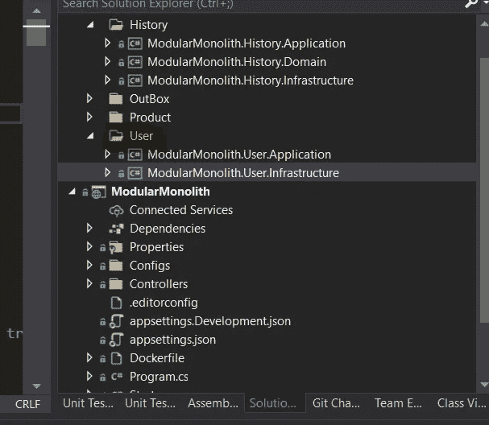
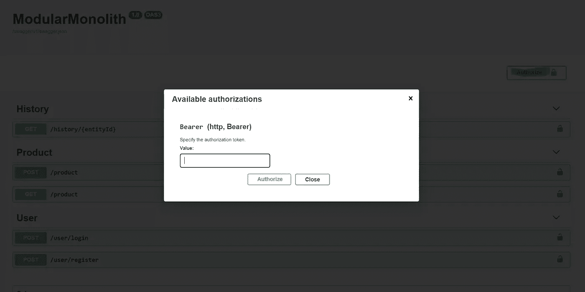

# 简易模块化整体结构—第 5 部分— JWT 认证/授权

> 原文：<https://itnext.io/easy-modular-monolith-part-5-jwt-authentication-authorization-f7a0a275226f?source=collection_archive---------1----------------------->

在 ModularMonolith 中，我们将使用 **JSON Web Token** 和 **Asp 核心身份**实现**认证**和**授权**。

## 在我们开始一个小理论之前:

**认证**—是关于确认你的 ID。如果你去银行，你必须出示你的身份证来证明你是你——在我们的系统中也是一样的。我们将通过发送用户名和密码来实现这一点——如果它们与我们系统中的匹配，您将获得一个访问令牌。

**授权** —这是关于你拥有什么样的特权/角色。基于此，您将获得(或不获得)对系统某些部分的访问权。

## 完整示例:

你来办公室用**你的 id 磁卡(身份证明)**通过正门(**认证**)。当你在公司时，基于你在公司的角色(软件开发人员/测试人员等。)，您将可以访问分配给您的职位的资源(工具/系统/)。如果你试图访问你的角色之外的资源，那么你将被拒绝(你不能进入你老板的办公室——你的卡不允许你绕过门)**授权**)。

## JSON Web 令牌:

> JSON Web Token (JWT)是一个开放标准(RFC 7519 ),它定义了一种紧凑的自包含方式，以 JSON 对象的形式在各方之间安全地传输信息。该信息可以被验证和信任，因为它是数字签名的。jwt 可以使用秘密(使用 **HMAC** 算法)或使用 **RSA** 或 **ECDSA** 的公钥/私钥对进行签名。

## [ASP.NET 核心身份](https://docs.microsoft.com/en-us/aspnet/core/security/authentication/identity?view=aspnetcore-5.0&tabs=visual-studio):

是一个框架，它:

> 管理用户、密码、配置文件数据、角色、声明、令牌、电子邮件确认等。

# 体系结构

**要求:**

*   用户能够注册一个新账户。
*   用户能够使用用户/密码登录。(**认证**)
*   基于他的角色，用户应该能够访问一些受保护的资源。(**授权**)

## 实施:

首先，让我们创建一个新模块，负责处理我们系统中的所有用户帐户。它的结构将和其他的几乎一样。
在这个模块中，目前我们还没有一个领域项目。我们没有它，因为 **Asp 核心标识**为我们处理我们试图实现的功能所需的所有域对象。

## 大幅改进:

到目前为止，只有经过身份验证的用户才能访问我们的资源端点，让我们改进我们的 Swagger 文档页面，使发送经过身份验证的请求更加容易。它将包含一个新的“**授权**”按钮，这将允许我们把一个 JWT 令牌放在那里，该令牌将在每个请求的标题中自动发送。

负责这个额外按钮的代码在**第 47 行**中定义(代码如下)。
没有火箭科学:
首先，我们需要添加安全定义，告诉 Swagger 通过 HTTP 头发送 JWT。之后，我们应该添加 SecurityRequirements，告诉 Swagger 我们希望将我们的定义全局应用到它的每个端点。

好了，斯瓦格准备好了。

作为身份验证的准备，我们需要启用它。很简单——**第 89 行和第 90 行**这样做。

## 证明

为了提供身份验证(通过用户名和密码登录)，我们将使用一个名为 **ASP 核心身份的框架的一部分。**
整个框架可用于交付完整的账户管理功能(包括登录/注册视图等前端部分)。
在我们的场景中——由于 ModularMonolith 是 WebApi，我们将只使用它的一部分。

**第 21 行**定义了我们身份功能的注册。重要的是，我们使用 **AddIdentityCore** 而不是它的完整版本 AddIdentity，它注册的比我们需要的多得多(角色/cookie 认证模式等)。

它将注册 **UserManager** 类，该类提供了几个重要的方法，如:

*   用户群
*   验证用户名和密码

在**第 24 行**中，我们有一个大的“配置”方法，围绕用户帐户的要求设置一些基本的东西。当我们尝试调用注册用户方法时，这些选项将被验证。如果验证失败，我们将收到一条错误消息。

**第 45 行**注册将要使用的认证模式。在我们的例子中，按照 JWT 的方式，我们注册了 JWTBearer 模式。
**第 50 行**注册一个中间件，该中间件将验证用**【Authorize】**属性修饰的每个请求。

## 注册用户帐户

注册 Asp 核心身份基本组件后，让我们转到一个允许我们创建用户帐户的命令。

非常简洁的命令处理程序——它所做的只是调用 UserManager 类的 Create 方法。因此，我们可以得到一个成功的结果或验证错误。这些验证错误反映了我们在注册 Asp 核心身份时选择的设置。如果有任何错误，我们抛出我们的自定义异常，它将包装所有的身份错误，然后作为一个用户友好的消息。

## 注册

Login 命令更复杂，因为它不仅使用 Identity 来验证我们的用户，还使用 JWTService 来生成授权令牌。
我们来看看:

首先，我们试图找到一个用户。如果它存在，我们会尝试验证它的密码。如果匹配，我们生成一个带有声明的 JWToken(我们应该返回哪一个取决于业务需求。)添加声明非常简单，您所要做的就是在列表中添加一个新项目。
如果一切正常，我们返回一个 JWT 令牌，稍后将用于验证对**【授权】**端点的访问。

## **JWT 服务**

JWT 代币一代的核心在于 JWT 服务。由于这是一个实践教程，我不会在这里深入理论。最重要的部分是，要生成安全令牌，我们需要一些东西来签名。

在我们的示例中，我们将使用对称密钥对令牌进行签名(一个密钥用于签名和验证)。在我们的例子中，这是一个很好的解决方案，因为只有一个服务——ModularMonolith——负责创建和验证每个令牌。

在其他情况下，我会推荐非对称密钥，因为它们在分布式系统中更安全。

在我们的示例中，令牌的颁发者和受众是相同的，因为 ModularMonolith 是令牌的颁发者，但同时，它也是令牌的受众，因为它将验证令牌。

## 验证改进

为了能够将 **Asp 核心标识**附加到我们的异常处理管道，我们必须对我们的**exceptionlogginmiddleware**做一点修改。
首先让我们创建一个新的类，它将负责在出错时返回扩展消息。

它与基本集合的区别在于，它包含一个额外的集合来存储验证消息。

我们还将创建一种新的 AppException 类型。姑且称之为 **ValidationException** 。每次我们想要返回额外的消息时，我们都会使用这个基类。

下面是它的一种用法:

作为构造函数中的参数，我们将接受 **IdentityError** 列表，该列表是在尝试注册新帐户时返回的 **ASP 核心标识**类，并且存在任何错误。

现在一切准备就绪，让我们更新**exceptionlogginmiddleware**来处理我们的新异常类型。

在第 6 行中，我们添加了一个新的语句，现在将检查我们试图处理的异常是否是 ValidationExcception。如果是，那么我们返回新的 **ValidationErrorMessage** 类，它将以用户友好的格式包含所有验证错误。

处理异常类型的顺序在这里很重要，因为 **ValidationException** 属于 **AppException** 类型——如果我们在 **ValidationException** 之前处理它，我们就永远不会得到扩展的错误消息。

## 入口点—用户控制器

这个很简单。它包含两种方法——一种用于注册新用户，另一种用于登录。
看一看:

## **如何保护端点？**

很简单:
**【授权】**属性会为我们做好一切。
我们可以在整个控制器上添加这个属性，将授权应用于控制器中的所有方法，或者如果我们想保护一些方法而不保护其他方法，可以将授权应用于控制器中的方法。

**【Authroize】**属性更加强大，可以用于基于角色/策略的授权。这个主题将是未来文章的一部分。

## 摘要

尽管整篇文章很长，但是实现认证/授权很简单。我们的新用户模块现在包含:

*   注册
*   注册
*   JWT 发电服务
*   JWT 令牌验证中间件

这四个功能足以提供对带有端点的 ModularMonolith 的安全访问。

# 完整代码可在此处获得:

[https://github . com/ridikk 12/ModularMonolith/tree/authentic ation](https://github.com/Ridikk12/ModularMonolith/tree/authentication)

# 上一个:

 [## 简易模块化整体结构—第 4 部分—全局异常处理

### 全局异常处理是我们将在模块化应用程序中实现的下一个特性。它将允许我们…

ridikk12.medium.com](https://ridikk12.medium.com/easy-modular-monolith-part-4-global-exception-handling-8355cc4905d4) 

# 在下一部分:

*   模块之间的直接通信。

# 将来(此列表可能会更改):

*   发件箱改进。
*   域事件。
*   单元/集成测试。
*   存储配置。
*   模块之间的直接通信。
*   数据库方法(多个数据源)。
*   准备微服务(用 RabbitMq 代替 MediatR)。
*   迁移到微服务。

# 参考资料:

 [## JWT。IO - JSON Web 令牌简介

### 新:免费获得 JWT 手册，深入学习 jwt！JSON Web Token (JWT)是一个开放标准(RFC 7519 ),它…

jwt.io](https://jwt.io/introduction)  [## ASP.NET 核心的身份介绍

### 由里克安德森 ASP.NET 核心身份:是一个 API，支持用户界面(UI)登录功能。管理用户…

docs.microsoft.com](https://docs.microsoft.com/en-us/aspnet/core/security/authentication/identity?view=aspnetcore-5.0&tabs=visual-studio)