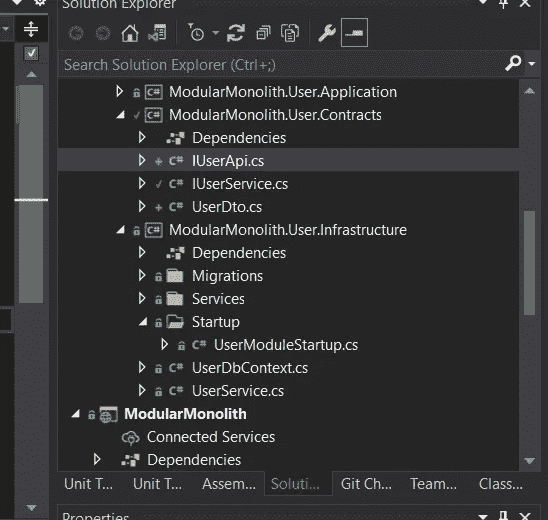
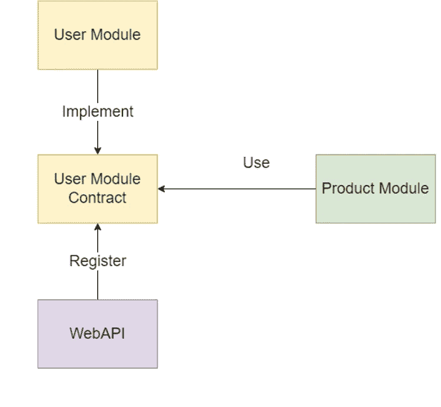
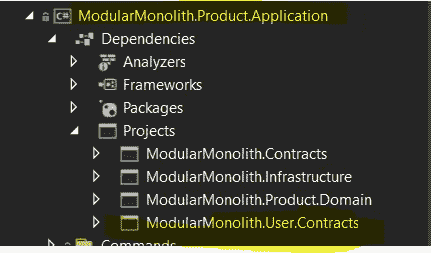

# 简易模块化整体结构—第 6 部分—模块间的同步通信

> 原文：<https://itnext.io/easy-modular-monolith-part-5-synchronous-communication-between-modules-7af876f06c16?source=collection_archive---------0----------------------->

你的模块有时不得不相互交流。
本文将使用直接引用和 RESTFull 风格展示模块间同步通信的两种方式。

> 同步通信是一种实时通信，意味着我们必须等待响应，直到走得更远。

如果没有响应或发送响应有任何问题，调用者将引发一个异常。这种类型的通信是典型的客户端-服务器应用程序。

对于复杂的架构，如微服务或模块化整体架构，尽管这种通信是最简单、最容易实现的，但它也有其缺点，如潜在的性能问题，或者最关键的问题是级联故障(环境中一个模块故障会导致所有其他模块死亡)。尽管如此，它仍被广泛使用，所以今天，我们将在 ModularMonolith 中实现两个可能的变体。

# 背景:

在上一篇文章中，我们添加了一个存储用户信息的用户模块。让我们想象一下，每次我们想在 **ProductModule，**中保存一个新产品时，我们也想保存是谁做的信息。

*   这里需要注意的是，我们不想在每次保存新产品时都复制并保存完整的用户信息。(如果有人在 UserModule 中更新用户的数据，将很难保持数据的一致性)。
*   出于同样的原因，我们不想从 UserModule 复制用户表。

相反，我们将——在 **ProductModule** 中——只保存执行某个方法的用户的全局 id；因此，我们稍后将能够获取详细信息。

# 改进:

首先，让我们通过用两个新字段扩展用户类来改进用户模块。为此，我们需要从 **IdentityUser** (ASP 核心身份用户类)继承，然后注册我们的新类而不是 IdentityUser。看一看:

然后，我们应该用一个新的 AppUser 类替换所有 IdentityUser 实例。(我已经帮你做了:)。

接下来，让我们向我们的 JWT 令牌添加一个新字段—它将存储全局用户 Id — UserId 变量(**第 36 行**)。

至此，让我们创建一个用户上下文类，它将允许从 JWT 令牌中提取 UserId。此类将在根基础结构项目中注册；因此将在每个模块中提供。

**第 19 行** —从 HtppContext 的用户上下文中，我们提取一个在登录到应用程序时添加的声明。

好的——让我们看看如何使用它:

首先，我们注入**iuser context**——然后调用一个 getter UserId。
非常简单——现在我们有了关于调用 **AddProductCommand** 的 UserId 的信息。有了变量，我们可以把它传递给**产品。新的**方法。

我们很好——关于用户的信息片段已经被保存。

# 沟通

现在，由于我们在 **ProductModule** 中保存了关于用户的信息，所以在查询产品时，我们必须获取保存的用户的详细信息。

让我们创建一个名为**modularmonolith . user . contracts .** 的新项目。该项目将为 UserModule 希望与其他模块共享的方法存储接口。

契约

然后，UserModule 将实现一个契约的接口( **IUserService 或 IUserApi** )，并将其注册到 **WebApi** (应用程序入口点)中的实现中。然后将它注入 ProductModule 将允许我们访问来自 **UserModule** 的数据。

模块间的通信

# 两种交流方式

## 通过引用直接通信

直接沟通是通过引用一个项目到另一个项目来进行的沟通。在我们的例子中，我们将使用运行时引用。

**编译时引用**表示用户模块。应用程序项目必须由 ProductModule 引用。应用程序项目能够获取数据。这个引用将创建一个非常难看的耦合，并增加对 UserModule 查询/命令的访问。我们不会走这条路。

**运行时引用**是我们一直在**modular mono with**中使用的东西。**生产模块**不会引用整个**用户模块**，只会引用一个小而整洁的**用户模块。合同**项目。**用户模块。项目只包含对实现的抽象。当我们运行一个应用入口点项目( **WebApi 项目**)时，它会注册实现；因此，它被称为运行时引用—直到应用程序运行时，实现才为人所知。这要干净得多，因为我们只共享这种情况下必需的方法和 dto。**

让我们来看看:

在**用户模块中。我们将创建一个返回用户详细信息的新查询。重要的是(**第 14 行)**这个查询处理程序实现了我们的契约接口 **IUserService。** 我们有我们的方法，让我们看看如何使用它:**

首先，让我们引用一个用户模块。ProductModule 中的合同。应用项目。
然后让我们在**GetProductQueryHandler:**中使用我们的新接口

我们将 **IUserService** 注入到构造函数中，然后在**第 31 行，**我们所做的就是调用一个方法 GetUserDetails，传递一个我们之前保存的 UserId。

## 宁静的交流

如果我们想为迁移到微服务准备 ModularMonolith，我们想使用 HTTP 请求，而不是使用直接通信。类似于我们在用户模块中实现的直接通信。契约让我们创建一个契约接口:

这个和 **IUserService** 最大的区别在于:

*   它定义了一个带有资源路由的 REST 方法。
*   它使用了一个 Refit，一个伟大的 RESTFull 库，允许定义强类型的、基于接口的契约。

因为我们声明了一个将用于交付数据的端点，所以让我们在 UserController 中创建它。

第 36 行——如您所见，它类似于 Controller 中的所有其他方法。重要的是，该方法执行 GetUserDetailsQuery 的**和 GetUserDetailsQueryHandler 将处理的**。相同的一个返回数据用于直接通信。
如果我们向上滚动一会儿到 GetProductQueryHandler，我们会注意到我们在那里注入了一个 **IUserApi** 接口，然后像调用 **IUserService** 一样调用它。

## 用户模块启动

**第 31 行** —我们所做的就是将一个基本 URL 指向我们的 ModularMonolith 实例，并注册 **IUserApi** 以在每次执行来自它的方法时请求这个基本 URL。

**第 39 行**—**iuserserieve**实施登记。这一行简单的代码注册了一个将在运行时为 GetUserDetails 方法执行的处理程序。如果我们在 **IUserServcie** 契约中有更多的方法(因为现在只有 GetUserDetails)，而不是在处理程序级别实现它，我们将创建一个单独的 UserService 类来处理我们的案例。

# 摘要

在本文中，我展示了在模块化整体架构中实现模块间同步通信的两种方法。

我们应该记住，每次我们需要与另一个模块通信时，我们都会创建一个耦合，如果没有理由地引入并且设计正确，将来会带来很多麻烦。这样，如果您注意到一个模块必须与另一个模块共享大量数据，您应该考虑将其合并为一个模块。

## 主要区别:

IUserService 将执行一个进程内调用并返回数据。
**IUserApi** 将对用户控制器执行 HTTP Get 请求并执行。

## 选哪个？

如果您不准备迁移到微服务，我建议坚持直接沟通，因为这样更直接。作为迁移到微服务的中间阶段，我会使用基于 HTTP 的通信。

还有一种沟通方式涉及到我们对数据一致性看法的改变。在以后的文章中，我们将研究异步通信，何时以及为什么使用它。

# 完整代码可在此处获得:

 [## GitHub-ridikk 12/ModularMonolith at 模块 _ 通信

### 模块化整体建筑风格的一步一步的方法。第一部分…

github.com](https://github.com/Ridikk12/ModularMonolith/tree/modules_communication) 

# 上一个:

 [## 简易模块化整体结构—第 5 部分— JWT 认证/授权

### 在 ModularMonolith 中，我们将使用 JSON Web 令牌和 Asp 核心身份实现身份验证和授权。

itnext.io](/easy-modular-monolith-part-5-jwt-authentication-authorization-f7a0a275226f) 

# 在下一部分:

*   域事件。

# 将来(此列表可能会更改):

*   异步通信。
*   发件箱改进。
*   单元/集成测试。
*   存储配置。
*   数据库方法(多个数据源)。
*   准备微服务(用 RabbitMq 代替 MediatR)。
*   迁移到微服务。

# 参考资料:

 [## GitHub - reactiveui/refit:的自动类型安全 REST 库。NET Core、Xamarin 和。网络…

### 的自动类型安全 REST 库。NET Core、Xamarin 和. NET。深受 Square 的改造库的启发…

github.com](https://github.com/reactiveui/refit)