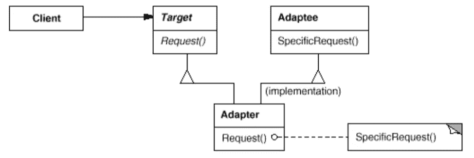

# 简单模式:适配器

> 原文：<https://itnext.io/easy-patterns-adapter-9b5806cb346f?source=collection_archive---------7----------------------->

本文是《简单模式描述》系列的续篇，描述了使最初不兼容的类能够协同工作的结构模式。

目前，您可以找到此类模式的文章:

## 创作模式:

> [**简易工厂**](/easy-patterns-simple-factory-b946a086fd7e)
> 
> [**工厂法**](/easy-patterns-factory-method-5f27385ac5c)
> 
> [**构建器**](/easy-patterns-builder-d85655bcf8aa)
> 
> [**单个**](/easy-patterns-singleton-283356fb29bf)
> 
> [**抽象工厂**](/easy-patterns-abstract-factory-2325cb398fc6)
> 
> [**原型**](/easy-patterns-prototype-e03ec6962f89)

## 结构模式:

> [**适配器**](/easy-patterns-adapter-9b5806cb346f) *(本文)*
> 
> [**装饰者**](/easy-patterns-decorator-eaa96c0550ea)
> 
> [**桥梁**](/easy-patterns-bridge-28d50dc25f9f)
> 
> [**复合**](/easy-patterns-composite-8b28aa1f158)
> 
> [**立面**](/easy-patterns-facade-8cb185f4f44f)
> 
> [**飞锤**](/easy-patterns-flyweight-dab4c018f7f5)
> 
> [**代理**](/easy-patterns-proxy-45fc3a648020)

## 行为模式:

> [**来访者**](/easy-patterns-visitor-b8ef57eb957)
> 
> [**调解员**](/easy-patterns-mediator-e0bf18fefdf9)
> 
> [**观察者**](/easy-patterns-observer-63c832d41ffd)
> 
> [**纪念物**](/easy-patterns-memento-ce966cec7478)
> 
> [**迭代器**](/easy-patterns-iterator-f5c0dd85957)
> 
> [**责任链**](/easy-patterns-chain-of-responsibility-9a84307ad837)
> 
> [**策略**](/easy-patterns-strategy-ecb6f6fc0ef3)
> 
> [**状态**](/easy-patterns-state-ec87a1a487b4)

# 主要本质

这种模式也被称为**包装器**。它包装不兼容的类，以便与系统中的其他类一起工作。这种模式包括三个主要角色:

*   **目标—** 定义使用适配接口的目的地点
*   **适配器** —与符合所需接口的目标协作
*   **adaptee —** 定义需要适配的现有接口

# 使用示例

在本例中，我们创建的存储可以将用户保存在内存中，并呈现一些包含所有用户的表格。每个用户可以只给存储名称和年龄字段，但也需要 id、名字字母和返回配置文件数据的方法等字段。因此，我们将每个用户包装在适配器类中，以获得额外的功能。

我们也不能将用户实例传递给包装类，而只能从用户类扩展适配器类。在这种情况下，adapter 从 adaptee 类扩展初始字段，并添加一些新字段。在我们当前的例子中，很容易隐藏不需要的属性和方法，并添加新的，目标类需要的。

# 利润

这有助于使一个类适应其他类的工作。这种模式也有助于用额外的功能扩展 adaptee 逻辑。它只提供一种类型的对象在系统中工作，不需要额外的间接点。

# 薄弱的地方

它通过继承隐藏了 adaptee 的实现。每个适配器需要特定的适配器，并且不能与其他适配器类型统一工作。然而，可以创建双向适配器——通过实现对该适配器感兴趣的每个目标的特定接口，使通信更加透明的类。

# 结论

如果您觉得这篇文章有帮助，请点击👏按钮并在下面随意评论！