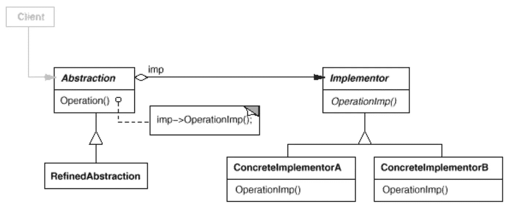

# 简单模式:桥

> 原文：<https://itnext.io/easy-patterns-bridge-28d50dc25f9f?source=collection_archive---------2----------------------->

本文是 easy patterns 系列描述的延续，介绍了将抽象从实现中分离出来的结构化模式，这样两者可以独立变化。

## 创作模式:

> [**简易工厂**](/easy-patterns-simple-factory-b946a086fd7e)
> 
> [**工厂法**](/easy-patterns-factory-method-5f27385ac5c)
> 
> [**构建器**](/easy-patterns-builder-d85655bcf8aa)
> 
> [**单个**](/easy-patterns-singleton-283356fb29bf)
> 
> [**抽象工厂**](/easy-patterns-abstract-factory-2325cb398fc6)
> 
> [**原型**](/easy-patterns-prototype-e03ec6962f89)

## 结构模式:

> [**适配器**](/easy-patterns-adapter-9b5806cb346f)
> 
> [**装饰者**](/easy-patterns-decorator-eaa96c0550ea)
> 
> *****(本文)*****
> 
> ****[**复合**](/easy-patterns-composite-8b28aa1f158)****
> 
> ****[**立面**](/easy-patterns-facade-8cb185f4f44f)****
> 
> ****[**飞锤**](/easy-patterns-flyweight-dab4c018f7f5)****
> 
> ****[**代理**](/easy-patterns-proxy-45fc3a648020)****

## ****行为模式:****

> ****[**来访者**](/easy-patterns-visitor-b8ef57eb957)****
> 
> ****[**调解员**](/easy-patterns-mediator-e0bf18fefdf9)****
> 
> ****[**观察者**](/easy-patterns-observer-63c832d41ffd)****
> 
> ****[**纪念物**](/easy-patterns-memento-ce966cec7478)****
> 
> ****[**迭代器**](/easy-patterns-iterator-f5c0dd85957)****
> 
> ****[**责任链**](/easy-patterns-chain-of-responsibility-9a84307ad837)****
> 
> ****[**策略**](/easy-patterns-strategy-ecb6f6fc0ef3)****
> 
> ****[**状态**](/easy-patterns-state-ec87a1a487b4)****

# ****主要本质****

****在某些来源中，桥接模式被命名为手柄或主体。当一个抽象可以有一个或几个可能的实现时，这种模式有助于解决这个问题。****

****从另一方面来说，这个问题可以用继承来解决。这样，抽象和可能的实现被永久地绑定在一起，这在抽象和实现应该被独立地修改或重用的情况下不是一个好主意。****

****这种模式包括两个主要角色:****

*   ******抽象—** 定义抽象接口并维护对实现者的引用****
*   ******实现者(桥)——**定义实现类的结构和接口。****

****实现者只提供原语操作，抽象基于此原语定义更高级的操作。****

# ****使用示例****

****这是一个典型的例子，网页可以使用浅色或深色主题来呈现内容。****

# ****利润****

****这种模式有助于避免抽象和实现之间的永久绑定。这在运行时应该切换实现的情况下很有帮助。****

****这种模式并不反对抽象和实现仍然可以通过子类化来扩展。因此，您可以组合抽象，也可以组合实现并独立扩展它们。****

****接口和实现之间的这种分离鼓励分层，这有助于构建结构更好的系统。****

****一些资料描述了实现者可以在几个对象之间共享的例子。它可以有一个内部存储，并让抽象来控制它的状态。这样的实施者称为主体。****

# ****薄弱的地方****

****当我们只讨论一个实现者，并且在实现者和抽象之间只有一对一关系的情况下，使用这种模式是没有必要的。****

****在某些情况下，关于应该使用哪个实现的决定可以委托给外部对象，而不是在抽象内部做出决定。这可以通过使用抽象工厂模式来解决，抽象工厂模式的唯一职责是在具体实现中封装细节。****

# ****结论****

****如果您觉得这篇文章有帮助，请点击👏按钮并在下面随意评论！****