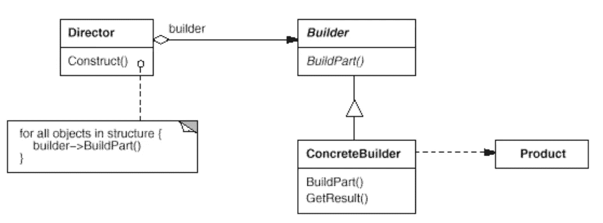

# 简单模式:生成器

> 原文：<https://itnext.io/easy-patterns-builder-d85655bcf8aa?source=collection_archive---------3----------------------->

本文是 easy patterns 系列描述的延续，提出了一个 Builder 模式，解决了复杂对象的构造和表示分离的问题。

## 创作模式:

> [**简易工厂**](/easy-patterns-simple-factory-b946a086fd7e)
> 
> [**工厂法**](/easy-patterns-factory-method-5f27385ac5c)
> 
> ***(本文)***
> 
> **[**单个**](/easy-patterns-singleton-283356fb29bf)**
> 
> **[**抽象工厂**](/easy-patterns-abstract-factory-2325cb398fc6)**
> 
> **[**原型**](/easy-patterns-prototype-e03ec6962f89)**

## **结构模式:**

> **[**适配器**](/easy-patterns-adapter-9b5806cb346f)**
> 
> **[**装饰者**](/easy-patterns-decorator-eaa96c0550ea)**
> 
> **[**桥梁**](/easy-patterns-bridge-28d50dc25f9f)**
> 
> **[**复合**](/easy-patterns-composite-8b28aa1f158)**
> 
> **[**立面**](/easy-patterns-facade-8cb185f4f44f)**
> 
> **[**飞锤**](/easy-patterns-flyweight-dab4c018f7f5)**
> 
> **[**代理**](/easy-patterns-proxy-45fc3a648020)**

## **行为模式:**

> **[**来访者**](/easy-patterns-visitor-b8ef57eb957)**
> 
> **[**调解员**](/easy-patterns-mediator-e0bf18fefdf9)**
> 
> **[**观察者**](/easy-patterns-observer-63c832d41ffd)**
> 
> **[**纪念品**](/easy-patterns-memento-ce966cec7478)**
> 
> **[**迭代器**](/easy-patterns-iterator-f5c0dd85957)**
> 
> **[**责任链**](/easy-patterns-chain-of-responsibility-9a84307ad837)**
> 
> **[**策略**](/easy-patterns-strategy-ecb6f6fc0ef3)**
> 
> **[**状态**](/easy-patterns-state-ec87a1a487b4)**

# **主要本质**

**当创建对象的算法应该与创建对象本身的部分分离时，就需要构建器模式。这种构造过程允许被构造的物体有不同的表现。**

**例如，你想创建一个内部有许多属性的对象。您用一长串参数调用它的构造函数，这些参数将被指定为新创建的对象的内部属性。这是一个常见的问题示例，称为[伸缩构造函数](http://www.captaindebug.com/2011/05/telescoping-constructor-antipattern.html#.W5aETtj-hTY)。**

**这种模式包括三个主要角色:**

*   ****构建器** —构建产品的部件并提供检索接口**
*   **导演 —使用构建器接口构建一个对象**
*   ****产品** —代表在建的复杂对象。这是混凝土导演和混凝土建造者合作的结果**

# **使用示例**

**在这个例子中，我们在建造者的帮助下，根据我们描述的一些规范创建了一架飞机。在创建和更新特定的构建器之后，很容易将其作为参数传递给 Director 类，并实例化一个具体的产品。**

# **利润**

****此模式允许您改变产品的内部表现。**每个构建器都包含创建特定种类产品的所有代码。构建器的代码只需编写一次，就可以被不同的控制器重用。**

****这种模式隔离了构造和表示的代码。构建器为导演提供了构建产品的抽象接口。这个界面有助于隐藏产品的外观和内部结构。****

**这种模式可以让你更好地控制构建过程。不同于其他立即构建产品的模式，构建者模式在主管的控制下一步一步地构建产品。**

**所有这些都让你能够很好地控制最终产品的构建过程。**

# **薄弱的地方**

**有时，您可能需要访问先前构建的产品的某些部分。只要一个建筑商一步一步地建造它的产品，就很难给予这样的机会。在某些时候，您需要将已经创建的子节点返回给 Director，Director 将在后续步骤中为构建器提供访问权限。**

# **结论**

**有一个类似的模式来构造名为[抽象工厂](/easy-patterns-abstract-factory-2325cb398fc6)的复杂对象。但是主要的区别是抽象工厂构造产品对象的系列，并且一次完成(立即返回产品)。另一方面，构建器模式有助于逐步构建一个复杂的对象，并在最后一步返回产品。**

**如果您觉得这篇文章有帮助，请点击👏按钮并在下面随意评论！**