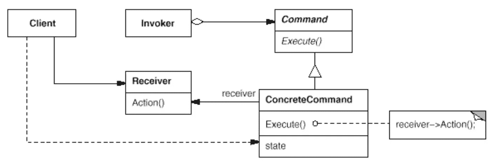
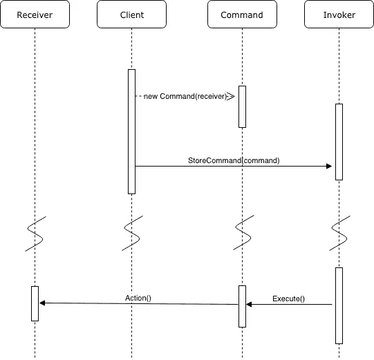

# 简单模式:命令

> 原文：<https://itnext.io/easy-patterns-command-15733a2b56f0?source=collection_archive---------7----------------------->

命令模式的结构

本文是 easy patterns 系列描述的延续，介绍了一个名为 Command 的行为模式，它有助于参数化具有不同请求的客户机，并支持可撤销的操作。

也请参考其他模式文章:

## 创作模式:

> [**简易工厂**](/easy-patterns-simple-factory-b946a086fd7e)
> 
> [**工厂法**](/easy-patterns-factory-method-5f27385ac5c)
> 
> [**构建器**](/easy-patterns-builder-d85655bcf8aa)
> 
> [**单个**](/easy-patterns-singleton-283356fb29bf)
> 
> [**抽象工厂**](/easy-patterns-abstract-factory-2325cb398fc6)
> 
> [**原型**](/easy-patterns-prototype-e03ec6962f89)

## 结构模式:

> [**适配器**](/easy-patterns-adapter-9b5806cb346f)
> 
> [**装饰者**](/easy-patterns-decorator-eaa96c0550ea)
> 
> [**桥**](/easy-patterns-bridge-28d50dc25f9f)
> 
> [**复合**](/easy-patterns-composite-8b28aa1f158)
> 
> [**立面**](/easy-patterns-facade-8cb185f4f44f)
> 
> [**飞锤**](/easy-patterns-flyweight-dab4c018f7f5)
> 
> [**代理**](/easy-patterns-proxy-45fc3a648020)

## 行为模式:

> [**来访者**](/easy-patterns-visitor-b8ef57eb957)
> 
> [**调解员**](/easy-patterns-mediator-e0bf18fefdf9)
> 
> [**观察者**](/easy-patterns-observer-63c832d41ffd)
> 
> [**纪念品**](/easy-patterns-memento-ce966cec7478)
> 
> [**迭代器**](/easy-patterns-iterator-f5c0dd85957)
> 
> [**责任链**](/easy-patterns-chain-of-responsibility-9a84307ad837)
> 
> [**策略**](/easy-patterns-strategy-ecb6f6fc0ef3)
> 
> [**状态**](/easy-patterns-state-ec87a1a487b4)
> 
> **命令**命令*(此条)*

# 主要本质

有时有必要向对象发出请求，而不知道请求接收者正在请求的操作。例如一些按钮部分有一个按钮。单击时应该处理一些请求，但是按钮部分不能显式地实现请求，它应该由应用程序本身来完成。我们不知道请求的接收者或执行请求的操作，只有应用程序知道这一点。

这种模式也称为动作或事务。

这种模式包括四个主要角色:

*   **命令** —定义一个接收者对象和一个动作之间的绑定。通过调用接收器上的相应操作来实现一个`.execute`方法。
*   **调用者** —要求命令执行请求。
*   **接收者** —知道如何执行与执行请求相关的操作。
*   **客户端** —创建一个命令对象并设置其接收者

关于角色协作的一些话。

模式角色之间的协作(UML 表示)

1.  客户端创建一个命令对象并指定它的接收者。
2.  调用程序对象存储命令对象。
3.  调用程序通过调用命令上的`.execute`发出请求。
4.  如果命令`.execute`是可撤销的，命令在调用`.execute`之前存储撤销命令的状态。
5.  命令对象调用其接收者上的操作来执行请求。

命令是面向对象的回调替代物(在某个地方注册的函数，在以后的某个时间被调用)。

可以将这样的操作发送到其他独立的地方执行，例如不同的进程。

命令`.execute`操作可以在内部存储状态用于反转其效果。所以，基本上你得到的不仅仅是封装在里面的执行逻辑，还有一个`.undo`逻辑。

如果系统崩溃，也可以重新应用逻辑。它的发生是由于日志的支持。在系统中保持一个持久的变化日志是可能的。

# 使用示例

在这个例子中，我们将创建一个咖啡机。我们还将创建一个名为 ControlPanel 的 Invoker 类，它将通过调用它的`.execute`方法为我们调用一个特定的命令。Command 类的每个实例都接受一个 CoffeeMachine 实例，以便以后操作。Action 类已经知道执行所需的一切。但是执行本身被延迟了，直到 ControlPanel 类决定做些什么(用户按钮按下，等等)。

我在这里用抽象方法创建了命令类，只是为了展示一些特定命令的结构(每个特定的命令类都是从这个命令类扩展而来的)。

# 利润

命令模式将调用操作的对象与知道如何执行操作的对象分离开来。

命令通常是一级对象(它们可以像任何其他对象一样被操作和扩展)。

可以将命令组合成一个复合命令(宏命令)。所以同时执行一组命令是可能的。

新命令很容易添加，因为您不必更改现有的类。

# 薄弱的地方

当调用方与接收方的解耦在非常简单的逻辑中没有意义时，这可能是一种开销。在某些情况下， [PubSub](/easy-patterns-observer-63c832d41ffd) 模式足以执行基于事件监听的回调。

# 结论

有几种相关的模式可以与命令模式一起使用:

*   一个[复合](/easy-patterns-composite-8b28aa1f158)模式可以用来从简单的命令类中生成一个宏命令。
*   为了帮助`.undo`实现回滚到之前的状态，如果出现问题，可以使用 [Memento](/easy-patterns-memento-ce966cec7478) 模式。

复合模式有助于围绕基于原语操作的高层操作构建系统。这种结构在支持事务的系统中很常见。每个事务封装了一组对数据的更改。基本上事务可以用命令类来完成。命令有一个公共接口，允许您以相同的方式调用所有事务。这种模式使得用新的事务扩展系统变得容易，只需实现新的命令类。

如果您觉得这篇文章有帮助，请点击👏按钮并在下面随意评论！