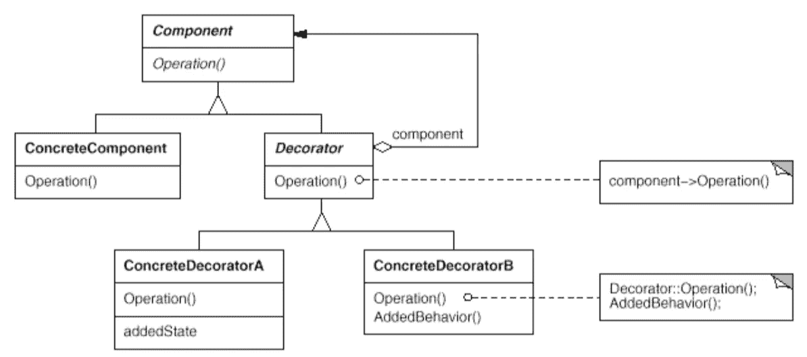

# 简单模式:装饰者

> 原文：<https://itnext.io/easy-patterns-decorator-eaa96c0550ea?source=collection_archive---------0----------------------->

本文是“简单模式描述”系列的延续，描述了动态地为对象附加额外职责的结构模式。

目前，您可以找到此类模式的文章:

## 创作模式:

> [**简易工厂**](/easy-patterns-simple-factory-b946a086fd7e)
> 
> [**工厂法**](/easy-patterns-factory-method-5f27385ac5c)
> 
> [**建造者**](/easy-patterns-builder-d85655bcf8aa)
> 
> [**单个**](/easy-patterns-singleton-283356fb29bf)
> 
> [**抽象工厂**](/easy-patterns-abstract-factory-2325cb398fc6)
> 
> [**原型**](/easy-patterns-prototype-e03ec6962f89)

## 结构模式:

> [**适配器**](/easy-patterns-adapter-9b5806cb346f)
> 
> *****(本文)*****
> 
> ****[**桥梁**](/easy-patterns-bridge-28d50dc25f9f)****
> 
> ****[**复合**](/easy-patterns-composite-8b28aa1f158)****
> 
> ****[**立面**](/easy-patterns-facade-8cb185f4f44f)****
> 
> ****[**飞锤**](/easy-patterns-flyweight-dab4c018f7f5)****
> 
> ****[**代理**](/easy-patterns-proxy-45fc3a648020)****

## ****行为模式:****

> ****[**来访者**](/easy-patterns-visitor-b8ef57eb957)****
> 
> ****[**调解员**](/easy-patterns-mediator-e0bf18fefdf9)****
> 
> ****[**观察者**](/easy-patterns-observer-63c832d41ffd)****
> 
> ****[**纪念物**](/easy-patterns-memento-ce966cec7478)****
> 
> ****[**迭代器**](/easy-patterns-iterator-f5c0dd85957)****
> 
> ****[**责任链**](/easy-patterns-chain-of-responsibility-9a84307ad837)****
> 
> ****[**策略**](/easy-patterns-strategy-ecb6f6fc0ef3)****
> 
> ****[**状态**](/easy-patterns-state-ec87a1a487b4)****

# ****主要本质****

****在某些源代码中，装饰模式和适配器模式被命名为包装器，所以应该弄清楚它是哪种模式。如果您需要添加一些额外的功能，而不是添加到整个类本身，而是添加到某个具体的实例中，它会工作得非常好。****

****那么装饰器和适配器的主要区别是什么呢？对于适配器模式，当您扩展 Adaptee 类或用重写的方法创建一个新类时，它通常符合目标类(详见[适配器模式文章](/easy-patterns-adapter-9b5806cb346f))。在 Decorator 的情况下，目的很简单——向具体的对象实例动态添加新的功能。装饰器将请求转发给组件，并且可以执行额外的动作。****

****这种模式包括两个主要角色:****

*   ******组件** —定义一个可以附加额外责任的对象****
*   ****装饰者 —给组件增加功能****

# ****使用示例****

****这是一个经典的例子，将一个类实例传递给 decorator 来扩展一些功能。****

****在本例中，我们正在建造一架基础飞机及其改型(跨大西洋飞机和喷气式飞机)。装饰者使用传递的实例的基本方法，以一种需要的方式扩展它。喷气式飞机扩展了基础飞机的最大速度，而跨大西洋飞机扩展了它的最大距离。****

# ****利润****

****这种模式有助于在不影响其他对象的情况下，动态、透明地向单个对象添加所需的功能。****

****使用它以透明的方式分离功能也很好(您可以看到每个装饰器相对于基本对象功能的用途)。****

****Decorator 将请求转发给它的组件对象。它可以在转发请求之前和之后可选地执行附加操作。这增加了添加额外功能的灵活性。****

# ****薄弱的地方****

****装饰者和组件不是相同的东西。装饰器充当透明外壳。所以在使用 decorators 的时候不应该依赖对象标识。****

****这种模式迫使你在系统中拥有许多小对象。这些小物体的不同之处仅在于它们相互连接的方式。更有甚者，很容易不经意地多次修饰对象而得到意想不到的结果。有了古典传承，这种事情就更难做了。所以，对于了解它们的人来说，定制这样的系统是很容易的，你所需要的只是了解系统中使用了哪些装饰器，以及用于什么目的。****

# ****结论****

****如果您觉得这篇文章有帮助，请点击👏按钮并在下面随意评论！****