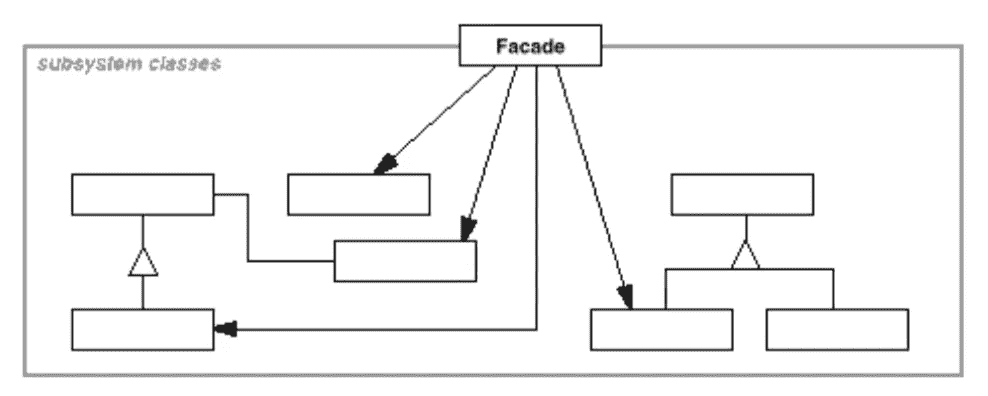

# 简单模式:正面

> 原文：<https://itnext.io/easy-patterns-facade-8cb185f4f44f?source=collection_archive---------6----------------------->

本文是 easy patterns 系列描述的延续，提出了一个名为 Facade 的结构模式，它通过提供一个更高层次的接口来解决某些特定系统中接口集的使用问题。

## 创作模式:

> [**简易工厂**](/easy-patterns-simple-factory-b946a086fd7e)
> 
> [**工厂法**](/easy-patterns-factory-method-5f27385ac5c)
> 
> [**建造者**](/easy-patterns-builder-d85655bcf8aa)
> 
> [**单个**](/easy-patterns-singleton-283356fb29bf)
> 
> [**抽象工厂**](/easy-patterns-abstract-factory-2325cb398fc6)
> 
> [**原型**](/easy-patterns-prototype-e03ec6962f89)

## 结构模式:

> [**适配器**](/easy-patterns-adapter-9b5806cb346f)
> 
> [**装饰者**](/easy-patterns-decorator-eaa96c0550ea)
> 
> [**桥**](/easy-patterns-bridge-28d50dc25f9f)
> 
> [**复合**](/easy-patterns-composite-8b28aa1f158)
> 
> [**立面**](/easy-patterns-facade-8cb185f4f44f) *(本文)*
> 
> [**飞锤**](/easy-patterns-flyweight-dab4c018f7f5)
> 
> [**代理**](/easy-patterns-proxy-45fc3a648020)

## 行为模式:

> [**来访者**](/easy-patterns-visitor-b8ef57eb957)
> 
> [**调解员**](/easy-patterns-mediator-e0bf18fefdf9)
> 
> [**观察者**](/easy-patterns-observer-63c832d41ffd)
> 
> [**纪念物**](/easy-patterns-memento-ce966cec7478)
> 
> [**迭代器**](/easy-patterns-iterator-f5c0dd85957)
> 
> [**责任链**](/easy-patterns-chain-of-responsibility-9a84307ad837)
> 
> [**策略**](/easy-patterns-strategy-ecb6f6fc0ef3)
> 
> [**状态**](/easy-patterns-state-ec87a1a487b4)

# 主要本质

当几个子系统的接口缺少公共场所时，Facade 模式是有用的，但是它需要提供一个简单的接口。

随着应用的发展，包含的子系统变得更小，更可重用和可定制。但是这样一来，客户就很难利用它们，尤其是在不需要定制这样的子系统的时候。

Facade 模式提供了一个简单的默认接口，对于大多数客户端来说已经足够了。对于那些需要获得额外功能和可定制性的人来说，可以透过表面来看。

这种模式也有助于通过抽象的硬实现将客户端从类中分离出来。因此，客户只会使用简单明了的接口，这些接口只代表所需的和可预测的功能。

这种模式包括两个主要角色:

*   **Facade** —委托对特定子系统类的调用
*   **子系统** —负责具体功能的独立单元类

# 使用示例

让我们创建一个咖啡机，里面有一些实现的方法，像:打开，关闭，开始加热，酿造咖啡，清洁机器。对于最终用户来说，没有必要做所有的事情，因为咖啡机的制造商可以在咖啡机的顶部制作方便的按钮，并在引擎盖下安装方便的程序。比如:煮咖啡和清洁机器。咖啡机的这种顶部被称为立面。因此，用户只需按下一个按钮，咖啡机将经历整个生命周期。

# 利润

facade 模式通过聚合的 Facade 组件和众所周知的、文档化的 API，使客户不必与分布式的、复杂的子系统类合作。

使用这种模式，您可以改变子系统组件，从而减少客户端和组件之间的耦合。这有助于在子类改变的情况下节省重新编译的时间(比如热交换)。

使用 Facade 模式的另一个好处是，它不会阻止客户在必要时直接使用子系统类。

使用这种模式有助于减少用户文档的数量，因为对于用户来说，知道如何使用 Facade API 是至关重要的，而不需要深入研究子系统实现。

# 薄弱的地方

使用这种模式会导致创建额外的类(Facade ),这可能是额外的、无用的工作，尤其是在系统不太复杂的情况下。只有在具有大的子系统树的大而复杂的系统中才能获得真正的好处。

# 结论

Facade 模式可以和[抽象工厂](/easy-patterns-abstract-factory-2325cb398fc6)模式一起使用(或者甚至代替它)。这有助于对客户端隐藏特定于平台的类。

此外，[中介](/easy-patterns-mediator-e0bf18fefdf9)的模式类似于门面。它从现有的类中抽象出一个客户端。但是一般来说，中介器的目的是抽象子类之间的通信，并且通常集中不属于任何一个子类的功能。

不需要有许多 Facade 对象来与客户机通信。所以，他们通常是 T4 的单身族。

如果您觉得这篇文章有帮助，请点击👏按钮并在下面随意评论！