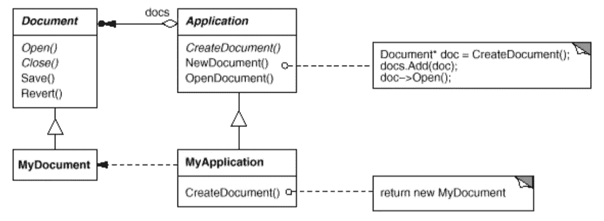

# 简单模式:工厂方法

> 原文：<https://itnext.io/easy-patterns-factory-method-5f27385ac5c?source=collection_archive---------5----------------------->

本文是简单模式描述系列的延续，描述了在运行时将实例化逻辑委托给嵌套类所需的工厂方法模式。

目前，您可以找到此类模式的文章:

## 创作模式:

> [**简易工厂**](/easy-patterns-simple-factory-b946a086fd7e)
> 
> [**工厂法**](/easy-patterns-factory-method-5f27385ac5c) *(本文)*
> 
> [**建造者**](/easy-patterns-builder-d85655bcf8aa)
> 
> [**单个**](/easy-patterns-singleton-283356fb29bf)
> 
> [**抽象工厂**](/easy-patterns-abstract-factory-2325cb398fc6)
> 
> [**原型**](/easy-patterns-prototype-e03ec6962f89)

## 结构模式:

> [**适配器**](/easy-patterns-adapter-9b5806cb346f)
> 
> [**装饰者**](/easy-patterns-decorator-eaa96c0550ea)
> 
> [**桥梁**](/easy-patterns-bridge-28d50dc25f9f)
> 
> [**复合**](/easy-patterns-composite-8b28aa1f158)
> 
> [**立面**](/easy-patterns-facade-8cb185f4f44f)
> 
> [**飞锤**](/easy-patterns-flyweight-dab4c018f7f5)
> 
> [**代理**](/easy-patterns-proxy-45fc3a648020)

## 行为模式:

> [**来访者**](/easy-patterns-visitor-b8ef57eb957)
> 
> [**调解员**](/easy-patterns-mediator-e0bf18fefdf9)
> 
> [**观察者**](/easy-patterns-observer-63c832d41ffd)
> 
> [**纪念物**](/easy-patterns-memento-ce966cec7478)
> 
> [**迭代器**](/easy-patterns-iterator-f5c0dd85957)
> 
> [**责任链**](/easy-patterns-chain-of-responsibility-9a84307ad837)
> 
> [**策略**](/easy-patterns-strategy-ecb6f6fc0ef3)
> 
> [状态**状态**状态](/easy-patterns-state-ec87a1a487b4)

# 主要本质

在面向对象语言中，这种模式有助于借助嵌套类中的生成方法来实例化新项。这有助于避免在父类中提及特定的类，并将类型定义完全委托给嵌套的类。甚至，类类型可以在运行时定义。

# 使用示例

在示例中，我们创建了一个父车辆类`Vehicle`和两个嵌套类:`Car`和`Bicycle`。还用抽象工厂方法`addVehicle`创建了 base `SpecializedRentalAgency`，在嵌套类`CarRentalAgency`和`BicycleRentalAgency`中实现，以返回所需的类类型实例。但是方法`lendVehicle`中描述的整个租赁过程对它们来说是相同的，因此在基类`SpecializedRentalAgency`中实现。

# 赞成的意见

工厂方法有助于解决未定义时的实例化问题，即需要哪些类实例。它可以在执行阶段定义。

系统保持独立于类实例化过程，并完全与这种关注点分离。此外，该模式在添加新的类类型进行实例化时，保持了系统的可扩展性和灵活性。

# 骗局

由于实例化过程的动态性，应该对其进行控制。应该添加额外的类类型存在检查器，以避免在类类型存在、类型兼容性等方面出现错误。

# 结论

如果您觉得这篇文章有帮助，请点击👏按钮并在下面随意评论！