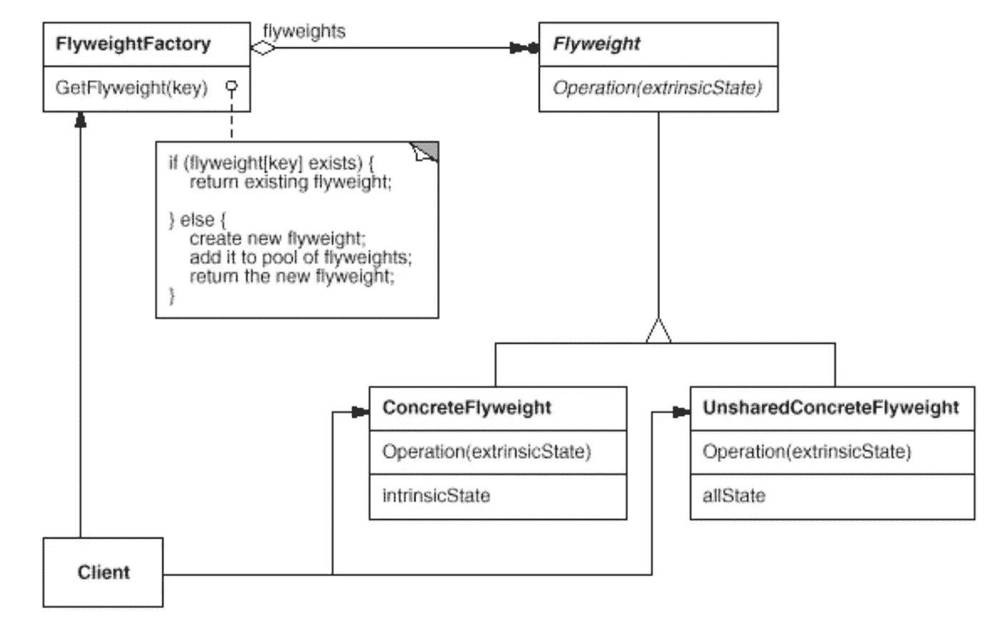

# 简单模式:轻量级

> 原文：<https://itnext.io/easy-patterns-flyweight-dab4c018f7f5?source=collection_archive---------4----------------------->



本文是 easy patterns 系列描述的延续，介绍了一个名为 Flyweight 的结构模式，它解决了使用相似逻辑共享复杂对象的问题，以保持性能和内存使用的优化。

也请参考其他模式文章:

## 创作模式:

> [**简易工厂**](/easy-patterns-simple-factory-b946a086fd7e)
> 
> [**工厂法**](/easy-patterns-factory-method-5f27385ac5c)
> 
> [**构建器**](/easy-patterns-builder-d85655bcf8aa)
> 
> [**单个**](/easy-patterns-singleton-283356fb29bf)
> 
> [**抽象工厂**](/easy-patterns-abstract-factory-2325cb398fc6)
> 
> [**原型**](/easy-patterns-prototype-e03ec6962f89)

## 结构模式:

> [**适配器**](/easy-patterns-adapter-9b5806cb346f)
> 
> [**装饰者**](/easy-patterns-decorator-eaa96c0550ea)
> 
> [**桥**](/easy-patterns-bridge-28d50dc25f9f)
> 
> [**复合**](/easy-patterns-composite-8b28aa1f158)
> 
> [**立面**](/easy-patterns-facade-8cb185f4f44f)
> 
> [](/easy-patterns-flyweight-dab4c018f7f5)***(本文)***
> 
> **[**代理**](/easy-patterns-proxy-45fc3a648020)**

## **行为模式:**

> **[**来访者**](/easy-patterns-visitor-b8ef57eb957)**
> 
> **[**调解员**](/easy-patterns-mediator-e0bf18fefdf9)**
> 
> **[**观察者**](/easy-patterns-observer-63c832d41ffd)**
> 
> **[**纪念品**](/easy-patterns-memento-ce966cec7478)**
> 
> **[**迭代器**](/easy-patterns-iterator-f5c0dd85957)**
> 
> **[**责任链**](/easy-patterns-chain-of-responsibility-9a84307ad837)**
> 
> **[**策略**](/easy-patterns-strategy-ecb6f6fc0ef3)**
> 
> **[**状态**](/easy-patterns-state-ec87a1a487b4)**

# **主要本质**

**flyweight——它是一个共享对象，可以同时在多个上下文中使用。例如，每个表格渲染器都有几种对象类型，如行和单元格。让我们想象一个画面，当你有一个表，里面有两行和两列。每个实例都有自己的类:对于行，它是行类，对于单元格，它是单元格类。在这样的配置中，您必须实例化六个对象(2x 行类和 4x 单元类)来描述这样的表内容。看起来像个计划，对吧？**

**假设您的表格内容随着时间的推移急剧增加，现在您有一个 500 行 8 列的表格。所以，让我们做一些计算:**

```
const rowNumber = 500;
const columnNumber = 8;const getRowClassNumber = rowNumber => rowNumber;
const getCellClassNumber = (rowNumber, columnNumber) => rowNumber * columnNumber;getRowClassNumber(rowNumber); // 500
getCellClassNumber(rowNumber, columnNumber); // 500 * 8// Result
// 500 + 500 * 8 === 4500!!!
```

**结果就是这样。基本上，使用这种方法，我们需要使用 4500 个类实例来描述这种表格的每一行和每一个单元格…**

**但是让我们假设我们知道在某个时间点用户只能看到 10 行内容。因此，实际上我们只能在可见区域重用实例。在这种情况下，我们需要的实例数量:**

```
const rowNumber = 10;
const columnNumber = 8;const getRowClassNumber = rowNumber => rowNumber;
const getCellClassNumber = (rowNumber, columnNumber) => rowNumber * columnNumber;getRowClassNumber(rowNumber); // 10
getCellClassNumber(rowNumber, columnNumber); // 10 * 8// Result
// 10 + 10 * 8 === 90
```

**基本上我们减少了 50 倍的内存消耗。**

**怎样才能做出这样的可共享的类实例？答案是让他们成为轻量级选手。Flyweights 不能对它们运行的环境做出假设。主要概念是将他们的内部状态分为内在的和外在的。内在状态由独立于 flyweight 上下文的信息组成(共享它)。外在状态取决于 flyweight 的上下文。**

**该模式包括三个主要角色:**

*   ****客户端** —维护对 flyweight 的引用**
*   ****flyweights factory**—创建和管理 flyweight**
*   ****Flyweight** —实现 Flyweight 接口，并在内部添加内部状态**

# **使用示例**

**让我们创建一个包含内容的表格。一旦滚动了 1 个位置，我们不会创建新的行和单元格实例，但会用新的内容更新现有的实例。诸如此类…在当前的例子中，我没有使用巨大的模拟数据来渲染，而是在运行中生成新的内容。内在状态保持渲染方法，链接到 DOM 等。外部状态保存有关当前单元格内容的信息，该信息将在滚动位置更改后立即更新。**

**这里的表的主要编制者是一个表类**

```
/**
* Class presenting a table
*/
class Table {
  /**
  * Create a table
  * [@param](http://twitter.com/param) {String} selector - table selector
  */
  constructor(selector) {
    this.$table = document.querySelector(selector);
  }

  /**
  * Add flyweight rows into the table
  * [@param](http://twitter.com/param) {Array} - array of rows flyweight to add
  */
  addRows(rows) {
    this.rows = rows;
    this.rows.forEach(row => this.$table.appendChild(row.render()));
  }

  /**
  * Update flyweight rows extrinsic state with a new content
  * [@param](http://twitter.com/param) {Array} data - new data for rows
  */
  updateTableData(data) {
    this.rows.forEach((row, idx) => row.updateRowData(data[idx]));
  }
}
```

**在实例化时，它接受一个选择器来获得到 DOM 的链接。`.addRows`方法接受 flyweight 行的数组在表中呈现。`.updateTableData`方法将每一行的外在状态更新到对应的实际滚动位置。**

**row flyweight 类看起来像**

```
/**
* Class presenting a row flyweight
*/
class Row {
  /**
  * Create a row
  * [@param](http://twitter.com/param) {Array} cellItems - cell items to render
  **/
  constructor(cellItems) {
    this.cellItems = cellItems;
  }

  /**
  * Update row data with new extrinsic state data
  * [@param](http://twitter.com/param) {Array} newData - new data array to be updated
  */
  updateRowData(newData) {
    this.cellItems.forEach((item, idx) => {
      item.updateContent(newData[idx]);
    });
  }

  /**
  * Render the row
  * [@return](http://twitter.com/return) {DOMElement} row - row element
  */
  render() {
    const row = document.createElement('tr');
    this.cellItems.forEach(item => row.appendChild(item.render()));

    return row;
  }
}
```

**它接受单元格 flyweight 项数组，因此 Row 类能够依次更新其外部状态。可通过接受新数据数组的`.updateRowData`方法进行更新。`.render`方法只是将每个单元格的内容作为子元素添加到行容器中。**

**cell flyweight 类看起来像**

```
/**
* Class presenting a cell flyweight
*/
class Cell {
  /**
  * Create a cell
  * [@param](http://twitter.com/param) {String} content - content of a cell
  **/
  constructor(content) {
    this.content = content;
  }

  /**
  * Update content of a cell
  * [@param](http://twitter.com/param) {String} content - content of a cell
  */
  updateContent(content) {
    this.content = content;
    this.cell.innerText = content;
  }

  /**
  * Render the cell
  * [@return](http://twitter.com/return) {DOMElement} cell - cell element
  */
  render() {
    const cell = document.createElement('td');
    this.cell = cell;
    cell.innerText = this.content;

    return cell;

  }
}
```

**它接受要在表格单元格内呈现的内容。`.updateContent`方法接受新的内容作为新的外在状态传递。`.render`方法只是用从当前外部状态传递的内容创建新的 DOM 节点。**

# **利润**

**共享的 flyweights 越多，节省的存储就越多。最严重的情况发生在当对象使用大量的内在和外在状态时，并且外在状态可以被计算而不是被存储。**

**当处理大量的内容时，这是一个巨大的好处，可以与用户进行实时交互。**

# **薄弱的地方**

**Flyweights 可能会引入一些与转移、查找和计算现有状态相关的运行时成本。然而，对于内存分配的节省来说，这是一个公平的报酬，随着更多的轻量级共享，内存分配也会增加。**

**有时，当内存比运行时限制便宜时，外部状态的计算可能是一种开销。**

**从代码阅读的角度来看，计算给代码增加了一点复杂性(与庞大且组织良好的静态数据结构形成对比)。**

# **结论**

**Flyweight 模式通常与[复合](/easy-patterns-composite-8b28aa1f158)模式一起使用，以保持系统中的逻辑层次结构。**

**优点是使用 Flyweight 模式来实现状态和策略模式对象。**

**如果您觉得这篇文章有帮助，请点击👏按钮并在下面随意评论！**