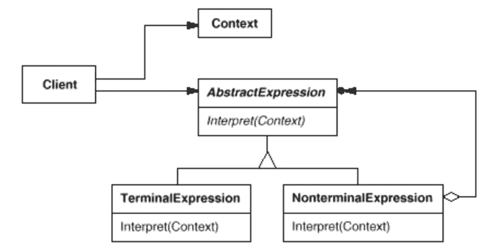

# 简单模式:解释器

> 原文：<https://itnext.io/easy-patterns-interpreter-58434c94304d?source=collection_archive---------1----------------------->

解释器模式的结构

本文是 easy patterns 系列描述的延续，介绍了一个名为解释器的行为模式，它有助于获得某种语言的适当表示(代码分析、解析、处理等)。

也请参考其他模式文章:

## 创作模式:

> [**简易工厂**](/easy-patterns-simple-factory-b946a086fd7e)
> 
> [**工厂法**](/easy-patterns-factory-method-5f27385ac5c)
> 
> [**建造者**](/easy-patterns-builder-d85655bcf8aa)
> 
> [**单个**](/easy-patterns-singleton-283356fb29bf)
> 
> [**抽象工厂**](/easy-patterns-abstract-factory-2325cb398fc6)
> 
> [**原型**](/easy-patterns-prototype-e03ec6962f89)

## 结构模式:

> [**适配器**](/easy-patterns-adapter-9b5806cb346f)
> 
> [**装饰者**](/easy-patterns-decorator-eaa96c0550ea)
> 
> [**桥**](/easy-patterns-bridge-28d50dc25f9f)
> 
> [**复合**](/easy-patterns-composite-8b28aa1f158)
> 
> [**立面**](/easy-patterns-facade-8cb185f4f44f)
> 
> [**飞锤**](/easy-patterns-flyweight-dab4c018f7f5)
> 
> [**代理**](/easy-patterns-proxy-45fc3a648020)

## 行为模式:

> [**来访者**](/easy-patterns-visitor-b8ef57eb957)
> 
> [**调解员**](/easy-patterns-mediator-e0bf18fefdf9)
> 
> [**观察者**](/easy-patterns-observer-63c832d41ffd)
> 
> [**纪念品**](/easy-patterns-memento-ce966cec7478)
> 
> [**迭代器**](/easy-patterns-iterator-f5c0dd85957)
> 
> [**责任链**](/easy-patterns-chain-of-responsibility-9a84307ad837)
> 
> [**策略**](/easy-patterns-strategy-ecb6f6fc0ef3)
> 
> [状态**状态**状态](/easy-patterns-state-ec87a1a487b4)
> 
> [**命令**](/easy-patterns-command-15733a2b56f0)
> 
> **解释器** *(当前文章)*

# 主要本质

搜索与模式匹配的字符串是一个常见问题。正则表达式是指定字符串模式的标准语言。搜索算法可以解释指定一组匹配字符串的正则表达式，而不是构建自定义算法来匹配每个模式和字符串。

解释器模式描述了如何为简单的语言定义语法，用语言表示句子并解释这些句子。

该模式包括 4 个主要角色:

*   **TerminalExpression** (文字表达式)——声明语法树中与语法中的终止符号相关联的所有节点共有的解释操作。
*   **NonTerminalExpression** (交替表达式、重复表达式、序列表达式)——声明语法树中与语法中的非终结符号相关联的所有节点共有的解释操作。
*   **上下文** —包含解释器的全局信息。
*   **客户端** —构建抽象语法树，以语法定义的语言表示特定句子。

关于这些角色协作的几句话。

1.  客户端将句子构建为抽象语法树。
2.  客户端初始化上下文并调用解释操作。
3.  每个非终结符表达式节点在每个子表达式上定义解释器。每个终端表达式的解释操作定义了递归中的基本情况。
4.  每个节点上的解释操作使用上下文来存储和访问解释器的状态。

# 使用示例

在这个例子中，我们将创建一个咖啡机，它可以通过内置键盘(或某种语音到文本分析器)的书面文本来分析命令。

会保存我们需要的全局数据:输入和输出值。

类将在语言语法和要执行的特定命令之间提供一座桥梁。每个表达式都有自己的解释逻辑定义。

函数将从许多已定义的表达式中收集抽象语法树，并通过它们来分析传递的输入句子。这个函数将结果写回上下文。

# 利润

有了许多表达式，改变和扩展语法就很容易了。该模式使用类来表示语法规则，因此可以通过类扩展来扩展功能。

定义抽象语法树中节点的类。这样的类很容易编写，并且通常这样的过程被委托给编译器或解析器生成器。

解释器模式使得以一种新的方式计算表达式变得更加容易。例如，您可以通过在表达式类上定义一个新的操作来支持表达式的漂亮打印或类型检查。

# 薄弱的地方

解释器模式为语法中的每个规则定义了至少一个类。因此，包含许多规则的语法可能很难管理和维护。

当语法非常复杂时，您可能也需要一个更复杂的解决方案。像解析器或编译器生成器这样的工具将有助于你不用自己维护大量的类。

# 结论

解释器模式广泛应用于用面向对象语言实现的编译器中。在 JavaScript 中，有很多分析器都有这个核心概念。它们都使用抽象语法树来管理语法分析(Babel、EsLint、StyleLint)。

有一些相关的模式使得解释器的工作变得有效和复杂:

*   [**复合**](/easy-patterns-composite-8b28aa1f158) —抽象语法树是复合模式本身的一个实例。
*   [**Flyweight**](/easy-patterns-flyweight-dab4c018f7f5) —展示如何在抽象语法树中共享终端符号。
*   [**迭代器**](/easy-patterns-iterator-f5c0dd85957) —帮助遍历抽象语法树的结构。
*   [**Visitor**](/easy-patterns-visitor-b8ef57eb957) —可以用来维护一个类中抽象语法树中每个节点的行为。

如果您觉得这篇文章有帮助，请点击👏按钮并在下面随意评论！