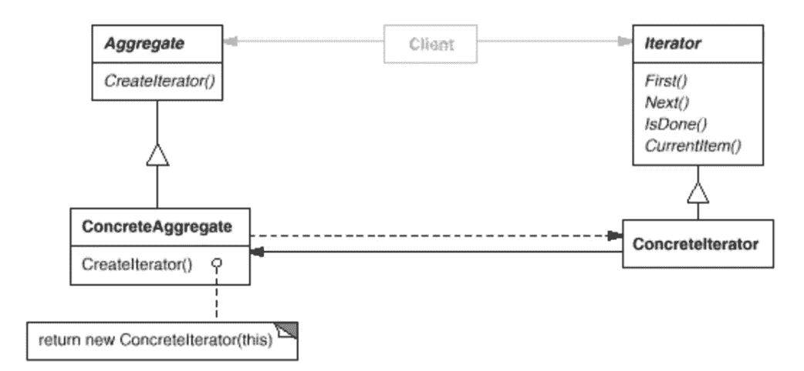

# 简单模式:迭代器

> 原文：<https://itnext.io/easy-patterns-iterator-f5c0dd85957?source=collection_archive---------5----------------------->



本文是 easy patterns 系列描述的延续，介绍了一个名为迭代器的行为模式，它提供了一种访问某个序列(聚合对象)的元素而不暴露其内部表示的方法。

也请参考其他模式文章:

## 创作模式:

> [**简易工厂**](/easy-patterns-simple-factory-b946a086fd7e)
> 
> [**工厂法**](/easy-patterns-factory-method-5f27385ac5c)
> 
> [**建造者**](/easy-patterns-builder-d85655bcf8aa)
> 
> [**单个**](/easy-patterns-singleton-283356fb29bf)
> 
> [**抽象工厂**](/easy-patterns-abstract-factory-2325cb398fc6)
> 
> [**原型**](/easy-patterns-prototype-e03ec6962f89)

## 结构模式:

> [**适配器**](/easy-patterns-adapter-9b5806cb346f)
> 
> [**装饰者**](/easy-patterns-decorator-eaa96c0550ea)
> 
> [**桥**](/easy-patterns-bridge-28d50dc25f9f)
> 
> [**复合**](/easy-patterns-composite-8b28aa1f158)
> 
> [**立面**](/easy-patterns-facade-8cb185f4f44f)
> 
> [**飞锤**](/easy-patterns-flyweight-dab4c018f7f5)
> 
> [**代理**](/easy-patterns-proxy-45fc3a648020)

## 行为模式:

> [**来访者**](/easy-patterns-visitor-b8ef57eb957)
> 
> [**调解员**](/easy-patterns-mediator-e0bf18fefdf9)
> 
> [**观察者**](/easy-patterns-observer-63c832d41ffd)
> 
> [**纪念品**](/easy-patterns-memento-ce966cec7478)
> 
> [**迭代器**](/easy-patterns-iterator-f5c0dd85957) (本文)
> 
> [**责任链**](/easy-patterns-chain-of-responsibility-9a84307ad837)
> 
> [**策略**](/easy-patterns-strategy-ecb6f6fc0ef3)
> 
> [状态**状态**状态](/easy-patterns-state-ec87a1a487b4)

# 主要本质

迭代器模式的关键思想是让你以你想要的方式访问和遍历列表。所有这些功能都将放在迭代器对象中。iterator 类定义了一个访问列表元素的接口。迭代器对象还负责跟踪当前元素以及哪些元素已经被遍历。

为了创建一个迭代器实例，客户端应该提供一个列表来遍历它。一旦迭代器实例准备就绪，客户机就可以顺序访问列表中的元素。

每个迭代器类都需要实现公共接口:

*   `.currentItem`方法返回列表中的当前元素
*   `.next`方法将当前元素推进到聚合对象中的下一个元素
*   `.isDone`方法测试我们是否到达了聚集对象的末尾。

遍历机制与 list 对象的分离让我们可以为不同的遍历算法定义迭代器，而无需在 list 接口中声明它们。例如，一些 **FilterIterator** 只能从列表中返回满足特定约束的元素。

这种模式包括两个主要角色:

*   **迭代器** —定义访问和遍历元素的接口及其实现
*   **Aggregate** —定义创建迭代器对象的接口及其实现。

这种模式也称为**光标**，应该用于以下情况:

*   要访问聚集对象内容
*   支持聚合对象的多次遍历
*   为了提供用于遍历不同集合结构统一接口

# 使用示例

在我们的例子中，我们将创建一个聚合对象，并用几个迭代器实例遍历它。

第一个迭代器对象将根据聚集对象`from`和`to`边界中定义的直接顺序返回相关数据项。

第二个迭代器对象将以相反的顺序返回定义的边界中的相关数据。

这只是使用迭代器模式的迭代控制的一个小演示。潜在地，当您处理非常复杂的数据时，由于数据和迭代逻辑之间的关注点分离，这种模式可以极大地降低代码的复杂性并提高其可读性。

要以自定义方式查看迭代过程，您可以使用`for..of`迭代，而不是展开**运算符**。

```
for (let item of ascendingIterator) {
  console.log(item);
}
```

这将为您返回与第一个示例相同的结果。也可以在 Codepen 中随意使用它:

# 利润

迭代器模式使得聚合遍历中的变化成为可能。复杂的集合体可以以多种方式遍历。迭代器使得改变遍历算法变得很容易——只需用不同的迭代器实例替换它。

迭代器简化了集合对象的接口，因为它可以将遍历问题完全委托给迭代器对象本身。聚合对象应该知道并担心迭代器如何遍历它的元素。

聚合对象可以有任意多的并行遍历。迭代器跟踪自己的遍历状态。

聚合对象可能没有长度属性，如果在运行时没有剩余的元素，就进行定义。同样，不仅可以迭代数组和列表。

# 薄弱的地方

在大多数情况下，迭代器的使用可能是一种开销。它需要实现特定的方法才能工作。它的逻辑可能不明显，尤其是如果它没有用在正确的地方。通常 JavaScript 在很多地方使用迭代器模式:对于字符串和数组对象， **spread** 操作符返回迭代器的聚合对象。

可以创建无限的迭代器来生成无限的数据序列。因此，与`for..of`一起调用这样的迭代器也将是无限的。这种灵活性需要在这样的代码中对退出点进行额外的控制(例如使用一些`break`操作符)。

# 结论

迭代器是一个可以遍历其他对象的对象。在 JavaScript 中，这种能力需要实现`Symbol.iterator`方法并返回`next`方法的实现。

JavaScript 中有很多地方都在使用这种模式: **spread** 操作符、**数组**和 **String** 对象。

经常与[复合模式](/easy-patterns-composite-8b28aa1f158)一起使用。通常迭代器应用于递归结构。

[工厂方法](/easy-patterns-factory-method-5f27385ac5c)通常与迭代器模式一起使用来实例化适当的迭代器子类。

Memento 模式通常与迭代器模式结合使用。迭代器可以使用它在内部捕获迭代的状态。

如果您觉得这篇文章有帮助，请点击👏按钮并在下面随意评论！