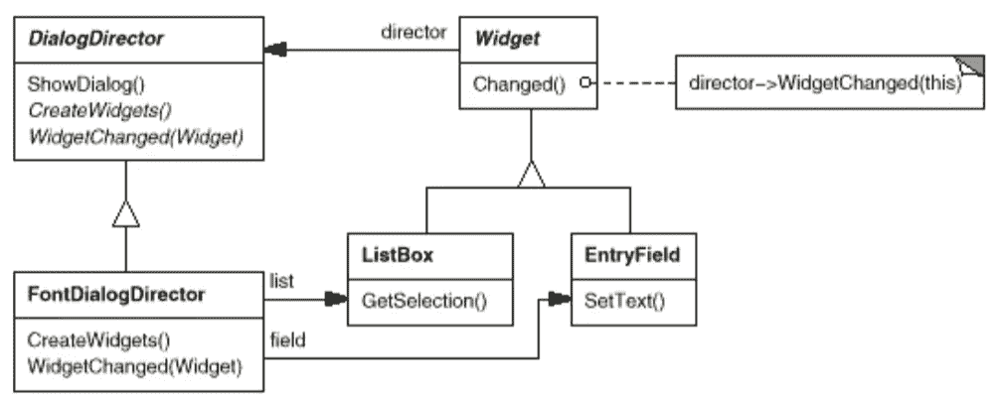

# 简单模式:调解人

> 原文：<https://itnext.io/easy-patterns-mediator-e0bf18fefdf9?source=collection_archive---------8----------------------->

本文是 easy 模式描述系列的延续，描述了用于减少交互的两个对象之间耦合的结构模式。

目前，您可以找到此类模式的文章:

## 创作模式:

> [**简易工厂**](/easy-patterns-simple-factory-b946a086fd7e)
> 
> [**工厂法**](/easy-patterns-factory-method-5f27385ac5c)
> 
> [**构建器**](/easy-patterns-builder-d85655bcf8aa)
> 
> [**单个**](/easy-patterns-singleton-283356fb29bf)
> 
> [**抽象工厂**](/easy-patterns-abstract-factory-2325cb398fc6)
> 
> [**原型**](/easy-patterns-prototype-e03ec6962f89)

## 结构模式:

> [**适配器**](/easy-patterns-adapter-9b5806cb346f)
> 
> [**装饰者**](/easy-patterns-decorator-eaa96c0550ea)
> 
> [**桥**](/easy-patterns-bridge-28d50dc25f9f)
> 
> [**复合**](/easy-patterns-composite-8b28aa1f158)
> 
> [**立面**](/easy-patterns-facade-8cb185f4f44f)
> 
> [**飞锤**](/easy-patterns-flyweight-dab4c018f7f5)
> 
> [**代理**](/easy-patterns-proxy-45fc3a648020)

## 行为模式:

> [**来访者**](/easy-patterns-visitor-b8ef57eb957)
> 
> [**调解员**](/easy-patterns-mediator-e0bf18fefdf9) *(本文)*
> 
> [**观察者**](/easy-patterns-observer-63c832d41ffd)
> 
> [**纪念品**](/easy-patterns-memento-ce966cec7478)
> 
> [**迭代器**](/easy-patterns-iterator-f5c0dd85957)
> 
> [**责任链**](/easy-patterns-chain-of-responsibility-9a84307ad837)
> 
> [**策略**](/easy-patterns-strategy-ecb6f6fc0ef3)
> 
> [**状态**](/easy-patterns-state-ec87a1a487b4)

# 主要本质

这种模式决定了两个对象之间的关系。其中在它们之间添加了第三个对象来控制它们的相互作用。这减少了这些对象之间的耦合，并且它们不必知道彼此的实现细节。

# 使用示例

这个例子描述了用户通过 messenger 的通信。每个用户可以`sendMessage`委托哪个`mediator`实例发布消息。因此，用户不知道彼此的实现，但是可以访问处理他们感兴趣的所有事情的 messenger 实例。

# 利润

高度耦合的系统可能会有很多潜在的问题。这种模式有助于降低耦合度，因此组件在交互时具有更大的灵活性。

添加中介组件导致关注点分离:所有与交互相关的逻辑都放在一个模块中，因此如果出现问题，很容易调试它。不需要每个需要与其他对象通信的对象的实现细节。

# 薄弱的地方

添加介体作为额外层会导致性能略有下降。仅根据系统内部发生的事件很难预测系统的反应，但通常这是减少耦合的通常代价。

# 结论

如果您觉得这篇文章有帮助，请点击👏按钮并在下面随意评论！