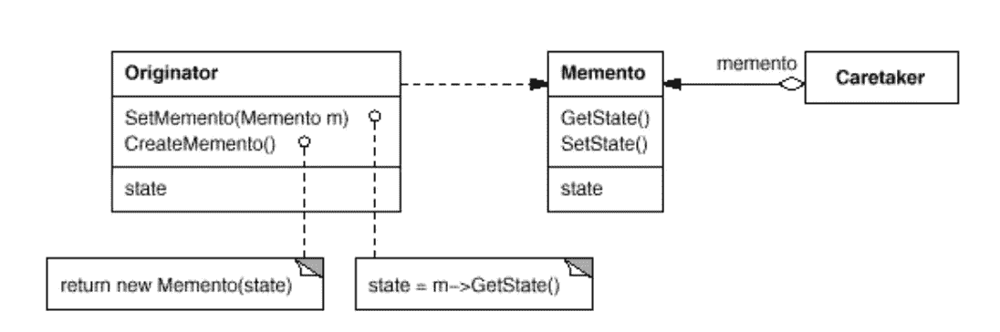

# 简单模式:纪念品

> 原文：<https://itnext.io/easy-patterns-memento-ce966cec7478?source=collection_archive---------10----------------------->

本文是 easy 模式描述系列的延续，描述了保存当前状态的行为模式，并与之前保存的值进行进一步的交互。

## 创作模式:

> [**简易工厂**](/easy-patterns-simple-factory-b946a086fd7e)
> 
> [**工厂法**](/easy-patterns-factory-method-5f27385ac5c)
> 
> [**构建器**](/easy-patterns-builder-d85655bcf8aa)
> 
> [**单个**](/easy-patterns-singleton-283356fb29bf)
> 
> [**抽象工厂**](/easy-patterns-abstract-factory-2325cb398fc6)
> 
> [**原型**](/easy-patterns-prototype-e03ec6962f89)

## 结构模式:

> [**适配器**](/easy-patterns-adapter-9b5806cb346f)
> 
> [**装饰者**](/easy-patterns-decorator-eaa96c0550ea)
> 
> [**桥**](/easy-patterns-bridge-28d50dc25f9f)
> 
> [**复合**](/easy-patterns-composite-8b28aa1f158)
> 
> [**立面**](/easy-patterns-facade-8cb185f4f44f)
> 
> [**飞锤**](/easy-patterns-flyweight-dab4c018f7f5)
> 
> [**代理**](/easy-patterns-proxy-45fc3a648020)

## 行为模式:

> [**来访者**](/easy-patterns-visitor-b8ef57eb957)
> 
> [**调解员**](/easy-patterns-mediator-e0bf18fefdf9)
> 
> [**观察者**](/easy-patterns-observer-63c832d41ffd)
> 
> *****(本文)*****
> 
> ****[**迭代器**](/easy-patterns-iterator-f5c0dd85957)****
> 
> ****[**责任链**](/easy-patterns-chain-of-responsibility-9a84307ad837)****
> 
> ****[**策略**](/easy-patterns-strategy-ecb6f6fc0ef3)****
> 
> ****[**状态**](/easy-patterns-state-ec87a1a487b4)****

# ****主要本质****

****memento 模式由两个对象实现:发起者和看管者。**发起者**是具有内部状态的对象。**管理员**对发起者执行操作，但是在需要的时候可以撤销变更。看管人向发起者请求纪念对象。然后应用该操作。看管人可以将发起者回滚到初始状态，将纪念对象返回给发起者。****

# ****使用示例****

****在上面的例子中，我们创建了可以保存一些值的看守实例，这些值是通过`setValue`方法添加的。在某种程度上，我们将当前的看守状态称为发起者实例。之后，我们继续向它输入值。之后，我们意识到我们需要用`caretaker.restore`回滚到先前保存的状态。最后，看守者保持先前保存的状态。****

# ****利润****

****使用这种模式将状态保存为里程碑并在它们之间来回移动很方便(撤销/重做功能)。****

# ****结论****

****如果您觉得这篇文章有帮助，请点击👏按钮并在下面随意评论！****