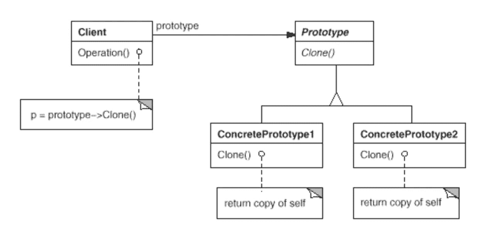

# 简单模式:原型

> 原文：<https://itnext.io/easy-patterns-prototype-e03ec6962f89?source=collection_archive---------3----------------------->

本文是 easy patterns 系列描述的延续，介绍了一个原型模式，它解决了在运行时创建新类实例的问题，特别是当手动实例化新类比复制现有类花费更多时间时。

## 创作模式:

> [**简易工厂**](/easy-patterns-simple-factory-b946a086fd7e)
> 
> [**工厂法**](/easy-patterns-factory-method-5f27385ac5c)
> 
> [**建造者**](/easy-patterns-builder-d85655bcf8aa)
> 
> [**单个**](/easy-patterns-singleton-283356fb29bf)
> 
> [**抽象工厂**](/easy-patterns-abstract-factory-2325cb398fc6)
> 
> [**原型**](/easy-patterns-prototype-e03ec6962f89) *(本文)*

## 结构模式:

> [**适配器**](/easy-patterns-adapter-9b5806cb346f)
> 
> [**装饰者**](/easy-patterns-decorator-eaa96c0550ea)
> 
> [**桥梁**](/easy-patterns-bridge-28d50dc25f9f)
> 
> [**复合**](/easy-patterns-composite-8b28aa1f158)
> 
> [**立面**](/easy-patterns-facade-8cb185f4f44f)
> 
> [**飞锤**](/easy-patterns-flyweight-dab4c018f7f5)
> 
> [**代理**](/easy-patterns-proxy-45fc3a648020)

## 行为模式:

> [**来访者**](/easy-patterns-visitor-b8ef57eb957)
> 
> [**调解员**](/easy-patterns-mediator-e0bf18fefdf9)
> 
> [**观察者**](/easy-patterns-observer-63c832d41ffd)
> 
> [**纪念品**](/easy-patterns-memento-ce966cec7478)
> 
> [**迭代器**](/easy-patterns-iterator-f5c0dd85957)
> 
> [**责任链**](/easy-patterns-chain-of-responsibility-9a84307ad837)
> 
> [**策略**](/easy-patterns-strategy-ecb6f6fc0ef3)
> 
> [**状态**](/easy-patterns-state-ec87a1a487b4)

# 主要本质

当克隆某个现有实例比从类中实例化它更便宜时，这种模式非常有用。当在运行时指定要实例化的类时，这种方法非常有用。构建代表产品层次结构的工厂层次结构可能会有巨大的成本，尤其是在某些具体实例只有几种状态组合的情况下。所以原型模式应该被认为是获取现有类实例副本的轻量级解决方案。

这种模式只包括两个主要角色:

*   **原型** —能够自我克隆的类的接口和实现
*   **客户端** —通过要求原型克隆自身来创建新实例

因此，每当系统需要获得新的类实例时，它会要求内部原型方法克隆自己并返回结果。

# 使用示例

在示例中，我们将基于 coffee 类(原型)创建一个 Coffee 实例。之后，我们将创建另一个咖啡实例(用克隆方法),并添加一些牛奶。因此，我们将获得两个独立的 coffee 实例(免费，没有任何显式实例化)。

# 利润

原型模式与抽象工厂模式有很多共同之处。它对客户端隐藏了具体的产品类，因此客户端需要知道的产品名称较少。

使用这种模式带来了 JavaScript 环境中常见的巨大好处——客户端可以在运行时安装和移除原型。

使用原型模式可以减少系统需要的类的数量。克隆逻辑可以通过对象组合来定义行为，因此克隆实例的外观和行为取决于您。

另一方面，工厂方法模式往往有一个子类层次结构。原型模式只是使用实现的克隆方法，而不是要求工厂方法基于某个子类层次结构创建一个新对象。因此，使用原型模式可以完全避免使用子类层次结构。

# 薄弱的地方

另一方面，Prototype 的每个子类都必须实现克隆逻辑。当现有的类内部不支持复制或具有复杂的嵌套结构时，实现 clone 方法会很困难。

# 结论

如果可以轻松实现克隆逻辑，这种模式会让生活变得更轻松。尤其是在大量使用[复合](/easy-patterns-composite-8b28aa1f158)和[装饰](/easy-patterns-decorator-eaa96c0550ea)模式的地方。

如果您觉得这篇文章有帮助，请点击👏按钮并在下面随意评论！