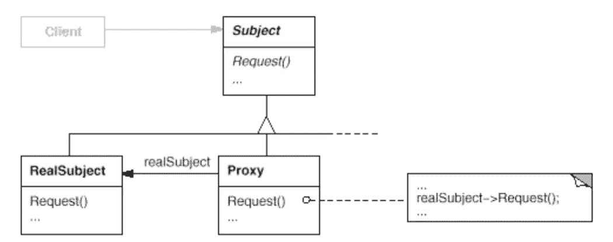

# 简单模式:代理

> 原文：<https://itnext.io/easy-patterns-proxy-45fc3a648020?source=collection_archive---------12----------------------->



本文是 easy patterns 系列描述的延续，介绍了一个名为 Proxy 的结构模式，它为另一个对象提供了一个占位符来控制对它的访问。

也请参考其他模式文章:

## 创作模式:

> [**简易工厂**](/easy-patterns-simple-factory-b946a086fd7e)
> 
> [**工厂法**](/easy-patterns-factory-method-5f27385ac5c)
> 
> [**建造者**](/easy-patterns-builder-d85655bcf8aa)
> 
> [**单个**](/easy-patterns-singleton-283356fb29bf)
> 
> [**抽象工厂**](/easy-patterns-abstract-factory-2325cb398fc6)
> 
> [**原型**](/easy-patterns-prototype-e03ec6962f89)

## 结构模式:

> [**适配器**](/easy-patterns-adapter-9b5806cb346f)
> 
> [**装饰者**](/easy-patterns-decorator-eaa96c0550ea)
> 
> [**桥**](/easy-patterns-bridge-28d50dc25f9f)
> 
> [**复合**](/easy-patterns-composite-8b28aa1f158)
> 
> [**立面**](/easy-patterns-facade-8cb185f4f44f)
> 
> [**飞锤**](/easy-patterns-flyweight-dab4c018f7f5)
> 
> [**代理**](/easy-patterns-proxy-45fc3a648020) (本文)

## 行为模式:

> [**来访者**](/easy-patterns-visitor-b8ef57eb957)
> 
> [**调解员**](/easy-patterns-mediator-e0bf18fefdf9)
> 
> [**观察者**](/easy-patterns-observer-63c832d41ffd)
> 
> [**纪念品**](/easy-patterns-memento-ce966cec7478)
> 
> [**迭代器**](/easy-patterns-iterator-f5c0dd85957)
> 
> [**责任链**](/easy-patterns-chain-of-responsibility-9a84307ad837)
> 
> [**策略**](/easy-patterns-strategy-ecb6f6fc0ef3)
> 
> [**状态**](/easy-patterns-state-ec87a1a487b4)

# 主要本质

代理模式在需要比简单指针更通用、更复杂的对象引用的情况下非常有用。代理在适当的时候将请求转发给主题，这取决于代理的类型。

一些常见的代理有:

*   **远程代理** —提供某个远程对象的本地表示(例如，在将数据发送到服务器之前收集一些数据块进行保存，以避免网络的额外负载)
*   虚拟代理——用轻量级表示代替昂贵的对象。仅在需要时创建这种昂贵的对象(例如图像占位符。用户滚动到文档中的适当位置，只有在这种情况下，我们才应该加载相当大的图片)
*   一个**保护代理** —控制对原始对象的访问(例如，在对某些功能具有单独访问权限的情况下，如具有授权分离的某些内容)
*   一个**智能引用**——控制主题是否应该被锁定(由于其他用户的编辑过程)或计算主题的点击次数等

这种模式包括两个主要角色:

*   **代理** —维护一个引用，允许代理访问真实主体，提供一个与主体相同的接口用于合法替换，并控制对被替换主体的访问。
*   **主题**—定义代理代表的对象。

这种模式也被称为**代理**。

在 JavaScript 语言中，有一个名为 Proxy 的特殊类。

```
const proxyObject = new Proxy(subject, handlerObject);
// subject - target object
// handlerObject - object with a traps (hooks) for a specific operations with a subject
```

让我们在这里描述一些陷阱:

*   `get(target, property, receiver)` —当`target`对象的特定`property`为红色时触发。`receiver`在大多数情况下是代理本身。
*   `set(target, property, receiver)` —在写入代理的情况下触发。
*   `has(target, query)` —在目标对象中检查到属性存在时触发。(操作员`in`)

```
const subject = {
  name: 'Pavel',
  age: 20
};const proxyObject = new Proxy(subject, {
  has(target, property) {
    console.log(`${property} is accessed`);
    return true;
  }
});console.log('someNonExistingProp' in proxyObject); // true
```

*   `deleteProperty` —在`delete`操作时触发。如果删除成功，应该返回 true
*   `apply(target, thisArg, argsList)` —当代理对象是一个函数时，在调用它之后立即触发。`thisArg`是调用的上下文(`this`)，而`argsList`是传递给函数的参数列表
*   `construct(target, argsList)` —实例化流程出现时触发(带`new`运算符)。

关于代理类实现的所有列表和更多信息你可以在这里找到。

# 使用示例

让我们创建一个具有内部状态(`isOn`)和两个控制开关的咖啡机。代理的职责是控制对这些方法的访问——如果机器已经打开，就没有必要再打开。机器关闭时的情况也是如此。在这种情况下，我们希望向用户显示机器已经打开或关闭的消息，而无需任何进一步的操作。

这是一个简单的**访问代理**的例子。

# 利润

**当访问一个对象时，代理模式引入了一个间接层。**

这种间接方式有许多用途:

*   保护代理允许控制访问过程
*   智能引用代理允许收集关于主题使用的信息
*   虚拟代理可以执行各种优化(比如按需创建对象和避免系统过载)
*   远程代理可以从不同的地址空间提供对远程对象的访问

另一种有用的方法叫做**写时复制**优化。这与按需创作有关。复制一个大而复杂的对象可能是一个昂贵的操作，如果副本从不被修改，那么这样的成本是没有用的。使用这种方法，我们确保只有在需要返回被修改的复杂对象时才使用复制过程。如果没有，我们应该只返回一个到现有链接的链接，并增加对它的引用计数。

# 薄弱的地方

**当访问一个对象时，代理模式引入了一个间接层。**

这会导致创建额外的实例，在一些简单的情况下，这可能是一种开销。

# 结论

代理模式的主要协作:它根据代理的种类，在适当的时候将请求转发给 Subject。

代理模式有几种常见的用例:

*   远程代理
*   虚拟代理
*   保护代理
*   智能引用代理

代理对象包装主题本身。通常，为了安全起见，您甚至可以重写一个指向原始主题的链接:

```
let payload = {
  name: 'Pavel',
  age: 20
};payload = new Proxy(payload, {
  ... // some proxy hooks
});// payload object here is already wrapped by proxy
```

还有一些其他相关的设计模式，如[适配器](/easy-patterns-adapter-9b5806cb346f)和[装饰器](/easy-patterns-decorator-eaa96c0550ea)。

**适配器**为它所适配的对象提供不同的接口，而代理为它的主体提供相同的接口。并且代理模式也用于可以拒绝执行操作的访问保护。

装饰器向对象添加一个或多个职责，而代理控制对包装对象的访问。然而，装饰者可以拥有与代理类似的实现。

如果您觉得这篇文章有帮助，请点击👏按钮并在下面随意评论！