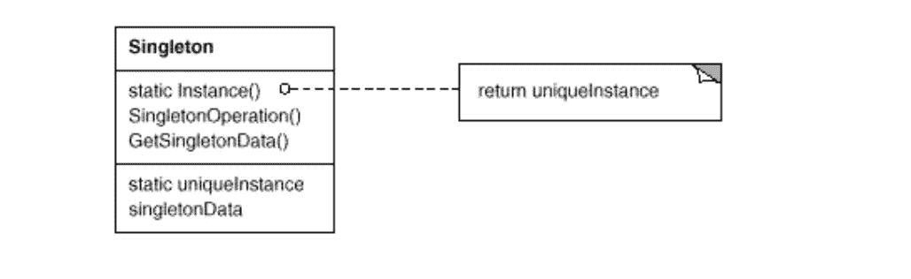

# 简单模式:单例

> 原文：<https://itnext.io/easy-patterns-singleton-283356fb29bf?source=collection_archive---------8----------------------->

通过这篇文章，我开始了一系列关于架构模式的简单明了的文章。我会用 JavaScript 实现例子。我在这些文章中的主要目标是用生活中的真实例子以简单的方式描述模式，并带来可记忆的类比。所以你心里很清楚。目前，您可以找到此类模式的文章:

## 创作模式:

> [**简易工厂**](/easy-patterns-simple-factory-b946a086fd7e)
> 
> [**工厂法**](/easy-patterns-factory-method-5f27385ac5c)
> 
> [**构建器**](/easy-patterns-builder-d85655bcf8aa)
> 
> *****(本文)*****
> 
> ****[**抽象工厂**](/easy-patterns-abstract-factory-2325cb398fc6)****
> 
> ****[**原型**](/easy-patterns-prototype-e03ec6962f89)****

## ****结构模式:****

> ****[**适配器**](/easy-patterns-adapter-9b5806cb346f)****
> 
> ****[**装饰者**](/easy-patterns-decorator-eaa96c0550ea)****
> 
> ****[**桥梁**](/easy-patterns-bridge-28d50dc25f9f)****
> 
> ****[**复合**](/easy-patterns-composite-8b28aa1f158)****
> 
> ****[**立面**](/easy-patterns-facade-8cb185f4f44f)****
> 
> ****[**飞锤**](/easy-patterns-flyweight-dab4c018f7f5)****
> 
> ****[**代理**](/easy-patterns-proxy-45fc3a648020)****

## ****行为模式:****

> ****[**来访者**](/easy-patterns-visitor-b8ef57eb957)****
> 
> ****[**调解员**](/easy-patterns-mediator-e0bf18fefdf9)****
> 
> ****[**观察者**](/easy-patterns-observer-63c832d41ffd)****
> 
> ****[**纪念品**](/easy-patterns-memento-ce966cec7478)****
> 
> ****[**迭代器**](/easy-patterns-iterator-f5c0dd85957)****
> 
> ****[**责任链**](/easy-patterns-chain-of-responsibility-9a84307ad837)****
> 
> ****[**策略**](/easy-patterns-strategy-ecb6f6fc0ef3)****
> 
> ****[状态**状态**状态](/easy-patterns-state-ec87a1a487b4)****

# ****主要精华****

****Singleton 有助于将对象创建委托给单独的函数，该函数只能用最少的逻辑返回新的实例。基本上它能做的就这么多了。它与静态类或对象的不同之处在于，它不提供所创建类的实际实例，而是提供代码结构，以确保通过严格定义的方式获得实例。所以，singleton——它是一个**代码结构**，而不是一个类实例。一个类必须只有一个实例，并且客户端必须可以从一个众所周知的访问点访问它。(GoF 书)****

# ****利润****

****单例可以延迟它们的初始化，因为它们可能依赖于一些在应用程序初始化期间不可用的数据。因此，您只能在需要的时候获得一个实例——它节省了运行时资源，并使其按需变得灵活。****

# ****小心使用它****

****虽然我们发现自己需要使用这种模式，但这通常是 app 架构需要重新评估的迹象。这表明模块是紧密耦合的，或者逻辑过度分散在应用程序的许多部分。由于隐藏的依赖和存根，Singleton 可能更难测试。请参考这篇文章，阅读更多关于这种模式的潜在问题[ibm.com](https://www.ibm.com/developerworks/webservices/library/co-single/index.html)。****

# ****为什么推迟执行被认为对一个独生子很重要？****

****在许多语言中，它用来隔离动态初始化顺序的不可预测性，将控制权交还给程序员。注意类(对象)的静态实例和单例实例之间的区别是很重要的:虽然单例实例可以作为静态实例来实现，但它也可以被惰性地构造，不需要资源也不需要内存，直到真正需要它的时候。如果我们有一个可以直接初始化的静态对象，我们需要确保代码总是以相同的顺序执行，当你有大量的源文件时，这是不可伸缩的。单例对象和静态对象都是有用的，但是它们不应该被过度使用——就像我们不应该过度使用其他模式一样。实际上，当只需要一个对象来协调系统中的其他对象时，单例模式非常有用。****

# ****例子****

****在这个例子中，我们创建了 FetchId singleton。它只导出 Singleton 的实例，所以我们已经确保它是安全的。但是，为了防止有人用一些逻辑扩展这个模块，我们提供了防止直接使用类构造函数的 enforcer 符号。所以，`instance` getter 是实例化类的唯一地方。****

# ****结论****

****如果您觉得这篇文章有帮助，请点击👏按钮并在下面随意评论！****