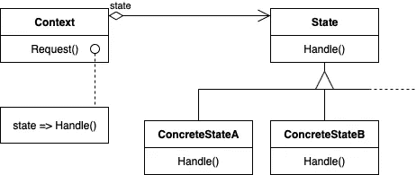

# 简单模式:状态

> 原文：<https://itnext.io/easy-patterns-state-ec87a1a487b4?source=collection_archive---------4----------------------->

状态模式的结构

本文是 easy patterns 系列描述的延续，提出了一个名为 State 的行为模式，当对象的内部状态改变时，它帮助对象改变其行为。

也请参考其他模式文章:

## 创作模式:

> [**简易工厂**](/easy-patterns-simple-factory-b946a086fd7e)
> 
> [**工厂法**](/easy-patterns-factory-method-5f27385ac5c)
> 
> [**构建器**](/easy-patterns-builder-d85655bcf8aa)
> 
> [**单个**](/easy-patterns-singleton-283356fb29bf)
> 
> [**抽象工厂**](/easy-patterns-abstract-factory-2325cb398fc6)
> 
> [**原型**](/easy-patterns-prototype-e03ec6962f89)

## 结构模式:

> [**适配器**](/easy-patterns-adapter-9b5806cb346f)
> 
> [**装饰者**](/easy-patterns-decorator-eaa96c0550ea)
> 
> [**桥**](/easy-patterns-bridge-28d50dc25f9f)
> 
> [**复合**](/easy-patterns-composite-8b28aa1f158)
> 
> [**立面**](/easy-patterns-facade-8cb185f4f44f)
> 
> [**飞锤**](/easy-patterns-flyweight-dab4c018f7f5)
> 
> [**代理**](/easy-patterns-proxy-45fc3a648020)

## 行为模式:

> [**来访者**](/easy-patterns-visitor-b8ef57eb957)
> 
> [**调解员**](/easy-patterns-mediator-e0bf18fefdf9)
> 
> [**观察者**](/easy-patterns-observer-63c832d41ffd)
> 
> [**纪念品**](/easy-patterns-memento-ce966cec7478)
> 
> [**迭代器**](/easy-patterns-iterator-f5c0dd85957)
> 
> [**责任链**](/easy-patterns-chain-of-responsibility-9a84307ad837)
> 
> [**策略**](/easy-patterns-strategy-ecb6f6fc0ef3)
> 
> [**状态**](/easy-patterns-state-ec87a1a487b4) *(本文)*

# 主要本质

考虑一个在外部条件的基础上表示某种逻辑的类。状态模式允许您选择与这些外部条件相关的适当逻辑。一些外部条件类(上下文类)将所有特定于状态的逻辑委托给状态对象。该上下文类使用其状态对象实例来执行特定于其特定内部状态的操作。

这种模式也被称为状态对象。

这种模式包括两个主要角色:

*   **上下文** —定义客户感兴趣的接口，维护定义当前状态的状态对象。
*   **状态** —定义与上下文的特定状态相关的行为的接口。

很少提及他们的合作。上下文将特定于状态的请求委托给当前状态对象。

在处理一些特定的逻辑时，上下文可以将自己作为参数传递给状态对象。这允许状态对象在必要时访问上下文。

客户端可以使用状态对象配置上下文(因为上下文是客户端的主要接口)。

上下文或状态对象可以决定哪个状态在什么情况下继承另一个状态。

# 使用示例

在这个例子中，我们将创建一个咖啡机(Context 类),它根据内部状态准备咖啡。在 CoffeeMachine 实例化之后，我们为它提供了状态对象数组，这些对象定义了上下文类的内部状态以及准备咖啡的逻辑。`setState`方法设置`CoffeeMachine`类的新状态。`setStateLibrary`用状态对象来实现我们的上下文类。`process`方法为我们准备一个咖啡杯(在`preparingEspresso`或`preparingLatteMachiatto`状态类型的情况下)。在其他状态下只需返回空的`cup`。

也可以扩展`stateLibrary`逻辑来添加或删除现有的状态对象。另一种方法是将状态对象存储在不同的类中，并在需要时从上下文类中获取它们。

# 利润

状态模式为不同的状态本地化特定于状态的行为和分区行为。它将与特定状态相关的所有行为放入一个对象中。所有的状态对象都存在于一个具体的地方，所以很容易用特定于状态的代码添加新的对象。

这种模式的一种替代方法是使用数据值来定义内部状态，并让上下文操作显式地检查数据。但是在这种情况下，我们会在上下文的实现中分散使用条件语句或 case 语句。添加新状态可能需要更改几个操作，这使得维护变得复杂。这就是为什么状态模式有助于将关注点分散到许多状态对象上，并避免上下文类中的逻辑开销。

如果有许多状态，关注点分离实际上是很好的，否则就需要在上下文类本身中使用大量的条件语句。大型条件语句往往会使代码不太明确，这使得它们难以修改和扩展。

这种模式使得状态转换显式。没有内部值来描述上下文逻辑内部的东西，但是所有的状态特定逻辑都委托给特定的状态对象本身。为不同的状态引入单独的对象使得过渡明显地移动。此外，状态对象可以保护上下文免受不一致的内部状态的影响，因为从上下文的角度来看，状态转换是原子的。

状态对象可以在许多上下文类之间共享。在这种情况下，状态对象实际上是没有内在状态，只有行为的[轻量级](/easy-patterns-flyweight-dab4c018f7f5)。

# 薄弱的地方

这种模式将不同状态的行为分布在几个状态对象中。这增加了类的数量，并且不如单个上下文类紧凑。

# 结论

状态模式通常类似于[策略](/easy-patterns-strategy-ecb6f6fc0ef3)模式。但是在第二种情况下，只有功能可以被共享，并且策略应该被明确地设置到上下文类，并且通常上下文类用期望的策略实例来实例化。在状态模式的情况下，状态对象是基于一些明确的状态变化而动态选择的。

状态对象通常是没有任何显式嵌套和变异的单例对象。在这种情况下，很难跟踪系统中所有可能的状态对象。最好将每一个这样的对象分开，并做好记录。

如果您觉得这篇文章有帮助，请点击👏按钮并在下面随意评论！