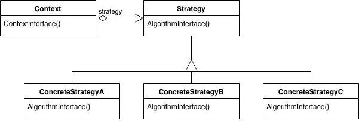

# 简单模式:策略

> 原文：<https://itnext.io/easy-patterns-strategy-ecb6f6fc0ef3?source=collection_archive---------4----------------------->

战略模式的结构

本文是 easy patterns 系列描述的延续，介绍了一个名为策略的行为模式，它有助于定义一系列算法，并使它们可以为客户所用。

也请参考其他模式文章:

## 创作模式:

> [**简易工厂**](/easy-patterns-simple-factory-b946a086fd7e)
> 
> [**工厂法**](/easy-patterns-factory-method-5f27385ac5c)
> 
> [**构建器**](/easy-patterns-builder-d85655bcf8aa)
> 
> [**单个**](/easy-patterns-singleton-283356fb29bf)
> 
> [**抽象工厂**](/easy-patterns-abstract-factory-2325cb398fc6)
> 
> [**原型**](/easy-patterns-prototype-e03ec6962f89)

## 结构模式:

> [**适配器**](/easy-patterns-adapter-9b5806cb346f)
> 
> [**装饰者**](/easy-patterns-decorator-eaa96c0550ea)
> 
> [**桥**](/easy-patterns-bridge-28d50dc25f9f)
> 
> [**复合**](/easy-patterns-composite-8b28aa1f158)
> 
> [**立面**](/easy-patterns-facade-8cb185f4f44f)
> 
> [**飞锤**](/easy-patterns-flyweight-dab4c018f7f5)
> 
> [**代理**](/easy-patterns-proxy-45fc3a648020)

## 行为模式:

> [**来访者**](/easy-patterns-visitor-b8ef57eb957)
> 
> [**调解员**](/easy-patterns-mediator-e0bf18fefdf9)
> 
> [**观察者**](/easy-patterns-observer-63c832d41ffd)
> 
> [**纪念品**](/easy-patterns-memento-ce966cec7478)
> 
> [**迭代器**](/easy-patterns-iterator-f5c0dd85957)
> 
> [**责任链**](/easy-patterns-chain-of-responsibility-9a84307ad837)
> 
> ****(本文)****
> 
> ****[**状态**](/easy-patterns-state-ec87a1a487b4)****

# ****主要本质****

****当您的类需要包含许多依赖于客户端类型的特定功能选项时(例如，根据特定的操作系统处理文本格式)，将这些功能分离出来并让您的类只具有一个在特定时刻该客户端需要的所需功能是非常有用的。****

****不同的算法在不同的时间会是合适的，我们最初并不需要它们都在我们的类中。甚至不要考虑这样一个事实，即如果一个新的算法已经是某个类的一个组成部分，那么就很难添加它。因此，将这种算法保存在单独的封装类中是一种更好的方法。****

****这种模式包括两个主要角色:****

*   ******策略**—为每个支持的算法声明一个接口和实现。****
*   ******Context** —您的类维护了一个对策略对象的引用，并定义了一个允许策略访问其数据的接口。****

****一般讲策略和语境，他们的交流方式有两种。当调用**上下文**的特定算法时，它可以传递**策略**所需的数据。或者，**上下文**可以将其自身作为参数传递给**策略**操作。第二个选项提供了在策略算法完成后回调上下文的可能性(例如在一些异步操作中)。****

****通常会定义一系列**策略**类供客户选择。****

# ****使用示例****

****在本例中，我们将创建一个咖啡机(Context ),它接受不同的策略对象，并根据应用的策略处理咖啡饮料。每个策略都有一个带有`name`的属性和一个包含特定算法的名为`process`的方法。`process`方法根据内部逻辑返回更新后的`cup`对象。正如你所看到的，在运行时在不同策略之间切换非常容易。****

# ****利润****

****相关算法家族有助于保持策略类有序，并在不同的上下文类中重用它们。****

****跨这种相关算法家族的继承有助于将算法的公共功能分解到某个父策略类中，并在子策略类中重用它。****

****这种模式有助于动态地改变算法(相反，当你用算法的一些嵌套实现来子类化上下文类时)。****

****策略消除了条件语句，这意味着你避免了不同的行为混合在一个类中，但是根据不同的策略对象有不同的逻辑。****

****客户端可以根据当前的需求在相同行为的不同实现中进行选择(例如，针对生产的优化代码或针对开发需求的冗长而缓慢的代码)。****

# ****薄弱的地方****

****客户必须了解不同的策略。潜在的问题是，客户在选择合适的策略之前，必须了解一些特定策略的不同之处。这就是为什么只有当行为变化与客户相关时才使用策略模式是最好的。****

****这种模式会导致策略和上下文之间潜在的通信开销。在某些情况下，策略实现可能非常简单，并且不会使用通过策略类的公共共享接口传递给它的所有信息。换句话说，上下文在策略算法中传递的信息量可能比策略算法真正需要的要多。****

****此外，如果您的逻辑有一个小的变化，这个算法可能是一个开销。策略对象的数量会极大地增加代码的复杂性，降低可读性。所以，也许 if/else 语句有时更好。****

# ****结论****

****这种模式也被称为**策略**。****

****开发人员应该检查共享策略不应该在调用之间保持一些公共状态。上下文是保存内部状态的唯一地方，策略的职责只是提供算法来解决一些计算问题。****

****当客户端时间或应用程序条件动态变化时，当您需要在算法之间动态切换时，这种模式非常有用。在应用程序中使用大量不同算法的情况下，它可以提高代码的可读性。但是在需要简单逻辑但种类不多的情况下也是无用的。****

****如果您觉得这篇文章有帮助，请点击👏按钮并在下面随意评论！****