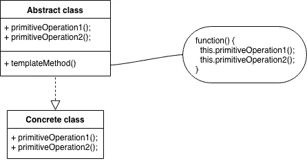

# 简单模式:模板方法

> 原文：<https://itnext.io/easy-patterns-template-method-9d90556326c7?source=collection_archive---------4----------------------->

模板方法模式的结构

本文是 easy patterns 系列描述的续篇，介绍了一个名为 Template Method 的行为模式，它有助于定义一个算法的框架，将一些步骤推迟到子类。因此，算法的结构是相同的，但是一些步骤可以在子类中被有效地重新定义。

也请参考其他模式文章:

## 创作模式:

> [**简易工厂**](/easy-patterns-simple-factory-b946a086fd7e)
> 
> [**工厂法**](/easy-patterns-factory-method-5f27385ac5c)
> 
> [**建造者**](/easy-patterns-builder-d85655bcf8aa)
> 
> [**单个**](/easy-patterns-singleton-283356fb29bf)
> 
> [**抽象工厂**](/easy-patterns-abstract-factory-2325cb398fc6)
> 
> [**原型**](/easy-patterns-prototype-e03ec6962f89)

## 结构模式:

> [**适配器**](/easy-patterns-adapter-9b5806cb346f)
> 
> [**装饰者**](/easy-patterns-decorator-eaa96c0550ea)
> 
> [**桥**](/easy-patterns-bridge-28d50dc25f9f)
> 
> [**复合**](/easy-patterns-composite-8b28aa1f158)
> 
> [**立面**](/easy-patterns-facade-8cb185f4f44f)
> 
> [**飞锤**](/easy-patterns-flyweight-dab4c018f7f5)
> 
> [**代理**](/easy-patterns-proxy-45fc3a648020)

## 行为模式:

> [**来访者**](/easy-patterns-visitor-b8ef57eb957)
> 
> [**调解员**](/easy-patterns-mediator-e0bf18fefdf9)
> 
> [**观察者**](/easy-patterns-observer-63c832d41ffd)
> 
> [**纪念品**](/easy-patterns-memento-ce966cec7478)
> 
> [**迭代器**](/easy-patterns-iterator-f5c0dd85957)
> 
> [**责任链**](/easy-patterns-chain-of-responsibility-9a84307ad837)
> 
> [**策略**](/easy-patterns-strategy-ecb6f6fc0ef3)
> 
> [状态**状态**状态](/easy-patterns-state-ec87a1a487b4)
> 
> [命令**命令**命令](/easy-patterns-command-15733a2b56f0)
> 
> [**解释器**](/easy-patterns-interpreter-58434c94304d)
> 
> **模板方法** *(当前文章)*

# 主要本质

模板方法模式提供了算法步骤的概要。实现这些步骤的对象可以选择重新定义或调整某些步骤，但结构保持不变。算法的一些不变部分应该在父类(或抽象类)中实现。可以变化的行为应该由子类来实现。

这种模式包括两个主要角色:

*   **抽象类** —定义算法的框架，实现一些不变的功能。
*   **具体类** —实现原语操作以执行算法的子类特定步骤。

具体类依赖抽象类来实现算法的不变步骤。

# 使用示例

在这个例子中，我们将实现一个咖啡机。抽象类定义了一些不变的功能(`turnOn`、`turnOff`、`cleanUp`)。一些像`brewCoffee`和`serve`这样的原始操作可能并且应该根据我们要作为具体类实现的咖啡机的类型来覆盖。

模板方法模式的代码示例

# 利润

模板方法模式为子类编写者提供了受控的自由来调整一些预定义的父类逻辑。这种覆盖仅在一些定义的**钩子操作**中是可能的，它本身是一个反向控制结构。父类调用子类的操作，而不是相反。这也被称为“好莱坞原则”，即“不要打电话给我们，我们会打电话给你”。

# 薄弱的地方

对于模板方法来说，指定哪些操作**可以被**覆盖，哪些是抽象操作(**必须被**覆盖)是很重要的。为了有效地重用抽象类，子类编写者必须理解哪些操作是为重写而设计的。

很容易忘记调用继承的操作。因此，我们可以让父类控制子类如何扩展它，而不是在继承的操作上调用父操作。想法是从父类中的模板方法调用钩子操作。然后子类可以覆盖这个钩子操作。

# 结论

工厂方法通常由模板方法调用。

策略模式可能看起来相似，但策略使用委托来改变整个算法，而模板方法使用继承来改变算法的一部分。

如果您觉得这篇文章有帮助，请点击👏按钮并在下面随意评论！