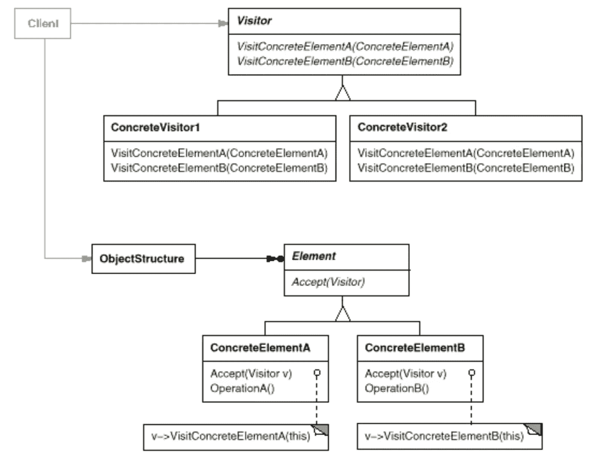

# 简单模式:访问者

> 原文：<https://itnext.io/easy-patterns-visitor-b8ef57eb957?source=collection_archive---------8----------------------->

本文是 easy 模式描述系列的延续，描述了分离类和它们执行的操作的行为模式。

目前，您可以找到此类模式的文章:

## 创作模式:

> [**简易工厂**](/easy-patterns-simple-factory-b946a086fd7e)
> 
> [**工厂法**](/easy-patterns-factory-method-5f27385ac5c)
> 
> [**建造者**](/easy-patterns-builder-d85655bcf8aa)
> 
> [**单个**](/easy-patterns-singleton-283356fb29bf)
> 
> [**抽象工厂**](/easy-patterns-abstract-factory-2325cb398fc6)
> 
> [**原型**](/easy-patterns-prototype-e03ec6962f89)

## 结构模式:

> [**适配器**](/easy-patterns-adapter-9b5806cb346f)
> 
> [**装饰者**](/easy-patterns-decorator-eaa96c0550ea)
> 
> [**桥**](/easy-patterns-bridge-28d50dc25f9f)
> 
> [**复合**](/easy-patterns-composite-8b28aa1f158)
> 
> [**立面**](/easy-patterns-facade-8cb185f4f44f)
> 
> [**飞锤**](/easy-patterns-flyweight-dab4c018f7f5)
> 
> [**代理**](/easy-patterns-proxy-45fc3a648020)

## 行为模式:

> [**来访者**](/easy-patterns-visitor-b8ef57eb957) *(本文)*
> 
> [**调解员**](/easy-patterns-mediator-e0bf18fefdf9)
> 
> [**观察者**](/easy-patterns-observer-63c832d41ffd)
> 
> [**纪念品**](/easy-patterns-memento-ce966cec7478)
> 
> [**迭代器**](/easy-patterns-iterator-f5c0dd85957)
> 
> [**责任链**](/easy-patterns-chain-of-responsibility-9a84307ad837)
> 
> [**策略**](/easy-patterns-strategy-ecb6f6fc0ef3)
> 
> [**状态**](/easy-patterns-state-ec87a1a487b4)

# 主要本质

访问者模式的主要思想是将类从它们执行的逻辑中分离出来。这有助于在不改变类本身的情况下添加新的逻辑(实体[的开/闭原理](https://en.wikipedia.org/wiki/SOLID))。

要实现这种模式，您需要两种类型的参与者:

*   **访问者** —声明具体类的操作。每个操作的名称应该包含向访问者发送访问请求的特定类的签名。
*   **元素** —定义一个接受操作，将访问者作为参数。

# 使用示例

在这个例子中，我们实现了基本的 visitor 和 element 类。在我们实现了与 console.log、警报和通知系统以及具体的访问者一起工作的具体元素之后，这些具体的访问者能够通过这些渠道向我们进行与通知相关的所有工作。在我们实例化了元素和 visitor 并调用每个 visitor accept 方法(将 visitor 实例作为参数传递)之后，我们可以在控制台、警报模式和通知 api 中看到输出。

因此，您可以看到，将另一个 visitor 实例传递给 accept 方法为每个元素类带来了一些其他功能(这些功能保持不变，因为所有逻辑都委托给了特定的 visitor)。

# 利润

1.  Visitor 使添加新操作更加容易。您可以通过添加新的访问者来定义对对象结构的新操作。如果没有这种模式，如果您在许多类之间扩展逻辑并决定添加新的操作，您应该为每个类都这样做。
2.  访问者模式有助于收集相关的操作和分离不相关的操作。不相关的操作应该设置在单独的 visitor 子类中。
3.  累积元素状态。就访问者访问对象结构中的每个元素而言，基于被调用的操作积累状态是非常容易的。

# 薄弱的地方

1.  然而，添加新元素类比平常更难。每一个新元素都会促使你给访问者添加新的操作。
2.  访问者模式经常破坏封装。它假设元素通过提供访问元素内部状态的公共操作来让 visitor 完成它的工作。这可能会影响其封装。

# 结论

如果您觉得这篇文章有帮助，请点击👏按钮并在下面随意评论！