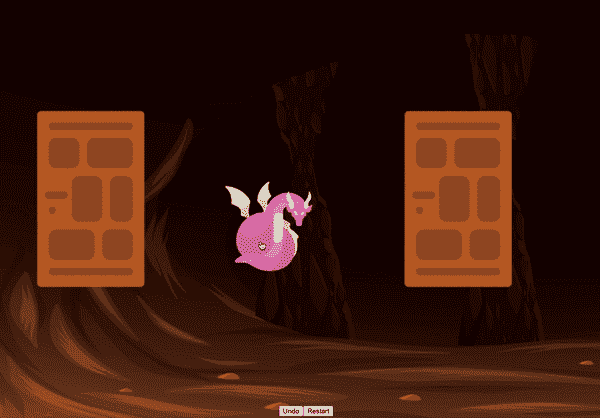

# React 和 Immer.js 的轻松撤销功能

> 原文：<https://itnext.io/easy-undo-feature-with-react-and-immer-js-9b467c080257?source=collection_archive---------2----------------------->

从头开始为 React 应用程序添加撤销功能是一项相当复杂的任务。管理状态已经很棘手了，实现撤销意味着状态版本化和跟踪随时间的变化。幸运的是，Immer.js 让它变得简单多了。

让我们探索使用 Immer.js 来管理复杂的状态和处理撤销，同时构建一个有趣的小地牢爬虫游戏。

完成的游戏

# 什么是 Immer.js？

Immer.js 是一个非常棒的库，有着广泛的应用。但是它的核心用例是提供无缝的[不变性](https://en.wikipedia.org/wiki/Immutable_object#:~:text=In%20object%2Doriented%20and%20functional,modified%20after%20it%20is%20created)。它允许您修改数据结构并返回副本，而不是改变原始数据。

你可能知道其他完成同样事情的库，主要是 [Immutable.js](https://immutable-js.github.io/immutable-js/) 。在众多选项中，Immer.js 是一个更好的选择，主要原因是它可以处理本机对象类型。

不可变的. js 的最大缺点是它为每个数据结构提供了一个自定义类型。另一方面，Immer.js 返回它接收到的相同的对象类型，这使得它很少受到干扰，并且更容易使用。

## Immer.js 的“生产”功能

Immer.js 的主要特点是[产生](https://immerjs.github.io/immer/produce)函数。该函数接受一个源对象和用于修改源的自定义处理程序。`produce`返回一个新副本，同时保持源文件不变:

在处理程序中，您会收到一个 draft 参数，您可以使用它直接改变源代码，而不用担心副作用。经手人不必退回汇票。Immer.js 足够聪明，可以在没有显式返回的情况下跟踪更改。

Immer 使用[写时复制](https://en.wikipedia.org/wiki/Copy-on-write)机制，这使得复制对象具有性能。

如果你想了解更多关于 Immer.js 的知识，最好从他们的[文档](https://immerjs.github.io/immer/)开始。

## 修补程序概述

构建撤销特性需要使用 Immer.js 更高级的功能— [补丁](https://immerjs.github.io/immer/patches)。

使用补丁，Immer.js 跟踪对状态所做的所有更改。补丁是 JSON 对象，遵循 Immer.js 理解的格式。补丁看起来是这样的:

您可以使用`applyPatches`函数将这些补丁反馈给 Immer.js 来撤销或重新应用状态更改。

# 辅导的

完成了对 Immer.js 的基本概述，让我们开始我们的教程。

如前所述，我们将构建一个简单的游戏。你在一个地牢里，面前有三扇门。其中一个有你要找的宝藏，另外两个背后有死敌。

这个游戏最重要的特点(对我们来说)是你可以使用撤销按钮作弊。

## 添加还原剂

我们将使用 [useReducer](https://reactjs.org/docs/hooks-reference.html#usereducer) 来管理应用程序的状态。这是我们减速器的初始设置:

我们的 reducer 使用`produce`函数返回一个新的状态。所有的状态操作都发生在生产处理程序内部。请再次注意，我们可以自由地改变状态，但一切仍然正常。相当酷！

`generateDoors`返回包含随机内容的门的数组。

我们使用减速器的方式和平时一样:

## 添加补丁

现在，让我们使用补丁。

这个`produce`函数实际上可以接受三个参数:

1.  初始源对象。在我们的例子中，它是减速器的状态。
2.  状态突变的处理函数。
3.  接收补丁的第二个处理程序。我们需要保存这些补丁以备后用。

补丁处理函数接收两个参数:

1.  修补程序—具有最新状态更改的修补程序阵列。
2.  inversePatches —用于恢复最新状态更改的修补程序阵列。

在我们的例子中，我们只关心`inversePatches`数组。然而，如果您要实现重做，您也需要跟踪`patches`。

让我们提供在逆向补丁到达时记录它们的处理程序:

注意，我们需要调用`enablePatches`来激活补丁特性。

我们检查以确保我们只跟踪可撤销操作的补丁。在我们的例子中，`OPEN_DOOR`是唯一可撤销的动作。

此外，当重置游戏时，我们希望清除`RESET`动作中的补丁。

## 添加撤消

这里的最后一步是添加应用我们存储的反向补丁的`UNDO`动作:

我们从`inverseChanges`数组中弹出最新的逆向补丁并应用它。注意，调用`applyPatches`时，Immer.js 要求我们显式返回结果。更多信息请点击此处。

# 包扎

本教程到此为止。我们看到添加撤销特性来与 Immer.js 交互是多么容易。

Immer.js 是一个很棒的不变性库，补丁允许创建一些高级功能。您可以使用补丁来构建诸如通过 WebSockets 交流更新、跟踪/调试、版本控制等功能。

这里有一个链接，链接到这个教程的完整代码的[代码沙箱](https://codesandbox.io/s/immer-undo-66mbe)。

*原载于 2021 年 5 月 24 日 https://isamatov.com**的* [*。*](https://isamatov.com/undo-with-react-and-immer/)