# 使用 VSTS 管道将 Angular 5 应用程序部署到 Azure Web App 的简单方法

> 原文：<https://itnext.io/easy-way-to-deploy-a-angular-5-application-to-azure-web-app-using-vsts-pipelines-4a288b9deae1?source=collection_archive---------1----------------------->

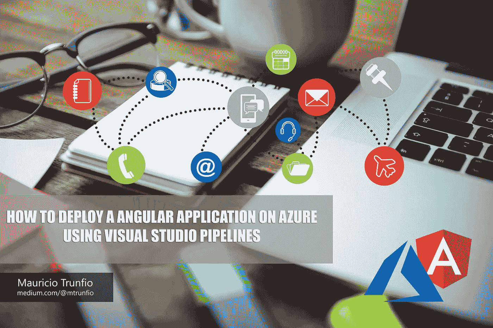

最近，我不得不将一个简单的 Angular 5 应用程序部署到 Azure 环境中，所以我决定使用 VSTS 部署管道来加速这个过程，但我错了。互联网上有如此多的错误信息，以至于我花了将近两天的时间才完成了这个版本的创建。

所以我决定写这篇文章来帮助像我这样的人，他们想要一种快速简单的方法来将 Angular 应用程序部署到 Azure，而没有痛苦。

# 以下是步骤:

## web.config 文件

这是解决方案中最重要的部分。你必须告诉 Azure 你正在使用一个节点应用，你需要启动它。我尝试了很多我在网上找到的解决方法，但是解决我的问题的是这个。以下是完整的 web.config 文件:

```
<configuration>
    <system.webServer>
      <rewrite>
        <rules>
          <rule name="Angular" stopProcessing="true">
            <match url=".*" />
            <conditions logicalGrouping="MatchAll">
              <add input="{REQUEST_FILENAME}" matchType="IsFile" negate="true" />
              <add input="{REQUEST_FILENAME}" matchType="IsDirectory" negate="true" />
            </conditions>
            <action type="Rewrite" url="/" />
          </rule>
        </rules>
      </rewrite>
    </system.webServer>
</configuration>
```

你必须把这个文件放在 */src/* 文件夹中，并在*资产*区域的 *angular.json* 文件中引用它，就像这样:


请参考 Angular.json 文件上的 web.config 文件

## VSTS 大厦

现在是时候创建您的构建并配置正确的步骤了。

创建新的构建，选择相关的源和项目以及该构建将处理的分支。

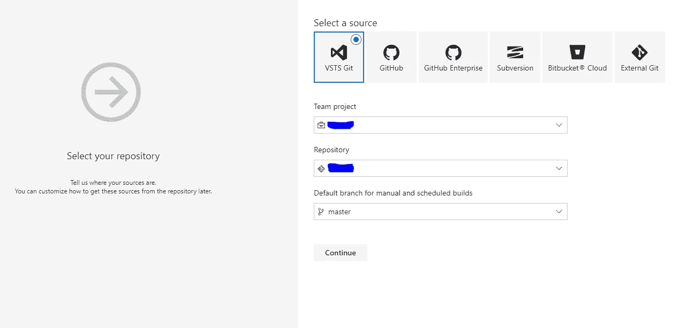

创建 VSTS 版本

由于我们没有 azure 上的 Angular 应用程序模板，请在下一个屏幕中单击“**清空管道**”。您将看到这个屏幕:

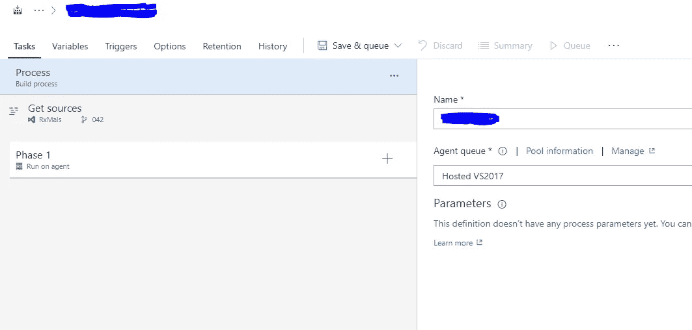

空管道模板

单击第 1 阶段代理的“ **+** ”，并在“添加任务”屏幕的搜索框中键入“ *npm* ”。选择 npm 任务，点击*添加*

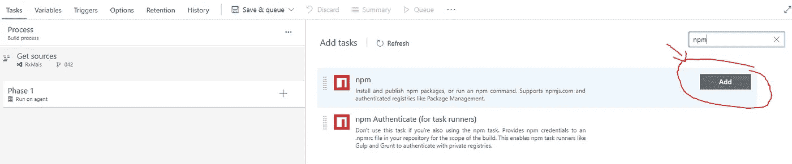

将 npm 任务添加到阶段 1

现在，选择您在左侧面板中添加的 npm 任务，并像这样配置它:

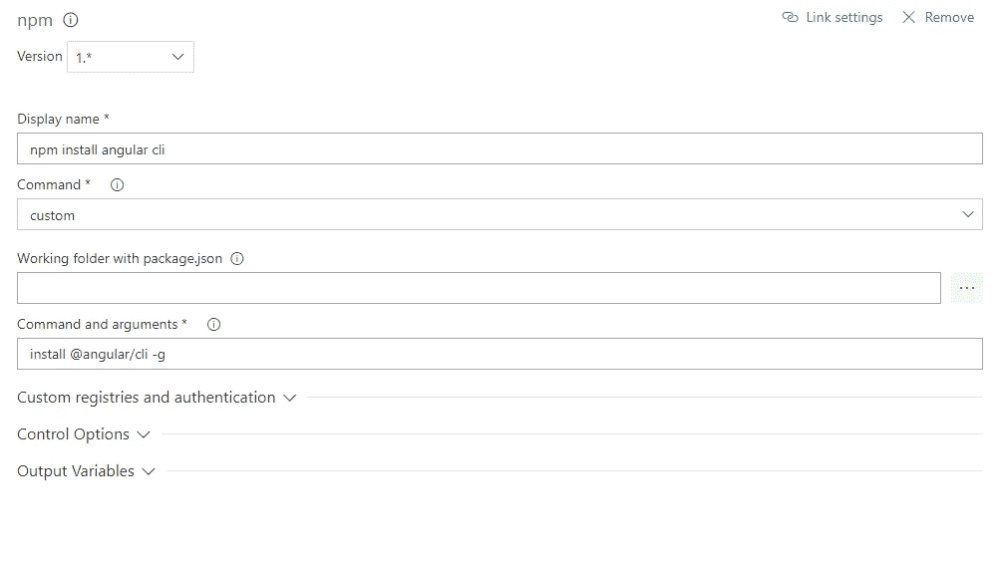

配置 npm 以安装 angular cli

不用担心*自定义注册表、控制选项和输出变量*。你不需要改变它。

回到左侧面板的阶段 1，再次点击“ **+** ”。添加另一个 *npm* 任务，并像这样配置它:

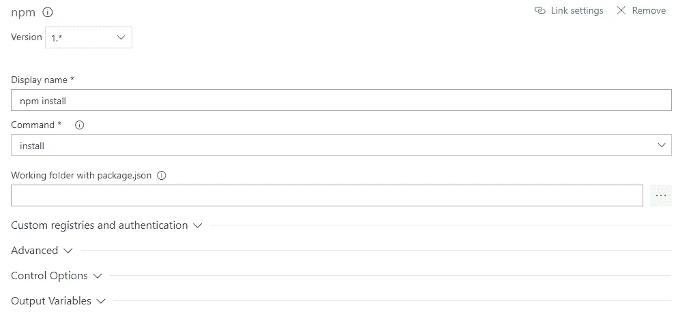

配置 npm 以安装节点模块

添加第三个 *npm* 任务，并将其配置如下:

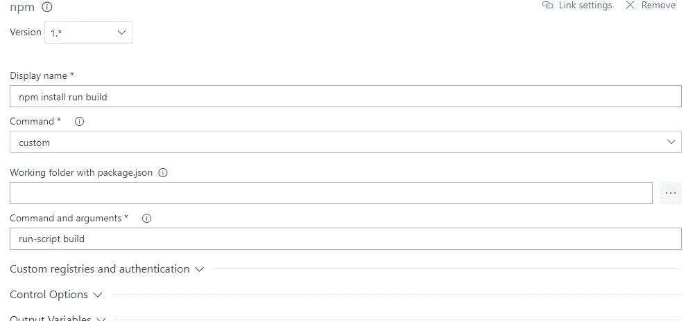

配置 npm 以构建应用程序

现在，添加一个名为 *Publish Build Artifacts 的任务，*这个任务将把你的构建上传到 azure。像这样配置它:

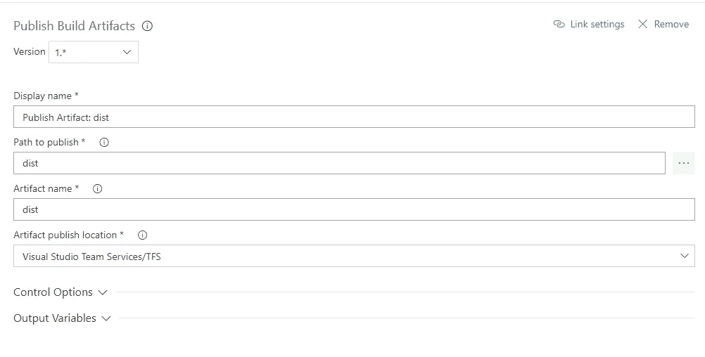

配置工件发布

现在是时候将你的工件部署到 azure 了。添加一个名为 *Azure App Service Deploy* 的任务，配置如下:

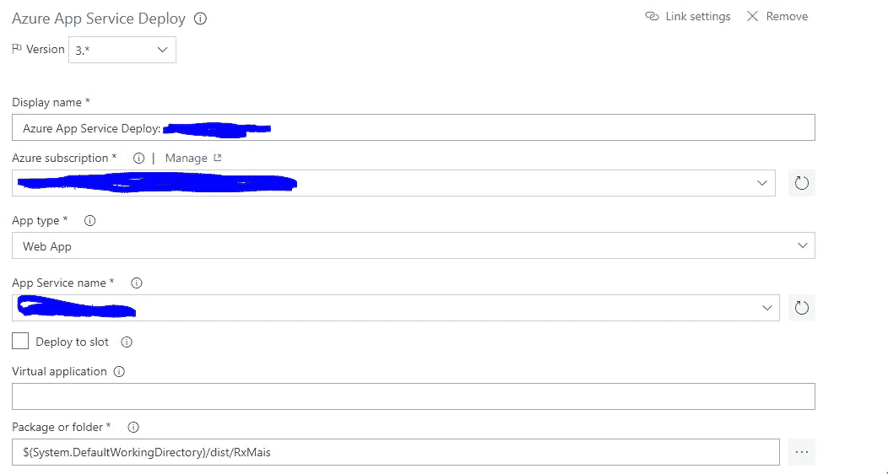

正在配置 Azure 应用部署

选择合适的 *Azure 订阅*和之前创建的*应用服务*来部署你的应用。仍在本节中，配置*附加部署选项*，并如下图所示进行设置:

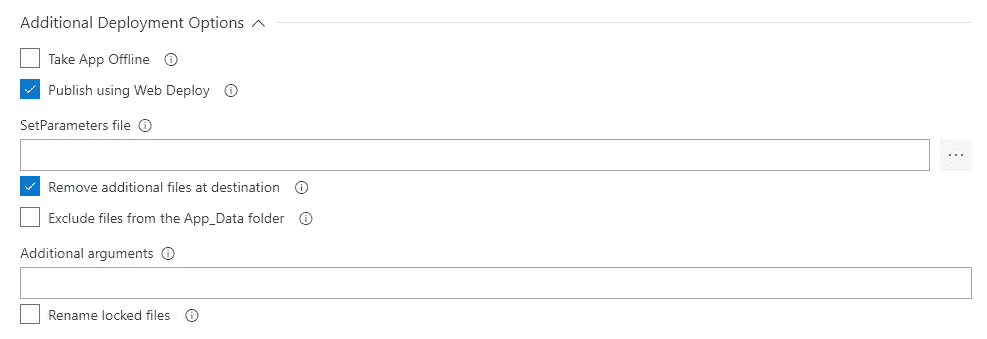

设置应用服务部署任务的其他部署选项

您的管道已经准备好进行测试，您可以点击 *Save & queue* 来保存您的更改并对构建进行排队。但是，如果您想要配置 CI/CD 并在您的分支上每次更新后构建您的管道，请转到*触发器*选项卡并选择*启用持续集成。*

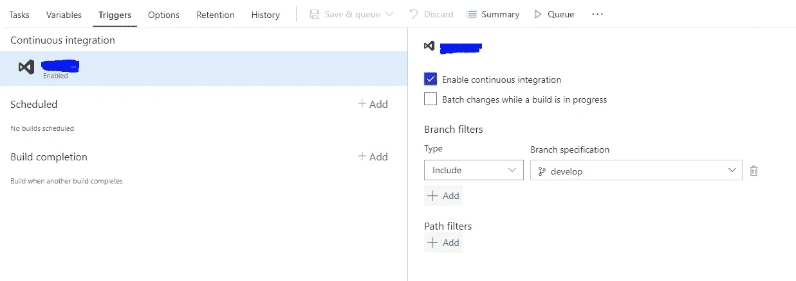

配置持续集成

您还可以计划构建并在构建完成后执行任务。

这是一张没有警告就执行的完整构建的图片:

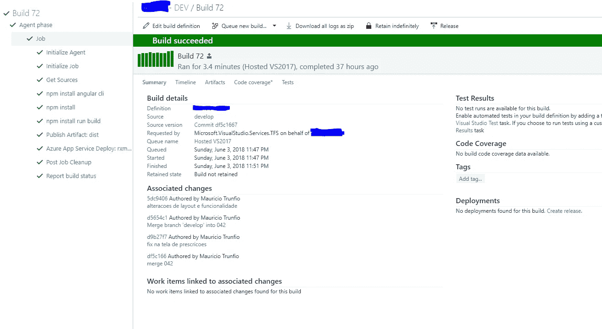

构建日志

这是一个非常简单的管道，但是你可以添加单元测试，集成测试，一些其他的验证等等。这取决于你！

希望这能帮助和我有同样问题的人。

再见！