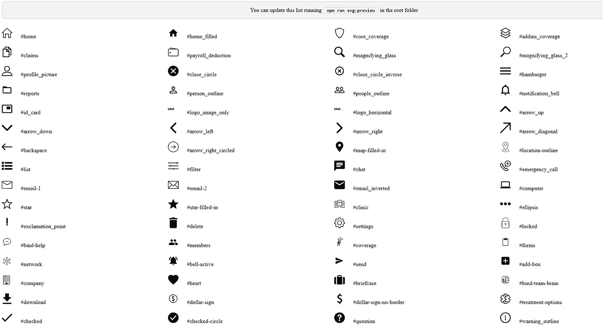

# Angular 5 中使用 SVG 组织图标的简单方法

> 原文：<https://itnext.io/easy-way-to-organize-your-icons-using-svgs-in-angular-5-f35333d0b442?source=collection_archive---------0----------------------->


如果你的项目中有太多的图标，想要重用/定制/使用不同颜色或边框的图标，并且不想保存一百万个文件，你可能会有兴趣阅读更多。

## **哑元件**

您需要知道的第一件事是，如果您想要样式化一个 SVG，您肯定需要使用它的标记，而不是到。svg 文件。

这里我们有一个简单 SVG 的例子:

(主页图标. svg)

如果您想重用这样的 SVG，您可以创建一个哑组件，它将是一个占位符，不包含任何特定的内容(图形对象，如路径、圆、多边形)。

(svg.component.html)

(svg .组件. ts)

你可以看到我们有`[<use>](https://developer.mozilla.org/en-US/docs/Web/SVG/Element/use)`标签，而不是内容。Use 标记用于呈现为将来使用而创建的非呈现元素(类似于模板)。这些“模板”有 id。所以当任意元素的 id 等于`<use>`的 href 属性时，`<use>` 就被这个元素替换了。

在我们的例子中,`href`是动态的，它从父组件传递给`svg.component.ts`。

## **定义**

现在我们有了一个占位符，但是 svg 的内容在哪里呢？

SVG 的内容由一些图形对象表示。SVG 允许定义图形对象供以后重用。为此，我们将使用`[<defs>](https://developer.mozilla.org/en-US/docs/Web/SVG/Element/defs)`标签。`<defs>`中的每个对象都被包装在`[<symbol>](https://developer.mozilla.org/en-US/docs/Web/SVG/Element/symbol)`中，我们可以把它看作一个模板。而最重要的部分就是给每个符号加上 **id** 。这个 id 应该是**唯一的**，它是占位符(`svg.component`)和定义(`svg-definitions.component`)之间的连接。标签`<defs>`中的所有符号被称为 **SVG 定义**。让我们看看我们的文件保存定义是什么样子的:

(svg-definitions.component.html)

你可能想在不同的页面上使用你的 SVG 图标，所以你需要确保应用程序中的每个地方都加载了定义**。为此，我们将在主组件中加载`svg-definitions.component`。**

(app.component.html)

```
<svg-definitions></svg-definitions>
```

## **用途**

因此，我们已经加载了所有的定义，并且为 SVG 占位符创建了一个共享组件。你可能会问自己如何在组件中使用它？这真的很简单。您需要将来自`svg-definitions.component`的符号 id 作为输入()名称传递给`svg.component`，就这样！

```
<svg-icon name=”home”></svg-icon>
```

## **预览**

把你所有的图标放在一个文件里是个不错的方法，对吧？但是当你的项目开始增长时，你需要小心。有时你可以有太多的图标。

可能会出现什么**问题**:

*   很难将**定位到文件中**
*   有可能出现**重复符号**
*   可能有两个符号具有相同的名称
*   不同名称的 **1 符号可能出现两次**

为了防止所有这些问题，你可以使用[节点](https://nodejs.org/en/)创建所有图标的**预览。**

## 1.为 SVG 添加 html

首先，我们将在/svgs 文件夹中创建一个新文件`svg-converter.js`。这个文件将访问`svg-definitions.component.html`并将**修改 html** :

1.  创建 svgDefinitions 的副本
2.  从副本中删除`<defs></defs>`
3.  用`<use>`替换`<symbol>`
4.  用`xlink:href=”#`替换`id`
5.  获取数组中的所有符号
6.  获取每个符号的名称
7.  将`<svg></svg>`中的每个符号换行
8.  把所有的符号连接起来
9.  将符号附加到定义中

(svg-converter.js)

## 2.向预览添加样式

您可能想要样式化您的预览，因此您可以创建一个`svg-preview.css`并从您的 svg 转换器中的这个文件获取样式。

(svg-converter.js)

## 3.构建预览文件

接下来的事情是构造预览文件。为了确保同时阅读完 html 和 css 文件**，可以使用 Promise.all。**

**(svg-converter.js)**

**最后，您需要生成预览文件。为此，请在/svgs 文件夹中运行:**

**`node svg-converter.js`**

**或者向 package.json 中的脚本添加任务:**

**`svg:preview”: “node \”src/ui-library/svgs/svg-converter.js\”`**

**并在您的项目的根目录下运行:`npm run svg:preview`**

****

**这就是了！预览你所有的图标，这将**节省你这么多时间**。那么你准备好**和复制代码**说再见了吗？**