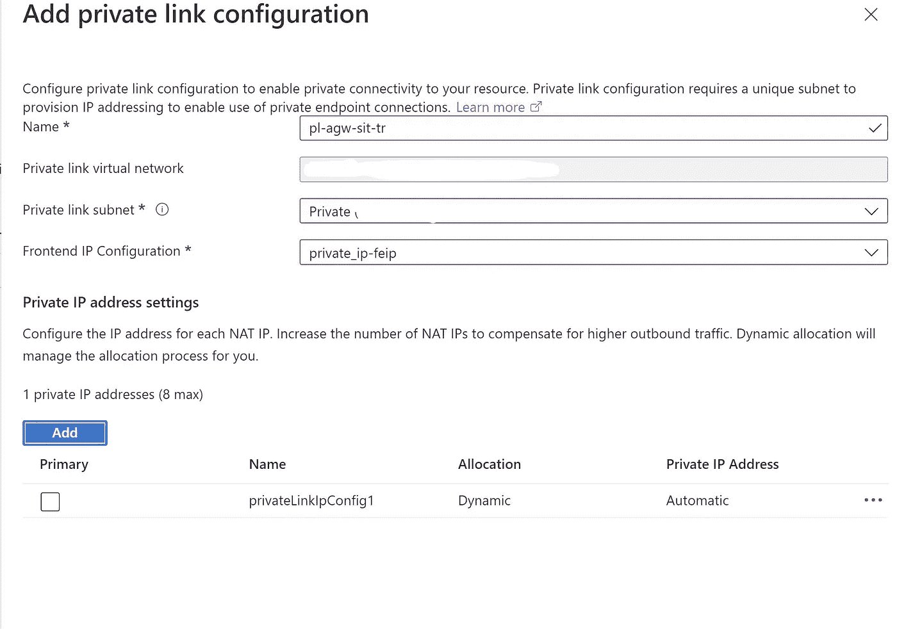
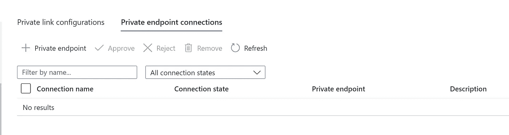
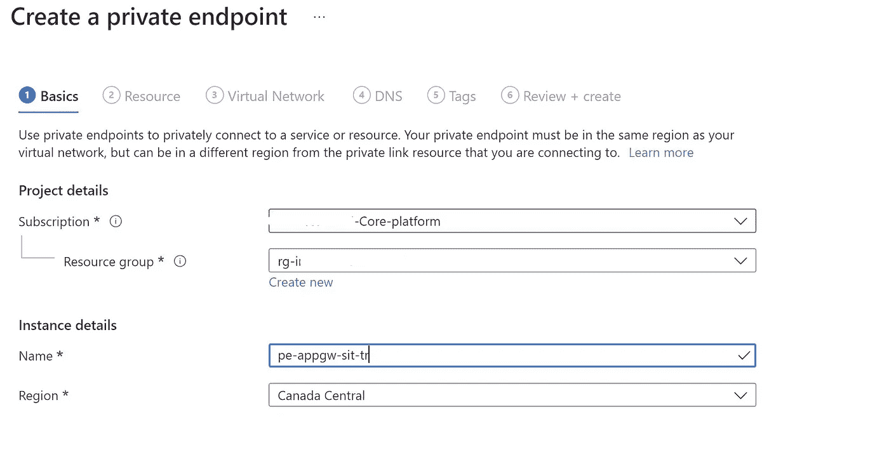
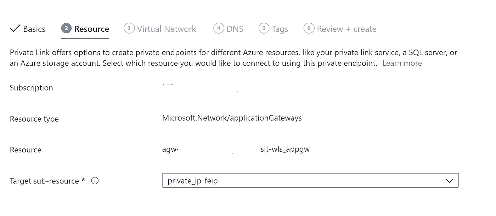
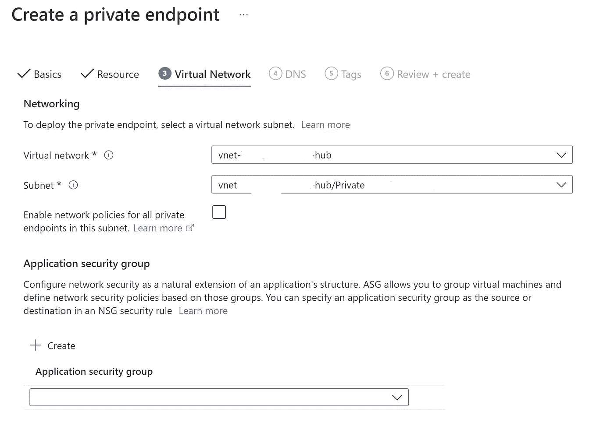
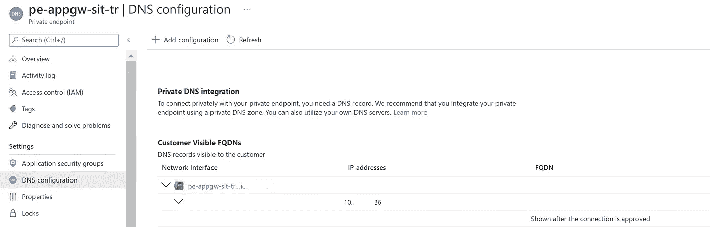
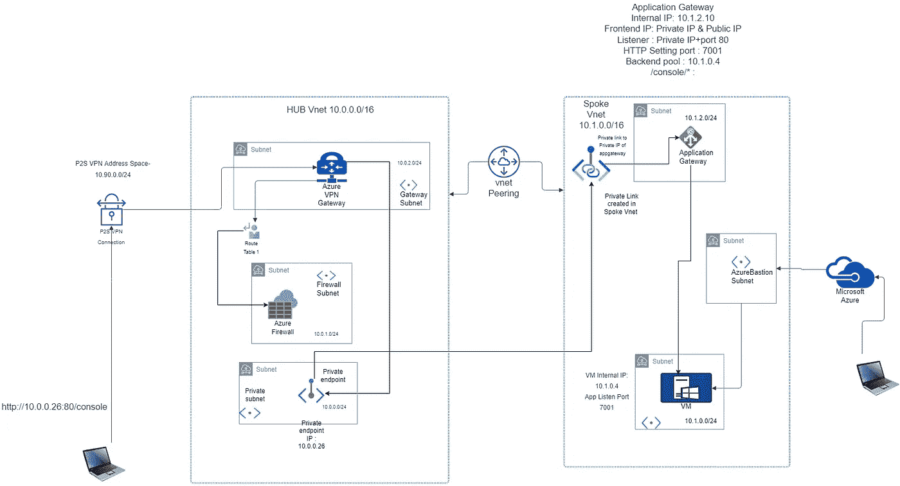

# 为内部网应用程序使用 Azure 应用程序网关的简单方法

> 原文：<https://itnext.io/easy-way-to-use-azure-application-gateway-for-an-intranet-application-e05e70e29d38?source=collection_archive---------1----------------------->

几个月前，我写了一篇关于使用 Azure Application Gateway 开发内部网应用程序的[帖子](https://harinderjitss.medium.com/using-azure-application-gateway-for-an-intranet-application-9009a91621ac)。这是那篇文章的延续。我们将实现同样的目标，但我们将使用不同的方式，用**更简单的方式**。

# 这个比较简单的方法是什么？

当我写最后一篇[博客](https://medium.com/@harinderjitss/using-azure-application-gateway-for-an-intranet-application-9009a91621ac)时，应用程序网关不允许我们创建 [**私有链接和私有端点**](https://docs.microsoft.com/en-us/azure/application-gateway/private-link-configure?tabs=portal) 来私有访问应用程序网关端点。现在，这个特性在预览版中是可用的。

Azure 私有端点是 Azure 私有链接的基础构建块。私有端点使部署在虚拟网络中的 Azure 资源能够与私有链接资源进行私有通信。

私有端点允许资源访问部署在虚拟网络中的私有链接服务。通过虚拟网络对等和内部网络连接访问私有端点扩展了连接性。

我之前写了一篇[文章](https://medium.com/@harinderjitss/configure-the-storage-account-access-without-public-ip-7f99c207073c)讨论私有端点及其与服务端点的比较。

# 这怎么容易？

简而言之，在我看来，这更容易，因为**你不需要维护一个单独的用户定义的路线(UDR)** ，我们在上一篇文章中就是这么做的。

以下是所需的步骤:

1.  部署应用程序网关(在我的例子中是 Standard v2)
2.  为应用程序网关中的应用程序配置后端池、后端设置(之前称为 HTTP 设置)、路由规则、健康探测和重写规则(如果有)。
3.  确保应用程序网关侦听器使用私有前端 IP(不使用公共 IP)和有效的主机名(在我的例子中是 DNS 中的类型记录)
4.  创建一个私有链接。
5.  创建私有端点。
6.  更新专用 DNS 记录以指向您的专用端点的专用 IP。

让我详细阐述第四点和第五点。

# 配置专用链接(4)

专用链接配置定义了应用程序网关使用的基础结构，以支持来自专用端点的连接。要创建专用链路配置，请完成以下步骤:

1.  前往 [Azure 门户](https://portal.azure.com/)
2.  搜索并选择应用程序网关。
3.  选择要启用专用链接的应用程序网关的名称。
4.  选择专用链接

5.配置以下项目:

*   名称:专用链接配置的名称。
*   专用链路子网:应该使用的子网 IP 地址。

*   前端 IP 配置:专用链路在应用程序网关上将流量转发到的前端 IP 地址。
*   专用 IP 地址设置:至少指定一个 IP 地址

6.选择添加。

这些步骤将在目标虚拟网络的专用子网中创建一个专用链路。每个专用链路配置的最大 IP 地址数是八个。仅支持动态分配。

# 配置私有端点(5)

私有端点是一个网络接口，它使用来自虚拟网络的私有 IP 地址，该虚拟网络包含希望连接到您的网关的客户端。每个客户端将使用私有端点的私有 IP 地址将流量隧道传输到应用网关。要创建私有端点，请完成以下步骤:

1.  选择专用端点连接选项卡。

单击私有端点。

2.在“基本”选项卡上，为专用端点配置资源组、名称和区域。选择下一步。

3.在资源选项卡上，选择下一步。如果在尝试选择私有端点创建的*资源*选项卡上的*目标子资源*时，公共或私有 IP 配置资源丢失，请确保监听器正在积极利用相应的前端 IP 配置。没有关联监听器的前端 IP 配置不会显示为*目标子资源*。

4.在虚拟网络选项卡上，配置专用端点网络接口应配置到的虚拟网络和子网。配置私有端点应该具有动态还是静态 IP 地址。最后，如果您希望创建一个新的专用链接区域来自动管理 IP 寻址，请进行配置。选择下一步。

5.在“标记”选项卡上，可以选择配置资源标记。选择下一步。

6.选择创建。

7.您可以从“DNS 配置”中获取与私有端点相关联的私有 IP

更新应用程序网关侦听器配置中使用的主机名的专用 DNS 记录，以指向您的专用端点的专用 IP。

# 以下限制适用于私有端点:

*   来自私有端点的流量会绕过网络安全组(NSG)
*   私有端点不支持网络安全组(NSG)或 Azure 防火墙等网络策略，因此安全规则不适用于它们。
*   来自私有端点的流量会绕过用户定义的路由(UDR)。用户定义的路由可用于覆盖去往私有端点的流量。

您可以将请求如何从客户端流向后端与[博客中介绍另一种方法](https://medium.com/@harinderjitss/using-azure-application-gateway-for-an-intranet-application-9009a91621ac)的图表进行比较。您可以看到请求不再流经防火墙，因为它绕过了 UDR。

# 走哪条路？

这应该是未来的讨论，因为与应用程序网关的私有链接的使用现在正在预览中。

一旦该功能可以投入生产，就需要考虑以下事项:

*   UDR 维护:如果您在使用此方法时需要访问另一个子网或另一个站点到站点 VPN 地址空间或另一个点到站点 VPN 地址空间中的资源，只要私有端点位于 HUB 虚拟网络的子网中，您就不必担心。如果您使用另一种方法，那么您需要将这些地址空间添加到 UDR associated 中。
*   防火墙和 NSG 规则:使用私有端点时无需担心，因为使用私有端点时会绕过防火墙和 NSG。如果您使用另一种方法，那么您需要将任何新允许/拒绝的地址空间添加到相关的防火墙和 NSG 规则中。
*   成本:私有端点会产生额外费用。
*   安全控制:对于私有端点，NSG 和防火墙被绕过，所以如果你想确保只有特定子网或网络中的资源才能使用应用网关访问应用的 URL，这不是正确的方法，我建议通过[查看我之前的帖子](https://medium.com/@harinderjitss/using-azure-application-gateway-for-an-intranet-application-9009a91621ac)。

请阅读我的其他文章，并分享您的反馈。如果你喜欢分享的内容，请点赞、评论并订阅新文章。