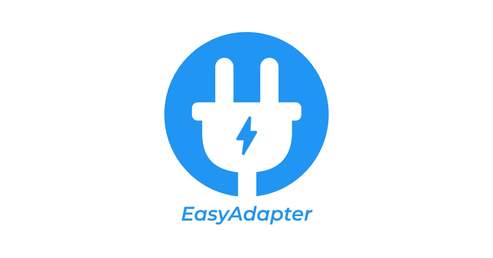

# 作为 Android 开发者如何在 2022 年轻松创建适配器

> 原文：<https://itnext.io/easyadapter-1-0-0-f392361c699c?source=collection_archive---------2----------------------->



大家好，在 Android 开发中，几乎每个项目都有一个或多个适配器类来处理视图集合，还有许多不同类型的适配器，如 RecyclerAdapter、ListAdapter、Paging2 Adapter、Paging 3 Adapter、ArrayAdapter、ExpandableListAdapter，有时您需要创建一个复杂的适配器类，但大多数时候您需要的只是将模型类与列表项布局绑定，并提供一些额外的侦听器，如此而已，那么我们为什么不能自动创建这些适配器类呢？

在谈论我们将如何自动化它之前，让我们首先谈论我们想要什么特性以及我们想要避免什么问题。

所以先说特点？

*   声明如何轻松地将数据绑定到视图。
*   向任何视图或主列表项布局视图添加侦听器。
*   支持一些功能，如加载图像与第三方库，如毕加索，滑翔，线圈。
*   支持适配器类的默认和自定义名称。
*   如果我们犯了任何错误，请提供清晰的错误消息。

使用这种解决方案我们想避免什么问题？

*   向运行时添加任何成本。
*   编写复杂的代码来处理这个解决方案。
*   缓慢的构建时间。
*   难学。
*   限制。

那么现在这个解决方案是什么？

解决方案是 **EasyAdapter** ,这是一个新的 Android 注释处理库，可以在编译时根据您的模型类和您的自定义信息生成适配器类。

那么它是如何工作的呢？

EasyAdapter 只有两种类型的注释，即适配器和绑定注释，第一种类型用于注释模型类，告诉 EasyAdapter 您希望从这个模型生成什么类型的适配器，以及您希望使用什么列表项，例如

```
@ListAdapter("com.amrdeveloper.app", "list_item_model")
class Model
```

此示例告诉库，您想要为模型类生成 ListAdapter，并使用“R.layout.list_item_model”作为列表项，例如，您还可以更改生成的名称。

```
@ListAdapter("com.amrdeveloper.app", "list_item_model", "ModelAdapter")
class Model
```

在版本 1.0.0 中，EasyAdapter 提供了 6 种适配器类型，它们是

*   ArrayAdapter
*   列表适配器
*   回收直升机
*   PagedListAdapter
*   PagingDataAdapter
*   可扩展列表适配器

您还可以在文档网站上找到关于它们的完整文档和示例

第二种注释类型是绑定注释，它们用于绑定或提供特性

例如，要告诉 EasyAdapter 您想要使用这个字符串字段作为 id 为 R.id.user_name 的 TextView 的文本，您可以使用@BindText

```
@BindText("user_name") val name : String
```

此代码将生成一段代码，用于在 id 为“R.id.user_avatar”的 ImageView 类中加载路径为 imagePath 的图像

```
@BindImage(ImageLoader.PICASSO, "user_avatar")
val imagePath : String
```

例如，您还可以在模型类上使用@BindListener 注释来为任何视图生成侦听器

```
@BindListener(ListenerType.OnClick) @BindListener(ListenerType.OnClick, "call_button")
...
class Model
```

EasyAdapter 现在将生成两个单击监听器第一个用于列表项本身，另一个用于 id 为 R.id.call_button 的视图

在版本 1.0.0 10 中，绑定注释

*   绑定文本
*   BindImage
*   BindImageRes
*   BindBackgroundColor
*   BindBackgroundRes
*   BindAlpha
*   BindGif
*   绑定可见性
*   绑定监听器
*   绑定可扩展
*   BindExpandableMap

您还可以在文档网站上找到关于它们的完整文档和示例

如你所见，使用 EasyAdapter 并不难，你可以在几分钟内轻松学会。

但是 EasyAdapter 到底是如何工作的呢？

EasyAdapter 支持 2 个注释处理器 [Kapt](https://kotlinlang.org/docs/kapt.html) (Kotlin 注释处理工具)和 [KSP](https://kotlinlang.org/docs/ksp-overview.html) (Kotlin 符号处理)，可以在源代码中穿行，并通过简单的类型检查从注释中收集信息，以确保例如代表图像路径的@BindImage 注释字符串字段，如果需要，显示错误和警告消息。 在我们获得所有需要的信息后，我们使用代码生成器，使用 Square 的 [kotlinpoet](https://github.com/square/kotlinpoet) 库生成结果适配器类源代码，然后我们将这些源代码写入输出目录内的适配器文件中:d .我们试图尽可能优化生成的代码，例如，我们避免使用相同的 Id 调用可变的 findViewById，而是使用一个受[符号表](https://en.wikipedia.org/wiki/Symbol_table)概念启发的 ViewTable 类来管理声明的变量并再次重用它们。

这只是第一个版本，欢迎每个人通过建议功能、报告问题和对代码库或文档做出贡献来帮助改进这个工具，每个人都可以增加价值。

github repository:[**AMR developer/easy adapter**](https://github.com/amrdeveloper/easyadapter)
网址: [**EasyAdapter**](https://amrdeveloper.github.io/EasyAdapter/)

你可以在: [**GitHub**](https://github.com/amrdeveloper) ， [**LinkedIn**](https://www.linkedin.com/in/amrdeveloper/) ， [**Twitter**](https://twitter.com/amrdeveloper) 上找到我。

享受编程😋。