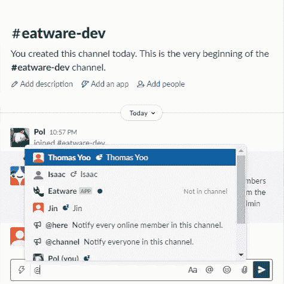
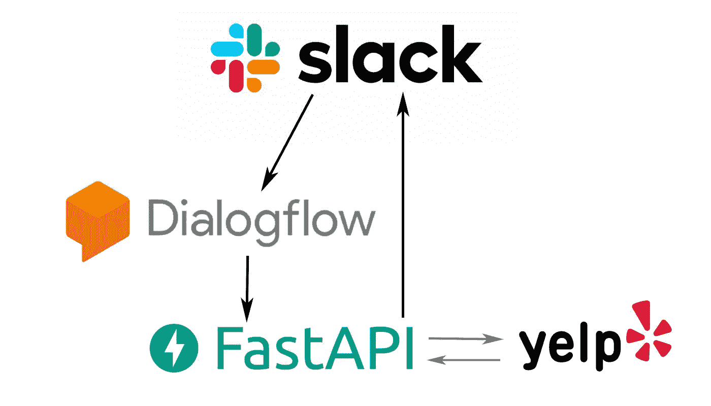
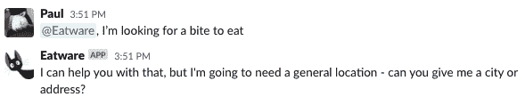
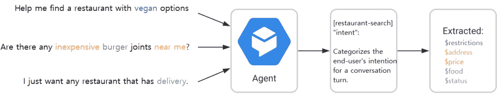
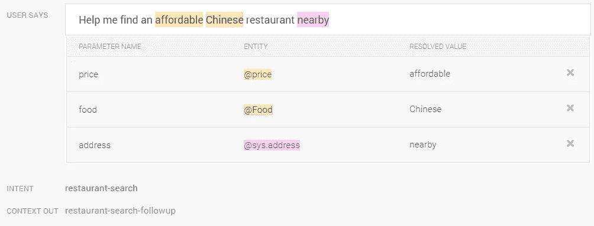
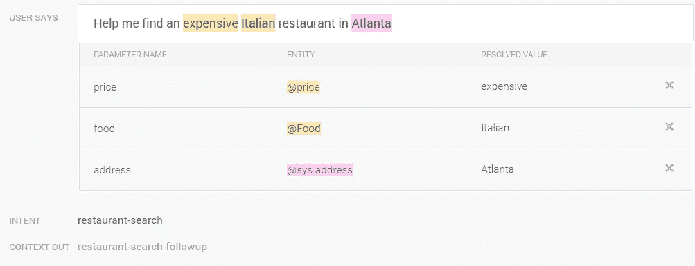
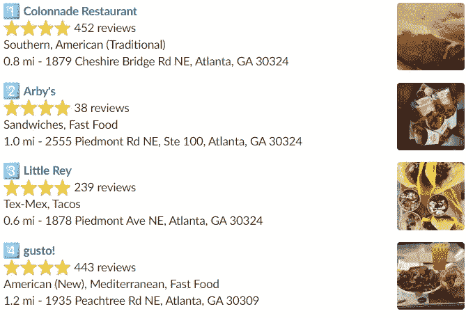

# eatware——使用 Dialogflow 和 FastAPI 创建灵活的模块化机器人

> 原文：<https://itnext.io/eatware-creation-of-a-flexible-modular-bot-with-dialogflow-and-fastapi-a11b19fa8b25?source=collection_archive---------2----------------------->

## 我们如何在两天内制作了一个 Slackbot 来为我们计划团队午餐。

编剧:[金正](https://twitter.com/jincontroller)、[托马斯·尤](https://github.com/TsyooHUB)、[保罗·汉萨](https://github.com/biggestcookie)。

# 背景

当我们真正在办公室的时候，我们的团队效率被一个重复出现的问题所困扰——我们从来不知道我们想去哪里吃饭。团队午餐变成了一个很难计划的任务，但是作为开发人员，我们有很大的权力和责任用新的和流行的技术来自动化琐碎的问题。

随着我们在 NCR 的最新内部黑客马拉松，我们有机会用 Slack 进行黑客攻击，并在 Slack 团队的帮助和建议下创建 Slack 应用程序。我们的黑客马拉松团队聚集在一起，在我们的 Slack workspace 中一劳永逸地创建了这个问题的解决方案。通过使用 [Dialogflow](https://cloud.google.com/dialogflow) ，一个为将自然语言集成到应用程序中提供接口的平台，以及 [FastAPI](https://fastapi.tiangolo.com/) ，一个用于 Python 的简单而高性能的 API 框架，我们能够轻松地创建一个交互式聊天机器人，名为 Eatware，它将执行我们的命令。

如果你不知道去哪里吃饭，试试 Eatware！

下面是我们如何使用这三种技术快速设置我们的应用程序。

# 应用程序结构

我们可以将应用程序结构分成三层:

*   **我们的表示层 Slack**允许用户与机器人交互，并从机器人接收信息。
*   **我们的语言处理层 Dialogflow，**直接从 Slack 接收消息信息并解析。
*   **我们的后端层，Eatware API，**从 Dialogflow 接收 webhook 请求，从外部 API 提取餐馆信息，并将结果发送回 Slack。

从表示层开始，我们让用户提示机器人开始体验。我们认为用户需要用自然语言与机器人交谈是体验的核心部分，所以它自然地融入了团队频道的对话(这也是使用该技术的一个有趣的借口)。

用户给机器人贴上标签，用自然语言询问它他们正在寻找食物。

语言处理层 Dialogflow 配置了 Slack 来读取所有提到注册的@Eatware 应用程序的请求。它读取句子，并使用我们训练它的信息来识别用户的意图和他们可能提供的任何参数。Dialogflow 将在对话流中做出响应，提示用户任何缺失的参数，当它达到满意的程度时，它将对我们选择的位置进行 webhook 调用。在我们的例子中，我们设置了一个 API 来接收这个调用。

我们的后端层是用 FastAPI 构建的，它从用户那里接收现在已经完成的有效负载参数，并用我们的餐馆搜索词调用外部服务。执行这个调用后，我们的 API 将外部响应映射到 Slack 有效负载，并将响应发送到 Slack，以便作为 bot 进行响应。

既然我们已经介绍了应用程序是如何设置的，那么让我们进入每个部分的更详细的细节。

# 对话流

Dialogflow 是一个端到端的开发工具，用于为网站和应用程序创建对话界面。它还可用于与多种平台接口，包括脸书、线路、电报等。对于我们的特定项目，我们集成了 Slack，这允许我们与同事直接测试功能。

Eatware 上的 Dialogflow 是我们应用程序的中间层，它从 Slack 灵活地接收用户输入，从语句中解析出相关信息，然后作为 webhook 请求发送给我们的 API。当 API 返回一个响应时，Dialogflow 获取信息，将它组合成一种用户友好的格式，然后作为 Slack 消息输出给用户。

这里的主要因素是训练我们的 Dialogflow 代理识别用户可能说的常见句型，并确定属于某一类别的关键字。

当出现这样的句子时:

> “帮我在附近找一家价格实惠的中国餐馆”

Dialogflow 最初不会将关键字识别为有意义的数据。然而，通过在它的字典中设置几个词来手动训练它，例如“负担得起=价格”、“中国=食物偏好”和“附近=地址”，句子就成为我们的代理可以解析的参数。

由于它的检测功能，我们不必单独将每个单词绑定到一个类别；当 Dialogflow 找到相似的句子结构时，它会尝试自己这么做。因此，下次当我们要求机器人“帮我在亚特兰大找到一家昂贵的意大利餐馆”时，代理会检测到句子中的相似之处，推断出用户的意图，并已经正确地假设了各自的类别。与所有机器学习一样，Dialogflow 通过日常使用和用户反馈来提高其 NLP 能力。

一旦确定了参数，我们可以允许 Dialogflow 将这些参数传递给后端层的 [fulfillment webhook 请求](https://cloud.google.com/dialogflow/es/docs/fulfillment-overview)。

# 后端

对于我们的后端，我们很高兴选择 FastAPI，这是一个现代的 Python web API 框架。它利用了 Python 最近的类型提示特性，并通过 [Pydantic](https://fastapi.tiangolo.com/python-types/#pydantic-models) 提供了简单的模型创建，这提供了有用的 IDE 类型错误报告以及自动请求/响应验证。

我们首先设置一个 POST 路由来接收 Dialogflow 的 webhook 请求。当 Dialogflow 将参数传递给 Eatware 的 API 时，我们向 Dialogflow 返回一个初始响应，Dialogflow 将这个响应转发给 Slack，以便 dialog flow 和用户都知道他们的请求被成功接收。同时，FastAPI 的[后台任务](https://fastapi.tiangolo.com/tutorial/background-tasks/)处理我们获取餐馆信息的外部调用。

在我们的案例中，我们选择 Yelp 作为我们的外部服务，因为它可以免费使用，易于上手，并且是一个成熟的平台。

收到 Yelp 的回复后，我们将其很好地格式化成 Slack 的 [Block Kit](https://api.slack.com/block-kit) ，这是一个用于在消息中创建自定义视觉效果和交互性的组件集合。对我们来说，这意味着解析我们的 Yelp 响应，获取评级、距离和餐馆信息，并将它们一起放入块格式中，以创建一个吸引人的可视化和餐馆基本细节和联系信息的摘要。

最后，创建的块被发送到我们的 Slack bot，在那里它将块显示为一条消息。

# 结论

我们在使用 Slack、Dialogflow 和 FastAPI 进行开发时度过了美好的时光，并且发现将它们结合在一起相当容易。NCR 黑客马拉松为我们的团队提供了一个探索新技术的绝佳机会，我们肯定会在未来重新审视这些新技术。

由于 GCP 的 Dialogflow 提供的灵活性和我们 API 的模块化，我们可以很容易地添加对许多其他平台的支持。通过将我们的外部呼叫实现为服务，我们可以将 Yelp 的使用换成另一种服务，例如 NCR 自己的内部餐厅 API，或者选择通过 Slack 之外的另一个聊天应用程序进行交互。

如果您想亲自查看 API，下面提供了我们的源代码！

 [## 餐具

### Eatware 是一个 Slackbot，它可以帮助你和你的团队找到附近的就餐地点并进行投票。专为 NCR 开发…

github.com](https://github.com/biggestcookie/Eatware) 

## 关于作者

Paul、Jin 和 Thomas 是的应届毕业生和软件工程师。除了使用 NCR 酒店与便利和燃油零售解决方案开发应用程序，他们还喜欢玩格斗游戏和创建有趣的新 web 应用程序。