# 边缘聚焦紧凑型 Kubernetes 和 MicroPaaS (μPaaS) — k3s/k3OS 和 Rio

> 原文：<https://itnext.io/edge-focused-compact-kubernetes-with-micropaas-%CE%BCpaas-k3s-k3os-and-rio-6f7d758e19f1?source=collection_archive---------0----------------------->

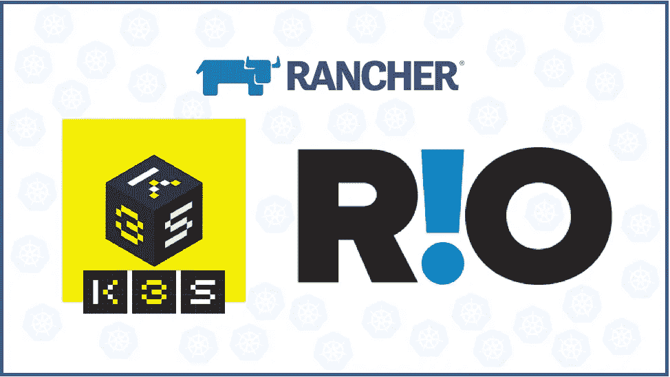

面向边缘、物联网和电信平台的轻量级 Kubernetes 平台，具有最少的 PaaS

边缘资源通常是有限的，但是，在数据中心或公共云环境中，促进 Kubernetes bare 最低 2–4gb 的最低 RAM 要求可能不是问题，另一方面，这将成为边缘计算的限制因素，因为用户无法使用具有多个包依赖关系的大量 Kubernetes 发行版。

这就是 Rancher 的 k3s 的用武之地，k3s 实际上是一个 Linux 发行版和 Kubernetes 发行版的组合，只有不到 40 MB 的二进制文件，只需要 512 MB 的 RAM，这使得即使在最节省资源的基础设施和低资源计算环境中部署 Kubernetes 也很容易。 [k3OS](https://k3os.io/) 是另一个基于 k3s 的产品，该解决方案被打包成一个完全由 Kubernetes 管理的操作系统。K3s 省略了许多使大多数 Kubernetes 发行版臃肿的特性，例如很少使用的插件，并将 Kubernetes 发行版的各种功能合并到一个进程中。

k3s 解决了基础设施组件，然后是部署和管理应用程序等主要挑战，因为 Kubernetes 本身不是一个传统的、无所不包的 PaaS(平台即服务)系统。在没有 PaaS 的情况下，部署基于微服务的应用程序可能很简单，只需要几个地理位置集中的数据中心，但如果有数千个边缘站点，情况就完全不同了，如下所示:

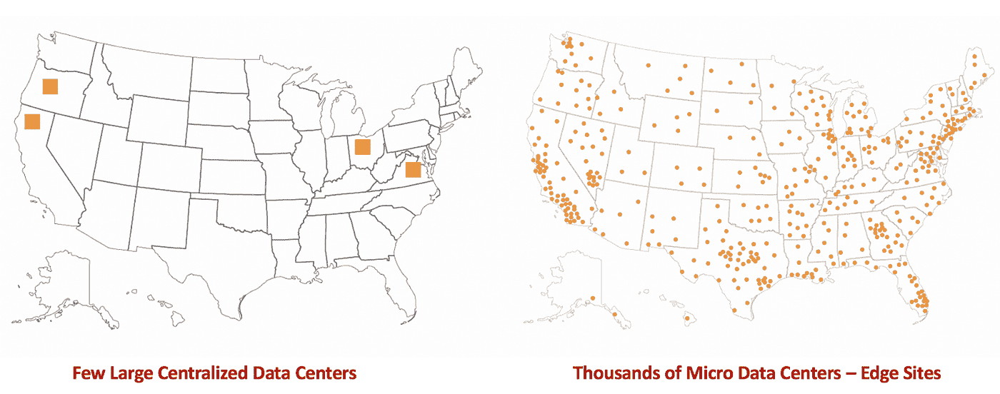

在传统的 PaaS 环境中，开发人员将在本地开发应用程序，与应用程序的部署位置隔离开来。在这里，应用程序和它的基础设施没有连接，但是同样的东西不适合 Kubernetes 环境，在 Kubernetes 环境中，应用程序的每个部分都是它自己的容器(简单地说就是微服务)。μPaaS 代表了应用程序开发和部署方式的转变。应用程序不是脱离其基础设施独立开发的，而是在基础设施内部开发的*。*

Rancher's Rio 是一个微型 PaaS，可以放在任何标准 Kubernetes 集群之上。由一些 Kubernetes 定制资源和一个 CLI 组成，以增强用户体验，用户可以轻松地将服务部署到 Kubernetes，并自动获得连续交付、DNS、HTTPS、路由、监控、自动缩放、canary 部署、git 触发的构建等等。k3s 的工作开始是作为 Rio 的一个组成部分，然后被分成两个不同的一流开源项目。

# K3s

K3s 是全新的 Kubernetes 发行版，专为需要快速可靠地将应用部署到资源受限环境(例如:具有单板计算机的边缘站点)的用户而设计，并且专为无人值守、资源受限、远程位置或物联网设备内部的生产工作负载而设计。

K3s 通过从 Kubernetes 二进制文件中剥离一堆特性(例如遗留、alpha 和特定于云提供商的特性)，用 Containerd 替换 docker，并使用 sqlite3 作为默认 DB(代替 etcd，支持 etcd 作为选项)来实现其轻量级目标。K3s 只需要最少的内核和 cgroup 挂载。因此，这个轻量级的 Kubernetes 只消耗 512 MB 的 RAM 和 200 MB 的磁盘空间。

K3s 将 Kubernetes 组件(kube-apiserver、kube-controller-manager、kube-scheduler、kubelet、kube-proxy)捆绑到组合的进程中，作为一个简单的服务器和代理模型。运行 k3s 服务器将启动 Kubernetes 服务器，并自动将本地主机注册为代理。k3s 支持多节点模型，用户可以使用进程启动时生成的“节点令牌”。默认情况下，k3s 会安装服务器和代理(结合了 Kubelet、kubeproxy 和法兰绒代理进程)，可以使用'— disable-agent '来控制服务器和代理(Kubernetes 术语中的主节点和节点)。

## **服务器启动:**

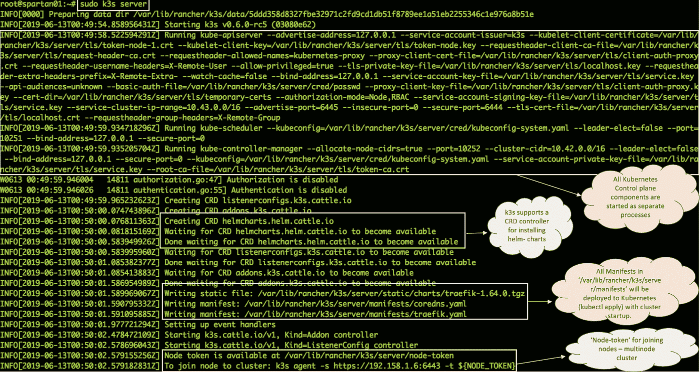

k3s 服务器启动/集群创建

## **代理发起:**

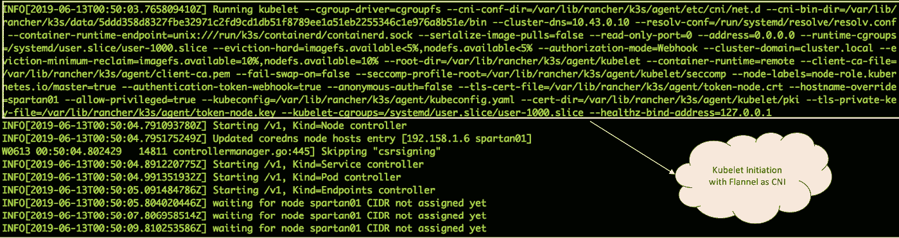

k3s 代理启动

默认情况下，k3s 使用法兰绒作为 CNI，同样可以使用'—no-法兰绒'从安装中省略。其他的是可配置的，因为 CNI 现在完全独立于 Kubernetes Install，大部分被当作一个附加组件。

## **k3s 最小资源使用:**

k3s 资源使用

二进制启动创建一个完整的 Kubernetes 集群，默认情况下将 kube-config 文件写入“/etc/rancher/k3s”。k3s 在主机上安装 kubectl，并提供与 k3s 一起执行 Kubectl 和 crictl 命令的功能。

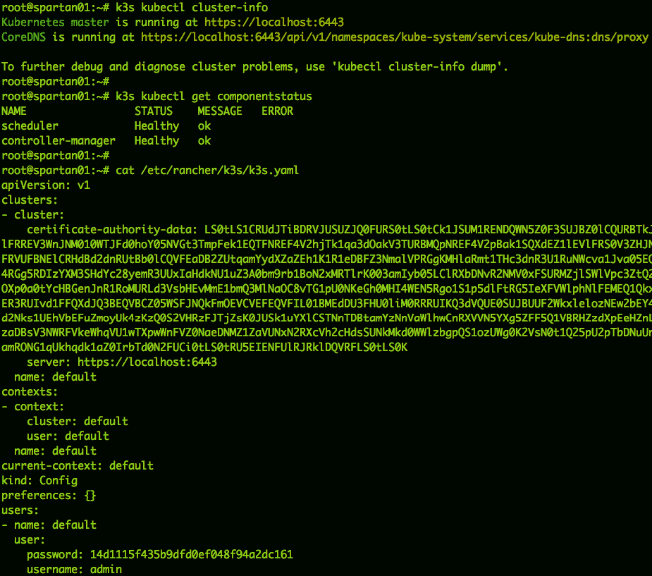

含 k3s 的功能性 Kubernetes 簇

由于所有的 kube 系统组件都作为单独的进程运行，因此在名称空间中不会创建任何容器(kube-apiserver、kube-scheduler、kube-proxy 和 kube-controller-manager)。只有通过清单创建的应用程序容器才被创建为由 Containerd (CRI)管理的容器/pod。

## **Containerd 作为容器运行时:**

K3s 没有使用 Docker 的完整实例作为容器的运行时引擎，而是使用 Docker 的核心容器运行时， [Containerd](https://www.infoworld.com/article/3181312/open-source-tools/docker-frees-container-core-for-cloud-native-computing-foundation.html) 。这样，Docker 中通常包含的许多元素都可以省略。

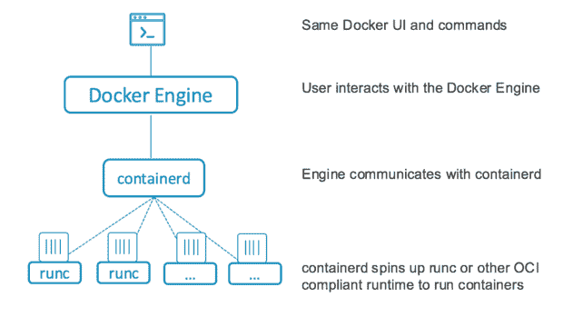

码头工人和集装箱工人

k3s 使用 container d——一个可以管理整个容器生命周期的容器运行时——从图像传输/存储到容器执行、监督和联网，并消除了 Docker 层。Docker 和 Containerd 之间的唯一区别是:Docker 使用 Containerd 作为 Docker 添加功能(如与容器运行时交互的引擎)的组件之一，并且可以被视为容器运行时接口。如下图所示，所有的容器都由 Containerd 直接管理，这使得它变得轻量级，去掉了 Docker 组件。

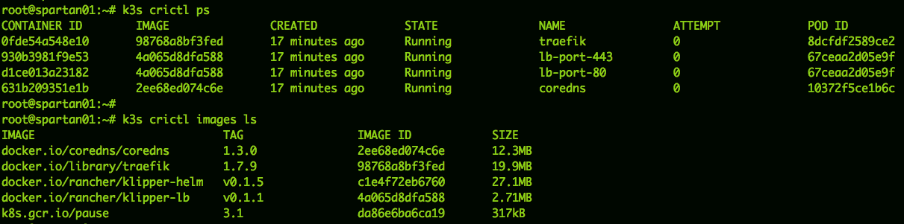

k3s crictl 查询容器 id

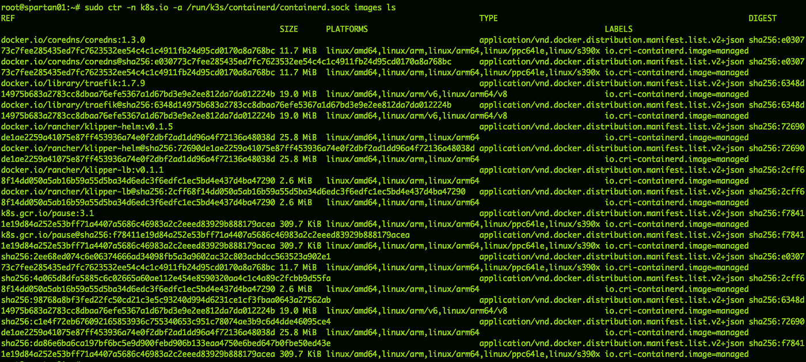

由 Containerd 管理的容器

## **Sqlite3 作为默认存储机制:**

默认情况下，K3s 使用 Sqlite 作为存储后端，取代 etcd。etcd3 仍然可用，但不是默认的。由于 SQLite 的技术限制，K3s 目前不支持高可用性(HA ),就像现在运行多个主节点一样。

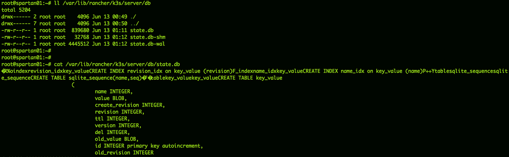

Sqlite 作为数据库— k3s

## 自动部署清单:

在/var/lib/rancher/k3s/server/manifests 中找到的任何文件都将自动部署到 Kubernetes，部署方式类似于 kubectl apply。如下所示，Coredns 会随着群集启动自动部署到群集上。

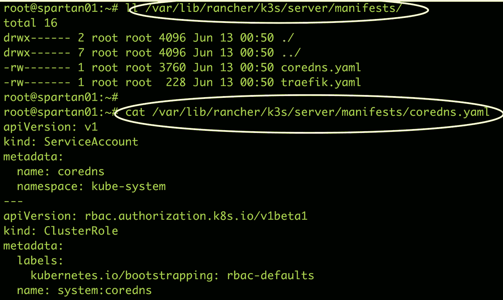

自动部署的清单位置

K3s 支持安装舵图的 CRD 控制器。通过此功能，用户可以利用简单的基于 YAML 的清单与控制器通信，以自动部署舵图。所有需要的变量都可以通过“set”传递，这使用户能够定制和部署舵图表，作为使用上游图表或内部图表存储库的集群部署的一部分。

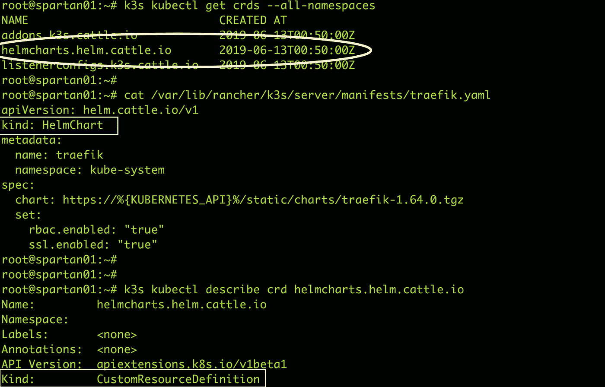

舵 CRD 控制器

# Rio-Kubernetes 基微型电池

Rio 是一个“微 PAAS (μPaaS)”，开发人员可以使用它轻松地将应用程序中的样板服务部署到 Kubernetes，这些服务可以位于任何标准 Kubernetes 集群之上。Rio 利用少量 Kubernetes 自定义资源和 CLI 编排了一系列应用开发基本功能，例如为服务网格或微服务之间的安全和通信设置 Istio、自动扩展、构建基础架构、TLS、设置路由、无缝 canary 部署、A/B 部署、监控服务网格内部的 HTTP 流量等。

Rio 提供了一个全面的 CLI，它将屏蔽多个 Kubectl 和 Istioctl 命令来配置和部署服务。

# 里约概念

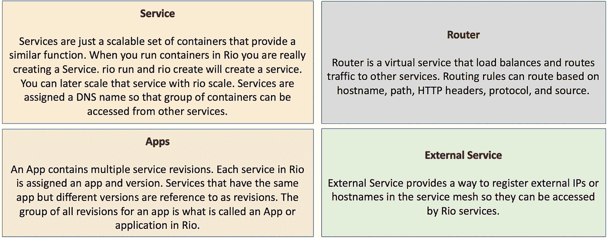

里约概念

# 里约特色

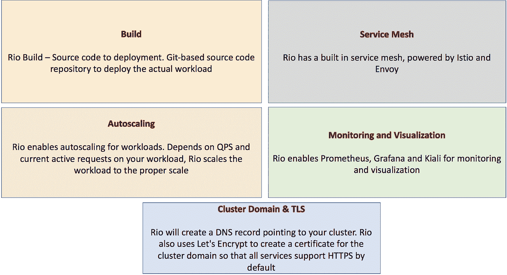

Rio 支持的功能

# 里约组件

Rio 使用大量应用程序来促进上述功能，所有应用程序都部署到 Kubernetes (K3s 集群)上的“rio-system”命名空间。

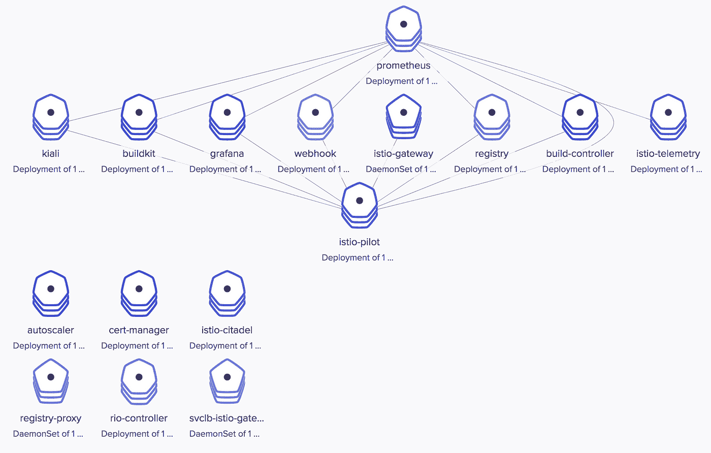

里约系统组件

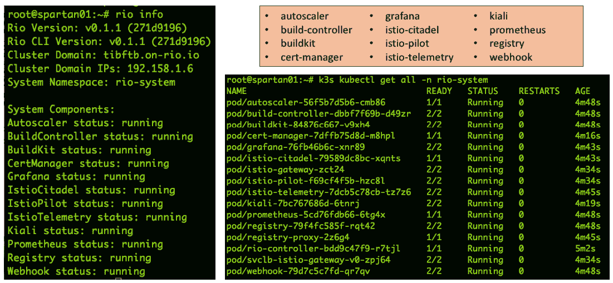

里约系统组件

# Rio 安装

Rio 是一个单独的二进制文件，它可以自动在 Kubernetes 集群上部署所有组件。

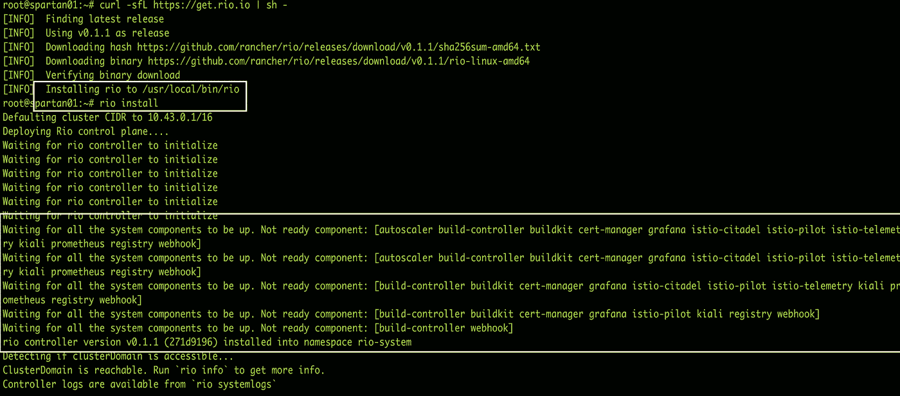

里约装置

# 使用群集域和 TLS 部署服务

Rio 使用户能够使用一个命令带来一个具有服务网格、自动缩放、TLS 和其他集成路由结构的成熟应用。这屏蔽了多个 Kubectl 命令来部署单个对象以及复杂的服务网格配置。

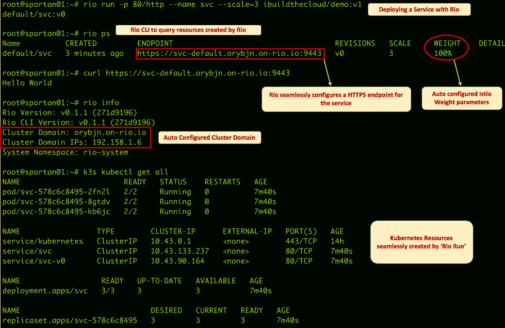

Rio-使用 TLS 和服务网格进行服务部署

默认情况下，Rio 将创建一个指向您的集群的 DNS 记录。Rio 还使用 Let's Encrypt 为集群域创建了一个证书，这样所有服务在默认情况下都支持 HTTPS。

Rio 还创建所需的 Istio 配置，如目的地规则和虚拟服务，以在部署的服务上启用服务网格。Rio 将所有必需的应用程序部署打包到一个命令中。Rio 还部署了“Kiali ”,用于 Istio 特定的可视化。-服务网格

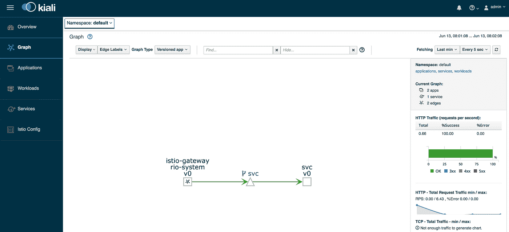

服务网格地图 Kiali 上的可视化

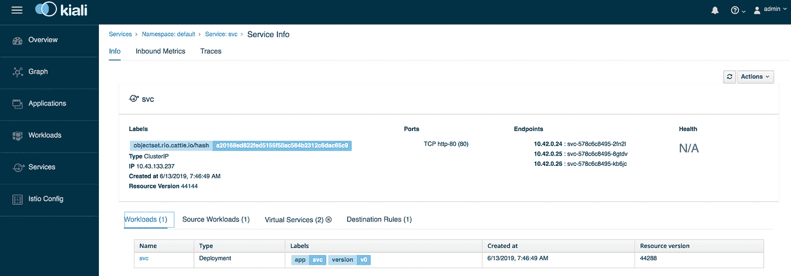

服务网格配置 Kiali 上的可视化

# 服务网格和金丝雀部署

里约有一个内置的服务网络，由 Istio 和 Envoy 提供支持。Rio 特别要求用户不要太了解底层服务网格。

服务可以一次部署多个版本。然后，服务网格可以决定将多少流量路由到每个版本。

## 使用 Rio-Stage 来存放同一服务的多个版本:

Rio“stage”对现有服务进行新的修改:

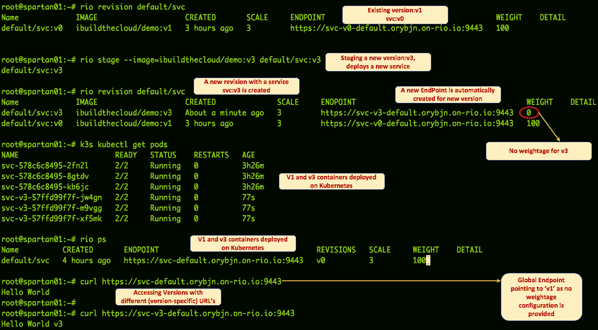

使用 Rio-Stage 部署同一服务的多个版本

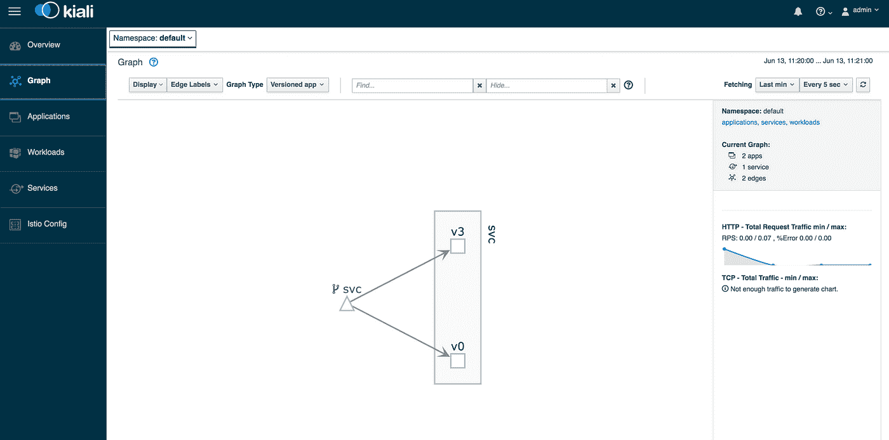

服务 v0 和 v3 — Kiali

## 使用 Rio-Promote 调整服务版本之间的流量:

Rio“promote”使用户能够在部署的服务上使用金丝雀流，逐步调整版本之间的权重。流量将逐渐转移，默认权重每 5 秒增加 5%(可配置)。

如下所示，上面使用 rio-stage 创建的服务 V3 已升级:

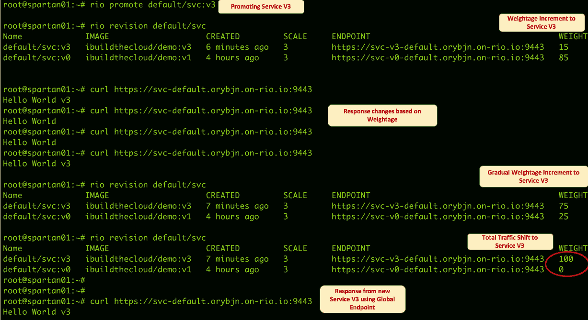

使用称重配置调整流量，使用 Rio-Promote 部署金丝雀

## *动态调整服务权重:*

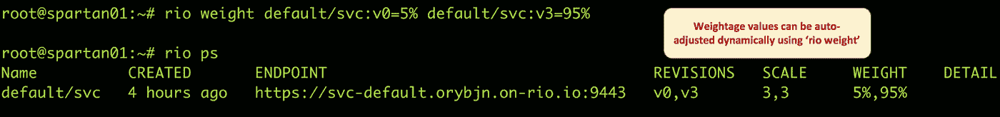

使用 Rio-Weight 动态调整重量

## *与基亚利一起可视化:*

Rio 部署了 Kiali(Istio 的默认 UI)和 Isio 堆栈。上面所做的所有配置和更改都可以很容易地从 web 界面中描述出来。

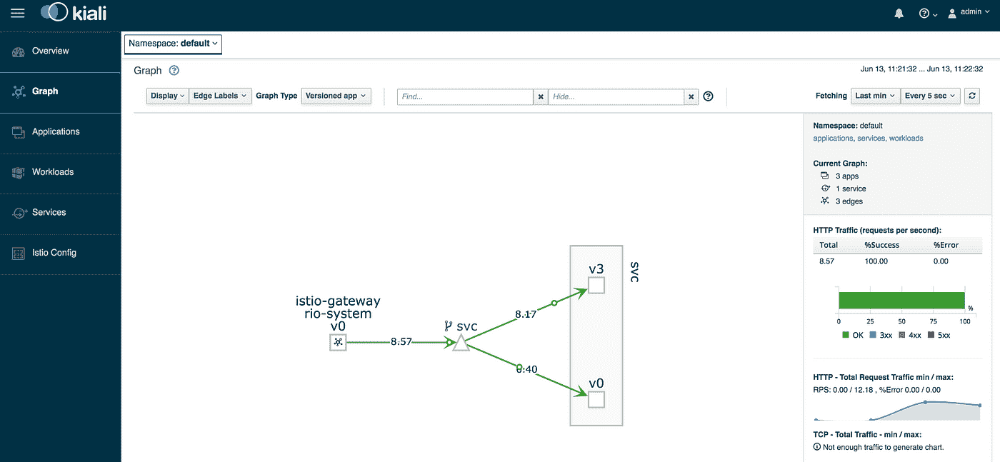

重量变化时的交通变化

# 自动缩放

默认情况下，Rio 支持工作负载的自动扩展。根据您的工作负载的 QPS 和当前活动请求，Rio 将工作负载扩展到适当的规模。

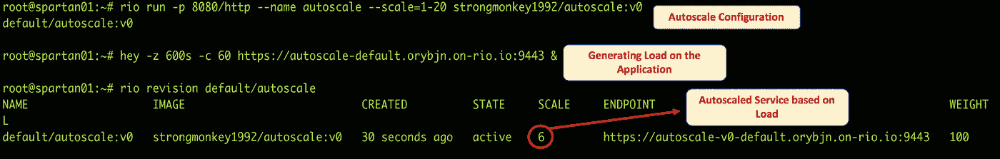

自动缩放—里约

## *根据需求从零开始扩展服务:*

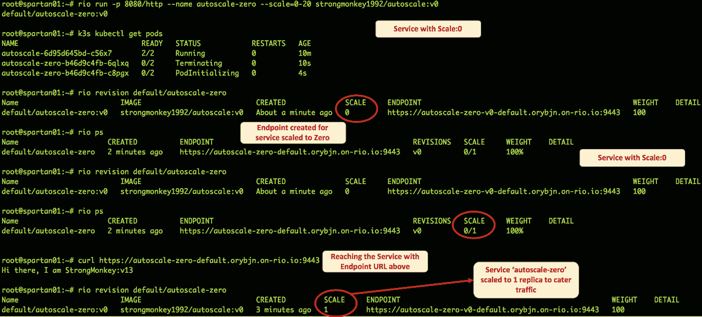

自动缩放—里约

# 部署的源代码

Rio 支持配置基于 Git 的源代码存储库来部署实际的工作负载。这就像给 Rio 一个有效的 Git repository repo URL 一样简单。

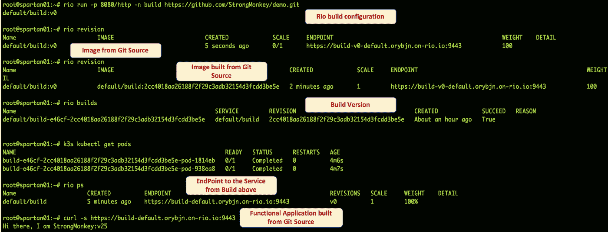

用 Rio 构建的源代码— Git 源代码

Rio 将自动观察任何提交或标签被推到一个特定的分支(默认为 master)。默认情况下，Rio 会以一定的时间间隔提取并检查分支，但是可以配置为使用 webhook。Rio 允许用户动态配置 webhooks，在下面创建 Kubernetes secret，并可以通过 build 命令传递。

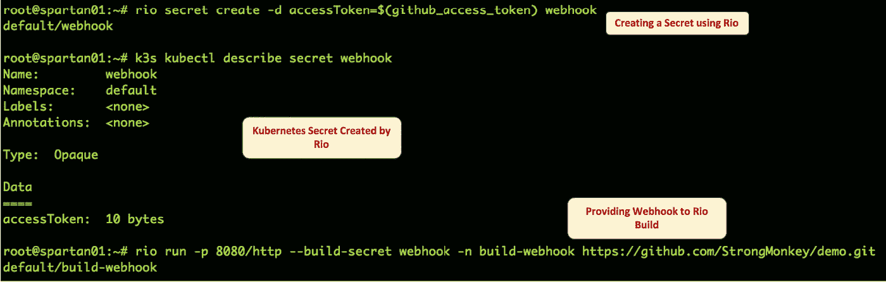

用 Rio 配置 Webhook

# 监视

Rio 部署了 Prometheus、Grafana 和 Kiali 来监控和可视化服务部署。

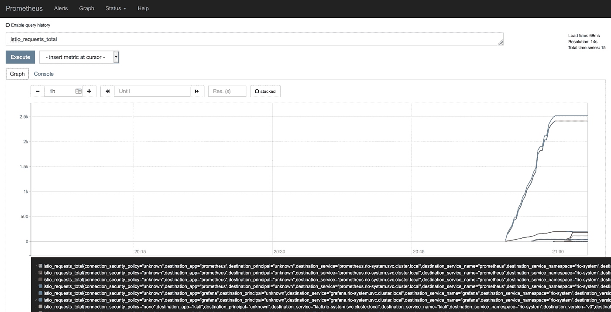

普罗米修斯

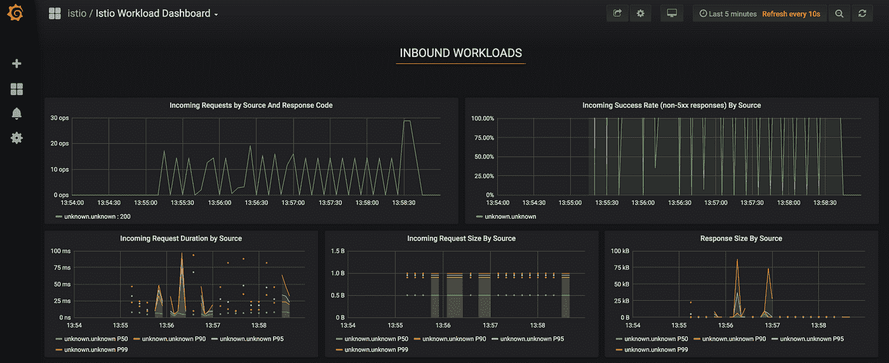

Istio 工作量/里约服务仪表板

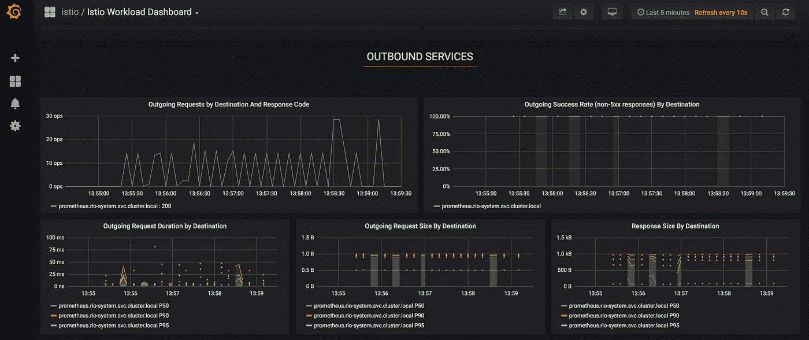

Istio 工作量/里约服务仪表板

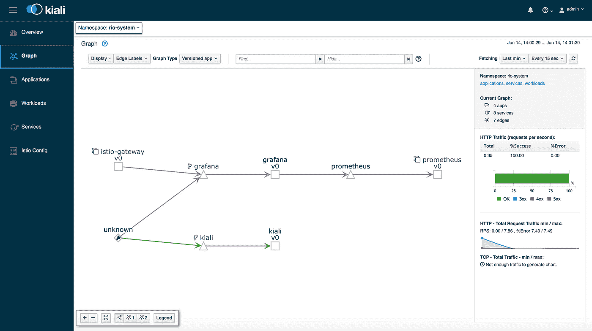

使用 Kiali 实现 Istio 特定映射和可视化

根据定义，边缘基础设施是一个资源受限的环境。K3s 有潜力有效利用这些资源，从可用资源中榨取最后一点汁液。另一方面，Rio 支持多功能 PaaS 平台在 Kubernetes 上部署应用程序，使 K3s + Rio 成为 Edge 生态系统的良好组合。

然而，K3s 的目标是成为一个生产级的 Kubernetes 发行版，包括自动证书生成和向集群添加新节点的简单方法。看看 Kubernetes 的精简版本是否会超过全功能部署会很有趣。