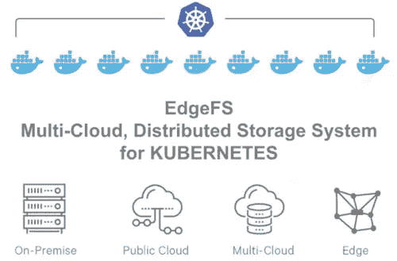
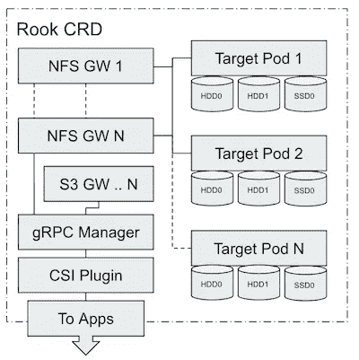
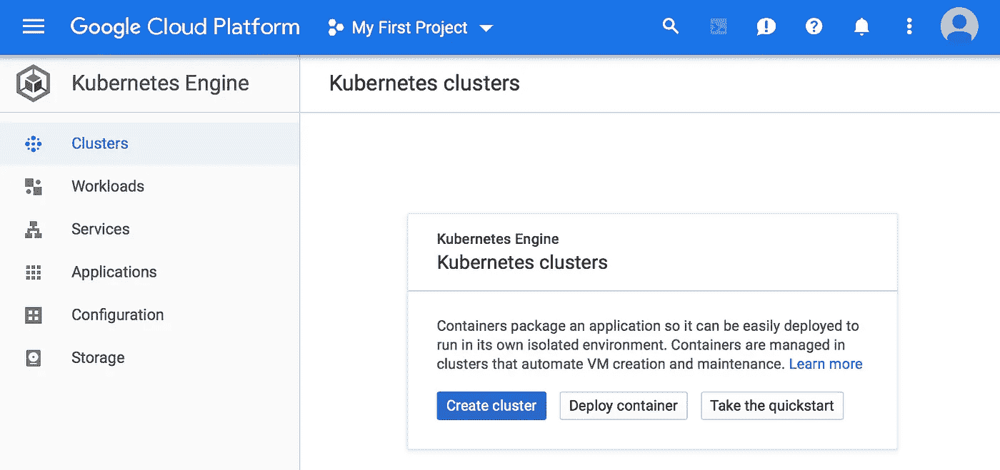
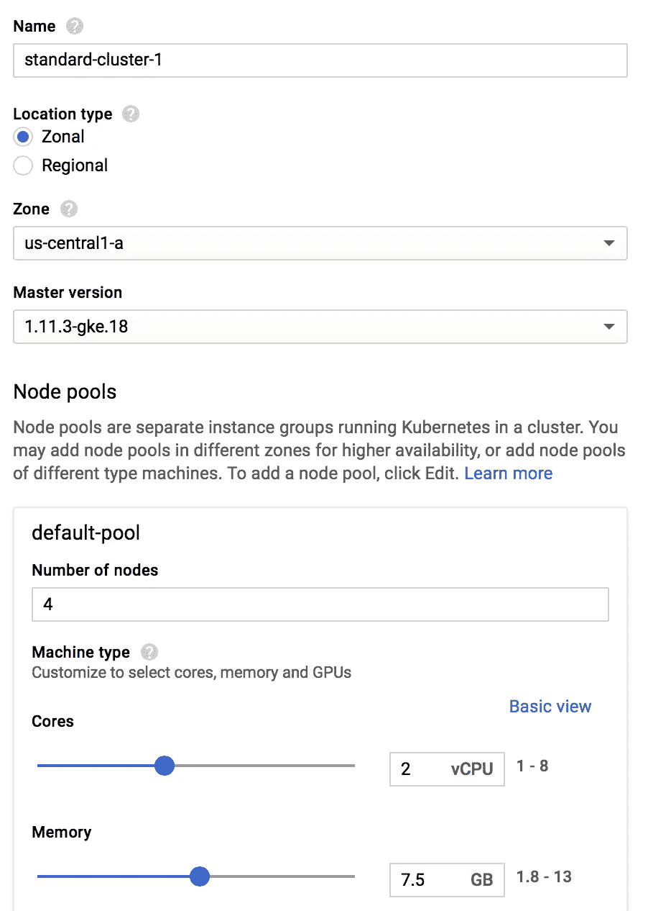
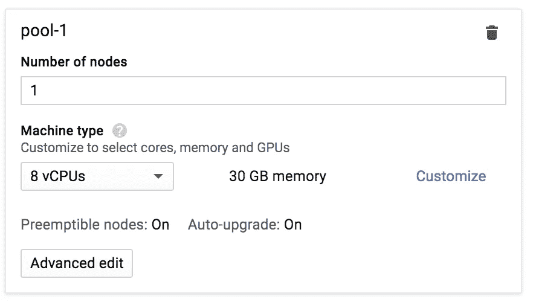
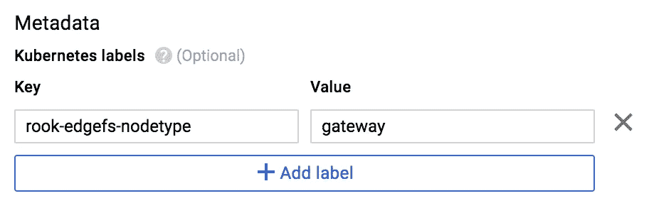
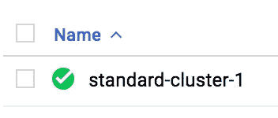
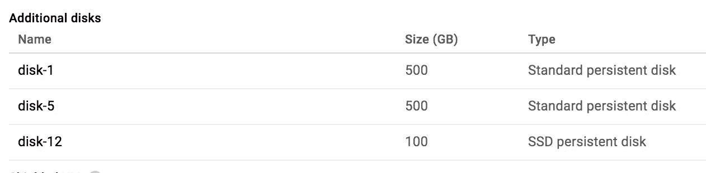
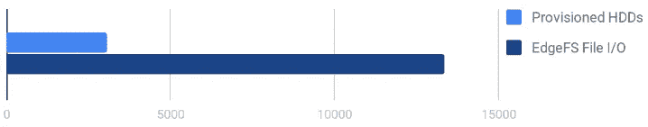

# Google Cloud 中带有 Rook 的 EdgeFS 集群

> 原文：<https://itnext.io/edgefs-cluster-with-rook-in-google-cloud-885227625b9b?source=collection_archive---------1----------------------->

如果你碰巧在 GCP 云中运行 Kubernetes，那么你可能会有兴趣通过 Rook EdgeFS Operator 尝试一下这个新项目。它不仅支持地理透明数据访问的新用例(想想多云工作负载！)，而且它还可以显著节省云成本！

随着托管 Kubernetes 解决方案的公共云或私有云产品的发展，将复杂的存储基础架构视为托管服务的需求日益增长。

为了实现这一目标，现在有了新的选项，即 Kubernetes 的 Rook Orchestration 和 EdgeFS 作为地理透明的数据 I/O 平台。
EdgeFS 具有独特的功能集，如全局重复数据删除和 git 式容错，以及其他功能，为 NFS 和 iSCSI 持久性卷提供现成的 Kubernetes CSI 集成，运行在完全不可变的存储系统之上。众所周知，EdgeFS 是一个考虑到“git”架构的存储解决方案，其中所有修改都是全局不可变的、版本化的、自识别的和全局可访问的。使用这种架构的好例子是跨多个数据中心或云对相同数据集的一致和容错访问。



除了企业级的可靠性和可用性特性，EdgeFS 还展示了在云中运行时令人印象深刻的性能结果。由于其内置的重复数据消除和压缩支持，它还是一个非常经济高效的解决方案。

为了将 EdgeFS 作为托管的 Kubernetes 服务来运营，我们最近增加了对 Rook Operator 的支持。Rook v0.9 版本现在提供了初始集成。使用 Rook Operator EdgeFS，可以通过自定义资源定义(CRD)结构将数据节点作为 StatefulSet 服务进行管理。Rook 提供了跨云提供商和在 Kubernetes 运行的任何环境中使用相同存储解决方案的灵活性。您将不再局限于 GCP 或其他特定于供应商的存储解决方案。

这篇文章是为那些已经熟悉 Kubernetes、听说过 GCP 但从未尝试过 EdgeFS 的人设计的。所以，让我在这里过一遍基本步骤，我相信你将能够填补空白(如果有的话),或者在最后提出意见/问题。

# 测试配置

我想配置 4 节点 EdgeFS 群集，准备使用 CSI 接口，通过透明的 S3 API 访问为横向扩展 NFS 导出提供服务。目标是建立如下所示的托管存储基础架构:



EdgeFS Rook CRDs 呈现为一个

其中，车 CRD 由 YAML 文件集 cluster.yaml、nfs.yaml 和 csi.yaml 表示。从技术上讲，csi 定义不是车分布的一部分，但由于紧密集成和假设，我认为 CSI 是 EdgeFS 车运算符的一部分。

NFS GW 1..n 是用于访问 EdgeFS 导出桶的一组 NFS 网关。

S3 GW..n 是通过 Kubernetes 负载平衡器服务类型连接的一组 S3 API 兼容网关。

gRPC 管理器是一个代理，它平衡和委派来自 CSI 插件的请求。它还充当工具箱的角色，即管理员可以在其中执行 EdgeFS CLI 的 UNIX shell。

目标节点 1..n 是一组数据节点，为一些磁盘服务。目标可以服务于各种不同的配置，可以是全 HDD、元数据卸载到 SSD 的混合 HDD/SSD 以及全 SSD。

# 将 GCP·库伯内特公司设置为存储服务

首先，一旦你登录到你的谷歌帐户，并在 GCP 控制台创建了一个项目(在我的例子中，它被称为“我的第一个项目”)，导航到 Kubernetes 引擎部分，并点击“创建集群”。



集群规模很重要，这里的假设是本文中的资源分配将用作最佳配置的示例。在根据 I/O 性能和可用性要求设计初始安装时，需要应用某些规则。要考虑的最佳要求的最小子集:

*   解除 GW 吊舱接入点和目标吊舱的隔离。虽然在同一个节点上混合 GW 和目标功能是可以的，但不建议这样做，因为这会对性能/可用性产生负面影响。例如，现在滚动升级会突然影响 NFS 功能的可用性。或者，激进的 NFS 客户端可以中断目标 CPU 内核，从而在共享内核的情况下导致尾部延迟显著增加。
*   目标 pod CPU 核心数公式需要考虑介质类型。固态硬盘/ NVMe 运行速度更高，单核可能不够。每个 SSD 至少分配 2 个 CPU 内核是一个很好的经验法则。虽然每个 SSD 个 CPU 内核可以很好地工作，但它会增加多线程应用程序在更高 I/O 时的尾部延迟。
*   目标 pod 内存公式需要考虑工作负载。如果工作负载是小型 I/O 随机负载，主要服务于多线程应用程序，请考虑为每个设备分配 2 GB。除此之外，Target 的其他功能(如协调服务和后台操作)还需要 2GB 的最低内存。
*   GW pod CPU 和内存公式需要考虑工作负载。如果工作负载是小 I/O 随机的，有许多多线程应用程序，增加更多的 CPU 和内存会有所帮助。不要忘记，NFS 和 S3 的 EdgeFS 服务可以通过随时添加更多的 pod 进行水平扩展。

记住这一点，让我们继续创建区域类型集群(其中所有的 Kubernetes 节点将在相同的地理位置运行)。此外，因为我计划在不同的节点上运行 1 个 NFS GW pod，默认池大小必须为 4 台服务器，并且预期 EdgeFS 将为主机设置故障域策略，因此 3 个副本将安全地存储在 3 台不同的服务器上。



对于网关和计算节点，我们需要选择稍有不同的配置文件，从而为服务和应用提供更多 CPU 和内存:



我们应该标记我们计划用作专用 EdgeFS 网关的节点，这可以通过 GCloud“元数据”编辑界面来完成:



通过将“rook-edgefs-nodetype”设置为“gateway ”,我们可以为存储服务自动计划程序策略启用关联。我们的 NFS 和 S3 服务单元将自动转向网关节点，Kubernetes 将负责在集群中配置的所有专用网关之间实现复杂的最佳资源平衡。如果没有提供标签，那么服务将在目标节点上运行。这是一个“可以”的默认行为，但不是最佳行为。

现在，创建集群并等待它准备就绪:



一旦集群开始运行，点击集群名称，复制 gcloud example 命令并将其粘贴到您的工作站控制台中，其中已经预装了 kubectl，可以使用了。请遵循 gcloud 提供的关于如何设置 gcloud 命令的说明。

EdgeFS 支持两种主要的机制来部署目标 pod——在预先格式化、预先挂载的目录之上或在原始磁盘之上。在本文中，我想让我们演示一下原始磁盘的配置。混合使用硬盘和固态硬盘可以实现最佳性价比配置，其中硬盘用于容量，固态硬盘用于日志/元数据。要实现这一点，请按照 gcloud 文档中的步骤，为集群中的每个目标节点创建 2 个 HDD 和 1 个 SSD:

[https://cloud . Google . com/compute/docs/disks/add-persistent-disk # create _ disk](https://cloud.google.com/compute/docs/disks/add-persistent-disk#create_disk)

可以通过“虚拟机实例详细信息”来确认结果，例如，在我的例子中，我创建的所有 4 个目标节点看起来都是这样的:



在 Rook Operator 的帮助下，EdgeFS 将自动检测设备并创建最佳布局。

# 设置 EdgeFS Rook 运算符

现在我们到了您需要登录到工作站控制台并为我们想要尝试的配置准备 Rook CRDs 的部分。

在继续之前，使用“kubectl get pod”命令，确保可以看到 kubernetes 集群。请注意，Google Cloud 用户需要明确授予用户创建角色的权限。确保执行以下命令以获得必要的访问控制:

```
kubectl create clusterrolebinding cluster-admin-binding --clusterrole cluster-admin --user **$(**gcloud config get-value account**)**
```

现在克隆车库并导航到 edgefs 示例:

```
git clone [https://github.com/rook/rook.git](https://github.com/rook/rook.git)
cd rook/cluster/examples/kubernetes/edgefs
```

通过运行下面的命令来安装 EdgeFS 操作符应该足够了。然而，在撰写本文时，需要将操作符图像更改为 edgefs/edgefs-operator:latest:

```
kubectl create -f operator.yaml
```

使用以下命令监控结果:

```
kubectl get po -n rook-edgefs-system
NAME                                READY   STATUS    RESTARTS   AGE
rook-discover-5h6fj                 1/1     Running   0          26s
rook-discover-dcrlr                 1/1     Running   0          26s
rook-discover-sh4r6                 1/1     Running   0          26s
rook-discover-shjxl                 1/1     Running   0          26s
rook-discover-v7zvg                 1/1     Running   0          26s
rook-edgefs-operator-6d54bb-v47mv   1/1     Running   0          28s
```

接下来，打开 cluster.yaml 文件，找到“kind:Cluster”CRD，进行修改，使其看起来类似于以下内容:

请注意，我希望将全部元数据卸载到 SSD，并且因为在测试中使用了大部分 16K 或更大的有效负载，所以优化了有效负载页面大小。

这里的其他重要参数是自我描述的“useAllNodes”和“useAllDevices”。我希望能够自动发现和调配我所有包含未使用的硬盘和固态硬盘的节点。和“/var/lib/edgefs”目录来保存目标 pod 的本地状态信息。

现在，保存它并执行 CRD 创建:

```
kubectl create -f cluster.yaml
```

您希望看到的是 mgr 和 target-* pod 显示为正在运行:

```
kubectl get po -n rook-edgefs
NAME                             READY   STATUS    RESTARTS   AGE
rook-edgefs-mgr-6f9dd99b-j9pf9   1/1     Running   0          47s
rook-edgefs-target-0             3/3     Running   0          47s
rook-edgefs-target-1             3/3     Running   0          47s
rook-edgefs-target-2             3/3     Running   0          47s
rook-edgefs-target-3             3/3     Running   0          47s
rook-edgefs-target-4             3/3     Running   0          47s
```

其中，mgr pod 是 gRPC 代理，target-* pod 是我们的数据和网关节点。请注意，目标数据单元和网关单元之间没有明显的区别。Gateway pod 是完全相同的构造，运行相同的软件，但不服务于任何磁盘。

是时候初始化集群了，这可以通过工具箱工具来完成:

```
kubectl exec -it -n rook-edgefs rook-edgefs-target-0 -c daemon -- env COLUMNS=$COLUMNS LINES=$LINES TERM=linux toolboxWelcome to EdgeFS Toolbox.
Hint: type efscli to begin#
```

FlexHash 是一个重要的 EdgeFS 构造。它代表以“行”组织的磁盘的动态发现集群布局。任何低级别的读或写 I/O 都将使用这种布局来协商网络上的有效负载传递。

初始化 FlexHash 映射(它是自动发现的，现在可以使用了):

```
# efscli system initSystem Initialization
=====================Please review auto discovered FlexHash Table:from_checkpoint 0
zonecount 0
numrows 8
pid 1
genid 1544406738001966
failure_domain 1
leader 0
servercount 4
vdevcount 8Please confirm initial configuration? [y/n]: y
Sent message to daemon: FH_CPSET.1544406738001966
Successfully set FlexHash table to GenID=1544406738001966
System GUID: 0B936E29335A480BB8DA0D7E9A395CCB
```

现在，让我们创建逻辑站点命名空间“cltest”和租户“test”:

```
efscli cluster create cltest
efscli tenant create cltest/test
```

# EdgeFS 数据输入/输出飞机的飞行前验证

EdgeFS 附带了 FIO 集成 I/O 引擎，可以在此时快速执行这些引擎来验证整体 I/O 性能特征:文件、块和对象。

I/O 生成器在专用网关节点上执行，以模拟接近生产环境。专用网关节点可以与“池-1”中定义的一样多，并且配置文件必须更加计算密集型。除了在 I/O 生成器内存上下文中，读取数据不会在本地缓存，即重新启动 FIO 将清除缓存的数据，并强制通过网络从目标数据节点重新读取这些数据。

对于文件和数据块，FIO 文件如下所示:

此 FIO 文件将生成 16 个文件，数据集比目标数据节点上的可用内存总量(4 x 8GB)大 3.5 倍。随机 80/20 工作负载，具有对齐的 32K 数据块、直接 C 接口(无 NFS 或 iSCSI 开销)、复制计数 1、模拟压缩(50%)和重复数据消除系数(87%)。

登录我们的专用网关(通常为 target-0)并执行:

```
fio edgefs-file.fio
...clat percentiles (usec):
70.00th=[ 1080], 80.00th=[ 1368], 90.00th=[ 1848], 95.00th=[ 2320]
read: IOPS=10.7k, BW=333MiB/s (349MB/s)(128GiB/394029msec)clat percentiles (usec):
70.00th=[ 1768], 80.00th=[ 2040], 90.00th=[ 2512], 95.00th=[ 3024]
write: IOPS=2661, BW=83.2MiB/s (87.3MB/s)(32.3GiB/394029msec)
...
```

现在，让我们来分析一下结果。首先，延迟在 1 到 1.2 毫秒之间，95%的尾部在 2 到 3 毫秒之间。这可能取决于硬盘如何配置的内部因素，但对我来说，这看起来像是一些有效的缓存正在发生，这是可以的。其次，谷歌提供的硬盘广告上写着 350 个读取 IOPS，700 个写入。也就是说，如果直接用于 80/20 工作负载，我们的 8 块硬盘只能提供大约 3080 IOPS。为了直观地比较这一点:



16 个线程，16 个文件，每个文件 10GB，32KB，80/20，与谷歌提供的硬盘最大容量相比，IOPS

为了解释这一点，EdgeFS 的优势主要来自数据 I/O 减少(动态重复数据删除、压缩)和智能使用元数据卸载技术到内存/SSD。不要忘记提及使用轻量级 UDP/IP 而不是 TCP/IP 的网络结构，传输都是无连接的，并且在其自己的数据放置/检索协议逻辑内操作。

对于对象，FIO 文件如下所示:

该 FIO 文件将生成 65536 个大小为 1MB 的对象(32 * 2G /1MB ),使用复制计数为 1 的直接 C 库接口(无 S3 开销)平均分布在 4 个存储桶 bk1-bk4 上。该数据集比目标数据节点上的可用内存总量(4 x 8GB)大 2 倍左右。我们首先以 rwmixread=0 (100%写入)运行它，然后以 rwmixread=100 (100%读取)重新运行它。

```
fio edgefs-object.fio
...
write: IOPS=1128, BW=2257MiB/s (2367MB/s)(64.0GiB/29035msec)read: IOPS=1676, BW=3352MiB/s (3515MB/s)(64.0GiB/19550msec)
```

让我们试着分析和理解这个结果。在此示例中，每个调配的 HDD 设备都限制在 60MB/s，也就是说，我们的 8 个设备不可能达到 480MB/s 以上。我们调配群集 SSD 的方式是，我们不将它们用于数据缓存，仅用于元数据卸载和写入日志，但读取速度惊人，接近 **3.5GB/s、**，写入速度惊人，接近 **2.5GB/s** ！为了形象化这一点:


吞吐量 32 个线程，2MB 对象跨 4 个存储桶，而 Google 提供的硬盘，MB/s

为了解释这一点，写 I/O 受到 HDD 的限制，EdgeFS 需要做更多的工作来处理元数据和数据放置。借助 read I/O EdgeFS，在通过网关的网络接口发送/接收数据块之前，利用重复数据消除和压缩，这一点做得非常好。

# 配置服务

至此，配置已验证，特性已预测试，我们可以继续创建我们需要的服务:

```
# bucket, aligned on 32K chunk size
efscli bucket create cltest/test/files -s 32768 -r 1 -t 1# bucket, aligned on 4MB chunk size
efscli bucket create cltest/test/objects -s 4194304 -r 1 -t 1# NFS service, serving Tenant
efscli service create nfs files
efscli service serve files cltest/test/files# S3 service, serving buckets we want to be transparently accessed
efscli service create s3 objects
efscli service serve objects cltest/test
```

上面创建了两个名为“文件”和“对象”的服务。这些服务定义保存在集群本身中，由 gRPC 管理器用来与 CSI 框架通信。

现在是时候为这两种服务创建车 CRD 定义了:

注意，我将 gateway 的可用内存分成两个 12GB 的部分，用于每个服务，并使 CRD 名称(“文件”、“对象”)与相应的 EdgeFS 服务相匹配。

还要注意，两个服务 CRD 都定义了放置条件“rook-edgefs-nodetype”=“gateway”，从而告诉 Kubernetes 调度程序尝试找到所需的资源。

让我们创建 CRD:

```
kubectl create -f edgefs-s3-gateway.yaml
kubectl create -f edgefs-nfs-gateway.yaml# kubectl get po --all-namespaces|grep s3-objects
rook-edgefs   rook-edgefs-s3-objects-23ffe   1/1   Running   0   33s
# kubectl get po --all-namespaces|grep nfs-files
rook-edgefs   rook-edgefs-nfs-files-345fx    1/1   Running   0   7s
```

服务现在正在运行，我们可以检查 ClusteIP 是否可用:

```
# kubectl get svc -n rook-edgefs | grep s3-objects
rook-edgefs-s3-objects   NodePort    10.11.241.165 9982:31138/TCP
```

此时，CSI 插件应该能够连接并使用动态或静态配置的持久卷的存储服务。

跟随 Rook [EdgeFS CSI 文档](https://rook.io/docs/rook/v0.9/edgefs-csi.html)了解如何设置它的细节。

# 集群拆卸

使用原始磁盘的 EdgeFS(未创建文件系统！)作为其存储介质。连接到群集目标节点的 HDD 和 SSD 已分区并在使用中。如果我们想拆除集群，我们可能还想删除所有分区并清除磁盘。有两种方法可以做到这一点:1)只需简单地删除集群，并为每个节点上的每个设备手动执行“wipefs -a /dev/DEV”命令；2)使用内置的 EdgeFS 工具重新使用当前配置和 zap 设备。在后一种情况下，如果您希望重新配置某些配置参数，但不希望重新发现磁盘或进行手动清理，这将非常有用。

为了实现这一点，通过车集群 CRD 有 3 个选项可用:

*   devices resurrectmode:" restoreZapWait ":zap 所有正在使用的磁盘，并等待直到" kubectl delete -f cluster.yaml "
*   devices resurrectmode:" restore zap ":在目标守护进程启动之前清除所有正在使用的磁盘。当您希望从头开始但保持相同的配置时，这对于集群重启非常有用
*   设备恢复模式:" restore ":不要更换磁盘，而是尝试恢复集群 CRD 删除之前使用的配置。如果上次运行时/var/lib/edgefs 目录中还有配置，那么将从该目录中提取配置。

如何在切换设备时重启集群的示例:

```
kubectl delete -f cluster.yaml
# edit cluster.yaml and add devicesResurrectMode: “restoreZap”
kubectl create -f cluster.yaml
```

# 结论

通过在 GCP 运行 EdgeFS Rook Operator，分布式 EdgeFS 存储的部署和管理现在大大简化了。

现在，部署 EdgeFS 作为 Kubernetes 运营商管理的服务不仅非常容易，它还证明了 ***它可以在 GCP 提供最大限度的硬盘驱动器、固态硬盘和网络资源*** 的基础上显著提升性能。当然，这意味着成比例的云成本节约！

这只是 GCP 的一种配置。我期待听到您使用 EdgeFS Operator 配置 Rook 以优化您的云配置的性能和成本的经验！

请记住，任何支持 Kubernetes 的环境都可以使用 Rook 和 EdgeFS 作为后备存储。这种方法是可移植的，使其成为任何云原生环境的良好选择，无论是在公共云中、内部还是在边缘物联网角落。

我还没有谈到的 EdgeFS 特性之一是它的设计，通过提供地理透明的数据访问来支持多云存储工作负载。请继续关注这方面的更多文章！

## 前进

将 Rook EdgeFS Operator 作为存储架构的焦点，您将能够灵活地提供块、对象存储或横向扩展网络文件系统来满足各种需求，避免供应商锁定，并享受现代分布式 Kubernetes 本地存储。

即将到来的 EdgeFS 与 Crossplane 和其他 Kubernetes 联邦和工作负载管理解决方案的集成将允许云原生应用程序真正跨云和开放。

我很期待看到 EdgeFS to Rook！

我代表 EdgeFS 和 Rook 开发者邀请您加入我们充满活力的 Rook [社区](https://rook-slackin.herokuapp.com/)和 EdgeFS [社区](https://edgefs.slack.com/)，亲自体验一下 [EdgeFS](http://edgefs.io) 。欢迎投稿和反馈！