# 飞镖和颤振的有效算法。大 o。

> 原文：<https://itnext.io/effective-algorithms-for-dart-and-flutter-big-o-874627c433ba?source=collection_archive---------0----------------------->

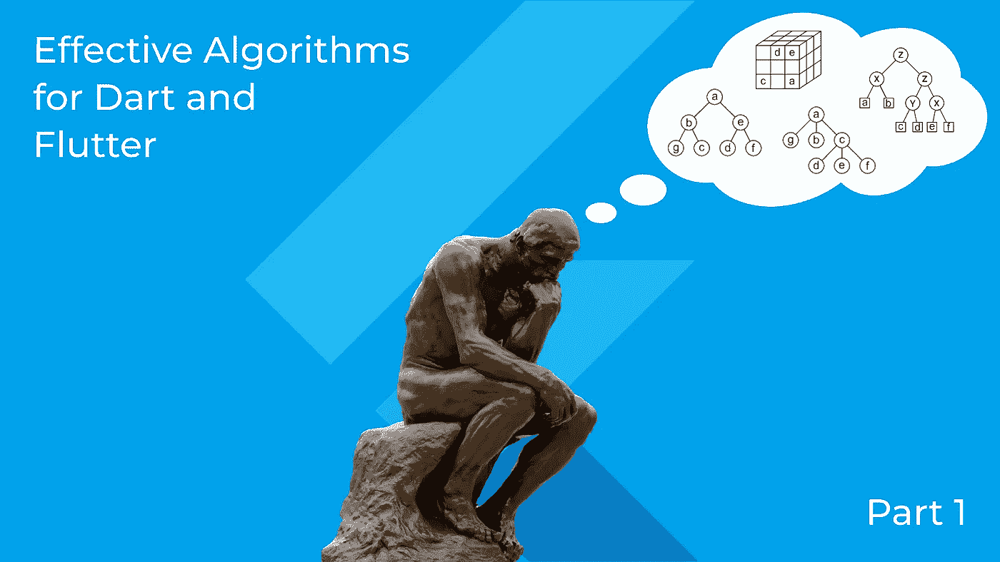

可能技术面试最重要的部分是算法和数据结构的知识检查。这是任何语言的专业程序员学习曲线的必备部分，尤其是对于 Flutter。

Flutter 的荣耀使命是为移动设备编写代码。移动设备需要特别关注其算法的性能和有效的内存使用。我们没有通过升级服务器硬件来获得更高 CPU 和内存的纵向扩展。加上高效算法的强大功能，你可以为 Android 和 IOS 创建更快、更稳定的代码。这就是为什么面试官会对你的能力进行压力测试。

在进一步阅读之前，让我们做一个检查。你听说过 [**leetcode**](https://leetcode.com) 吗？如果是，就继续读下去。如果没有，请花 10-15 分钟浏览一下这个网站的问题和社区页面。这是行业趋势在面试和选择一个工作或远程项目的新程序员的整个过程中的反映。

顺便说一下，我将在本主题接下来的部分解释一些最重要的 leetcode 问题。

今天我们将试着理解核心原理，甚至是定律，我们可以用它来估计任何算法的效率。

这些知识，加上一些提高效率的技巧和方法的知识地图，形成了这个“可怕”的部分。

# 算法很重要

攻击算法和数据结构的第一步是理解它们为什么如此重要。

我们来考虑一个非常简单的 Flutter app。这个应用程序必须计算像[1，2，3，4，…]这样的整数递增序列的总和。

我们将使用 [**FlutLab.io**](http://flutlab.io) ，你也可以从 [**FlutLab 的 WidgetBay**](https://widgetbay.flutlab.io/widget/algorithms-matter) 中抓取初始项目。如果你以前没有使用 FlutLab，这是一个在线 Flutter IDE，你可以在这里免费注册和构建你的应用程序。如果您已经有一个帐户，请转到 WidgetBay 上的初始项目[并单击“Fork to FlutLab IDE”。](https://widgetbay.flutlab.io/widget/algorithms-matter)

现在，您可以在您的个人资料中找到这个项目:

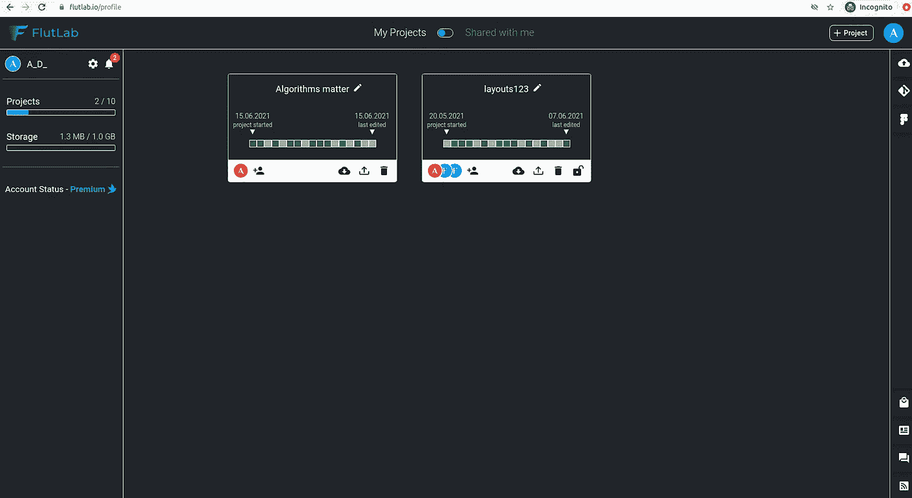

进入该项目并运行 Web Build。您应该在 Web 模拟器的中心看到“结果:0 ”:

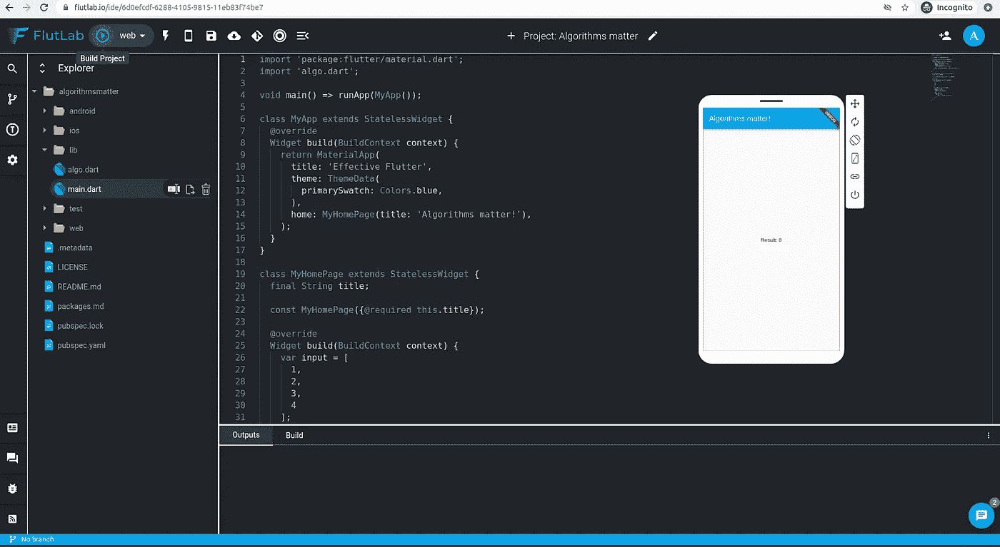

此应用程序的计算部分是作为一个名为“Algo”的独立 Dart 类制作的:

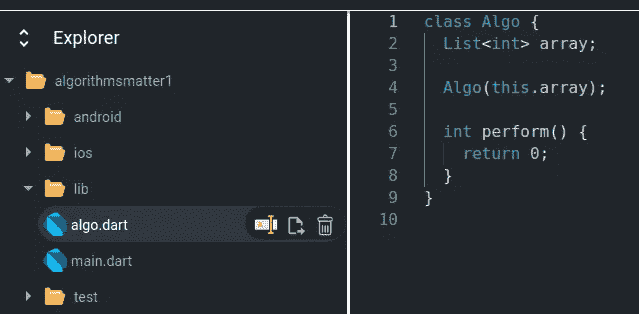

目前它只包含方法“perform”的占位符，返回 0。

这就是为什么我们在运行这个应用程序时可以看到“结果:0”:

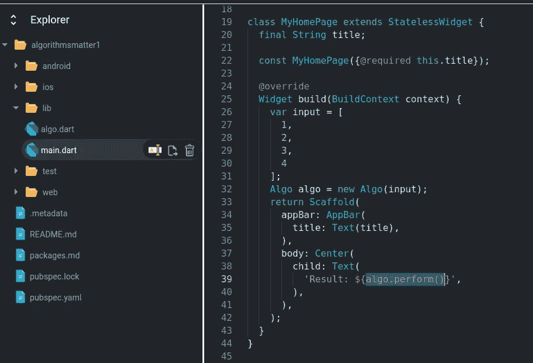

现在让我们实现 Algo 来计算列表元素的总和:

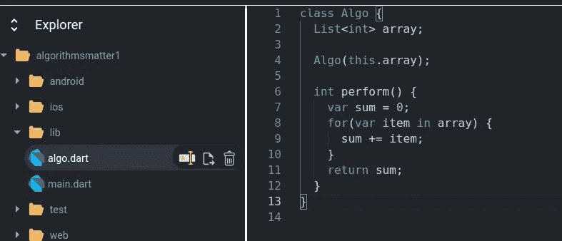

很简单，对吧？让我们再次运行 web build 或热重装:

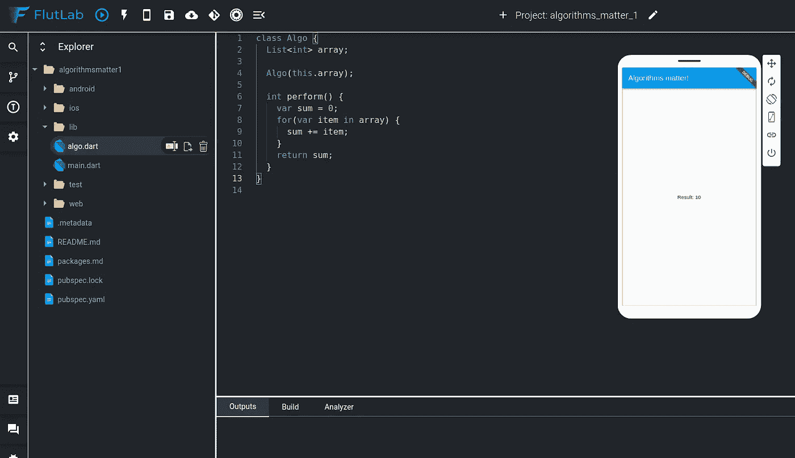

一切看起来不错。实际上，普通的 Flutter 开发者会很高兴地止步于此。

但是我们能改进这个解决方案吗？

是啊！

如何看出这个方案并不理想？让我们打开包含算法单元测试的项目的另一部分:

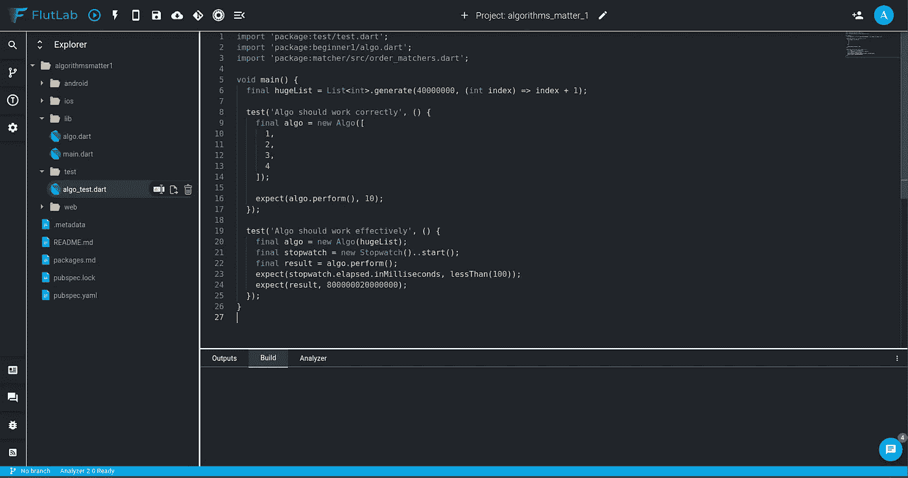

这里我们有两个单元测试:

*   算法应该工作正常
*   算法应该有效地工作

让我们通过单击“运行测试”按钮来运行这个测试包:

我们可以看到，第一个测试“算法应该正确工作”通过了，但第二个测试“算法应该有效工作”——失败了。

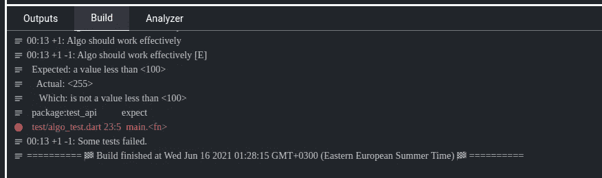

这是因为它花费了超过 100 毫秒的时间，这是算法执行的最大允许时间:

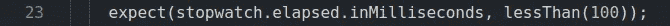

# 大 O 来帮忙了

我们可以改变单元测试的代码，可以注意到，这个测试通过了一些不是很大的数组。

所以，我们的算法需要完成的时间是它的输入——数字数组——的大小的函数。

大 O 符号给了我们简单的标准来估计我们算法的速度或时间复杂度。

在这种方法中，我们不需要估计算法所需的物理时间。因为这个时间取决于我们电脑的性能和它在做多少后台工作。

但是我们可以相对于输入数据的大小来估计当时的**阶**。

例如，完成时间(让我们用**时间复杂度**术语)可以是 1，n，n 等。其中 n 是要处理的数据的大小。

相应地，算法的时间复杂度可以是 O(1)，O(n)，O(n)

O(1)是算法和数据结构的圣杯——最优化的算法都有这个时间复杂度。

O(n)可以接受，但不太好。而 O(n)是纯粹的邪恶。

如何计算我们算法实现的时间复杂度？

通过计算操作！

如果我们有一个大小为 n 的输入数组，我们的代码需要多少次逻辑运算？

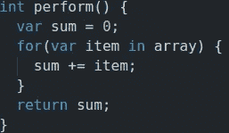

1 求和初始化操作

循环的 n 次操作

1 个返回值的操作

太棒了。我们有 O(n + 2)的时间复杂度。没那么快。当我们需要知道时间复杂度的阶数时，我们应该截断所有的常数。不管我们有 O(2n)，O(4n+3)还是 O(1000n + 2000)，我们只要提一个事实，时间复杂度是 n 的线性函数，这里的正确答案是 O(n)。

如果您仍然没有完全理解大 o 的概念，请不要担心。我们将重新讨论不同算法的时间和空间复杂度的计算。

等一下！—你可以说。我们真的可以把这个算法重新加工成一个常数的阶，O(1)。是的，我的朋友，我们可以。

让我们记住，我们是在对线性增长的数字求和。从 1 开始，每个下一个值都比 1 大。

我们可以画一个小图，在数字要求和的地方用深色标出:

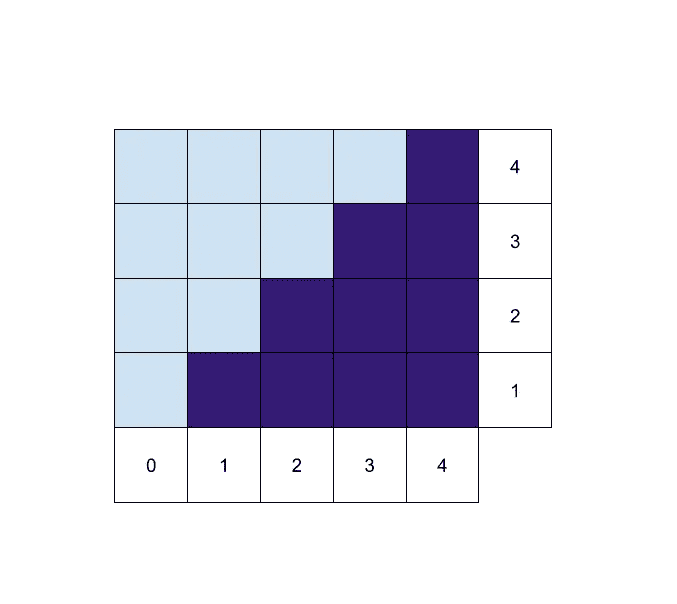

其中 X 轴是数组项的位置，Y 轴是它的值。我们添加了值为 0 的 0 的元素，以展示一个有趣的现象:所有项目的总和是矩形 n*(n+1)的总面积除以 2。事实上，黑暗细胞正好占据了大矩形空间的一半。

所以我们的新算法应该是这样的

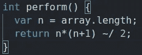

这是 2 次运算，与输入数组的大小无关。所以，是 O(1)。

有了这一改变，我们所有的测试都成功通过了:

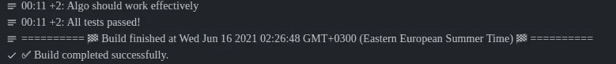

结论。算法和数据结构是一个复杂而广泛的知识库。但是，我们可以在实践中学习。它的方法和术语的关键的、小的子集允许我们编写更有效的代码并通过编码面试。今天我们了解到，即使是最简单的算法也可以通过计算其运算次数来优化。还有，我们遇到了大 O 符号。我们将很快看到更多的例子来巩固我们的大 O 本能，形成我们的新心态。

待续..