# 飞镖和颤振的有效算法。哈希集。

> 原文：<https://itnext.io/effective-algorithms-for-dart-and-flutter-hash-set-f71e6d2b5837?source=collection_archive---------0----------------------->

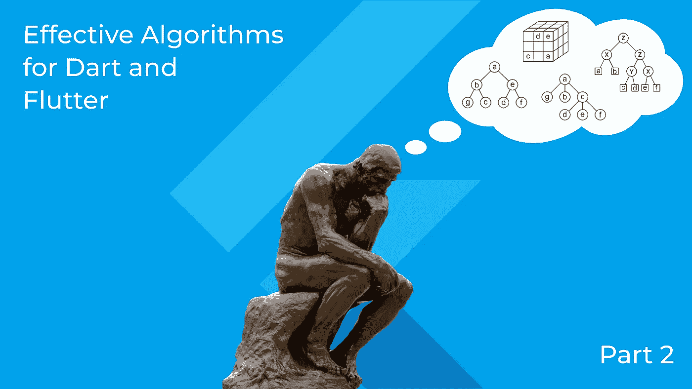

在[Dart 的有效算法，第 1 部分](/effective-algorithms-for-dart-and-flutter-big-o-874627c433ba)中，我们开始讨论 Dart 和 Flutter 中的算法和数据结构。我们想到了**算法至关重要**的想法。即使在非常简单的情况下，选择合适的算法也是至关重要的。

今天我们将讨论选择合适的数据结构的重要性。今天课程的口号是**数据结构很重要**。

像往常一样，在 [Online Flutter IDE](https://flutlab.io/) 的帮助下，我们的旅程将会很实用。

所以我们这里挑[初始颤振项目](https://widgetbay.flutlab.io/widget/algorithms-matter-2)。

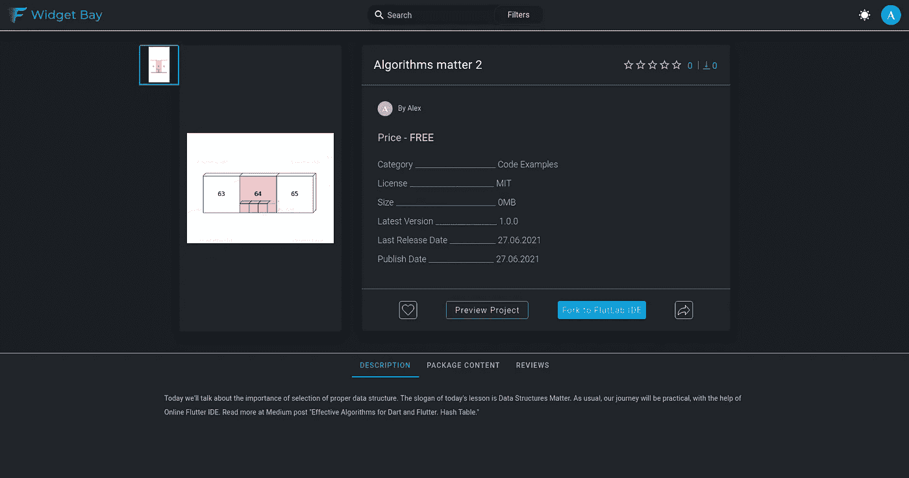

单击“Fork to FlutLab IDE”。现在，您应该会在仪表板中看到一个名为“算法至关重要 2”的新颤振项目:

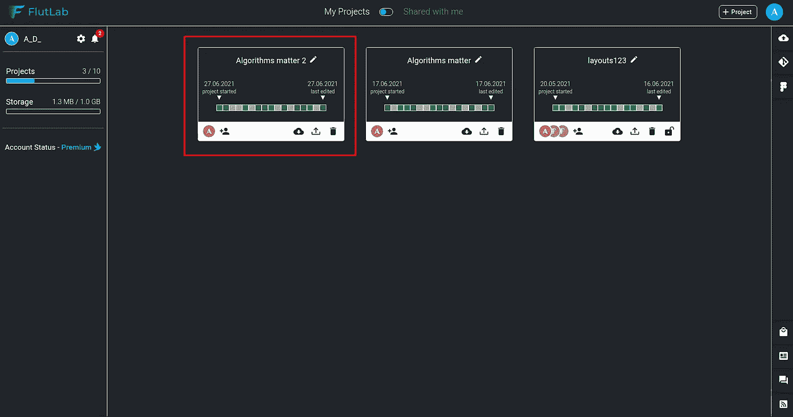

打开此项目并运行 Web build:

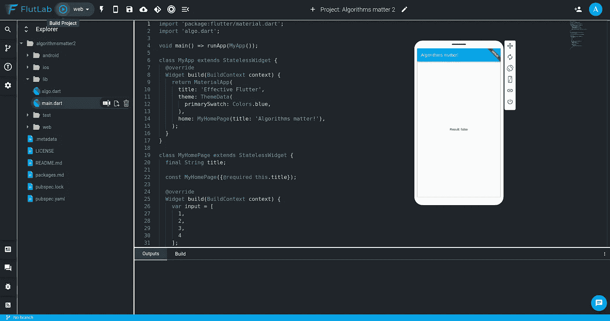

现在我们为我们的旅程做好了准备！

我们将尝试编写一个非常简单的应用程序。这个应用程序将在数组中搜索一些数字。让我们看看我们的 Flutter 应用程序的**构建**方法:

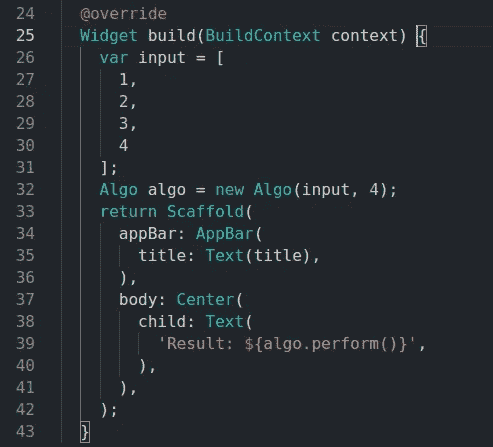

它从**算法**类创建一个**算法**对象。**算法**的构造器有两个参数:

*   要搜索的数组
*   要查找的值

然后我们的应用程序在应用程序屏幕中央的文本中呈现 **algo.perform()** 的结果。老实说，它在搜索方面做得很糟糕——它说在数组[1，2，3，4]中没有找到数字 4。

让我们看看位于 main.dart 附近的 **algo.dart** 文件:

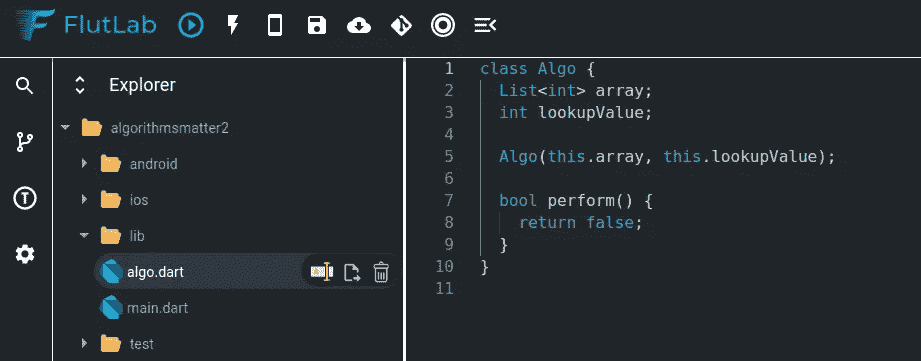

现在一切都清楚了！Algo 已经硬编码**执行**方法。它总是返回错误的。

让我们用最简单的方法来解决这个问题:

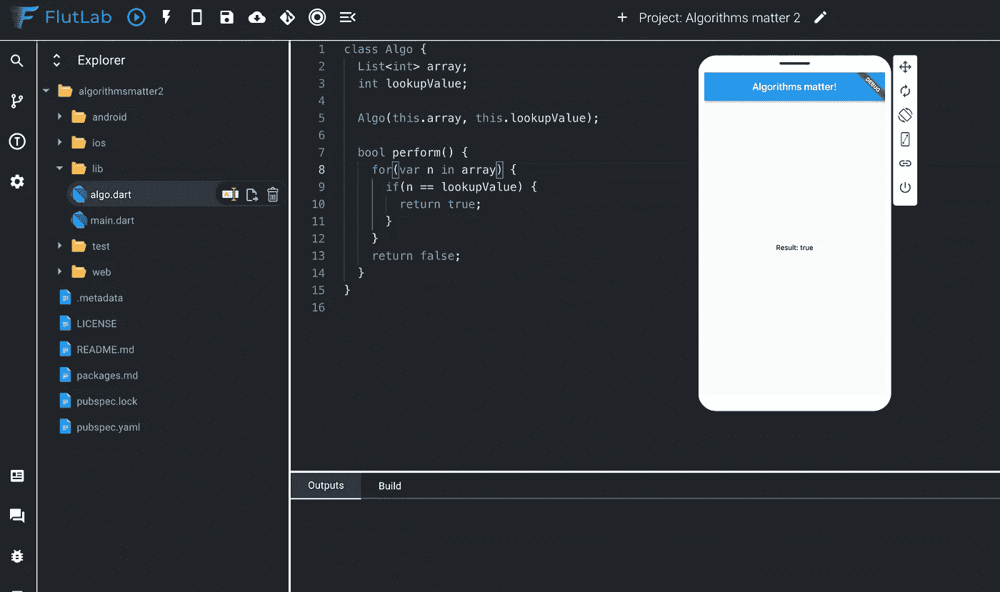

这看起来是一个合适的解决方案。让我们用这个按钮来运行我们的单元测试:

这里我们可以看到一些问题:

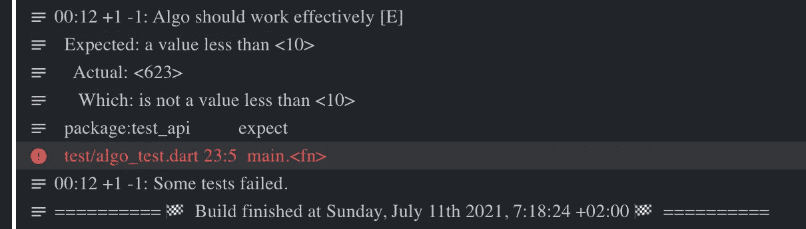

下面是失败的测试:

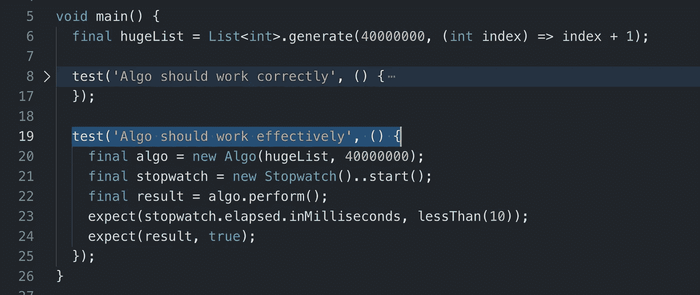

因此，我们期望查找函数的执行速度快于 10 毫秒，但它用了 623 毫秒。

问题的解决方法是改变我们查找的数据结构。

让我们改变我们的实现，在**中使用 **Set** 而不是**List**perform**方法:

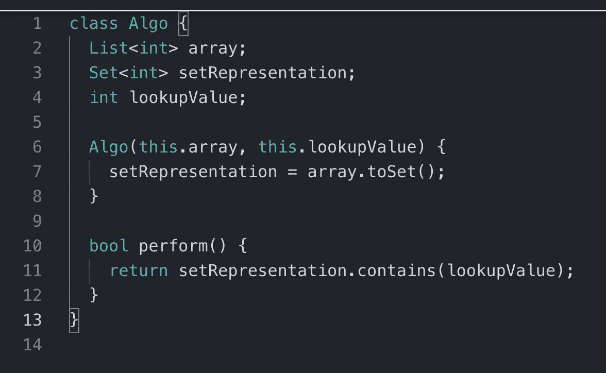

如果我们现在运行我们的单元测试——它们将会成功通过。

我们来分析一下 **Set** 为什么查找这么快。但是首先，让我们使用**列表**集合来估计我们第一次实现查找的时间复杂度。平均来说，对于 N 个元素，我们需要花 N/2 步才能找到列表中的值。我们只是从第一个元素到最后一个元素，一步一步来。它是 **O(n)** 算法，因为我们必须丢弃所有的常数([详见第 1 部分](/effective-algorithms-for-dart-and-flutter-big-o-874627c433ba))。

什么是野兽，谁能允许**O①**搜索呢？我们看到这个野兽是一个**集合**集合。更具体地说，一个**散列集**。

但是在深入讨论 Hash 之前，让我们从另一个角度来看看 out **List** 数据结构。姑且称之为索引表吧。我们可以画一些列表，比如**【5，2，6，4】**为两列的表格:**指标**和**值**:

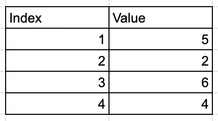

其中 index —是我们的值在列表中的位置。事实上，有了某个值的索引，我们可以用 **O(1)** 的时间复杂度得到它——我们只需跳转到相应的存储单元即可。事实上，因为我们所有的元素都有相同的大小(整数值)——我们可以用索引乘以单个元素的大小。

如果我们可以将该值用作自身的**键**呢？我们刚刚发现了哈希集的主要思想！

想象一个特殊的数学函数，它可以得到值，比如说， **5** ，并计算它在我们的集合中的位置。这个函数有一个特殊的名字: **Hash** 。哈希函数可以非常简单。例如，它可以是一个简单的算法:

*   获取值的字符串表示形式
*   将该字符串拆分为单个字符
*   将字符映射到它们的 ASCII 数字
*   返回这些 ASCII 数字的总和

所以，对于我们的简单值 **5** ，我们得出一个数字 **53** (google ASCII 表)。这是我们自己的散列集实现中的值为 5 的地址。

当然，生产哈希函数要复杂得多。它们结合了计算速度和有效的碰撞算法。是的，碰撞会发生！想象两个值:53 和 35。我们自己简单的哈希函数会将它们放入哈希集中的单个**桶**中。是的，碰撞解决方案需要桶内的 O(n)交互。好的散列函数会将你的值均匀地放在足够小的内存空间中。

在这一点上，你应该保持对哈希集如何工作以及为什么它对搜索算法如此重要的一般性理解。

你可以跳转到 FlutLab 并使用本课的代码，阅读一些关于 Dart 集合的方法的资料。

结论。算法和数据结构是一个复杂而广泛的知识库。但是，我们可以在实践中学习。它的方法和术语的关键的、小的子集允许我们编写更有效的代码并通过编码面试。今天我们学习了如何使用适当的数据结构:散列集来加速搜索算法。我们已经知道散列函数是什么了。

待续..