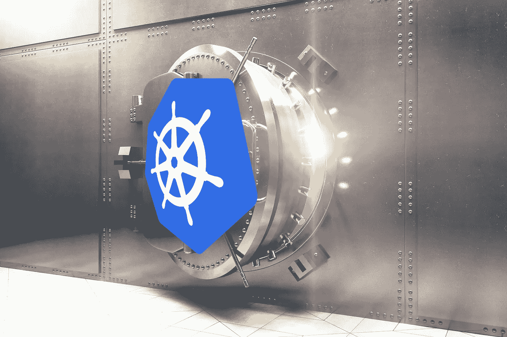

# Vault 和 Kubernetes 的有效秘密

> 原文：<https://itnext.io/effective-secrets-with-vault-and-kubernetes-9af5f5c04d06?source=collection_archive---------0----------------------->

# 介绍

Kubernetes 是容器编排的事实上的标准，HashiCorp 的 Vault 是秘密管理的事实上的标准。现在的问题是:如何将这些技术结合起来，在 Kubernetes 应用程序中使用中央保险库实例中的秘密？

一个解决方案是使用 [AppRole](https://www.vaultproject.io/docs/auth/approle.html) auth 方法。Boostport 提供了 Kubernetes 中 AppRoles 的出色集成。另一种可能是使用 [Kubernetes auth 方法](https://www.vaultproject.io/docs/auth/kubernetes.html)。这种身份验证方法在 Vault 和您的 Kubernetes 集群之间建立信任关系，因此您可以使用服务帐户对 Vault 进行身份验证。您可以使用带有 Kubernetes 的 [Vault 代理来获取和更新认证令牌。](https://learn.hashicorp.com/vault/identity-access-management/vault-agent-k8s)

在本文中，我将向您展示如何使用一些 Go 助手工具来实现相同的功能，这些工具可以验证和更新令牌，甚至更进一步，将预定义的机密子集从 Vault 同步到 Kubernetes。

*等级:高级*

# 先决条件

为了简单起见，我做了一些选择:

*   Kubernetes 集群可以通过许多不同的方式建立。通常，`minikube`用于测试或开发目的。我将使用`kubeadm`,因为建立一个真正的*集群非常简单。*
*   在 Kubernetes 中，将使用`default`名称空间。
*   保险库将以*开发*模式运行。*生产中不要这样用！*确保相应地设置环境变量`VAULT_ADDR`。
*   Ubuntu 将用于所有代码示例。它们已经在 GCE 上的单个 Ubuntu 18.10 VM 上经过测试，具有 2 个 vCPUs 和 7.5 GB。(看看 GCP 300 美元[免费等级](https://cloud.google.com/free/)，随便说说……)
*   除非另有说明，否则将使用 Bash。

# 库伯内特斯

让我们从一个简单的测试集群开始。下面是单节点安装的安装说明。

# 跳跃

## 装置

Vault 安装非常简单:下载并解压二进制文件:

## 运行 Vault 服务器

我们将在*开发*模式下运行一个 Vault 服务器。同样，这非常简单。请注意，当启动一个 dev 服务器时，一个根令牌将被写入`$HOME/.vault-token`，即使对于根用户也是如此。Vault 进程将被放在带有`&`符号的背景中，这样我们就可以继续使用同一个 shell。

## 配置 Kubernetes 身份验证方法

现在，我们必须确保 Kubernetes 能够通过启用 Kubernetes auth 方法与 Vault 通信。这在 Kubernetes 和 Vault 之间建立了信任关系。命名角色`vault-demo-role`将映射策略并定义一个 TTL。

因为我们使用`kubeadm`建立了我们的 Kubernetes 集群，所以很容易找到属性`kubernetes_ca_cert`的认证中心(CA)商店。当使用云提供的 Kubernetes 安装时，这可能有点困难。

## 基于角色的访问控制(RBAC)

在 Kubernetes 方面，我们现在必须建立相应的 RBAC 的东西。首先，我们将创建一个名为`vault-serviceaccount`的服务帐户。然后，我们将添加一个名为`vault-closterrolebinding`的集群角色绑定，这样我们新创建的服务帐户就可以使用默认的集群角色`system:auth-delegator`执行委托身份验证请求。角色`vault-secretadmin-role`和角色绑定`vault-secreatadmin-rolebinding`也被绑定到`vault-serviceaccount`，这样我们就能够同步秘密。

让我们应用这些清单:

准备完毕。现在我们可以开始我们的用例了。

# 用例

我们将涵盖三个用例:

*   第一个示例将演示如何通过使用 init 容器对 Vault 进行身份验证并获取身份验证令牌。
*   第二个例子将演示如何使用 sidecar 容器更新这个令牌。
*   第三个例子将演示如何将秘密从 Vault 同步到 Kubernetes。

这三个用例都基于我在 PostFinance 的同事构建的三个 Docker 图像。特别要感谢 Marc Sauter，他受 Seth Vargo 作品的启发编写了最初的实现。这三张图片都可以在 [Docker Hub](https://hub.docker.com/u/postfinance) 上找到，它们都包含小 Go 助手工具，源代码可以在 [GitHub](https://github.com/postfinance/vault-kubernetes) 上找到。

## 使用 Init 容器进行身份验证

第一个例子将展示`vault-kubernetes-authenticator`图像的用法(简称 *auther* )。auther 在 init 容器中运行，使用服务帐户`vault-serviceaccount`对 Vault 进行身份验证，并将 Vault 身份验证令牌写入`/home/vault/.vault-token`。

让我们应用这个清单，然后我们将做一些测试来验证一切工作正常。

## 用边车更新令牌

第二个例子将展示`vault-kubernetes-token-renewer`图像的用法(简称 *renewer* )。renewer 在 sidecar 容器中运行，定期检查 TTL，并相应地更新身份验证令牌。

让我们同样应用此清单，并再次进行一些验证。(我删除了之前的部署。)

## 将机密从 Vault 同步到 Kubernetes

第三个例子将展示`vault-kubernetes-synchronizer` (简称 *syncer* )的用法。同步器可以以不同的方式使用。在演示中，Kubernetes 作业将用于从预定义的路径一次性同步 Vault 机密。保险库机密将被写入相应的 Kubernetes 机密。

同样，让我们应用这个清单，并检查一切是否按预期工作:

同步程序也可以在 Kubernetes cron 作业中使用，以定期同步 Vault 机密，或者在 Kubernetes 部署中的另一个 init 容器中使用，以便机密总是最新的。

请注意，Kubernetes 的秘密没有得到很好的保护。默认情况下，它们只是 base64 编码和存储，就像 Seth Vargo 在最近的 FOSDEM [演讲](https://fosdem.org/2019/schedule/event/base64_not_encryption/)中指出的那样。您应该启用[静态秘密数据的加密](https://kubernetes.io/docs/tasks/administer-cluster/encrypt-data/)。另外，请确保您只同步那些被您的 Kubernetes 应用程序有效使用的机密，这些机密受到相应的保管库策略和指定角色的保护。除此之外，这种方法允许您以云本地的方式使用秘密。您的应用程序不必直接访问 Vault，机密可以作为环境变量注入。

# 结论

Kubernetes 和 Vault 这两种技术可以通过组合和集成以最佳方式使用。这种整合很重要，但仍然是可行的。在本文中，我向您展示了如何实现这种集成，希望对您也有所帮助。

您可能会问自己，既然可以使用官方的 Vault 映像来运行代理以实现相同的目的，为什么还要使用一些第三方映像。原因是:存储库代理需要一个配置文件而不是环境变量，这意味着您必须管理另一个配置映射。并且代理当前无法同步机密。此外，图像重量更轻。官方保险库映像的大小约为 100 MB。auther 和 renewer 映像大约为 10 MB，syncer 大约为 40 MB。