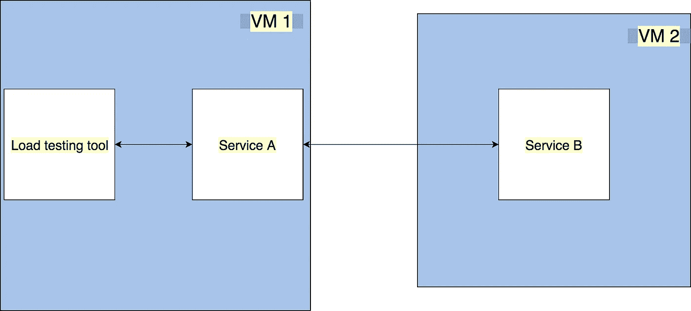
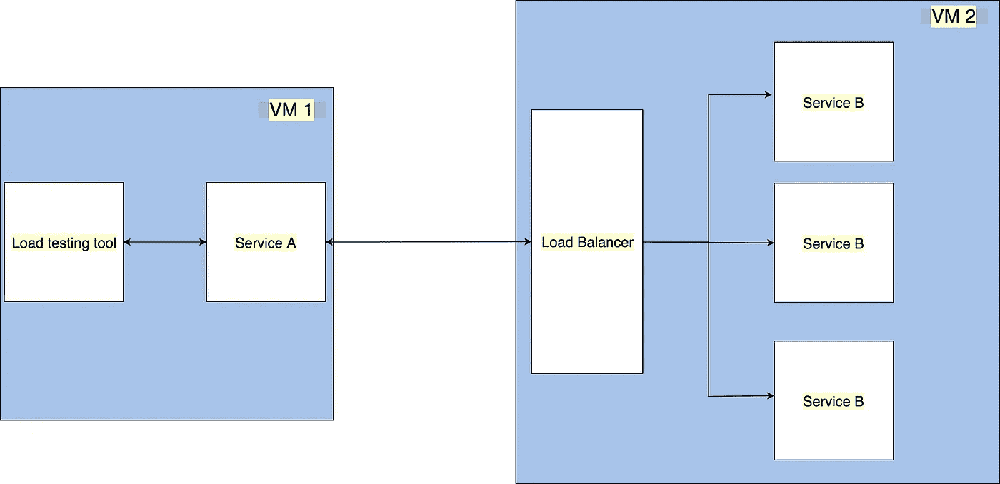

# 微服务之间的有效通信

> 原文：<https://itnext.io/effectively-communicate-between-microservices-de7252ba2f3c?source=collection_archive---------0----------------------->

**在 http/1.1 和 gRPC 之间选择。TL；DR:使用 gRPC**

有效沟通

微服务之间的通信方式会影响应用程序的性能和可伸缩性。服务之间的通信可以是同步的，也可以是异步的。在这篇博文中，我们将关注同步。我们有两个共同的协议

*   **HTTP/1.1** :“默认”HTTP 调用
*   **gRPC:** 高性能远程过程调用(RPC 框架)。[*grpc . io*](https://grpc.io/)*有一个全面的文档以及它是如何工作的。*

*让我们看一些样本代码，并运行一些性能测试来挑选我们的选择。*

# *非集群模式*

*让我们从小处着手，尝试让一个微服务与另一个微服务对话。*

**

*简单的应用程序架构图*

*我们的应用程序包含以下组件*

*   ***负载测试工具:** [jMeter](https://jmeter.apache.org/)*
*   *服务 A: 向服务 b 发出请求并返回响应。*
*   ***服务 B:** 在所有 API 延迟 10ms 后，用静态 JSON 进行回复*
*   ***虚拟机:**这两个虚拟机都是 Amazon EC2 T2 . x 大型机器*

# *HTTP/1.1*

*这是我们使用任何 HTTP 客户端库(如 [axios](https://github.com/axios/axios) 、 [superagent](https://github.com/visionmedia/superagent) )时的默认请求。*

*让我们创建`ServiceB`来实现我们的 API。*

*具有 HTTP/1.1 实现的服务 B*

*接下来，我们创建用 HTTP/1.1 调用`ServiceB`的`ServiceA`*

*具有 HTTP/1.1 实现的服务 A*

*随着这两个服务的运行，我们现在可以启动我们的`jMeter`来运行一些性能测试。我们将使用 50 个用户，每个用户将有 2000 个请求。正如我们在下面的截图中看到的，我们的中位数是`37ms`。*

**

*非集群模式下 HTTP/1.1 的性能结果*

# *gRPC*

*gRPC 默认使用[协议缓冲区](https://developers.google.com/protocol-buffers/docs/overview)。除了`serviceA`和`serviceB`，我们还需要一个`proto`文件来定义我们的远程调用。*

*公开的 RPC 的原型文件*

*让我们再次实现`serviceB`，这次使用`gRPC`*

*实施 gRPC 的服务 B*

*需要注意的几件事:*

*   *我们在`line 4`创建`grpc`服务器*
*   *我们在`line 16`的服务器上增加了一项服务*
*   *我们在第 23 行绑定`port`和`credentials`*

*`serviceA`使用 gRPC 的实现如下*

*实施 gRPC 的服务 A*

*需要注意的几件事:*

*   *我们在`line 4`创建`grpc`客户端*
*   *我们在`line 6`进行远程呼叫*

*让我们再次运行 jMeter 工具测试。*

**

*gRPC 在非集群模式下的性能结果*

*从这些数据中我们可以看出，`gRPC`比普通的 HTTP/1.1 请求快 27%*

# *集群模式下的应用架构*

**

*应用架构*

*如果您在生产环境中运行任何东西，很可能您正在运行任何给定服务的许多实例。在这种情况下，我们进行了以下更改:*

*   *在不同的端口上运行我们服务的三个实例*
*   *我们使用 NGINX 作为负载平衡器*

# *HTTP/1.1*

*在服务方面不需要任何改变。我们所需要做的就是配置我们的`nginx`来负载平衡`serviceB`的流量。我们可以将`/etc/nginx/sites-available/default`修改成这样*

*使用 HTTP/1.1 的 nginx*

*我们现在可以启动我们的 3 个`serviceB`实例，并运行我们的性能测试*

**

*HTTP/1.1 在集群模式下的性能结果*

# *gRPC*

*最近，nginx 版本 1 增加了对 gRPC 的支持..13.10 。因此，我们需要获得最新的版本，因为默认的`sudo apt-get install nginx`将不起作用。*

*我们没有在[集群](https://nodejs.org/api/cluster.html)模式下使用节点，因为 gRPC[不受](https://github.com/grpc/grpc/issues/6976)支持。*

*按照以下步骤获取最新的`nginx`*

*获取最新的 nginx*

*我们还需要 ssl 证书。我们可以使用 [openSSL](https://www.openssl.org/) 创建自签名证书*

*创建自签名证书的命令*

*接下来，我们需要修改我们的`/etc/nginx/sites-available/default`文件来开始使用`gRPC`。*

*带 gRPC 的 nginx*

*就是这样。让我们再次运行我们的性能测试*

**

*gRPC 在非集群模式下的性能结果*

*正如我们所见,`gRPC`比 HTTP/1.1 快 31%*

# *结论*

*gRPC 很快。在上面的测试中，我们通过改变我们之间的交流方式，比 HTTP/1.1 多了 31% 。*

*完整的源代码可以在 [GitHub](https://github.com/abhinavdhasmana/interserviceCommunication) 上找到*