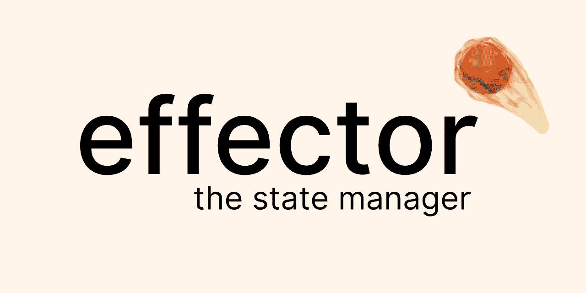

# 效果器——你应该试试的状态管理器

> 原文：<https://itnext.io/effector-state-manager-you-should-give-a-try-b46b917e51cc?source=collection_archive---------1----------------------->



嘿伙计们！我知道已经有一年多没有我的消息了。今年我很努力，也很努力学习，我的观点已经改变了(是的，我现在用 React😃)

今天我想分享我半年前发现并非常喜欢的图书馆！

这是 [**效应器**](https://effector.now.sh/)——应用程序状态管理器，它最符合我对组织业务逻辑的看法。

让我们从这个想法开始，然后我会展示一些简单的例子。

# 核心概念

*   分散商店**整体商店>整体商店** 处理简单的商店，然后将它们组合成各种形状，比将巨大的商店分成各个部分要简单得多
*   **商店应该尽可能简单**
    你不应该害怕在你的工作应用中增加一个商店
*   **直观的 API**
    少量的基础原理在不同的情况下被重用，减少了进入门槛。如果你知道`.watch`在事件中是如何工作的，你可能已经知道`.watch`在商店中是做什么的。
*   **将您的业务逻辑移出视图** 让组件变得简单*就像是“入门”示例*而效应器在业务逻辑上工作
*   **通过设计排除性能问题**
    效应器旨在仅通知受试者进行更改。它保证你的应用程序不会因为一些微小的状态变化而突然重新呈现
*   **无依赖性，框架不可知**
    效应器不依赖 React、RxJS 或其他任何东西。它仅使用符号可观察的聚合填充与可观察的兼容

# Todo 应用程序入门

我们喜欢 todos，对吧？所以让我们做一些商店。我不会深究所有细节，但会让你了解我们这里使用的最新信息。

开始前，安装效应器:

```
npm install effector effector-react
# or
yarn add effector effector-react
```

要创建**商店**，使用`createStore`功能。第一个参数是初始值
你也可以使用`store.map(cb)`方法创建**计算存储**

如何**改变**商店**状态**？效果器使用**事件**为
创建**事件**，使用`createEvent`功能:

并且，对于这个例子，我们还需要一件事情——处理表单提交。
我增加了一个事件，在代码的末尾你可以看到多了一个观察者

因此，我们的业务逻辑层已经准备好了。观看时间:

这就是我现在要做的，因为我想让它变得简单。
code sandbox 上的这个例子: [**点击这里**](https://codesandbox.io/s/l3r8owl94l)

# 还有什么？

## 合并商店

当然，您需要将商店组合成各种形状，或者进行一些自定义组合。

效应器对此有`combine`

示例:

## 效果

对于像获取数据这样的副作用，效应器有**效果**

*   效果就像事件一样，但是它们也有被调用的`.use(cb)`方法
*   影响也有`effect.done`和`effect.fail`事件

示例:

## 将可观测量转换为事件

我不是 RX 粉丝，但是如果你愿意，你可以使用`fromObservable`助手将可观察的东西转换成事件

感谢您阅读这篇文章。在未来，我想写一系列的文章，举例说明如何用 Effector 解决问题。但是如果你了解我，我最好不要做出承诺😄

项目地点:[https://effector . now . sh](https://effector.now.sh/)
项目 GitHub:[https://github.com/zerobias/effector](https://github.com/zerobias/effector)