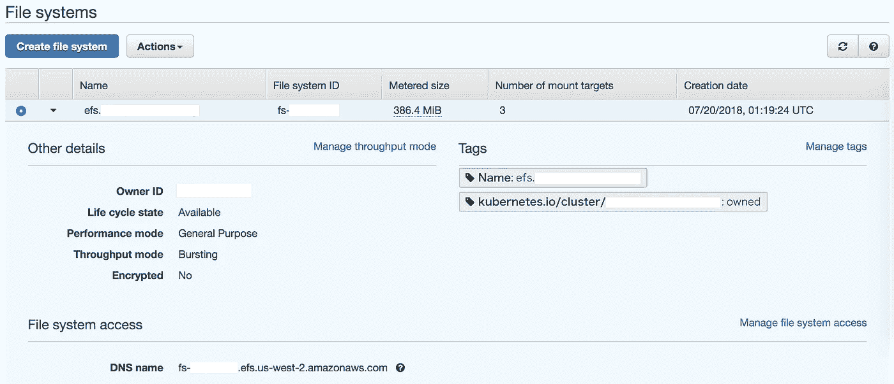
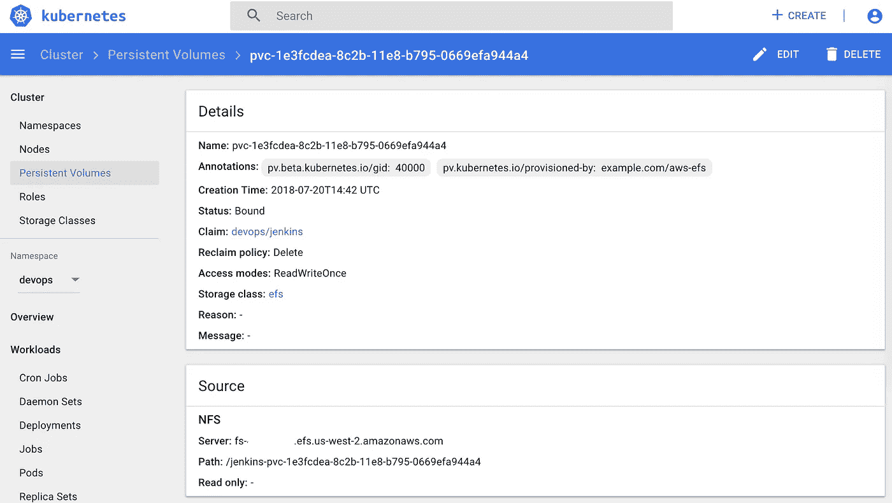

# 自动气象站 Kubernetes 上的 EFS 持久卷

> 原文：<https://itnext.io/efs-persistent-volumes-on-aws-kubernetes-193e0035bbfb?source=collection_archive---------0----------------------->

# TL；速度三角形定位法(dead reckoning)

Kubernetes 默认支持 [**EBS** 持久卷](https://kubernetes.io/docs/concepts/storage/storage-classes/#aws)。它还通过外部 [efs-provisioner](https://github.com/kubernetes-incubator/external-storage/tree/master/aws/efs) 支持 **EFS** 持久性卷。

本文介绍了 EFS 持久性卷(EFS PVs ),并解释了我们如何使用它和迁移到它。

# EBS vs EFS

文章“[何时选择亚马逊 EFS](https://aws.amazon.com/efs/when-to-choose-efs/) ”称:

> 亚马逊 EFS 提供共享文件存储，用于 AWS 云和本地服务器中的计算实例。需要共享文件访问的应用程序可以使用亚马逊 EFS 进行可靠的文件存储，同时为数千个客户端提供高聚合吞吐量。
> 
> Amazon EBS 是一种云块存储服务，提供从单个 Amazon EC2 实例到专用存储卷的直接访问。需要对单个主机进行持久专用块访问的应用程序可以使用 Amazon EBS 作为高可用、低延迟的块存储解决方案。

## 赞成的意见

EBS PV 仅提供`ReadWriteOnce`访问模式。EFS 光伏也提供了`ReadWriteMany`接入模式。

可以从多个可用性区域访问 EFS 文件系统，这对多 AZ 集群很有价值。

你只需支付使用过的数量。当很难估计一个应用程序的使用量时，您可以选择 EFS。

例如，您请求 100 GB 的卷，但应用程序仅使用 10 GB 的数据，EBS 和 EFS 的成本如下:

*   EBS 100 GB 每月花费 10 美元。(每月 0.1 美元/GB)
*   EFS 10 GB 每月费用为 3 美元。(每月 0.3 美元/GB)

## 骗局

EFS 文件系统是 NFS 文件系统。一些应用程序(如数据库)需要块设备，可能无法使用 EFS 文件系统。

EFS 不支持快照。您需要为备份设置一个 rsync 作业。

# 构建堆栈

## 1.创建 EFS 文件系统

EFS PVs 需要以下资源。

*   EFS 文件系统
*   EFS 在每个 AZ 安装目标
*   EFS 山目标的安全小组

您可以在 AWS 管理控制台上创建资源。



AWS 管理控制台中的 EFS

如果您正在使用 kops 和 Terraform，您可以使用标签引用 Terraform 中的 kops 托管资源，如下所示:

```
**data** "aws_vpc" "kops_vpc" {
  tags = "${map("kubernetes.io/cluster/hello.k8s.local", "owned")}"
}**data** "aws_subnet_ids" "kops_subnets" {
  vpc_id = "${data.aws_vpc.kops_vpc.id}"
}**data** "aws_security_group" "kops_nodes" {
  tags {
    Name = "nodes.hello.k8s.local"
  }
}**resource** "aws_efs_file_system" "efs_provisioner" {
  tags {
    Name = "efs.hello.k8s.local"
  }
}**resource** "aws_efs_mount_target" "efs_provisioner" {
  count = "${length(data.aws_subnet_ids.kops_subnets.ids)}"
  file_system_id = "${aws_efs_file_system.efs_provisioner.id}"
  subnet_id = "${data.aws_subnet_ids.kops_subnets.ids[count.index]}"
  # This example uses the nodes security group
  # but you should create a dedicated one for better security.
  security_groups = ["${aws_security_group.k8s_nodes.id}"]
}**output** "efs_provisoner_fsid" {
  value = "${aws_efs_file_system.efs_provisioner.id}"
}
```

参见[int 128/kops-terra form-starter](https://github.com/int128/kops-terraform-starter)中的完整配置。

然后应用配置。

```
terraform apply
```

## 2.部署 efs-provisioner

你可以从[舵图](https://github.com/helm/charts/tree/master/stable/efs-provisioner)中部署 [efs-provisioner](https://github.com/kubernetes-incubator/external-storage/tree/master/aws/efs) 。

这里我们使用 [Helmfile](https://github.com/roboll/helmfile) 并创建`helmfile.yaml`如下:

```
releases:
  - name: efs-provisioner
    namespace: kube-system
    chart: stable/efs-provisioner
    values:
      - efsProvisioner:
          efsFileSystemId: {{ requiredEnv "efs_provisoner_fsid" }}
          awsRegion: {{ requiredEnv "AWS_DEFAULT_REGION" }}
          path: /
          storageClass:
            name: efs
```

然后部署它。

```
**export** AWS_DEFAULT_REGION=us-west-2
**export** efs_provisoner_fsid="$(terraform output efs_provisoner_fsid)"
helmfile sync
```

您可以将默认存储类别从`gp2`切换到`efs`，如下所示:

```
kubectl patch storageclass efs -p '{"metadata": {"annotations": {"storageclass.kubernetes.io/is-default-class": "true"}}}'kubectl patch storageclass gp2 -p '{"metadata": {"annotations": {"storageclass.beta.kubernetes.io/is-default-class": null}}}'
```

## 3.部署应用程序

这里我们从[舵图](https://github.com/helm/charts/tree/master/stable/jenkins)部署詹金斯举例。它通过`Persistence.StorageClass`参数接受一个存储类。

通过以下`helmfile.yaml`部署詹金斯:

```
releases:
  - name: jenkins
    namespace: devops
    chart: stable/jenkins
    values:
      - Master:
          ServiceType: ClusterIP
          HostName: jenkins.dev.example.com
        Persistence:
          StorageClass: efs
```

然后，应该像这样创建一个 EFS PV:



Kubernetes 仪表板

请注意，当您运行`helm delete jenkins`时，EFS PV 将被删除。

为了避免删除，您需要将**回收策略**设置为`Retain`，如下所示:

```
kubectl patch pv pvc-1e3fcdea-8c2b-11e8-b795-0669efa944a4 -p '{"spec": {"persistentVolumeReclaimPolicy": "Retain"}}'
```

# 将数据从 EBS 迁移到 EFS

如果您已经有一个带有 EBS PV 的应用程序，您可以将其迁移到 EFS PV。本节展示了迁移步骤。

## 1.创建新的 PVC

使用`efs`存储类创建一个新的 PVC。

```
apiVersion: v1
kind: PersistentVolumeClaim
metadata:
  name: **new-pvc**
spec:
  accessModes:
    - ReadWriteOnce
  resources:
    requests:
      storage: 8Gi
  storageClassName: efs
```

然后将创建一个 PV 和 EFS 装载。您也可以通过 Helm 使用新的 PVC 部署应用程序。

现在 Kubernetes 集群上有以下资源。

*   新 app →新 PVC → EFS PV → EFS mount
*   旧 app →旧 PVC → EBS PV → EBS 卷

## 2.复制文件

通过将副本设置为 0 来停止应用程序。

```
kubectl scale --replicas=0 deployment/new-appkubectl scale --replicas=0 deployment/old-app
```

确保没有应用程序的 pod 正在运行。

创建迁移作业。

```
apiVersion: batch/v1
kind: Job
metadata:
  name: migration
spec:
  template:
    metadata:
      name: migration
    spec:
      containers:
        - name: migration
          image: alpine
          command: ["/bin/sh"]
          args:
            - -c
            - apk add rsync && rsync -av --delete /old/ /new/ && ls -la /new
          volumeMounts:
            - name: old-volume
              mountPath: /old
              readOnly: true
            - name: new-volume
              mountPath: /new
      volumes:
        - name: old-volume
          persistentVolumeClaim:
            claimName: **old-pvc**
        - name: new-volume
          persistentVolumeClaim:
            claimName: **new-pvc**
      restartPolicy: Never
  backoffLimit: 0
```

复制所有文件可能需要很长时间。最后，EBS PV 和 EFS PV 有相同的文件。

## 3.使用新的 PVC 启动应用程序

通过将副本数设置为 1 或更多来启动应用程序。

```
kubectl scale --replicas=1 deployment/**new-app**
```

应用程序应该支持迁移的数据。

## 4.删除旧 PVC 的应用程序

删除旧应用程序的资源。

```
kubectl delete deployment/**old-app** pvc/**old-pvc**
```

如果应用程序由 Helm 管理，只需删除发布即可。

```
helm delete --purge old-app
```

现在在 Kubernetes 集群上有以下资源。

*   新 app →新 PVC → EFS PV → EFS mount

# 结论

您可以通过设置 EFS 文件系统和 efs-provisioner 来使用 EFS PVs。您还可以通过创建迁移作业从 EBS PVs 迁移到 EFS PVs。