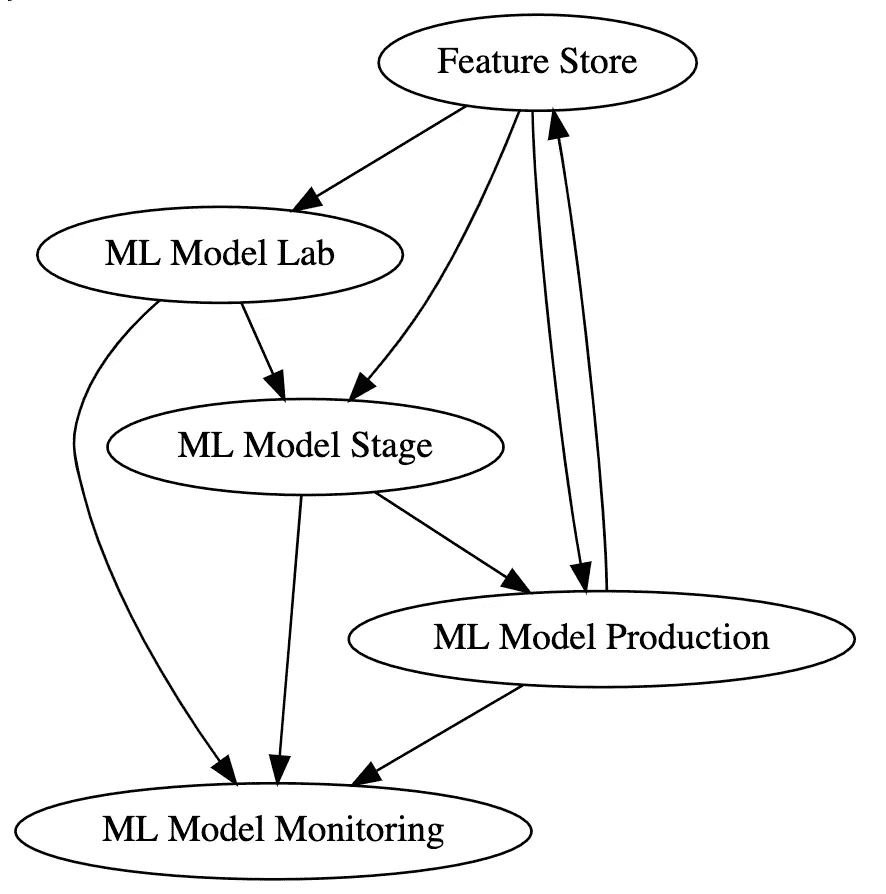
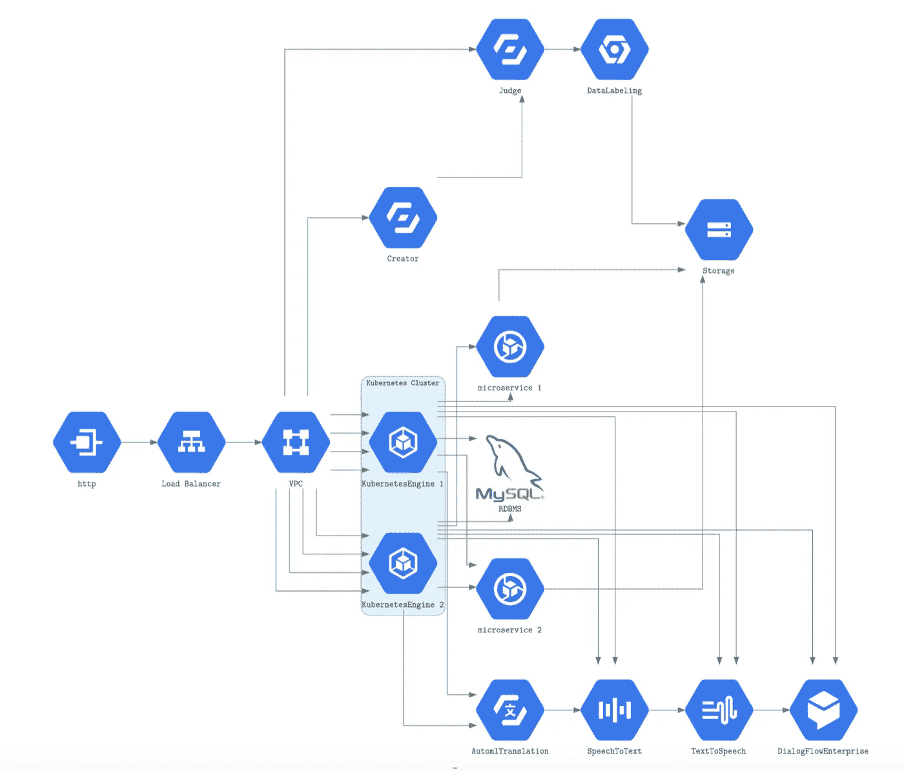
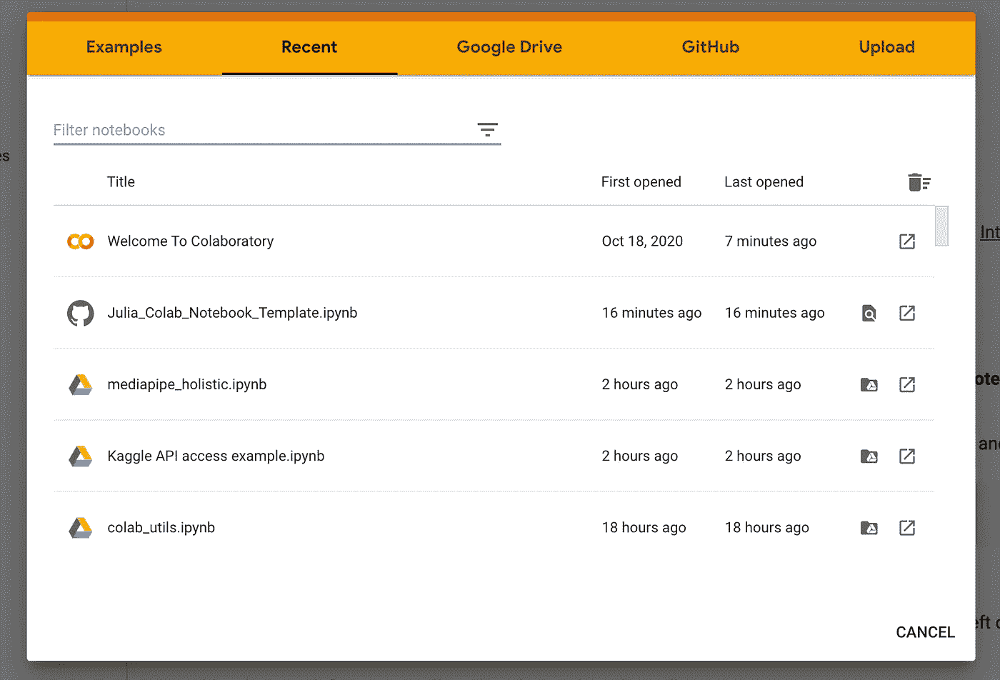

# Colab 生产力的 18 个 Python 片段

> 原文：<https://itnext.io/eighteen-python-snippets-for-colab-71269ac172e5?source=collection_archive---------2----------------------->

我分享我们团队使用的 Colab(和 Jupyter)笔记本 Python 代码实用程序。


图一。Google Colab 的一些功能。来源；[去飞溅](https://medium.com/@Ali_Shah/google-colab-what-is-google-colaboratory-google-colab-notebook-how-to-use-google-colab-8df939307cd9)

# 概述

如果您没有 Google 帐户，请创建一个。

如果你没有一个 Colab 账户，通过[用你的谷歌账户](https://colab.research.google.com/)登录来创建一个 Colab 账户。

在你的 Google Drive 上使用同一个 Google 账户。

这些是我们团队使用的一些 Colab(和 Jupyter)笔记本 Python 代码片段。

1.  重新加载任何。已更改的 py 文件；
2.  安装大多数 Python 包；
3.  显示基于 matplotlib 的 Colab 图形内联；
4.  显示已安装软件包的数量并列出所有已安装软件包；
5.  显示基本计算图像属性。；
6.  显示所有计算设备。；
7.  在您的 Colab 笔记本实例中安装您的护目镜驱动器；
8.  在 Google Drive 上创建、写入和读取文件；
9.  列出 Google Drive 上的顶级文件；
10.  正在导入。将文件复制到 Google Colab
11.  如何在 Colab 中使用 Git
12.  如何在 Colab 中使用 Tensorboard
13.  访问 Kaggle 数据集；
14.  在 Colab 中嵌入 Julia 语言；
15.  用 Graphviz 画图。；
16.  用图表画云厂商架构有向无环图。

[如果不熟悉谷歌，Colab 看了介绍。](https://towardsdatascience.com/ten-fast-text-preprocessing-benchmarks-on-cpu-gpu-and-tpu-2cd2653582f6)Colab 的显著特点是:

1.  基于朱庇特。
2.  直接访问所有谷歌云平台(GCP)服务；
3.  获得英伟达 T4，P100，V100，以及更多的图形处理器，因为他们被释放。截至这篇博客的日期，您已经可以访问一个单一的 GPU。
4.  访问单个谷歌 TPU。

使用各种 Colab 处理器进行文本处理的基准研究:

[](https://towardsdatascience.com/ten-fast-text-preprocessing-benchmarks-on-cpu-gpu-and-tpu-2cd2653582f6) [## CPU、GPU 和 TPU 上的十个快速文本预处理基准

### 我们展示了十种不同空间文本预处理操作的 Python 代码和基准。

towardsdatascience.com](https://towardsdatascience.com/ten-fast-text-preprocessing-benchmarks-on-cpu-gpu-and-tpu-2cd2653582f6) 

## 重新加载任何。已更改的 py 文件。

```
%load_ext autoreload
%autoreload
```

## 安装大多数 Python 包。

```
!pip install <package>
```

## 显示基于 matplotlib 的 Colab 内联图形。

```
import matplotlib
%matplotlib inline
import matplotlib.pyplot as plt
```

## 显示已安装的软件包数量，并列出所有已安装的软件包。

```
!pip install conda
packages = !conda list
len(packages),packages
```

=>

```
(392,
 ['Package                       Version        ',
  '----------------------------- ---------------',
  'absl-py                       0.10.0         ',
  'alabaster                     0.7.12         ',
  'albumentations                0.1.12         ',
  'altair                        4.1.0          ',
  'argon2-cffi                   20.1.0         ',
.
.
.
  'wheel                         0.36.2         ',
  'widgetsnbextension            3.5.1          ',
  'wordcloud                     1.5.0          ',
  'wrapt                         1.12.1         ',
  'xarray                        0.15.1         ',
  'xgboost                       0.90           ',
  'xkit                          0.0.0          ',
  'xlrd                          1.1.0          ',
  'xlwt                          1.3.0          ',
  'yellowbrick                   0.9.1          ',
  'zict                          2.0.0          ',
  'zipp                          3.4.0          '])
```

## 显示基本计算图像属性。

```
!cat /proc/cpuinfo
```

=>

```
processor	: 0
vendor_id	: GenuineIntel
cpu family	: 6
model		: 79
model name	: Intel(R) Xeon(R) CPU @ 2.20GHz
stepping	: 0
microcode	: 0x1
cpu MHz		: 2200.000
cache size	: 56320 KB
physical id	: 0
siblings	: 2
core id		: 0
cpu cores	: 1
apicid		: 0
initial apicid	: 0
fpu		: yes
fpu_exception	: yes
cpuid level	: 13
wp		: yes
flags		: fpu vme de pse tsc msr pae mce cx8 apic sep mtrr pge mca cmov pat pse36 clflush mmx fxsr sse sse2 ss ht syscall nx pdpe1gb rdtscp lm constant_tsc rep_good nopl xtopology nonstop_tsc cpuid tsc_known_freq pni pclmulqdq ssse3 fma cx16 pcid sse4_1 sse4_2 x2apic movbe popcnt aes xsave avx f16c rdrand hypervisor lahf_lm abm 3dnowprefetch invpcid_single ssbd ibrs ibpb stibp fsgsbase tsc_adjust bmi1 hle avx2 smep bmi2 erms invpcid rtm rdseed adx smap xsaveopt arat md_clear arch_capabilities
bugs		: cpu_meltdown spectre_v1 spectre_v2 spec_store_bypass l1tf mds swapgs taa
bogomips	: 4400.00
clflush size	: 64
cache_alignment	: 64
address sizes	: 46 bits physical, 48 bits virtual
power management:
```

## 显示所有计算设备。

```
from tensorflow.python.client import device_lib
device_lib.list_local_devices()
```

=>

```
[name: "/device:CPU:0"
 device_type: "CPU"
 memory_limit: 268435456
 locality {
 }
 incarnation: 7776197507331903039, name: "/device:XLA_CPU:0"
 device_type: "XLA_CPU"
 memory_limit: 17179869184
 locality {
 }
 incarnation: 13119766555461003311
 physical_device_desc: "device: XLA_CPU device", name: "/device:XLA_GPU:0"
 device_type: "XLA_GPU"
 memory_limit: 17179869184
 locality {
 }
 incarnation: 12261128317807567470
 physical_device_desc: "device: XLA_GPU device", name: "/device:GPU:0"
 device_type: "GPU"
 memory_limit: 14640891840
 locality {
   bus_id: 1
   links {
   }
 }
 incarnation: 5905533955859115248
 physical_device_desc: "device: 0, name: Tesla T4, pci bus id: 0000:00:04.0, compute capability: 7.5"]
```

## 在 Colab 笔记本实例中打开您的 Goggle Drive。

如果你的本地电脑上没有谷歌硬盘，那么[安装](https://www.google.com/intl/en_cy/drive/download/)它。谷歌驱动是免费的。

```
from google.colab import drive
drive.mount('/gdrive')
```

=>

```
Mounted at /gdrive
```

## 在 Google Drive 上创建、写入和读取文件。

```
with open('/gdrive/My Drive/myfile.txt', 'w') as f:
  f.write('Hello Google Drive!')
!cat '/gdrive/My Drive/myfile.txt'
```

=>

```
Hello Google Drive!
```

## 列出 Google Drive 上的顶级文件。

```
!ls /gdrive/'My Drive' -lax'
```

=>

```
Colab Notebooks'
.
.
.
text_pre_processing_colab-cpu.ipynb
text_pre_processing_colab_gpu.ipynb
text_pre_processing_colab_p100.ipynb
text_pre_processing_colab-tpu.ipynb
```

## [进口。将文件复制到 Google Colab](https://stackoverflow.com/questions/48905127/importing-py-files-in-google-colab)

```
!cp drive/MyDrive/<file>.py
import <file>
```

或者

```
import sys
sys.path.append('/gdrive/<packageirectory>')
import <package>
```

## [如何在 Colab](https://stackoverflow.com/questions/48350226/methods-for-using-git-with-google-colab) 中使用 Git？

Git 安装在 Colab 中。大多数 Git 命令在 Colab 中使用 shell-escape `!`执行。例如:

```
!git clone https://github.com/<repo>
```

## 如何在 Colab 中使用 Tensorboard？

[](https://medium.com/@tommytao_54597/use-tensorboard-in-google-colab-16b4bb9812a6) [## 在 Google Colab 中使用 Tensorboard

### Google Colab 为机器学习提供免费的 GPU 加速。在神经网络训练期间，我们希望看到训练…

medium.com](https://medium.com/@tommytao_54597/use-tensorboard-in-google-colab-16b4bb9812a6) 

## [访问 Kaggle 数据集](https://colab.research.google.com/drive/1DofKEdQYaXmDWBzuResXWWvxhLgDeVyl)

Colab 笔记本一步一步地展示了如何加载 Kaggle 数据集。

[](https://colab.research.google.com/drive/1DofKEdQYaXmDWBzuResXWWvxhLgDeVyl) [## 谷歌联合实验室

### 编辑描述

colab.research.google.com](https://colab.research.google.com/drive/1DofKEdQYaXmDWBzuResXWWvxhLgDeVyl) 

## 在 Colab 中嵌入 Julia 语言。

[](https://colab.research.google.com/github/ageron/julia_notebooks/blob/master/Julia_Colab_Notebook_Template.ipynb) [## 谷歌联合实验室

### 编辑描述

colab.research.google.com](https://colab.research.google.com/github/ageron/julia_notebooks/blob/master/Julia_Colab_Notebook_Template.ipynb) 

## 用 G `raphviz.`画图

graphiz 的文档。

安装 graphviz。

```
!apt-get -y install python-pydot
!apt-get -y install python-pydot-ng
!apt-get -y install graphviz
```

用 Graphviz 创建一个图表。

```
from graphviz import Digraph
dot = Digraph(comment='MLOps Flow as a DAG')print(dot)
dot.node('D', 'Feature Store')
dot.node('L', 'ML Model Lab')
dot.node('S', 'ML Model Stage')
dot.node('P', 'ML Model Production')
dot.node('M', 'ML Model Monitoring')dot.edges(['DL', 'DS', 'DP',])
dot.edges(['LM', 'SM', 'PM',])
dot.edge('L', 'S', )#constraint='false')
dot.edge('S', 'P', )# constraint='false')
dot.edges(['PD'])print(dot.source) 
dot.render('test-output/round-table.jpg', view=True)
dot
```

=>



图二。graphviz 的图形内联 Colab 实例。

## 用图表画云厂商架构有向无环图。

```
!pip install diagrams
import diagrams
from diagrams import Diagram , Edge
from diagrams.gcp.ml import AdvancedSolutionsLab
from diagrams.gcp.ml import AIHub
from diagrams.gcp.ml import AIPlatformDataLabelingService
from diagrams.gcp.ml import AIPlatform
from diagrams.gcp.ml import InferenceAPI
from diagrams.gcp.ml import JobsAPI
from diagrams.gcp.ml import AutomlNaturalLanguage
from diagrams.gcp.ml import AutomlTranslation
from diagrams.gcp.ml import SpeechToText
from diagrams.gcp.ml import TextToSpeech
from diagrams.gcp.ml import TranslationAPI
from diagrams.gcp.ml import NaturalLanguageAPI
from diagrams.gcp.ml import DialogFlowEnterpriseEdition
from diagrams.gcp.ml import TPU
from diagrams.gcp.ml import AutomlVideoIntelligence
from diagrams.gcp.ml import VideoIntelligenceAPI
from diagrams.gcp.ml import VisionAPI
```

=>



图 3。通过图表绘制内联 Colab 实例。

# 摘要

以上是我们在 Colab 文件头中使用的大部分 Python 代码实用程序片段。这些代码片段中的大部分建立了我们的 Colab 笔记本。

还有更多的例子，其中一些你可以通过标签`File|Open:`进入 Colab 笔记本



图 4。Colab 示例。ipynb 文件

你可以在 https://dr-bruce-cottman.medium.com 找到其他博客。

编码快乐！