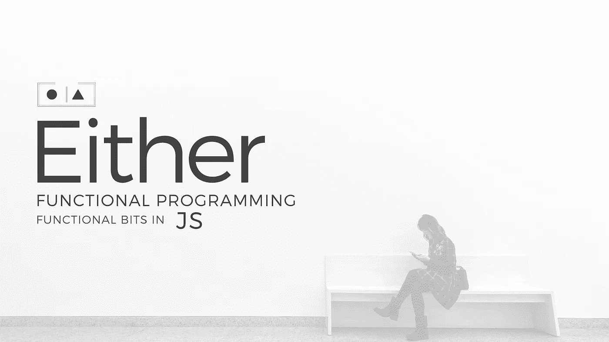

# Monad——JS 中错误处理的函数方法

> 原文：<https://itnext.io/either-monad-a-functional-approach-to-error-handling-in-js-ffdc2917ab2?source=collection_archive---------0----------------------->



在错误处理中，我们有两条可能的路径，要么计算成功，要么失败。控制流的必要方法是使用异常和 try/catch 块。在函数式编程中，他们认识到这两个**路径 ok 或 error 可以连接成一个结构** **，表示一个或另一个**是可能的，因此我们可以将它们统一成一个**要么< ok，要么>** 结构。

**要么**是函数式语言中常见的类型。通常被称为受歧视工会。这意味着任一类型都可以包含它所总结的任何类型。

为了找出我们 [**模式匹配**](https://en.wikipedia.org/wiki/Pattern_matching) **里面的东西。**通常在大多数函数库中，会有一个名为 **cata** (也称为 match 或 matchWith) 的方法，它的功能完全不同于:

好，让我们来看一下如何在错误处理中使用它。在任一仿函数实现中，重要的是**在映射时，左边的**会忽略映射。

```
const right = (v) => ({ 
    map: (f) => right(**f(v)**),    
  });

const left = (v) => ({ 
    map: (_) => left(**v**),  
  });
```

这意味着，当我们返回一个左，然后没有更多的计算与地图执行。

# 重构尝试/捕捉到

假设我们有这个 try catch 块

```
var finalPrice;
   try {
 **var discount = 0.1;
      finalPrice = 10 - discount * 10;**
   } catch (e) {
 **     console.log(e);**
   }if (finalPrice) {
      console.log(finalPrice);
   }
```

我们希望从实际计算中删除 try/catch。

```
try {
      **var computation = () => {
         var discount = 0.1;
         var finalPrice = 10 - discount * 10;
         return finalPrice;
      }**
   } catch (e) {
      **console.log(e);**
   }
```

然后我们提取一个方法，并将计算结果作为参数传递

```
var Try = (**f**) => {
      try {
         return **f**();
      } catch (e) {
 **console.log(e);**
      }
   }var finalPrice = Try(**() => {
      var discount = 0.1;
      var finalPrice = 10 - discount * 10;
      return finalPrice;
   }**);
```

最后我们返回一个这样的要么

```
var Try = (f) => {
      try { **
         return right(f());**
      } catch (e) {
       **  return left(e);**
      }
   }Try(() => t / 2).**matchWith**({
      right: v => console.log(v),
      left: v => console.log("error : " + v)
   })
```