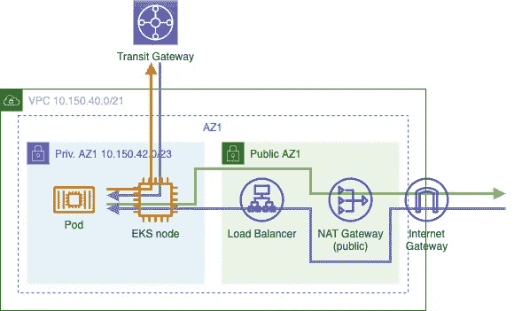
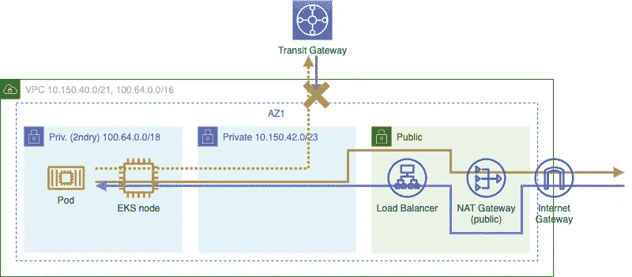
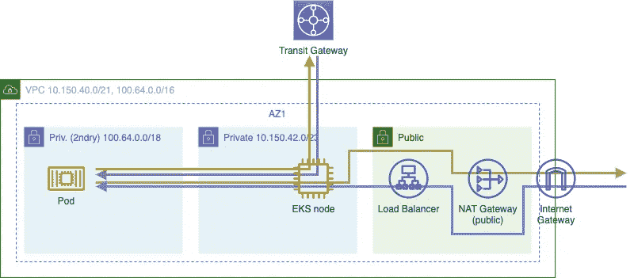
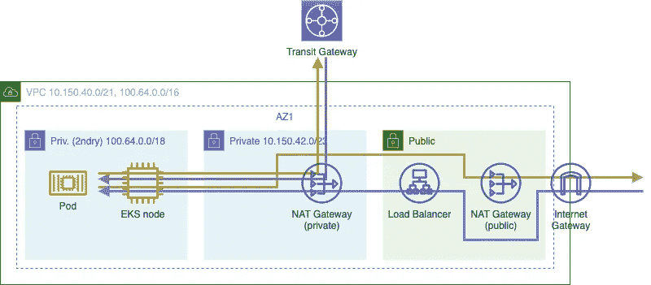

# EKS 和 IP 地址的探索:二级 CIDR 范围和私有 NAT 网关

> 原文：<https://itnext.io/eks-and-the-quest-for-ip-addresses-secondary-cidr-ranges-and-private-nat-gateways-1f5c69473a40?source=collection_archive---------2----------------------->

# EKS 及其对 IP 地址的渴求

Kubernetes 允许以相似的工作量运行高度多样化的工作负载。从用户的角度来看，在一个节点上运行 2 个 pod(每个消耗 2 个 vCPU)和运行数十个 pod(每个消耗 0.05 个 vCPU)没有什么区别。然而，看看网络，有一个很大的不同:每个 pod 需要有一个唯一的 IP 地址。在大多数 Kubernetes 实现中，有一个 CNI 插件，它在集群内部的 IP 空间中为每个 pod 分配一个 IP 地址。

EKS，AWS 管理的 Kubernetes 产品，[默认](https://docs.aws.amazon.com/eks/latest/userguide/pod-networking.html)使用[亚马逊 VPC CNI 插件用于 Kubernetes](https://github.com/aws/amazon-vpc-cni-k8s) 。与大多数网络实现不同，这在节点所在的网络 VPC 中为每个 pod 分配一个专用的 IP 地址。

VPC·CNI 插件做的事情可以归结为:

*   它在每个节点上保持一些网络接口(Eni)和 IP 地址“热”，以便能够快速将 IP 地址分配给新的 pod。
*   默认情况下，它可以保持整个备用 ENI 的温度。
*   这意味着任何节点都可以有效地声明`2 ENIs * ips-per-ENI`，因为总会有至少一个守护进程声明第一个 ENI 的 IP 地址。

现在，如果我们查看每个 ENI 的可用 IP 地址列表[并计算一个示例:](https://docs.aws.amazon.com/AWSEC2/latest/UserGuide/using-eni.html#AvailableIpPerENI)

*   EC2 类型`m5.xlarge`，每个 ENI 15 个 IP 地址。每个节点至少 30 个 IP 地址。
*   比方说，我们有 50 个节点在运行。这是 1500 个私人地址。(举例来说:按需 EC2 计算每月价值约 7000 美元)。
*   比方说，我们有`/21` VPC，提供 3 个`/23`私有子网。那是`3 x 512 = 1536`可用的 IP 地址。
*   托管服务也需要 IP 地址…

我们可以看到这将走向何方。那么，是创建`/16` VPCs 吗？大概不会。


喂养集群

# 多个 VPC

在许多组织中，并不只有一个 VPC。网络环境可能是以下因素的组合:

*   一个或多个地区的多个 AWS 帐户和 VPC
*   数据中心
*   办公网络
*   对等服务，比如来自 AWS 之外的提供商的 DBaaS

有许多方法可以连接 VPCs 和其他网络。需要从 VPC 之外发送的 CIDR 范围越大，重叠的可能性就越大。

因此，在较大的组织中，通常为个人 AWS 帐户提供一个 CIDR 范围相对较小的 VPC，以适应较大的网络计划。为了仍然拥有“大量 IP”，AWS VPC[可以配置](https://docs.aws.amazon.com/vpc/latest/userguide/VPC_Subnets.html#VPC_Sizing)二级 CIDR 范围。

这解决了 IP 空间问题，但是它本身并不能解决路由问题。次要的 CIDR 范围仍然需要在整个网络景观中是唯一的，以便从 VPC 之外可路由。如果辅助 CIDR *中的工作负载仅*需要连接到 VPC 中的资源，这可能不是一个实际问题，但事实往往并非如此。

最近，AWS 推出了[专用 NAT 网关](https://aws.amazon.com/blogs/networking-and-content-delivery/how-to-solve-private-ip-exhaustion-with-private-nat-solution/)，它与定制网络一起，是在二级 CIDR 范围内促进可路由 EKS pod 的选项。

# VPC 设置

让我们来看一些 VPC 的设置来说明这个问题，看看我们如何运行 EKS。

# 基础

一个基本的 VPC 由一个 CIDR 范围、一些私有和公共子网、一个 NAT 网关和一个 Internet 网关组成。根据主要 CIDR 范围的大小，这可能就足够了，但是在较大的组织范围内，让我们假设一个相对较小的 CIDR 范围。



基本 VPC

*   赞成:简单
*   缺点:私有知识产权枯竭

# 次级 CIDR 山脉

下一步:添加辅助 CIDR 范围，将节点和机架放在辅助子网中。如果工作负载永远不需要连接到 VPC 之外的私有网络中的资源，这种*可以*工作，这是不太可能的。理论上，pod 可以向其他 VPC 发送数据包，但是没有返回的路径。



次级 CIDR 山脉

*   赞成:简单
*   缺点:在豆荚和 VPC 之外的私人资源之间没有路线

# 次级 CIDR 系列+定制网络

为了解决路由问题，可以在 VPC CNI 插件中启用自定义网络。这允许将节点和单元放置在不同的子网中。节点进入主专用子网，单元进入辅助专用子网。这解决了路由问题，因为默认情况下，对于外部网络的流量，CNI 插件将 pods IP 地址转换为节点(SNAT)的主 IP 地址。在这种设置中，这些节点位于可路由的子网中。



次级 CIDR 系列+定制网络

在 [AWS 知识中心](https://aws.amazon.com/premiumsupport/knowledge-center/eks-multiple-cidr-ranges/)和[亚马逊 EKS 研讨会](https://www.eksworkshop.com/beginner/160_advanced-networking/secondary_cidr/)中描述了设置二级 CIDR 范围和自定义网络。

请注意，当使用 pod 的安全组时，源网络地址转换[被禁用:](https://docs.aws.amazon.com/eks/latest/userguide/security-groups-for-pods.html)

> 对来自分配了安全组的 pod 的出站流量禁用源 NAT，以便应用出站安全组规则。要访问互联网，必须在配置了 NAT 网关或实例的专用子网中部署的节点上启动分配了安全组的 pod。分配有部署到公共子网的安全组的 pod 无法访问互联网。

*   优点:不需要额外的 NAT 网关
*   缺点:复杂的 VPC CNI 网络配置
*   缺点:与 pod 的安全组不兼容

# 辅助 CIDR 范围+专用 NAT 网关

除了配置自定义网络之外，还可以通过使用私有 NAT 网关来解决路由问题。与公共 NAT 网关不同，它位于私有子网中，不链接到互联网网关。

这样，节点*和*吊舱可以在次级 CIDR 范围内运行，路由问题在 EKS 之外解决。



辅助 CIDR 范围+专用 NAT 网关

*   赞成:简单默认 VPC CNI 网络配置
*   Pro:可用于 pod 的安全组
*   缺点:NAT 网关会产生成本

# 路由和控制成本

# 一个 NAT 网关就足够了

让我们来看看可以为辅助专用子网设置的最基本的路由表:

```
10.150.40.0/21  **local**	
100.64.0.0/16   **local**	
0.0.0.0/0       nat-<private-id>
```

这会将所有非 VPC 流量放入主专用子网，并让在那里配置的路由表完成其余工作。简单，但是当从一个节点测试互联网连接时，我们可以观察到一个问题。

```
[ec2-user@ip-100-64-43-196 ~]$ ping www.google.com
PING www.google.com (74.125.193.147) 56(84) bytes of data.
64 bytes **from** ig-**in**-f147.1e100.net (74.125.193.147): icmp_seq=1 ttl=49 time=2.31 ms
^C[ec2-user@ip-100-64-43-196 ~]$ tracepath -p 443 74.125.193.147
 1?: [LOCALHOST]                                         pmtu 9001
 1:  ip-10-150-42-36.eu-west-1.compute.**internal**            0.168ms
 1:  ip-10-150-42-36.eu-west-1.compute.**internal**            1.016ms
 2:  ip-10-150-40-116.eu-west-1.compute.**internal**           0.739ms
 3:  ip-10-150-40-1.eu-west-1.compute.**internal**             1.510ms pmtu 1500
 3:  no reply
^C
```

查看跟踪和现有的 NAT 网关，我们可以看到流量通过私有的*和*NAT 网关。


VPC 中存在的 NAT 网关

细心的观察者可能会注意到流量图中绕过私有 NAT 网关的绿线。要实现这一点，只需通过*将私有网络流量定向到私有 NAT 网关*来调整路由表:

```
10.150.40.0/21  local	
100.64.0.0/16   local	
10.0.0.0/8      nat-<private-id>
0.0.0.0/0       nat-<public-id>
```

将通过 NAT 网关的流量减半就是将成本减半(忽略 NAT 网关的固定费用)。

# VPC 端点和对等连接

以上说明了复制主专用子网中存在的 VPC 端点和对等连接的路由表条目以避免流量不必要地通过专用 NAT 网关是很重要的。这(可能)行得通，但会带来不必要的成本。

提醒:由于作为 DNS、路由和安全组的行星需要对齐，所以一定要授予辅助 CIDR 范围对 VPC 中存在的任何“接口”类型的 VPC 端点的访问权。不这样做将使 DNS 返回一个 VPC 本地 IP 地址，该地址将*而不是*通过私有 NAT 网关，因此将被 VPC 端点上的安全组阻止。

# 结束的

在二级 CIDR 范围内运行 EKS pods 时，专用 NAT 网关可以替代自定义网络。与往常一样，需要考虑权衡，包括:

*   通过转接网关和专用 NAT 网关的网络流量
*   能够为 pod 使用安全组
*   设置的复杂性

以上应该给 EKS 网络世界一些启示，并有望提供更深入研究什么和避免什么陷阱的线索。一如既往，欢迎发表评论或[在 Twitter](https://twitter.com/TBeijen) 上讨论！

[1]这在这篇博文中有非常详细的描述:[https://better programming . pub/Amazon-eks-is-eating-my-IPS-e18ea 057 e 045](https://betterprogramming.pub/amazon-eks-is-eating-my-ips-e18ea057e045)
【2】免责声明:我们还没有为 pods 启用安全组，所以这是理论上的。然而，按照所描述的“没有 NAT =没有到互联网的路由”的逻辑，我们可以假设类似的限制适用于外部专用网络。
[3]使用比需要更多的 NAT 网关可能是一种严重的金钱浪费并且容易受到攻击。