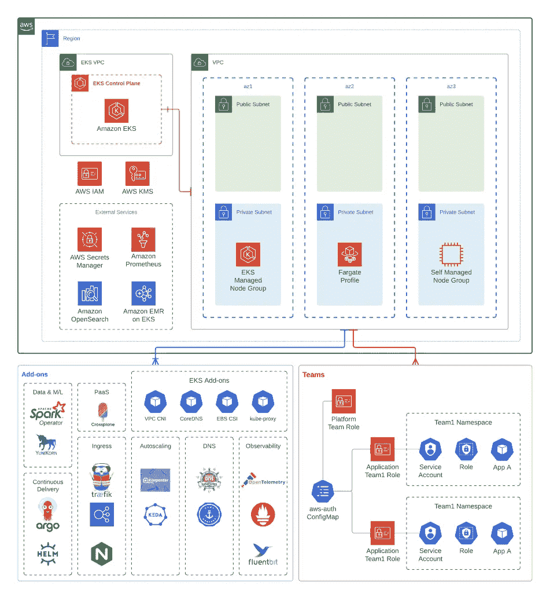

# EKS 蓝图:用于生产就绪的 Kubernetes 的 IaC 模块

> 原文：<https://itnext.io/eks-blueprints-iac-modules-for-production-ready-kubernetes-48032d5ce88?source=collection_archive---------3----------------------->

通过 [Terraform](https://www.terraform.io/) 和 [AWS CDK](https://aws.amazon.com/cdk/) 使用 [EKS 蓝图](https://aws.amazon.com/blogs/containers/bootstrapping-clusters-with-eks-blueprints/)在 AWS 上引导全功能 Kubernetes 集群。


由[万花筒](https://unsplash.com/@kaleidico?utm_source=medium&utm_medium=referral)在 [Unsplash](https://unsplash.com?utm_source=medium&utm_medium=referral) 上拍摄的照片

本周早些时候， [AWS 团队发布了 EKS 蓝图](https://aws.amazon.com/blogs/containers/bootstrapping-clusters-with-eks-blueprints/)，这是一组开源的基础设施代码(IaC)模块，用于使用 Prometheus、Karpenter、Nginx、Traefik、AWS 负载平衡器控制器等流行的 Kubernetes 工具来引导 EKS 集群。AWS Blueprints 还提供了一个模板，通过预先设定的`aws-auth`配置，基于名称空间和 RBAC 角色创建软多租户。AWS Blueprints 的首次推出支持 [Terraform](https://aws-ia.github.io/terraform-aws-eks-blueprints/getting-started/) 和 [AWS CDK](https://aws-quickstart.github.io/cdk-eks-blueprints/getting-started/) ，其中 [Pulumi](https://www.pulumi.com/blog/eks-blueprints-for-pulumi/) 在预览版中可用。

# 动机

在[我对托管 Kubernetes 产品的年度比较](https://medium.com/geekculture/state-of-managed-kubernetes-2021-43e8a4ca0207)中，我注意到 AWS EKS 缺乏 AKS 和 GKE 的许多管理功能，如自动节点修复、升级和内置入口控制器。随着 EKS 插件的推出，EKS 最近在推出关键 Kubernetes 组件的管理方面取得了重大进展，包括 AWS CNI、CoreDNS、kube-proxy 和亚马逊 EBS CSI 控制器。现在有了 EKS 蓝图，AWS 正在以模块化的方式扩展这种支持，以加快安装流行的开源工具和安全控制的过程，从而引导一个更适合生产的集群。

最有可能的是，有 EKS 经验的团队已经有了一些 EKS 蓝图的变体，无论是定制的地形模块，ArgoCD 设置，还是安装各种舵图的定制脚本。其他团队可能会使用基于 EKS 的应用框架，如 [Shipa](https://shipa.io/) 、 [KubeSphere](https://kubesphere.io/) 或 [Devtron](https://devtron.ai/) 来实现相同的体验。然而，我仍然看到了 EKS 蓝图的价值，因为 AWS 正在努力与不同的供应商和开源社区合作，以创建有见解的模板来推广最佳实践，并促进围绕如何大规模引导和管理 EKS 的讨论。



图片来源: [AWS 博客](https://aws.amazon.com/blogs/containers/bootstrapping-clusters-with-eks-blueprints/)

# 深入研究蓝图

顾名思义，EKS 蓝图是使用流行的工具来部署和操作工作负载，从而引导 EKS 集群的模板。在 Terraform 上，这些以模块的形式出现:

```
module "eks_blueprints" {
  source = "github.com/aws-ia/terraform-aws-eks-blueprints?ref=v4.0.2"# EKS Cluster VPC and Subnet mandatory config
  vpc_id             = <vpc_id>
  private_subnet_ids = <private_subnet_ids># EKS CLUSTER VERSION
  cluster_version = "1.21"# EKS MANAGED NODE GROUPS
  managed_node_groups = {
    mg_5 = {
      node_group_name = "managed-ondemand"
      instance_types  = ["m5.large"]
      min_size        = "2"
    }
  }
}# Add-ons
module "kubernetes_addons" {
  source = "github.com/aws-ia/terraform-aws-eks-blueprints//modules/kubernetes-addons?ref=v4.0.2" eks_cluster_id = module.eks_blueprints.eks_cluster_id # EKS Add-ons
  enable_amazon_eks_vpc_cni            = true
  enable_amazon_eks_coredns            = true
  enable_amazon_eks_kube_proxy         = true
  enable_amazon_eks_aws_ebs_csi_driver = true # Self-managed Add-ons
  enable_aws_for_fluentbit            = true
  enable_aws_load_balancer_controller = true
  enable_aws_efs_csi_driver           = true
  enable_cluster_autoscaler           = true
  enable_metrics_server               = true
}
```

而有了 CDK，EksBlueprint 构建器可以被调用:

```
const app = new cdk.App();const stackId = "<stack_id>";// By default will provision in a new VPC
blueprints.EksBlueprint.builder()
    .region('us-west-2')
    .version(eks.KubernetesVersion.V1_21)
    .addOns(
        new blueprints.addons.VpcCniAddOn(),
        new blueprints.addons.CoreDnsAddOn(),
        new blueprints.addons.KubeProxyAddOn(),

        // Self-managed Add-ons
        new blueprints.addons.AwsForFluentBitAddOn(),
        new blueprints.addons.AwsLoadBalancerControllerAddOn(),
        new blueprints.addons.ClusterAutoScalerAddOn(),
        new blueprints.addons.EfsCsiDriverAddOn(),
        new blueprints.addons.MetricsServerAddOn()
    )
    .build(app, stackId);
```

乍看之下，EKS 的蓝图与 Terraform AWS EKS 模块没有明显的不同。然而，Kubernetes 附加模块将底层的舵图管理抽象为简单的布尔启用/禁用语句，用于每个流行的插件，如 fluent-bit、EFS CSI 驱动程序、集群自动缩放器和度量服务器。有些人可能不喜欢通过 Terraform 管理舵图，而选择通过 ArgoCD 或 Flux 单独管理。尽管如此，模板显示了一种以集中方式管理这些工具的可能方式。

EKS 蓝图更有趣的部分是管理多租户的模板。配置适当的 IAM 角色、策略、aws-auth ConfigMap 以及用于服务帐户(IRSA)集成的 EKS IAM 角色的示例对于通过名称空间引导软多租户非常有用。模板遵循[软多租户章节](https://aws.github.io/aws-eks-best-practices/security/docs/multitenancy/#soft-multi-tenancy)中列出的 EKS 最佳实践。这些包括添加配额、标签和映射用户/角色。

```
module “eks-blueprints” {
  …
  application_teams = {
    team-blue = {
      "labels" = {
        "appName" = "blue-team-app",
      }
      "quota" = {
        "requests.cpu"    = "2000m",
        "requests.memory" = "4Gi",
        "limits.cpu"      = "2000m",
        "limits.memory"   = "8Gi",
      }
      users = ["arn:aws:iam::<aws-account-id>:user/team-blue-user"]
    }
  } platform_teams = {
    platform_admin = {
      users = ["arn:aws:iam::<aws-account-id>:user/platform-user"]
    }
  }
}
```

# 最后的想法

正如我在 Karpenter 上的帖子中提到的，AWS 最近取得了重大进展，使 EKS 成为一个更受管理的体验。很高兴看到 AWS 与行业合作伙伴( [Datadog](https://www.datadoghq.com/blog/eks-blueprints-datadog/) 、 [Dynatrace](https://www.dynatrace.com/news/blog/dynatrace-named-a-launch-partner-of-amazon-eks-blueprints/) 、 [HashiCorp](https://www.hashicorp.com/blog/vault-and-aws-partner-to-enhance-kubernetes-security) 、 [Kubecost](https://blog.kubecost.com/blog/deploy-kubecost-amazon-eks-blueprints) 、 [NewRelic](https://github.com/newrelic-experimental/newrelic-eks-blueprints-addon) 、 [Ondat](https://www.ondat.io/blog/ondat-is-now-available-via-amazon-eks-blueprints) 、 [Rafay](https://github.com/RafaySystems/rafay-eks-blueprints-addon) 、 [Snyk](https://github.com/snyk-partners/snyk-monitor-eks-blueprints-addon) 、 [Tetrate](https://github.com/tetratelabs/terraform-eksblueprints-tetrate-istio-addon) 、 [Kasten By Veeam](https://blog.kasten.io/kasten-k10-for-amazon-eks-blueprints) )一起降低时间和工作量我期待着构建新的集成来处理一些其他常见的用例，如秘密管理、配置重载等等。