# EKS+Fargate = Kubernetes 的可扩展性+无服务器优势

> 原文：<https://itnext.io/eks-fargate-extensibility-of-kubernetes-serverless-benefits-77599ac1763?source=collection_archive---------0----------------------->

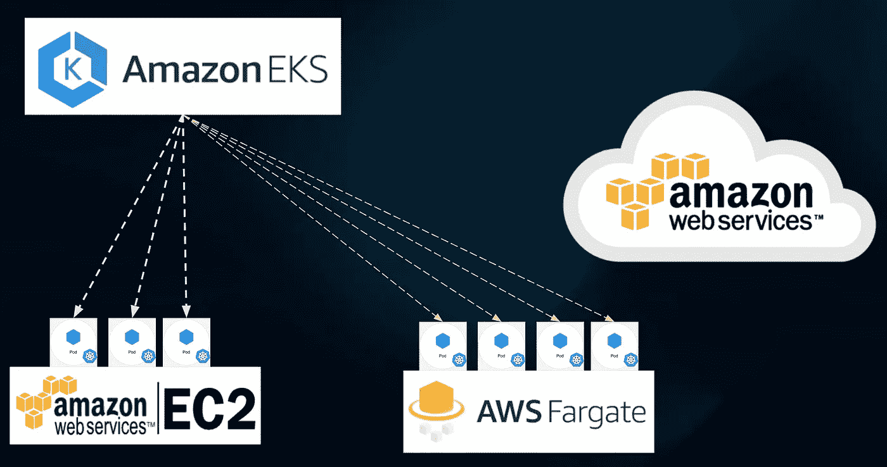

Amazon Elastic Kubernetes 服务在 AWS Fargate 上运行 Kubernetes pods

云计算的一个基本优势是大大降低了管理服务器硬件的复杂性。随着应用程序容器化的兴起，AWS 提出了大量特定于容器的平台。然而，在 AWS 引入 Fargate (ECS 启动类型)之前，配置和管理虚拟服务器并不是一个选项，而且始终是一个运营负担，在 Fargate 中，容器工作负载部署在 AWS 管理的计算资源上，用户无需管理任何 EC2 实例。Fargate 依赖 docker 容器来运行应用程序。容器作为 ECS 任务运行(类似于 Kubernetes Pod)，任务由服务管理(类似于 Kubernetes 部署)，服务可以用弹性负载平衡器设置，以通过 HTTP 接收外部流量。

选择容器执行策略包括管理 EC2 实例，其中最大的灵活性、对配置和价格的控制开始发挥作用。AWS 提供了三种运行容器的主要模型:ECS、Fargate 和 EKS。

*   ECS 是 AWS 提供的第一个容器编排工具。它基本上由 EC2 实例组成，这些实例已经安装了 docker，并运行一个 Docker 容器与 AWS 后端进行对话。
*   Fargate 是第二个服务产品，旨在从用户那里抽象出容器下的所有东西(运行它们的 EC2 实例)。
*   EKS 是最新的产品。通过 EKS，启动 Kubernetes 集群的一些复杂性从用户那里抽象出来，因为 AWS 管理主节点——控制平面。

AWS Fargate 是两种可用的 ECS 发布类型之一，Fargate 本身不是附加的容器或产品，它是一种发布类型。AWS Fargate 将容器呈现为服务(CaaS ),而 EC2 的基础设施即服务(IaaS)更简单地说就是“无服务器”。这意味着容器已经设置好了，包括网络、安全和最重要的扩展。这些主要的操作负担被抽象出来，为用户提供了直接在云上运行容器的能力。有了这项服务，开发人员只需为每个容器实例指定资源，并让 Fargate 无缝地处理所有其他需求。

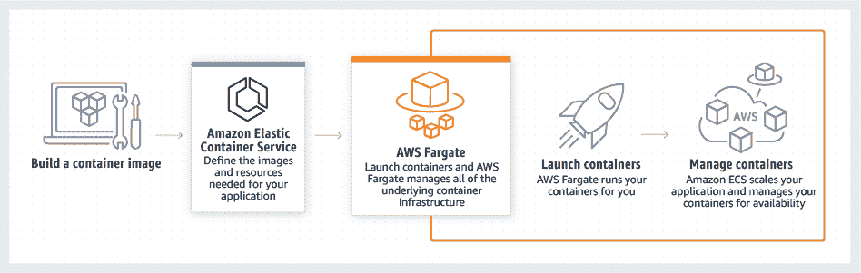

AWS Fargate

# ECS(容器实例)与 Fargate

ECS 容器实例只不过是运行 ECS 容器代理的 EC2 实例。EC2 实例由用户拥有和管理。该实例像任何其他 EC2 实例一样出现在 EC2 实例列表中。另一方面，AWS Fargate 管理任务的执行。不再需要管理 EC2 实例。在 Fargate 中运行的每个任务都有一个专用的弹性网络接口(ENI ),它有一个私有的 IP 地址。同一任务的所有容器都可以通过 localhost 相互通信。

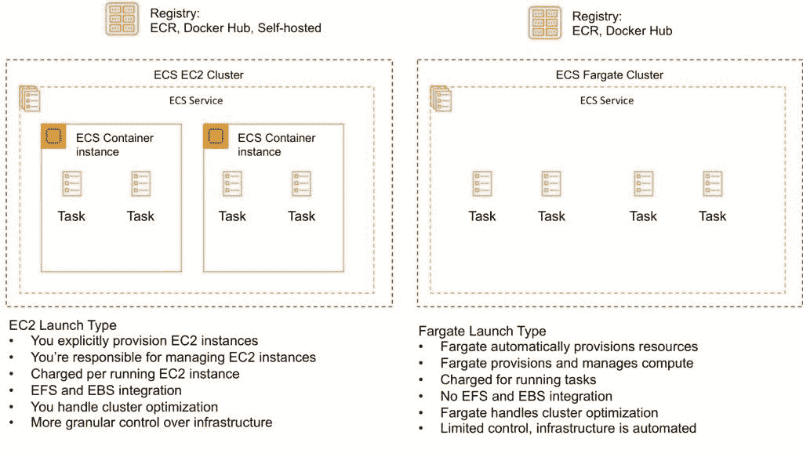

AWS ECS vs AWS Fargate

# 使用亚马逊 EKS 和 AWS Fargate 的无服务器 Kubernetes Pods

在拉斯维加斯的 AWS re:Invent 上，该公司宣布 Fargate 上提供弹性 Kubernetes 服务(EKS)。用户可以使用该功能让 EKS 在 AWS Fargate 上运行 Kubernetes pods。有了 AWS Fargate，就不再需要担心修补、扩展或保护 Amazon EC2 实例集群来在云中运行 Kubernetes 容器。

# 那时和现在

用户启动 EKS 控制面板，并将 Amazon EC2 添加到 EKS 集群。EC2 提供了运行基于 Kubernetes 的工作负载所需的计算能力。管理主节点和工作节点的费用为 0.20 美元/集群/小时，按照常规 EC2 实例成本收取。其他免费费用适用于启动补充资源，如 EBS 卷、网络/弹性负载平衡器等。

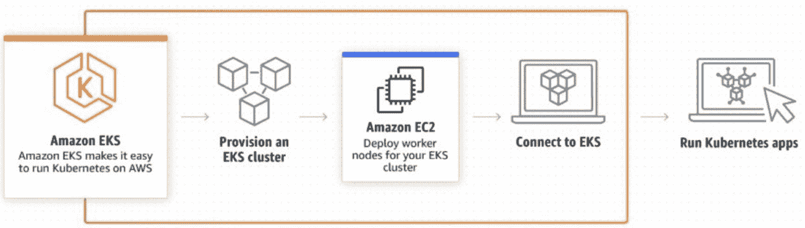

EKS — EC2 节点

现在，用户启动 EKS 控制平面并配置 fargate-profile，还可以将 EC2 添加到集群中。Fargate 上的网络使用与 EKS 的 AWS CNI 配置相同的子网，其中每个 Fargate pod 都分配有指定子网集中的 ENI。有了这一新增功能，用户可以利用无服务器/无节点 Kubernetes，他们只需为运行 pod 所需的 vCPU 和内存资源量付费。

使用 AWS Fargate，用户只需为 pod 运行所需的 vCPU 和内存资源量付费。这包括 pod 请求的资源，以及在 pod 旁边运行 Kubernetes 组件所需的少量内存。

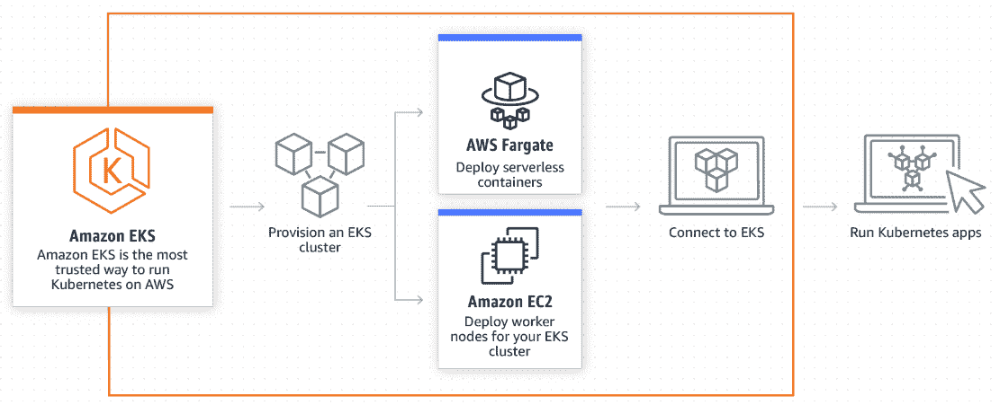

EKS —法盖特和 EC2

# 亚马逊 EKS 上的 AWS Fargate

带有 EKS 的 AWS Fargate 可以与“eksctl”无缝部署，其中所有必需的实体都是自动创建的。AWS 还允许用户将 Fargate 功能与现有的 EKS 集群关联起来(将 EC2 作为 Kubernetes 节点，版本=1.14)。

在使用[受管节点组](https://docs.aws.amazon.com/eks/latest/userguide/managed-node-groups.html)(用于供应或注册提供计算能力的实例)的现有集群中，所有集群安全组都自动配置到基于 Fargate 的工作负载，或者用户可以将安全组添加到节点组或自动扩展组，以实现在现有 EC2 实例上运行的 pod 与在 Fargate 上运行的 pod 之间的通信。在 Fargate 上运行的 pod 被自动配置为使用与它们相关联的集群的集群安全组。

使用 Fargate 创建 EKS 集群有多种方法。用户可以使用 eksctl、Terraform 或 AWS 控制台在 EKS 上创建 Fargate。用户可以使用“fargate-profiles”来控制 fargate 或现有 EC2 Kubernetes 节点上的 Kubernetes pods 的调度。Fargate 配置文件便于使用选择器来根据名称空间或 key:value 标签来确定 pod 的部署范围，这些标签可以添加到 Kubernetes 部署/pod 标签中。

# 使用 eksctl 创建集群

eksctl 中添加了一个新选项“— fargate”，它会自动创建所需的 IAM 策略和 fargate 配置文件，以便将 fargate 用于 EKS。

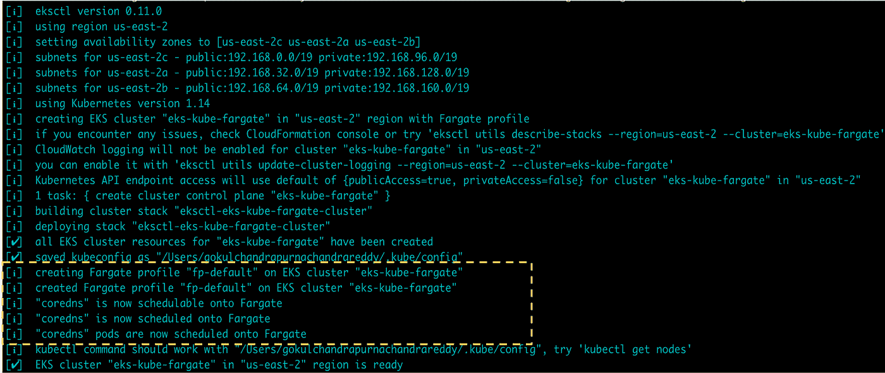

在 EKS 创建 Fargate—eks CTL

# 使用 Terraform 创建集群

Terraform 增加了创建所需的 fargate 配置文件并将其附加到 EKS 集群的支持。

创建 fargate 配置文件:

```
resource "aws_eks_fargate_profile" "example" {
  cluster_name           = aws_eks_cluster.example.name
  fargate_profile_name   = "example"
  pod_execution_role_arn = aws_iam_role.example.arn
  subnet_ids             = aws_subnet.example[*].id selector {
    namespace = "example"
  }}
```

为 EKS·法盖特配置文件创建 IAM 职责:

```
resource "aws_iam_role" "example" {
  name = "eks-fargate-profile-example" assume_role_policy = jsonencode({
    Statement = [{
      Action    = "sts:AssumeRole"
      Effect    = "Allow"
      Principal = {
        Service = "eks-fargate-pods.amazonaws.com"
      }
    }]
    Version = "2012-10-17"
  })
} resource "aws_iam_role_policy_attachment" "example-AmazonEKSFargatePodExecutionRolePolicy" {
  policy_arn = "arn:aws:iam::aws:policy/AmazonEKSFargatePodExecutionRolePolicy"
  role       = aws_iam_role.example.name
}
```

# 使用 AWS 控制台创建集群

一旦从 AWS 控制台“EKS”部分创建了 EKS 集群，就可以将 Fargate 配置文件添加到其中。

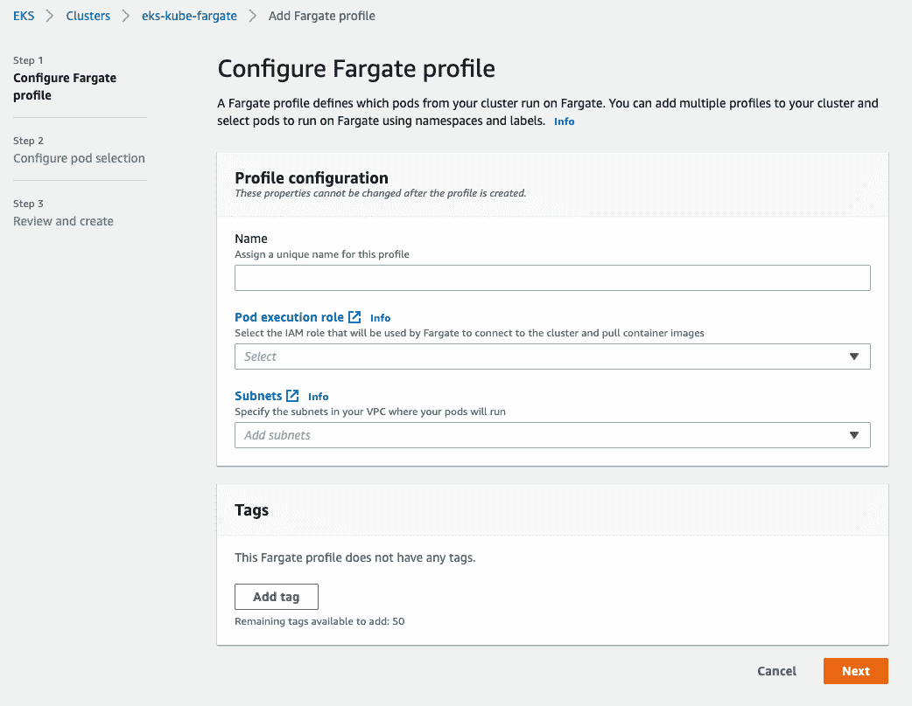

创建 Fargate 配置文件— AWS 控制台

# 配置组件

# Fargate Pod 执行角色

AWS Fargate 上的 Pods 需要从 Amazon ECR 调用 AWS APIs。亚马逊 EKS pod 执行角色为 IAM 提供了代表用户执行操作的权限。

IAM 角色的信任关系:

```
{
  "Version": "2012-10-17",
  "Statement": [
    {
      "Effect": "Allow",
      "Principal": {
        "Service": [
          "eks.amazonaws.com",
          "eks-fargate-pods.amazonaws.com"
        ]
      },
      "Action": "sts:AssumeRole"
    }
  ]
}
```

将信任关系与 IAM 角色相关联:

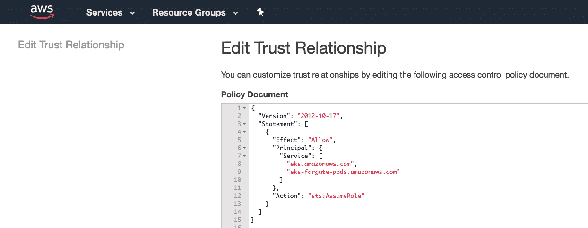

信任关系—角色— PodExecutionPolicy

将 AmazonEKSFargatePodExecutionRolePolicy 添加到上述角色:

```
{
    "Version": "2012-10-17",
    "Statement": [
        {
            "Effect": "Allow",
            "Action": [
                "ecr:GetAuthorizationToken",
                "ecr:BatchCheckLayerAvailability",
                "ecr:GetDownloadUrlForLayer",
                "ecr:BatchGetImage"
            ],
            "Resource": "*"
        }
    ]
}
```

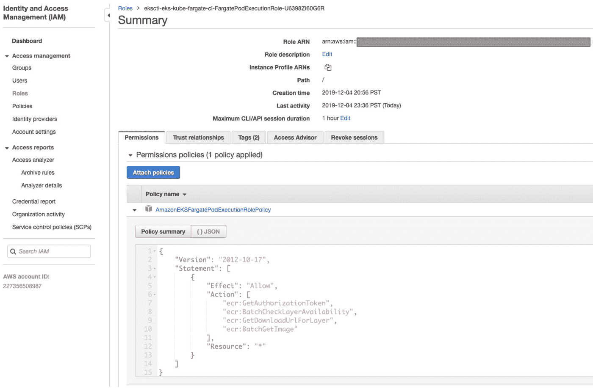

IAM 角色— PodExecutionPolicy

Kubernetes 代理或 kubelet 代表用户调用 Kubernetes API 服务器，因此集群需要 IAM 策略和角色来知道 kubelet 属于特定用户。此 IAM 角色被称为 pod 执行 IAM 角色。出于与您的帐户相关联的不同目的，用户可以拥有多个 pod 执行角色。

# 法盖特简介

Fargate 配置文件允许用户声明在 Fargate 上运行哪些 pod。这使得用户可以在节点(EC2 实例)和 Fargate 上运行工作负载。应至少指定一个 Fargate 配置文件，以确定启动时应使用 Fargate 的 pod。Fargate 配置文件是不可变的，应该创建一个新的更新配置文件来替换现有的配置文件，然后删除原始配置文件。

用户创建一个与 Kubernetes pods 中定义的名称空间和标签相匹配的配置文件。当新的 pod 启动时，它们将使用配置文件中定义的执行角色和子网在 Fargate 上运行。

```
{
    "fargateProfileName": "", "clusterName": "", "podExecutionRoleArn": "", "subnets": [
        "subnet-1", "subnet-2"
    ], "selectors": [
        {
            "namespace": "", "key-1": "label", "key-2": "label"
        }
    ]
}
```

*   **fargateProfileName** :标识 fargate 配置文件对象的唯一名称
*   **集群名**:要附加概要文件的集群的名称
*   **podExecutionRoleArn** :与 Fargate 上的 pod 一起使用的 pod 执行角色的 Amazon 资源名称(示例:arn:AWS:iam::XXX:role/AmazonEKSFargatePodExecutionRole)。这个角色被添加到集群的 Kubernetes RBAC 进行授权，以便在 Fargate 基础设施上运行的 kubelet 可以向 Amazon EKS 集群注册，并作为节点出现在集群中。
*   **子网**:与配置文件相关联的子网 id。对于现有集群，用户可以选择活动集群的子网 id。由于 AWS CNI 使用创建时分配的一组确定子网中的 IP，因此可以选择相同的子网来满足 Fargate 的需求，从而允许集群中的 pod 和服务之间进行通信。到目前为止，该参数只接受私有子网(没有到互联网网关的直接路由)。
*   **选择器**:选择器是一个“键:值”对，用于匹配 pod 以使用 Fargate 配置文件。每个选择器必须有一个关联的名称空间。或者，用户也可以为名称空间指定标签。用户可以在一个 Fargate 配置文件中指定多达五个选择器。一个 pod 只需要匹配一个选择器就可以使用 Fargate 配置文件运行。

例如，用户希望在 EKS 上部署 Fargate，其中所有在名称空间中创建的 Kubernetes pod:kube-system 和 default 都在 Fargate 上提供。在这种情况下，CoreDNS——部署在用户基础设施上的唯一 EKS 控制平面组件也将在 Fargate 上创建，因为用户选择了“kube-system”命名空间。

Fargate 配置文件配置:

```
{
    "fargateProfileName": "fargate-profile-1", "clusterName": "eks-kube-fargate", "podExecutionRoleArn": "arn:aws:iam::xxx:role/AmazonEKSFargatePodExecutionRole", "subnets": [
        "subnet-0968a124a4e4b0afe", "subnet-0723bbe802a360eb9"
    ], "selectors": [
        {
            "namespace": "kube-system",
            "namespace": "default"
        }
    ]
}
```

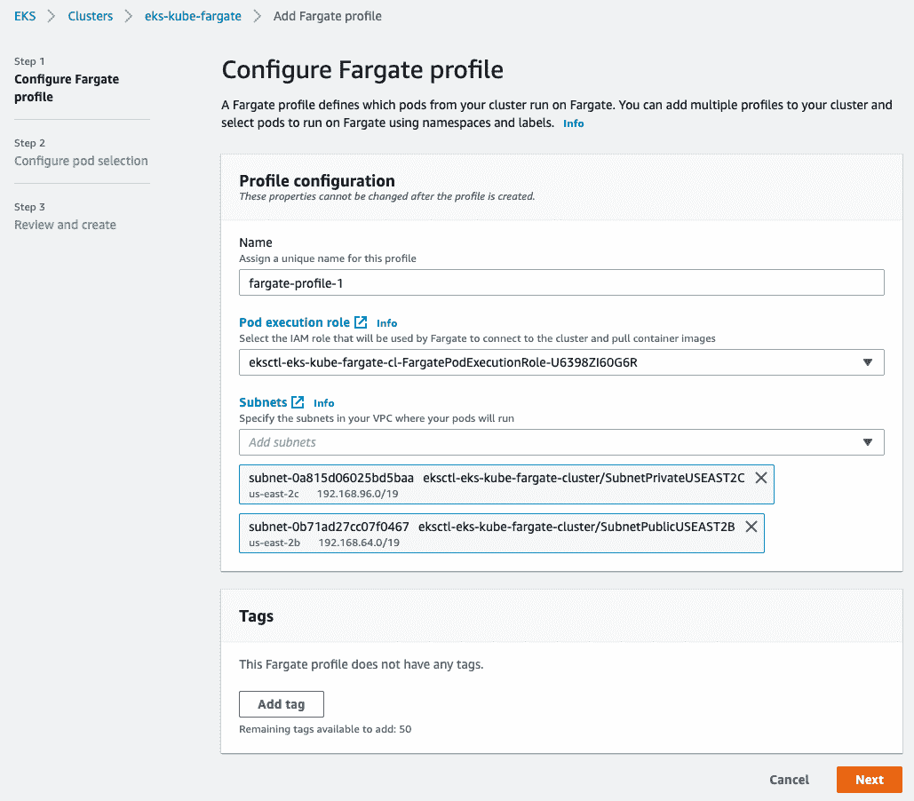

Fargate 配置文件— AWS 控制台

可选地，在 pod 选择器菜单中，用户可以添加特定的标签，这些标签允许指定来自特定名称空间的哪些 pod 使用该配置文件在 Fargate 上运行。

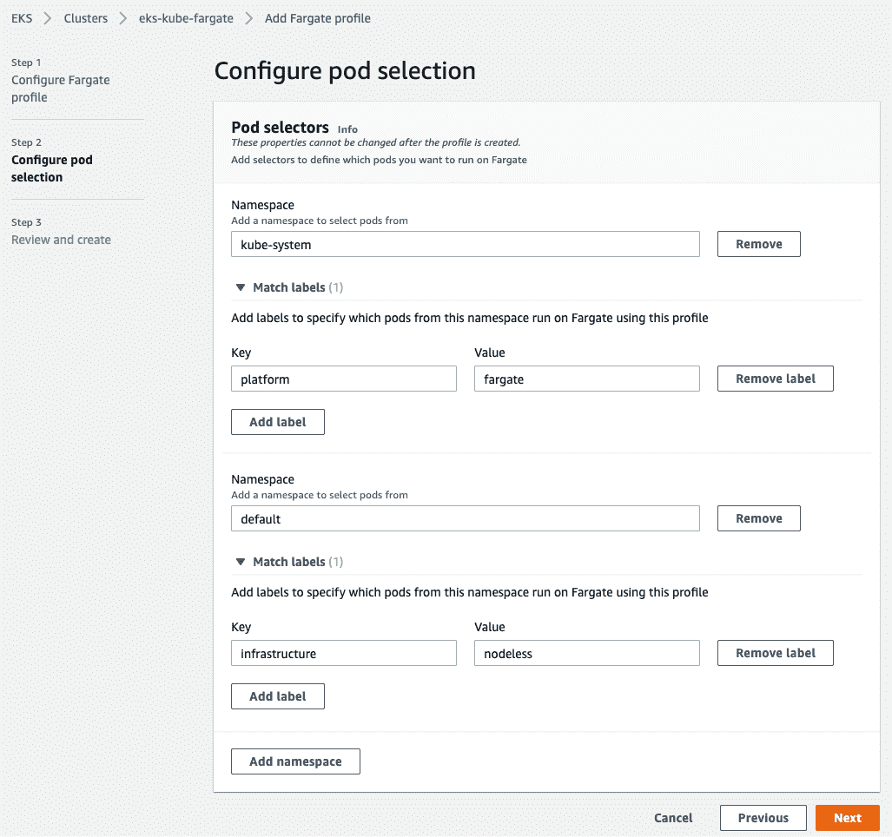

Fargate Profile — Pod 选择器

多个 fargate 配置文件可以连接到一个 EKS 集群。

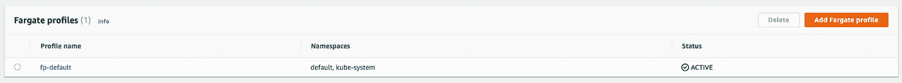

法盖特简介

# 在法盖特部署豆荚

创建了两个 Fargate 概要文件，第一个指定名称空间:kube-system 和 default，另一个指定名称空间“eks-fargate”和标签“environment:fargate”。为配置文件选择了 pod 执行角色(ARN)。

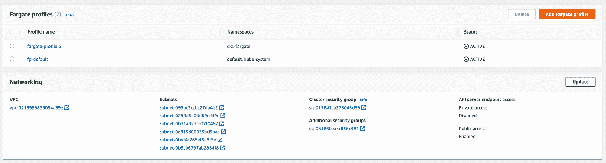

法盖特简介

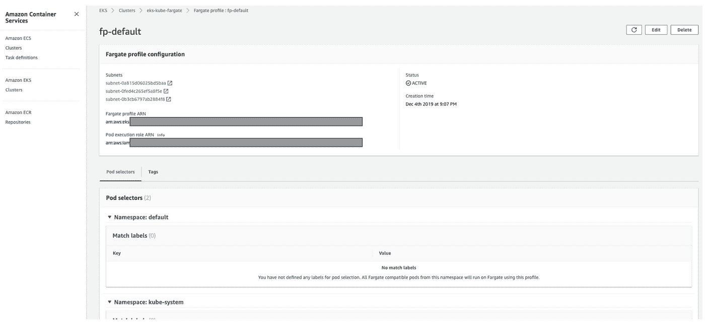

法盖特简介

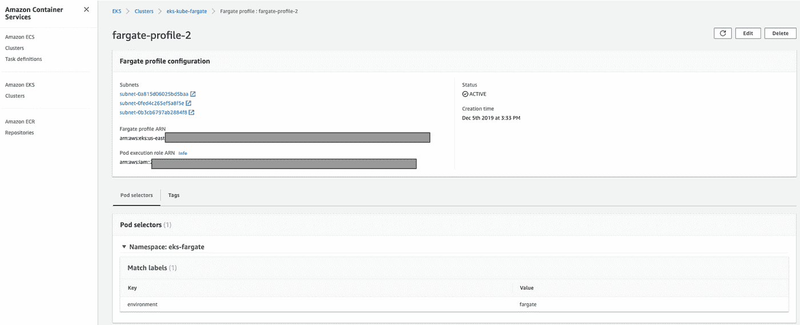

法盖特简介

由于在 profile-1 中选择了“kube-system ”, CoreDNS pod 将被安排在 Fargate 上。用户可以在 EC2 集群上控制 CoreDNS pods 的部署，从上面的配置文件中删除名称空间。

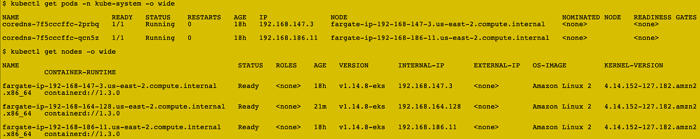

法盖特的库伯内特豆荚

如上所示，在 Fargate 上创建了两个 CoreDNS pod(deployment-replicas:2 ),并提供了来自配置文件中配置的子网的 IP。与 Fargate AWS 管理底层基础设施一样，运行 pod 的计算能力分布在 AWS 管理的随机节点上。

EKS 自动分配所需的特定标签，以将基于 fargate 的 pod 与其他 pod(如果存在的话)分开，其中包括使用的 Fargate 配置文件。可选地，用户可以向 fargate 配置文件提供标签，这些标签将被添加到 pod 标签中。

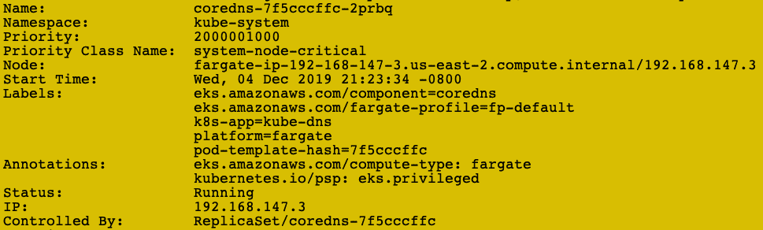

Kubernetes 标签— Fargate

fargate-profile“fargate-profile-2”如上所述，选择器配置包括选择一个名称空间“eks-fargate”和一个自定义标签“environment:fargate”。使用下面的清单部署了一个示例 nginx 部署，该清单只包含“namespace:eks-fargate”:

```
apiVersion: apps/v1
kind: Deployment
metadata:
  name: nginx-aws
  namespace: eks-fargate
spec:
  selector:
    matchLabels:
      app: nginx-aws
  replicas: 1
  template:
    metadata:
      labels:
        app: nginx-aws
    spec:
      containers:
      - name: nginx-aws
        image: nginx
        ports: - containerPort: 80
```

由于“fargate-profile-2”包括标签“environment:fargate”以及“namespace:eks-fargate”，上面的部署将保持挂起状态，因为集群中没有其他 EC2 Kubernetes 节点。

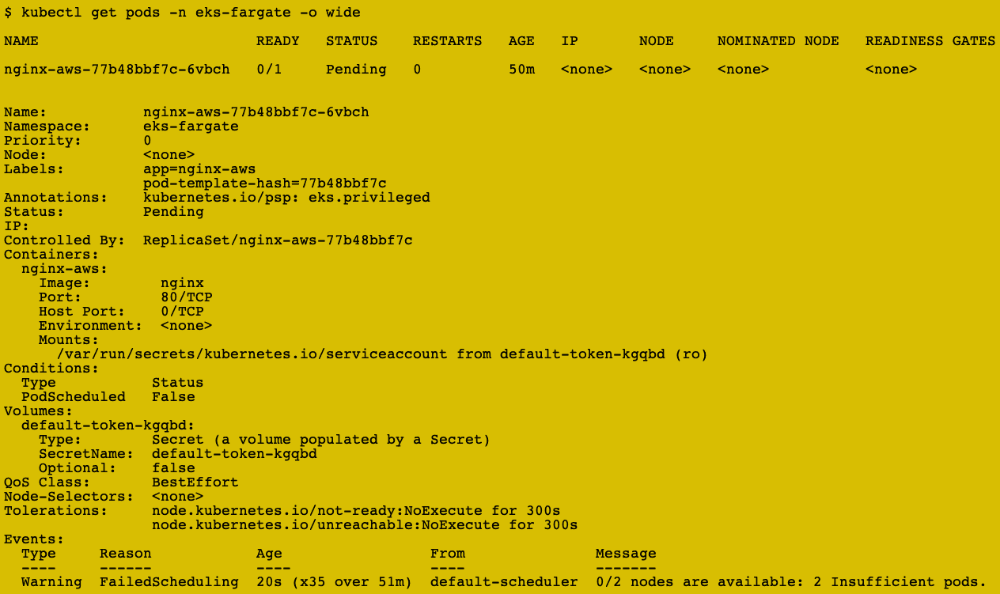

基于标签的选择器— Fargate 配置文件

这展示了使用定制标签和名称空间来控制 Fargate 上的 pod 调度的能力。来自相同名称空间的 pod 可以在 EC2 或 Faragate 上运行。如下所示，一旦添加了标签“环境:Fargate ”, pod 将被安排在 Fargate 上。

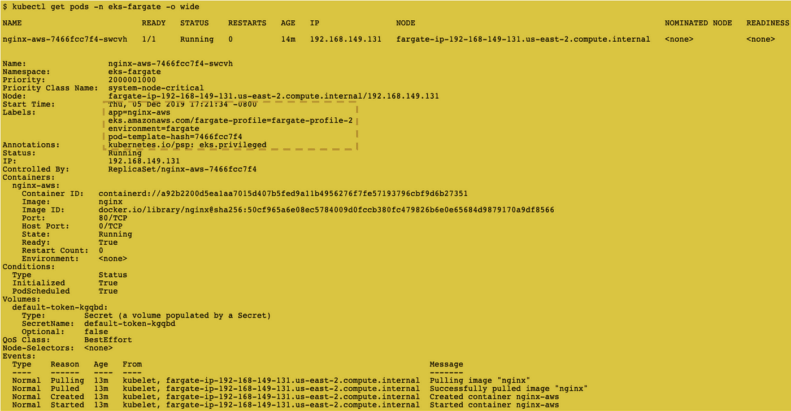

基于标签的选择器— Fargate 配置文件

# 限制

在 EKS 上使用 Fargate 的原生 EKS 功能有一定的限制。使用混合集群(EC2+Fargate)可以缓解大部分问题，在混合集群中，具有复杂需求的 Kubernetes 对象可以使用 EC2 节点，而具有最低需求的其他 pod 可以部署在 Fargate 上，这可以显著减少集群中 EC2 实例的数量。

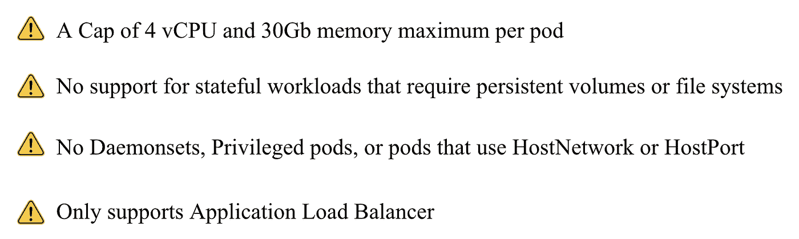

# 用例

*   如果工作负载符合 CPU 或内存要求(大约:4 个 vCPU 和 30Gb ),并且没有复杂的要求(存储、LB 等)。)，用户可以在 Fargate 上调度这些特定的工作负载集，而不是使用 EC2 来获得计算能力。
*   当工作负载由一致的周期性任务组成时，比如来自队列的 cron 作业或临时作业，那么可以利用 AWS Fargate。AWS Fargate 可以用来根据需求运行容器，而不是为 EC2 实例付费。
*   如果工作负载小而简单(网站或应用程序中的一层),应用程序在白天有更多流量，而在晚上流量较低，那么 AWS Fargate 仍然是最佳选择。用户可以在晚上在 Fargate 上缩小到成本很低的小容器，而在 EC2 上白天当基础设施需求更高时再扩大。
*   对于开发和测试团队来说，Fargate 可以用来在组织内部启动 pod。
*   对于按需或按计划运行且不需要专用 EC2 实例的任务。

*****************************************************************

EKS 的 AWS Fargate 将允许客户移除操作工人节点的无差别重负载，同时还能够使用 Kubernetes API。有了 Fargate，用户只需为 pod 运行所需的 vCPU、内存和资源量付费，这意味着开发人员不必担心过度配置，因为 Fargate 应该在任何给定时刻运行该 pod 所需的确切数量的资源，而不是更多。

亚马逊 EKS 和 AWS Fargate 提供了 Fargate 的无服务器优势、亚马逊 EKS 的最佳实践以及 Kubernetes 开箱即用的可扩展性。