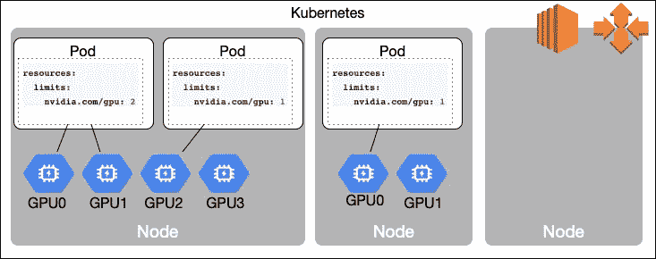

# EKS GPU 集群从零到英雄

> 原文：<https://itnext.io/eks-gpu-cluster-from-zero-to-hero-8df92cf720a5?source=collection_archive---------0----------------------->



# 介绍

如果您曾经尝试在 Kubernetes 集群上运行 GPU 工作负载，您会知道这项任务需要一个不小的配置，并且成本很高(GPU 实例非常昂贵)。

这篇文章展示了如何以经济高效的方式在 Kubernetes 集群上运行 GPU 工作负载，使用了[亚马逊 EKS](https://aws.amazon.com/eks/) 集群、 [AWS 自动缩放](https://aws.amazon.com/autoscaling/)、[亚马逊 EC2 Spot 实例](https://aws.amazon.com/ec2/spot/)，以及一些 Kubernetes 资源和配置。

# EKS 集群计划

首先，我们需要创建一个由混合节点组成的 Kubernetes 集群:用于管理和一般 Kubernetes 工作负载的非 GPU 节点，以及运行 GPU 密集型任务(如机器学习、医疗分析、地震勘探、视频转码等)的更昂贵的 GPU 驱动节点。

对于一般节点，这些节点组应该能够按需扩展(向外扩展和向内扩展)，对于昂贵的 GPU 实例，可以从 0 扩展到所需的数量，然后再回到 0。不仅如此，为了节省成本，我们将对通用节点和 GPU 节点都使用 [Amazon EC2 Spot 实例](https://aws.amazon.com/ec2/spot/)。

# AWS EC2 Spot 实例

使用[Amazon EC2 Spot Instances](https://aws.amazon.com/ec2/spot/)Instances，与按需价格相比，您可以节省高达 90%的费用。以前，Spot 实例按出价升序终止。因此，市场价格经常波动。在目前的模型中，现货价格更容易预测，更新频率更低，并且由亚马逊 EC2 备用容量决定，而不是投标价格。当特定可用性区域中的特定实例没有足够的容量时，AWS EC2 服务可以回收 Spot 实例。当将要被 Amazon EC2 服务回收时，Spot 实例会收到一个 2 分钟的警报，并且可以使用这个时间进行正常关闭和状态更改。

# 工作流程

# 1.创建 EKS 集群

可以使用[亚马逊 EKS CLI](https://docs.aws.amazon.com/cli/latest/reference/eks) 、CloudFormation 或 Terraform、 [AWS CDK](https://aws.amazon.com/cdk/) 或 [eksctl](https://eksctl.io) 创建[亚马逊 EKS](https://aws.amazon.com/eks/) 集群。

## eksctl CLI 工具

本文使用了`eksctl`(在 EKS 上创建集群的 CLI 工具)。可以将所有参数作为 CLI 标志或配置文件传递给该工具。使用配置文件使过程更加可重复和自动化友好。

`eksctl`可以使用 CloudFormation 堆栈创建或更新 EKS 集群和其他所需的 AWS 资源。

使用配置文件自定义您的集群。快跑吧

```
eksctl create cluster -f cluster.yaml
```

要应用`cluster.yaml`文件:

```
apiVersion: eksctl.io/v1alpha5 
kind: ClusterConfigmetadata: 
  name: test-cluster
  region: us-west-2nodeGroups: 
  - name: ng
    instanceType: t3.micro
    desiredCapacity: 10
```

将创建一个具有 10 个`t3.micro`按需 EC2 工作节点的新 EKS 集群，并将集群凭证添加到`~/.kube/config`文件中。

# 2.创建节点组

按照计划，我们将为 Kubernetes 工作节点创建两个节点组:

1.  *常规*节点组—使用 Spot 实例运行 Kubernetes 系统工作负载和非 GPU 工作负载的自动扩展组
2.  *GPU* 节点组——具有 GPU 支持的 Spot 实例的自动扩展组，可以从 0 扩展到所需的实例数，然后返回到 0。

幸运的是，`eksctl`支持向 EKS 集群添加 Kubernetes 节点组，这些节点组可以由纯 Spot 实例或者 Spot 和按需实例的混合组成。

## 2.1 常规节点组

`eksctl`配置文件包含跨越 3 个可用性区域的`us-west-2`中的 EKS 集群和在多样化的 Spot 实例上运行的第一个*通用*自动扩展(从 2 个节点到 20 个节点)节点组。

```
---
apiVersion: eksctl.io/v1alpha5
kind: ClusterConfigmetadata:
  name: gaia-kube
  region: us-west-2availabilityZones: ["us-west-2a", "us-west-2b", "us-west-2c"]nodeGroups:
  # spot workers NG - multi AZ, scale from 3
  - name: spot-ng
    ami: auto
    instanceType: mixed
    desiredCapacity: 2
    minSize: 2
    maxSize: 20
    volumeSize: 100
    volumeType: gp2
    volumeEncrypted: true
    iam:
      attachPolicyARNs:
        - arn:aws:iam::aws:policy/service-role/AmazonEC2RoleforSSM
        - arn:aws:iam::aws:policy/AmazonEKS_CNI_Policy
        - arn:aws:iam::aws:policy/AmazonEKSWorkerNodePolicy
        - arn:aws:iam::aws:policy/AmazonEC2ContainerRegistryReadOnly
      withAddonPolicies:
        autoScaler: true
        ebs: true
        albIngress: true
        cloudWatch: true
    instancesDistribution:
      onDemandPercentageAboveBaseCapacity: 0
      instanceTypes:
        - m4.2xlarge
        - m4.4xlarge
        - m5.2xlarge
        - m5.4xlarge
        - m5a.2xlarge
        - m5a.4xlarge
        - c4.2xlarge
        - c4.4xlarge
        - c5.2xlarge
        - c5.4xlarge
      spotInstancePools: 15
    tags:
      k8s.io/cluster-autoscaler/enabled: 'true'
    labels:
      lifecycle: Ec2Spot
    privateNetworking: true
    availabilityZones: ["us-west-2a", "us-west-2b", "us-west-2c"]# next: GPU node groups ...
```

现在是解释上面配置文件中使用的一些参数的时候了。

*   `ami: auto` - `eksctl`根据指定的 AWS 区域、EKS 版本和实例类型，自动发现工作节点的最新 EKS 优化 AMI 映像。参见用户指南中的[亚马逊 EKS 优化 AMI](https://docs.aws.amazon.com/eks/latest/userguide/eks-optimized-ami.html) 章节
*   `instanceType: mixed` -指定实际实例类型将是`instancesDistribution`部分中定义的实例类型之一
*   `iam`包含预定义的和适当的 IAM 策略列表；`eksctl`使用指定的策略创建一个新的 [IAM 角色](https://docs.aws.amazon.com/AWSEC2/latest/UserGuide/iam-roles-for-amazon-ec2.html)，并将该角色附加到每个 EKS 工作节点。您需要将几个 IAM 策略附加到每个 EKS 工作节点，请阅读用户指南中的[亚马逊 EKS 工作节点 IAM 角色](https://docs.aws.amazon.com/eks/latest/userguide/worker_node_IAM_role.html)部分和`[eksctl](https://eksctl.io/usage/iam-policies/)`IAM 策略文档
*   `instancesDistribution` -为 EC2 自动缩放组指定混合实例策略，阅读 AWS[MixedInstancesPolicy](https://docs.aws.amazon.com/autoscaling/ec2/APIReference/API_MixedInstancesPolicy.html)文档
*   `spotInstancePools` -指定要使用的 Spot 实例池的数量，[阅读更多信息](https://alexei-led.github.io/post/eks_gpu_spot/#Spot-Instance-Pools)
*   `tags` - AWS 标签添加到 EKS 工人节点
*   `k8s.io/cluster-autoscaler/enabled`将使用此标签进行 Kubernetes 集群自动缩放自动发现
*   `privateNetworking: true` -所有 EKS 工作节点将被置于专用子网中

**现货实例池**

当您使用 Spot 实例作为工作节点时，您需要将使用分散到尽可能多的 *Spot 实例池*。一个 *Spot 实例池*是一组未使用的 EC2 实例，它们具有相同的实例类型(例如`m5.large`)、操作系统、可用性区域和网络平台。

`eksctl`目前支持单点配置模式:`lowestPrice`分配策略。这种策略允许创建一个既便宜又多样化的 Spot 实例群。ASG 会根据您指定的现货池数量中的当前现货价格，自动部署最便宜的实例类型和可用性区域组合。这种组合可以避免最昂贵的 Spot 实例。

Spot 实例多样化还增加了工作节点的可用性，通常不是所有的 *Spot 实例池*都会同时中断，因此只有一小部分工作负载会被中断，EC2 自动伸缩组将替换其他 *Spot 实例池*中被中断的实例。

另外，请考虑为数据集、培训进度(检查点)和日志使用专用卷。该卷应该是持久的，不受实例终止的影响。

## 2.2 GPU 驱动的节点组

我们的`eksctl`配置文件的下一部分包含第一个 *GPU* 自动缩放(从`0`到`10`节点)节点组，该节点组运行在各种 GPU 支持的 Spot 实例上。

当使用 GPU 支持的 Spot 实例时，建议为每个可用性区域创建 *GPU* 节点组，并配置 Kubernetes 集群自动缩放器，以避免自动 [ASG 重新平衡](https://docs.aws.amazon.com/autoscaling/ec2/userguide/auto-scaling-benefits.html#arch-AutoScalingMultiAZ)。

为什么重要？一些 GPU 驱动的 EC2 Spot 实例具有相对较高的*中断频率*率(对于某些 GPU 实例类型为`>20%`);检查 [Spot Instance Advisor](https://aws.amazon.com/ec2/spot/instance-advisor/) ，使用多个 AZ 并禁用自动集群自动缩放器平衡有助于最大限度地减少 GPU 工作负载中断。

```
# ... EKS cluster and General node group ...# spot GPU NG - west-2a AZ, scale from 0
  - name: gpu-spot-ng-a
    ami: auto
    instanceType: mixed
    desiredCapacity: 0
    minSize: 0
    maxSize: 10
    volumeSize: 100
    volumeType: gp2
    volumeEncrypted: true
    iam:
      attachPolicyARNs:
        - arn:aws:iam::aws:policy/service-role/AmazonEC2RoleforSSM
        - arn:aws:iam::aws:policy/AmazonEKS_CNI_Policy
        - arn:aws:iam::aws:policy/AmazonEKSWorkerNodePolicy
        - arn:aws:iam::aws:policy/AmazonEC2ContainerRegistryReadOnly
      withAddonPolicies:
        autoScaler: true
        ebs: true
        fsx: true
        efs: true
        albIngress: true
        cloudWatch: true
    instancesDistribution:
      onDemandPercentageAboveBaseCapacity: 0
      instanceTypes:
        - p3.2xlarge
        - p3.8xlarge
        - p3.16xlarge
        - p2.xlarge
        - p2.8xlarge
        - p2.16xlarge
      spotInstancePools: 5
    tags:
      k8s.io/cluster-autoscaler/node-template/taint/dedicated: nvidia.com/gpu=true
      k8s.io/cluster-autoscaler/node-template/label/nvidia.com/gpu: 'true'
      k8s.io/cluster-autoscaler/enabled: 'true'
    labels:
      lifecycle: Ec2Spot
      nvidia.com/gpu: 'true'
      k8s.amazonaws.com/accelerator: nvidia-tesla
    taints:
      nvidia.com/gpu: "true:NoSchedule"
    privateNetworking: true
    availabilityZones: ["us-west-2a"]# create additional node groups for `us-west-2b` and `us-west-2c` availability zones ...
```

现在，是时候解释一些用于配置 GPU 驱动的节点组的参数了。

*   `ami: auto` - `eksctl`根据指定的 AWS 地区、EKS 版本和实例类型，自动发现最新的 EKS 优化的 AMI 映像，支持工作节点的 GPU。参见[支持 GPU 的亚马逊 EKS 优化 AMI](https://docs.aws.amazon.com/eks/latest/userguide/gpu-ami.html)用户指南
*   `iam: withAddonPolicies` -如果计划的工作负载需要访问 AWS 存储服务，则必须包含额外的 IAM 策略(由`eksctl`自动生成)
*   `tags` - AWS 标签添加到 EKS 工人节点
*   `k8s.io/cluster-autoscaler/node-template/taint/dedicated: nvidia.com/gpu=true` - Kubernetes 节点污染
*   `k8s.io/cluster-autoscaler/node-template/label/nvidia.com/gpu: 'true'` -集群自动缩放器使用的 Kubernetes 节点标签，用于将 ASG 从/缩放到 0
*   `nvidia.com/gpu: “true:NoSchedule”` — Kubernetes GPU 节点污点；有助于避免在昂贵的 GPU 节点上放置非 GPU 工作负载

**支持 GPU 的 EKS 优化 AMI 图像**

除了标准的亚马逊 EKS 优化 AMI 配置，GPU AMI 还包括以下内容:

*   NVIDIA 驱动程序
*   `nvidia-docker2`套餐
*   `nvidia-container-runtime`(作为默认运行时)

将节点组缩放到 0 或从 0 开始缩放

来自 Kubernetes[Cluster auto scaler](https://github.com/kubernetes/autoscaler/)0 . 6 . 1—假设满足所有向上和向下扩展的条件，可以将节点组扩展到 0 或从 0 扩展。

如果你使用的是`nodeSelector`，你需要用节点模板键`k8s.io/cluster-autoscaler/node-template/label/`和`k8s.io/cluster-autoscaler/node-template/taint/`标记 ASG，如果你使用的是污点。

# 3.调度 GPU 工作负载

## 3.1 基于 GPU 资源的调度

用于 Kubernetes 的 NVIDIA 设备插件[显示了集群中每个节点上的 GPU 数量。一旦安装了插件，就可以在 GPU 节点上使用`nvidia/gpu` Kubernetes 资源并用于 Kubernetes 工作负载。](https://github.com/NVIDIA/k8s-device-plugin)

运行此命令，使用`tolerations`和`nodeAffinity`将 Nvidia Kubernetes 设备插件作为`daemonset`应用于仅在 AWS GPU 驱动的工作节点上运行

```
kubectl create -f kubernetes/nvidia-device-plugin.yamlkubectl get daemonset -nkube-system
```

使用`nvidia-device-plugin.yaml` Kubernetes 资源文件

```
apiVersion: extensions/v1beta1
kind: DaemonSet
metadata:
  name: nvidia-device-plugin-daemonset-1.12
  namespace: kube-system
spec:
  updateStrategy:
    type: RollingUpdate
  template:
    metadata:
      labels:
        name: nvidia-device-plugin-ds
    spec:
      tolerations:
      - key: nvidia.com/gpu
        operator: Exists
        effect: NoSchedule
      containers:
      - image: nvidia/k8s-device-plugin:1.11
        name: nvidia-device-plugin-ctr
        securityContext:
          allowPrivilegeEscalation: false
          capabilities:
            drop: ["ALL"]
        volumeMounts:
          - name: device-plugin
            mountPath: /var/lib/kubelet/device-plugins
      volumes:
        - name: device-plugin
          hostPath:
            path: /var/lib/kubelet/device-plugins
      affinity:
        nodeAffinity:
          requiredDuringSchedulingIgnoredDuringExecution:
            nodeSelectorTerms:
            - matchExpressions:
              - key: beta.kubernetes.io/instance-type
                operator: In
                values:
                - p3.2xlarge
                - p3.8xlarge
                - p3.16xlarge
                - p3dn.24xlarge
                - p2.xlarge
                - p2.8xlarge
                - p2.16xlarge
```

## 3.2 污点和容忍

Kubernetes *污点*允许一个节点击退一组豆荚。污染和容忍一起工作，以确保 pod 不会被安排到不适当的节点上。一个或多个污点被应用到一个节点；这标志着节点不应该接受任何不容忍污染的 pod。容忍适用于 pod，并允许(但不要求)pod 调度到具有匹配污点的节点上。

更多细节见 Kubernetes [污染和容忍](https://kubernetes.io/docs/concepts/configuration/taint-and-toleration/)文档。

要在 GPU 支持的 Spot 实例节点上运行 GPU 工作负载，带有`nvidia.com/gpu: "true:NoSchedule"`污点，工作负载必须包括匹配的`tolerations`和`nodeSelector`配置。

Kubernetes 部署带有限制为`nvidia/gpu: 1`的`10` pod 副本:

```
apiVersion: apps/v1
kind: Deployment
metadata:
  name: cuda-vector-add
  labels:
    app: cuda-vector-add
spec:
  replicas: 10
  selector:
    matchLabels:
      app: cuda-vector-add
  template:
    metadata:
      name: cuda-vector-add
      labels:
        app: cuda-vector-add
    spec:
      nodeSelector:
        nvidia.com/gpu: "true"
      tolerations:
      - key: "nvidia.com/gpu"
        operator: "Exists"
        effect: "NoSchedule"
      containers:
        - name: cuda-vector-add
          image: "k8s.gcr.io/cuda-vector-add:v0.1"
          resources:
            limits:
              nvidia.com/gpu: 1 # requesting 1 GPU
```

部署`cuda-vector-add`部署，看看新的 GPU 驱动的节点是如何添加到 EKS 集群的。

```
# list Kubernetes nodes before running GPU workload
kubectl get nodes --output="custom-
columns=NAME:.metadata.name,TYPE:.metadata.labels.beta\.kubernetes\.io\/instance-type"NAME                                            TYPE
ip-192-168-151-104.us-west-2.compute.internal   c4.4xlarge
ip-192-168-171-140.us-west-2.compute.internal   c4.4xlarge# deploy GPU workload on EKS cluster with tolerations for nvidia/gpu=true
kubectl create -f kubernetes/examples/vector/vector-add-dpl.yaml# list Kubernetes nodes after several minutes to see new GPU nodes added to the cluster
kubectl get nodes --output="custom-columns=NAME:.metadata.name,TYPE:.metadata.labels.beta\.kubernetes\.io\/instance-type"NAME                                            TYPE
ip-192-168-101-60.us-west-2.compute.internal    p2.16xlarge
ip-192-168-139-227.us-west-2.compute.internal   p2.16xlarge
ip-192-168-151-104.us-west-2.compute.internal   c4.4xlarge
ip-192-168-171-140.us-west-2.compute.internal   c4.4xlarge
ip-192-168-179-248.us-west-2.compute.internal   p2.16xlarge
```

正如您所看到的，3 个新的 GPU 驱动的节点(`p2.16xlarge`)，跨 3 个 AZ，被添加到集群中。当您删除 GPU 工作负载时，群集将在 10 分钟后将 GPU 节点组缩减为 0。

# 摘要

按照本教程创建一个 EKS (Kubernetes)集群，该集群具有 GPU 支持的节点组，在 Spot 实例上运行，可从/向 0 节点扩展。

# 参考

- [EKS Spot 集群](https://github.com/alexei-led/eks-spot-cluster) GitHub 存储库，包含本博客的代码
- [运行 EC2 Spot 实例作为 Kubernetes 工作节点的权威指南](/the-definitive-guide-to-running-ec2-spot-instances-as-kubernetes-worker-nodes-68ef2095e767)作者 Ran shein Berg
-[Kubernetes 集群自动缩放器](https://github.com/kubernetes/autoscaler/tree/master/cluster-autoscaler)-
-[污点和容忍](https://kubernetes.io/docs/concepts/configuration/taint-and-toleration/) Kubernetes 文档

# 放弃

我在哪里工作并不重要，我所有的意见都是我自己的。

*草稿发布于*[*https://Alexei-led . github . io*](https://alexei-led.github.io/post/eks_gpu_spot/)*。*