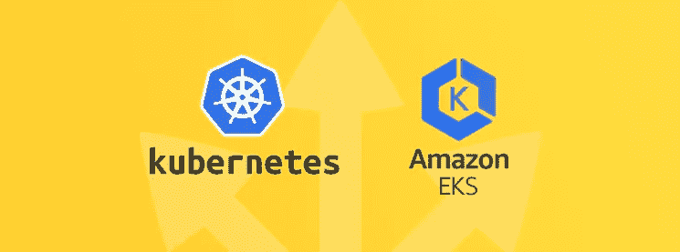

# EKS VS KOPS:为什么 EKS 可以成为 AWS 用户的最佳解决方案。

> 原文：<https://itnext.io/eks-vs-kops-a-comparison-for-aws-users-b6ecd94d2999?source=collection_archive---------4----------------------->



# 序文

我们都可以肯定地说，Kubernetes 正被广泛接受为容器编排的首选。过去几年，我们看到每一个主要的云提供商都试图为 Kubernetes 提供最佳的托管解决方案。谷歌的 GKE 是目前为止遥遥领先的赢家。在我使用 Kubernetes 的 3 年多时间里，我个人使用过 GKE、Kubespray(在 openstack cloud 上)、KOPS 和 EKS。借助 GKE，我能够轻松管理 5 个不同的集群，因此我对其他云提供商寄予厚望。

AWS 仍然是使用最广泛的云提供商，它从 2018 年 6 月开始提供 EKS。AWS 用户长期以来一直使用 KOPS 来创建和管理 Kubernetes 集群。在 EKS 之前我用的是 KOPS。与 GKE 类似，EKS 也负责 Kubernetes 主节点，用户只需关注工人节点。让我们现在就开始:

# 云支持:

## EKS:

*   EKS 仅面向 AWS 用户和将其物理基础架构扩展到 AWS 云的公司。

## KOPS:

*   AWS 是官方支持的。
*   GCE 和 OpenStack 处于 beta 支持阶段，VMware vSphere 处于 alpha 支持阶段。
*   KOPS 非常适合拥有多云战略的公司。

# 安全性:

## EKS:

*   由于 EKS 负责主节点，用户只需管理工作节点的安全性。

## KOPS:

*   KOPS 用户应该轮换加密密钥和证书，以限制密钥泄露的`blast radius`。正如这里所解释的[，这对 KOPS 来说是一个破坏性的过程。](https://github.com/kubernetes/kops/blob/master/docs/rotate-secrets.md)
*   对 **API 服务器的** **etcd** 的写访问权限相当于获得整个集群的 root 权限，甚至读访问权限也可以用来相当容易地提升权限。拥有自己的专用节点是很好的做法。对于 KOPS，默认情况下，etcd 与其他控制平面组件一起部署。
*   用户甚至可以在主节点上以非根用户的身份运行容器，一旦遭到破坏，可能会帮助攻击者进一步攻击**。**

> 安全性应该是所有公司关注的主要问题。EKS 只是剥夺了主节点的安全性。工程师甚至应该对工人节点保持警惕，不管是 EKS 还是 KOPS。

# 基础设施成本:

## EKS:

*   每个集群每小时的 EKS 成本仅为 0.2 美元。

## KOPS:

*   对于小型集群，KOPS 和 EKS 一样好。
*   大型集群需要具有高资源的主节点，这将增加成本。对于非常大的集群，这个成本应该非常高。例如，单个`t3.xlarge` 实例类型每小时花费`$0.1504`，用户至少需要 3 个。对于计算和内存特定的实例类型，成本更高。
*   默认情况下，KOPS 创建自己的 VPC，如果你不使用现有的 VPC，那么你必须承担 VPC 成本。点击[此处](https://aws.amazon.com/vpc/pricing/)查看 VPC 价格。

# 运营工作:

我只在 IAAC 使用 Terraform(基础设施作为代码)。因此，我将提到所有神奇的 terraform 可以为您的 EKS 集群。

## EKS:

1.  自我修复控制平面，因此主节点不需要监控/警报。
2.  基础设施作为一种代码是一条路要走，对于 EKS 来说，使用 Cloudformation 或 [Terraform 模块](https://github.com/terraform-aws-modules/terraform-aws-eks)创建和管理集群非常容易。
3.  AWS 负责升级主节点的**，这可以通过 UI 完成，也可以在 terraform 中更新[版本](https://www.terraform.io/docs/providers/aws/r/eks_cluster.html#version)值。**
4.  您可以通过更新工作节点的 AMI 来升级工作节点，尽管需要更多的规划。
5.  AWS 计划在未来引入受管工作节点，这将大大减少运营工作量。
6.  对于开发团队管理他们自己的 Kube 集群的公司来说，没有控制平面是件好事。
7.  轻松添加/删除员工组池(KOPS 的实例组)。下面是来自 Terraform 模块的代码。点击[此处](https://github.com/terraform-aws-modules/terraform-aws-eks/blob/master/examples/basic/main.tf)查看整个文件:

```
worker_groups = [
    {
      name                          = "worker-group-1"
      instance_type                 = "t2.small"
      additional_userdata           = "echo foo bar"
      asg_desired_capacity          = 2
      additional_security_group_ids = [aws_security_group.worker_group_mgmt_one.id]
    },
    {
      name                          = "worker-group-2"
      instance_type                 = "t2.medium"
      additional_userdata           = "echo foo bar"
      additional_security_group_ids = [aws_security_group.worker_group_mgmt_two.id]
      asg_desired_capacity          = 1
    },
  ]
```

## KOPS:

*   用户需要监控、警告和修复主节点的问题(如果有的话)。
*   通过添加 `—-target=terraform` 标志，Kops 可以创建一个 terraform 文件，需要应用该文件来创建集群。如果您不想使用 IAAC，那么可以从 bash shell 中运行 KOPS 命令，尽管不推荐用于生产用例。
*   用户需要对整个集群进行升级。升级必须从命令行完成，这可能是一个严格遵循 IAAC 公司的问题。

# 微调 Kubernetes 集群。

## EKS:

*   EKS 为主节点提供了良好的默认值，控制平面无法微调。
*   AWS 开源了用于构建亚马逊 EKS 优化 AMI 的构建脚本。他们可以在这里找到。

## KOPS:

*   与 EKS 相比，Kops 提供了对控制平面的更多控制。尽管与运行裸机 Kube 集群相比仍有限制，例如，不能使用 KOPS 更改或更新控制面板 pod 注释。
*   用户也能够使用他们自己的 AMI。

# CNI 网络:

## EKS:

*   用户必须使用 aws-vpc-cni 作为 EKS 的 cni。
*   用户可以通过使用 hacky 方法选择不同的 CNI。
*   aws-vpc-cni 的一个优点是，与 EKS 集群有网络连接的 ec2 实例可以使用它们的 IP 直接连接到 pod。对于边缘情况，这是一个很好的特性，在这种情况下，您希望从 kubernetes 之外或另一个集群中运行的应用程序直接连接到 pods。随着 pod 获得 VPC IP，EKS 集群需要拥有大型 IP 池的 VPC。

## KOPS:

*   用户可以选择使用 CNI。
*   在 IP 池方面还是挺宽松的。

# 版本和更新:

到目前为止，EKS 在版本和更新方面领先于 KOPS。

# 与 AWS 的集成:

## EKS:

*   总体而言，与 aws 服务的集成非常好。它内置了与 aws-iam-authenticator 的集成。
*   它可以与 CloudTrail 集成进行审计。AWS 计划带来更多与 AWS 服务的集成。
*   Kube2Iam 是与 Iam 集成的必由之路。

## KOPS:

*   在 IAM 集成方面，用户可以使用 KIAM 或 Kube2IAM 以及 aws-iam-authenticator。
*   它不能与其他 AWS 服务集成。

# 总结:

EKS 和 KOPS 都是了不起的工具。对于某些用例，KOPS 似乎是一个不错的选择。对于大多数用例来说，EKS 是 AWS 用户的好工具。我希望这篇文章对用户和公司决定选择什么有用。