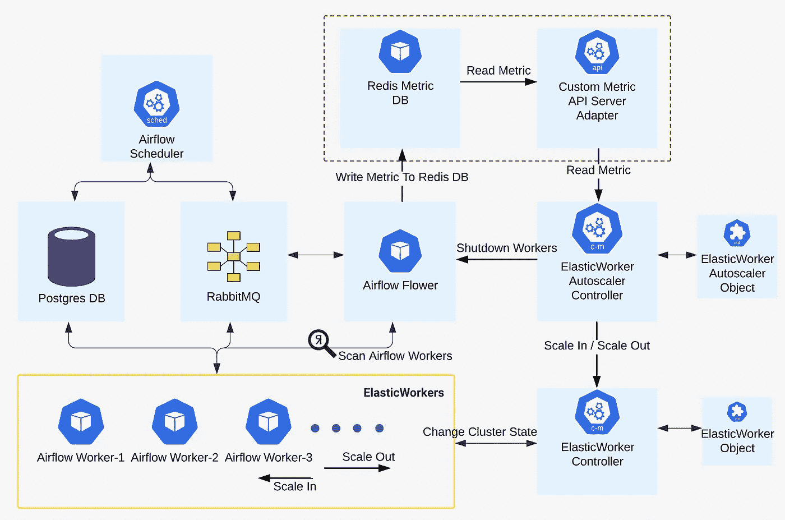
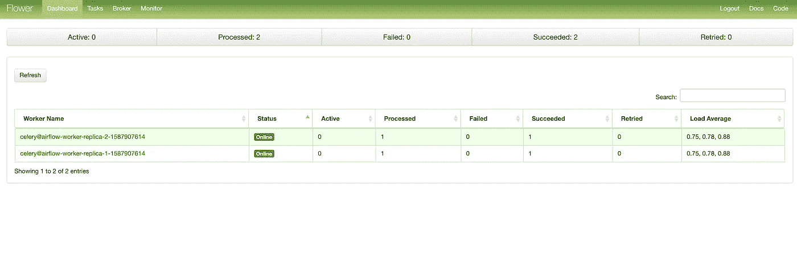
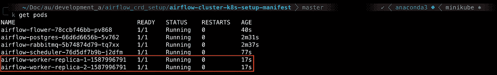
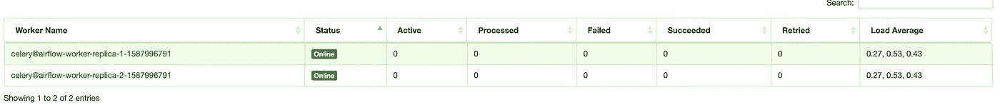
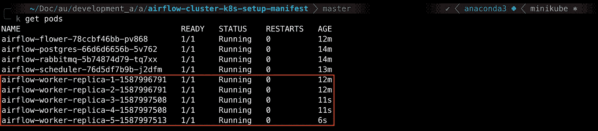
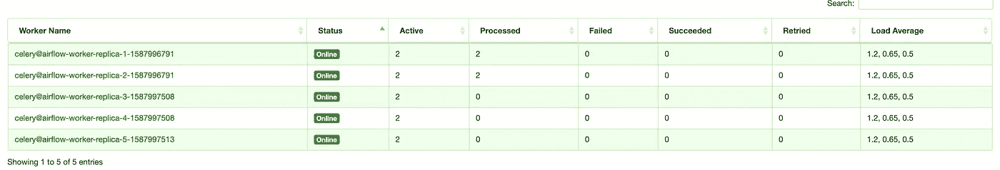
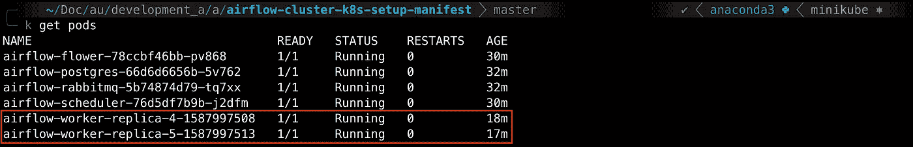
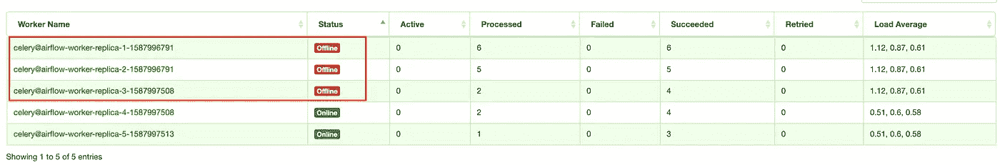
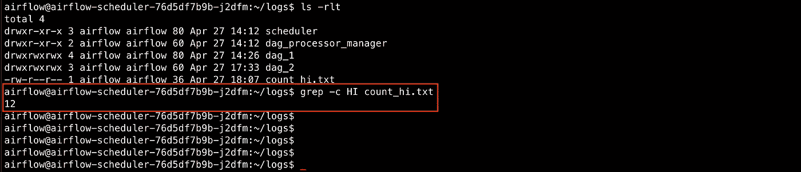

# Kubernetes 上的弹性(自动缩放)气流簇

> 原文：<https://itnext.io/elastic-autoscaling-airflow-cluster-in-kubernetes-14c16c73cac9?source=collection_archive---------0----------------------->

在本文中，我将演示如何构建一个弹性气流集群*，它可以在高负载时向外扩展，在负载低于阈值时安全地*向内扩展。**

> **如果您想先测试一下，请滚动到 setup。**

**Kubernetes 中的自动缩放通过水平 Pod 自动缩放器来支持。使用 HPA，横向扩展非常简单，HPA 增加了部署的副本，并且创建了额外的工作人员来分担工作负载。然而，扩大是问题所在，s [扩大过程通过基于它们在一个节点上的共同位置对它们进行排序来选择要终止的 pod。](https://github.com/kubernetes/kubernetes/blob/cb719f75aac98ca24224c563d80d1035079885a5/pkg/controller/replicaset/replica_set.go#L604)所以，如果有一个 worker pod 还在做一些处理，就不能保证它不会被终止。**

**在弹性气流集群中，为了扩大规模，我们需要保证执行某些处理的工作人员不会被终止。只有无所事事的员工才应该被考虑解雇。**

**为了实现这一点，我创建了两个 CRD 和两个控制器—**elastic worker**&**elastic worker rautoscaler**，这两个都将在本文后面描述。**

**这个问题还有其他的解决方案，例如，您可以创建 Kubernetes job，它会为一组任务运行到完成。随着负荷的增加，创造了更多的工作岗位。然而，这种方法并不是一种通用的解决方案，不能很好地适应具有类似自动缩放需求的其他用例。这里描述的方法是一个通用的实现，可以用作全面生产设置的起点。**

# **弹性气流集群架构**

****

**弹性气流集群架构**

**组件描述如下:**

*   ****气流调度器**解析[Dag](https://airflow.apache.org/docs/stable/concepts.html#dags)并将必要的任务添加到 RabbitMQ 队列中。**
*   **PostgresDB 保存关于任务、Dag、变量、连接等状态的信息。**
*   ****RabbitMQ** 将执行命令存储在队列中。**
*   **[**气流工作者**](https://docs.celeryproject.org/en/stable/userguide/index.html) 从 RabbitMQ 获取命令并执行。**
*   **[**Flower**](https://flower.readthedocs.io/en/latest/) 是一个基于 web 的工具，用于监控和管理芹菜工人。在我们的设置中，flower 还包含额外的脚本来获取每个 airflow worker 的指标，并将其放入 redis db 中。**
*   ****Redis DB** 存储每个 airflow worker pod 的负载指标以及集群总负载的总和。它还存储我们的自定义指标 APIServer 适配器的所有注册指标。**
*   ****定制指标 API 服务器适配器**是一个基本的定制指标 API 服务器适配器，分别为给定 pod 和 airflow 集群资源的*负载*和 *total_cluster_load* 指标请求提供服务。它从 Redis db 中检索这些指标。**
*   ****ElasticWorker 控制器**监视种类为***ElasticWorker(CRD)***的对象，并使集群状态与相应 elastic worker 对象中的规范保持一致。在高层次上，下面是该管制员的职责，**

**—创建等于`minReplica`的工人舱**

**—如果变量`scale>0`，创建额外的工人舱。但是要确保吊舱总数不超过`maxReplicas`**

**——在`scale<0`时删除工人舱。pod 的删除由策略中定义的比例控制。目前有三种策略，即 [ScaleInImmediately](https://github.com/sarweshsuman/elastic-worker-autoscaler/blob/435c159d4b3be0b501230aebaca53c21b6440ef6/api/v1/elasticworker_types.go#L77) 、 [ScaleInBySelector](https://github.com/sarweshsuman/elastic-worker-autoscaler/blob/435c159d4b3be0b501230aebaca53c21b6440ef6/api/v1/elasticworker_types.go#L81) 、[ScaleInBySelector](https://github.com/sarweshsuman/elastic-worker-autoscaler/blob/435c159d4b3be0b501230aebaca53c21b6440ef6/api/v1/elasticworker_types.go#L84)，这里我们将使用 ScaleInBySelector 策略。这确保控制器只删除那些已定义标签集的窗格。它还确保无论标签是否设置，豆荚数都不会低于`minReplicas`。**

```
**apiVersion: elasticcluster.sarweshsuman.com/v1
kind: ElasticWorker
metadata:
  name: elasticworker-sample
spec:
  minReplicas: 2
  maxReplicas: 5
  scaleInPolicy:  
    name: selector
    selector:
      matchLabels:
        **# Only pods with below labels are considered for deletion**
        delete: "true"  
  selector:
    matchLabels:
      worker: elastic-workers
  template:
    metadata:
      labels:
        worker: elastic-workers
    spec:
      containers:
      - name: worker-1
        image: busybox:latest
        command: ['sleep','30000']**
```

*   ****ElasticWorkerAutoscaler 控制器**监视实物**elastic workerautoscaler(CRD)**。下面的高层是这个管制员的职责，**

**—检索名为 referent ElasticWorker 对象的资源的指标`total_cluster_load`。**

**—横向扩展 if `total_cluster_load > targetValue`。计算新工人 pod 计数，以将负荷降低到目标值。[计算与 HPA 相同。](https://kubernetes.io/docs/tasks/run-application/horizontal-pod-autoscale/#algorithm-details)设置 referent ElasticWorker 对象的`scale`属性，需要额外的工作线程数。**

**——放大如果`total_cluster_load < 0.70 * targetValue`。如果负载低于阈值，则不会立即开始放大，b [ut，](https://github.com/sarweshsuman/elastic-worker-autoscaler/blob/435c159d4b3be0b501230aebaca53c21b6440ef6/api/v1/elasticworkerautoscaler_types.go#L65) `[scaleInBackOff](https://github.com/sarweshsuman/elastic-worker-autoscaler/blob/435c159d4b3be0b501230aebaca53c21b6440ef6/api/v1/elasticworkerautoscaler_types.go#L65)` [周期被取消](https://github.com/sarweshsuman/elastic-worker-autoscaler/blob/435c159d4b3be0b501230aebaca53c21b6440ef6/api/v1/elasticworkerautoscaler_types.go#L65)。默认情况下，它设置为 30 秒，如果此时间段结束，则执行放大。如果同时`total_cluster_load`增加，则 ScaleInBackOff 周期无效。一旦周期结束，控制器选择那些具有度量`load=0`的工人舱。[然后它调用请求](https://github.com/sarweshsuman/elastic-worker-autoscaler/blob/435c159d4b3be0b501230aebaca53c21b6440ef6/api/v1/elasticworkerautoscaler_types.go#L52)中的 shutdownHttpHook。这个钩子是为这个实现定制的，但是可以通用化。接下来，控制器用终止标签标记 pod，最后用适当的值更新`scale`,使 ElasticWorker 控制器改变集群状态。**

**—在过滤器`load=0`、`ShutdownHttpHook`和`TerminationLabel`的帮助下，确保只有那些不做任何事情的气流工人被终止。HttpShutdown 挂钩很重要，因为它确保了在 ElasticWorker 控制器终止任务时，标记为终止 airflow workers 的*不会从 RabbitMQ 获取任何任务。***

```
**apiVersion: elasticcluster.sarweshsuman.com/v1
kind: ElasticWorkerAutoscaler
metadata:
  name: elasticworkerautoscaler-sample
spec:
  scaleTargetRef:
    name: elasticworker-sample
    namespace: default
  metricSpec:
    name: total_cluster_load
    **# Has to be same as referent ElasticWorker object name**
    resourceName: elasticworker-sample
    namespace: default
  targetValue: 80
  scaleInSpec:
    shutdownHttpHook: [http://localhost:8888/shutdownpods](http://localhost:8888/shutdownpods)
    podMetricSpec:
      name: load
      namespace: default
    markForTerminationLabel:
      delete: "true"**
```

# ****设置****

**elastic worker & elastic worker rautoscaler 控制器代码可在此处获得—[*elastic-worker-auto scaler*](https://github.com/sarweshsuman/elastic-worker-autoscaler)*。***

**定制的 metric APIServer 适配器代码在这里可以找到—[*elastic-worker-custom metrics—adapter*](https://github.com/sarweshsuman/elastic-worker-custommetrics-adapter)*。***

****按照这里的设置说明**—[—*弹性-气流-集群-k8s-设置-清单*](https://github.com/sarweshsuman/elastic-airflow-cluster-k8s-setup-manifests) *。***

**在设置和运行测试 DAG 后，我们可以在 flower 仪表板中看到统计数据，以确保 airflow cluster 设置正常。**

****

**花卉仪表板**

**此外，我们可以用下面的命令启动 Kubernetes dashboard 并验证它，**

```
**minikube dashboard**
```

**我们在 minikube 上设置如下:**

**两个附加的名称空间，**

*   **弹性工人自动定标系统**
*   **elastic worker-自定义度量**

****—名称空间:**elastic worker-custom metrics 包含与定制指标相关的 pod。**

****—名称空间:**elastic-worker-auto scaler-system 包含用于 *ElasticWorker* 和*elastic worker rautoscaler*的控制器盒**

**其余的组件在*默认的*命名空间中创建。**

**我们可以使用以下命令检索 ElasticWorker 对象，**

```
**kubectl get elasticworkers**
```

**我们可以使用以下命令检索 ElasticWorkerAutoscaler 对象，**

```
**kubectl get elasticworkerautoscalers**
```

**现在设置已经完成。我们可以从自动缩放测试开始。**

# **测试**

**我们已经在设置时使用 [dag_1](https://github.com/sarweshsuman/elastic-airflow-cluster-k8s-setup-manifests/blob/master/sample-dags/dag_1.py) 测试了气流群集。如果不是，那么[到这里用 DAG](https://github.com/sarweshsuman/elastic-airflow-cluster-k8s-setup-manifests) 进行测试。我们将在这里使用相同的 DAG 进行测试。**

**为了测试，我在 ElasticWorkerAutoscaler 对象中将[目标值设置为 60。这意味着一旦总群集负载超过 60，将开始向外扩展，如果负载低于 30，将开始向内扩展。](https://github.com/sarweshsuman/elastic-airflow-cluster-k8s-setup-manifests/blob/master/elasticcluster-autoscaler.yaml)**

**我们将通过登录到 scheduler pod 来触发 Dag。**

**我们将从测试**横向扩展场景开始。****

**在我们的设置中，每个 airflow worker 的并发性设置为 2，这意味着我们总共有 2(并发性)*2(工作线程数)= 4 个可用的插槽。因此，触发 4 个 Dag 将使集群负载上升到 100%。**

**在这个测试案例中，我们将同时触发 10 个以上的 Dag(即我们需要 10 个以上的插槽)。这将导致 airflow worker 集群扩展到 maxReplica(即 5 个副本)。ElasticWorker 控制器将确保 Worker 计数不超过 maxReplica，即使负载保持在 100%。**

**下面的截图是开始测试前的气流工人集群。目前，我们有两个工人，所有的位置都是空的。**

****

**kubectl 获取豆荚**

****

**花卉仪表板**

**让我们通过登录到 scheduler pod 来触发 Dag。如果尚未取消暂停 DAG，请记住取消暂停。**

```
****#Login to Scheduler POD** kubectl exec -it airflow-scheduler-76d5df7b9b-mjp25 bashcd dags
**#If you have not unpaused dag_1 already**
airflow unpause dag_1export COUNT=0
while [[ $COUNT -lt 12 ]];
do
airflow trigger_dag dag_1
COUNT=`expr $COUNT + 1`
done;**
```

**随着负载的增加，我们看到会产生额外的气流工人来处理负载。**

****

**kubectl 获取豆荚**

****

**花卉仪表板**

**当我们触发 12 个 Dag 时，创建的额外气流工作线程应该不止 3 个，但是由于我们将 maxReplicas 设置为 5，ElasticWorker controller 没有创建超过 5 个的工作线程。**

**我们的横向扩展方案行得通！！**

**接下来，我们将测试**扩展场景。****

***之前的测试已经验证了基本的扩展场景*。如果我们等待一两分钟并检查集群状态，我们可以看到 worker count 已经缩减到 minReplicas。这是因为负载降至 30 以下。**

****

**kubectl 获取豆荚**

****

**花卉仪表板**

**我们还希望验证它是安全的扩展，即当触发扩展时，控制器将终止负载为 0 的工作线程，而不是仍在执行某些工作的工作线程。**

**为了测试这个场景，我们将使用 [dag_2](https://github.com/sarweshsuman/elastic-airflow-cluster-k8s-setup-manifests/blob/master/sample-dags/dag_2.py) ，它的任务将休眠 30 秒，然后将消息 HI 记录到文件`/home/airflow/logs/count_hi.txt` 中。我们将触发 DAG 12 次，每触发 4 次后，我们将等待 40 多秒，然后再次触发。**

**我们在中间等待触发放大。扩展的默认回退时间为 30 秒，这是为了避免抖动。**

**为了最终验证是否所有的任务都运行良好，并且实际执行处理的工人都没有被终止，我们只在输出文件中计算 message HI。如果它等于我们触发的 Dag 数(12 ),那么我们的测试用例将通过。**

**如下图创建 dag_2，**

```
****# Lets copy the dag_2.py file into minikube VM** minikube ssh
cd dags/
cat>dag_2.py
....PASTE CONTENT FROM SAMPLE DAG....
ctrl-d
logout**
```

**从调度程序窗格触发 DAG。**

```
****#Login to Scheduler POD** kubectl exec -it airflow-scheduler-76d5df7b9b-mjp25 bashcd dags
**#If you have not unpaused dag_2 already**
airflow unpause dag_2export COUNT=0
while [[ $COUNT -lt 4 ]];
do
airflow trigger_dag dag_2
COUNT=`expr $COUNT + 1`
done;sleep 40export COUNT=0
while [[ $COUNT -lt 4 ]];
do
airflow trigger_dag dag_2
COUNT=`expr $COUNT + 1`
done;sleep 45export COUNT=0
while [[ $COUNT -lt 4 ]];
do
airflow trigger_dag dag_2
COUNT=`expr $COUNT + 1`
done;**
```

**一旦所有的任务都被处理，我们将对消息 HI 进行计数。我们将使用 scheduler 窗格来检查输出文件。**

****

**从上面的截图中我们可以看到，消息 HI 被打印了 12 次，这与任务的数量相同。**

**这结束了我们的最后一个测试案例。**

# **结论**

**在本文中，我们看到了如何构建一个**弹性气流集群**，当负载增加到某个阈值以上时，它可以向外扩展；当负载低于某个阈值时，它可以安全地向内扩展。**

**我们使用了两个新的 CRD—**elastic worker**和**elastic worker rautoscaler**以及它们各自的控制器来实现这一点。ElasticWorker 控制器管理 airflow worker 副本，并确保它在 minReplica 和 maxReplica 之间。ElasticWorkerAutoscaler 控制器轮询指标*总集群负载*，并计算使集群负载达到指定的*目标值*所需的副本。然后，它将 referent ElasticWorker 对象更新为放大或缩小。**

**PS:**

*   **两个控制器代码都是原型，它们缺少某些特性，例如，ElasticWorker 对象不提供滚动升级。**
*   **此处进行的自定义度量设置是为了学习，但对于生产用途，应使用 prometheus 设置。**
*   **有关详细信息和更新，您可以参考下面的回购、**

**[](https://github.com/sarweshsuman/elastic-airflow-cluster-k8s-setup-manifests#elastic-airflow-cluster-k8s-setup-manifests) [## sarweshsuman/elastic-air flow-cluster-k8s-设置-清单

### 此报告包含气流群集组件的 dockerfiles/yaml。安装迷你库安装迷你库…

github.com](https://github.com/sarweshsuman/elastic-airflow-cluster-k8s-setup-manifests#elastic-airflow-cluster-k8s-setup-manifests) [](https://github.com/sarweshsuman/elastic-worker-custommetrics-adapter) [## sarweshsuman/elastic-worker-custom metrics-适配器

### 包含通过 Kubernetes 中的聚合层启用的弹性工作器自定义指标 APIserver 适配器的适配器代码…

github.com](https://github.com/sarweshsuman/elastic-worker-custommetrics-adapter) [](https://github.com/sarweshsuman/elastic-worker-autoscaler) [## sarweshsuman/elastic-worker-autoscaler

### 包含协调在 Kubernetes 中创建的 ElasticWorker 和 ElasticWorkerAutoscaler 对象的控制器代码…

github.com](https://github.com/sarweshsuman/elastic-worker-autoscaler)**