# 弹性豆茎是你的家伙来运行你的。AWS 上的网络应用

> 原文：<https://itnext.io/elastic-beanstalk-is-your-guy-to-run-your-net-apps-on-aws-13b6138013a9?source=collection_archive---------5----------------------->

在我公司的一个小项目中，我需要将一个带有 MS-SQL 数据库的 ASP.Net MVC 应用程序部署到云中。我有几次使用微软 Azure 的经验，但是，由于我们已经在其他应用程序中使用了 AWS，我们决定将这个应用程序部署到 AWS。在这篇文章中，我想描述我所遵循的步骤以及花了我一些时间来解决的问题。

*我假设你有一个 AWS 帐户来尝试这些步骤*

# 弹性豆茎

[Elastic Beanstalk](https://aws.amazon.com/elasticbeanstalk/) 是一个让运行 Java 开发的应用成为可能的家伙。NET、PHP 等。首先要做的是在控制台上搜索**弹性豆茎**:

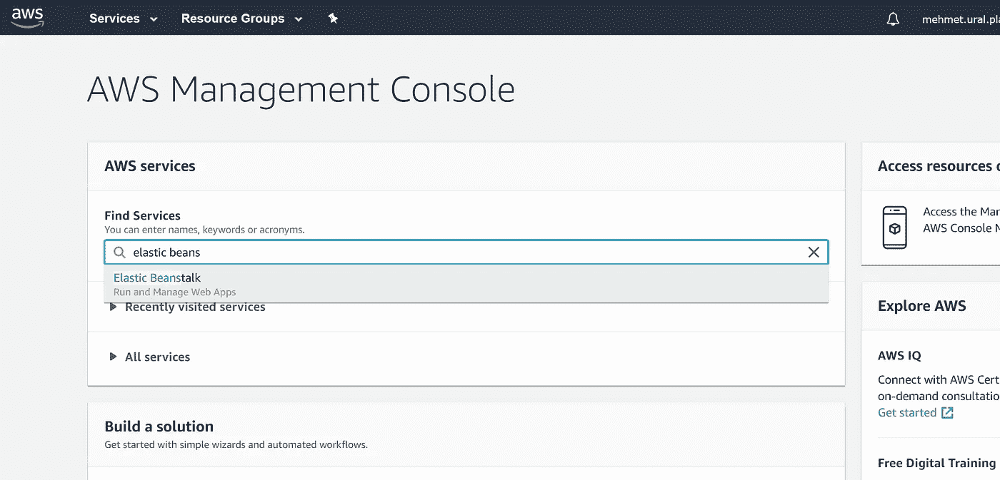

AWS 控制台

单击链接并导航到 Elastic Beanstalk 仪表板后，单击右上角的**创建新应用程序**按钮。填充弹出窗口，然后点击创建按钮。

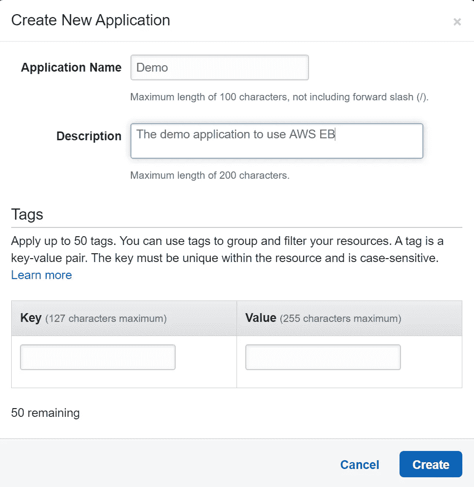

新应用程序弹出窗口

创建应用程序后，我们需要创建一个环境。在创建环境时，我们将配置 Elastic Beanstalk 来运行我们的 ASP.NET MVC 应用程序。现在，从右上角的**动作**下拉菜单中点击“创建环境”按钮，并选择“Web 服务器环境”。

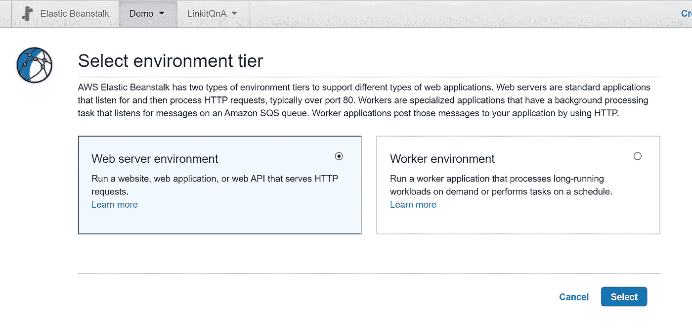

在接下来的页面中，我们将环境设置为运行 ASP.Net 应用程序。根据需要填充命名和其他部分，并设置平台。Net (Windows/IIS)。将应用程序代码部分保留为“简单”应用程序。

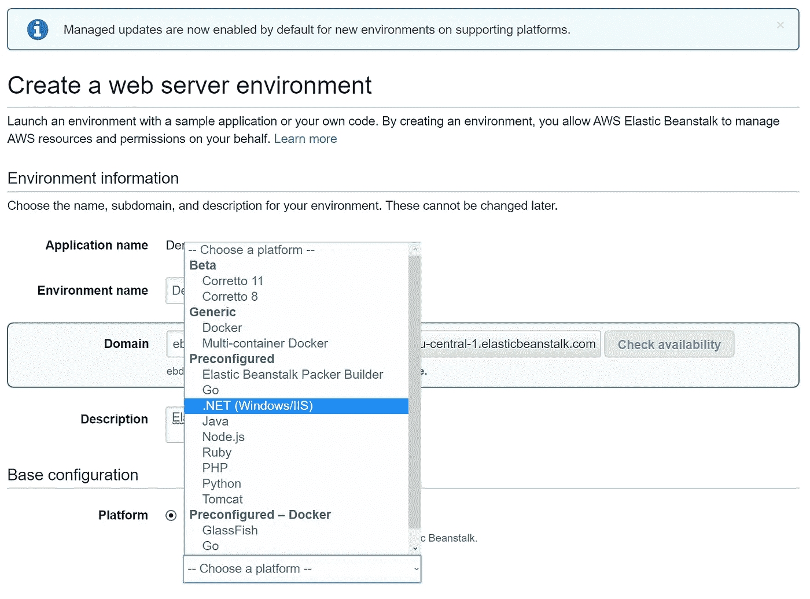

单击“创建”按钮后，需要一段时间。完成后，您可以浏览您的简单应用程序。

# **设置数据库**

从左侧菜单中，单击“配置”，滚动到页面底部。在“数据库”行中，单击“修改”按钮。

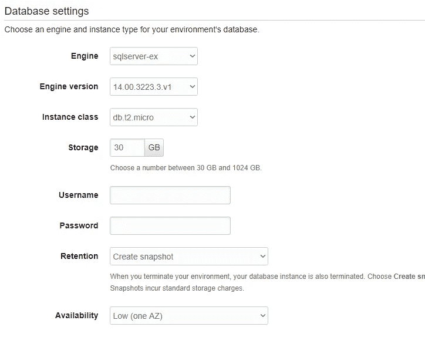

您可以在这里创建几种类型的数据库，但我们特别需要一个 MSSQN，所以选择“sqlserver-ex”。选择您需要的实例类，并设置访问数据库的用户名和密码。点击“应用”按钮，让 AWS 创建您的数据库。大约一分钟后，您的数据库就准备好了。

*注意:您将看到 MSSQL 服务器的三个选项(Express，Web & SE)。在本教程中，我选择了 SQL Server Express，因为我只需要一个小的。*

当操作完成时，导航到您的数据库仪表板并获取端点信息以创建您的连接字符串。

# 上传应用程序

当您查看弹性 Beanstalk 仪表板时，您会看到一个名为“上传和部署”的按钮。你可以使用该功能上传你的应用，但我为此使用了一个 VisualStudio 的扩展。

打开 Visual Studio，从顶部的扩展菜单中，单击管理扩展并搜索“AWS Toolkit”

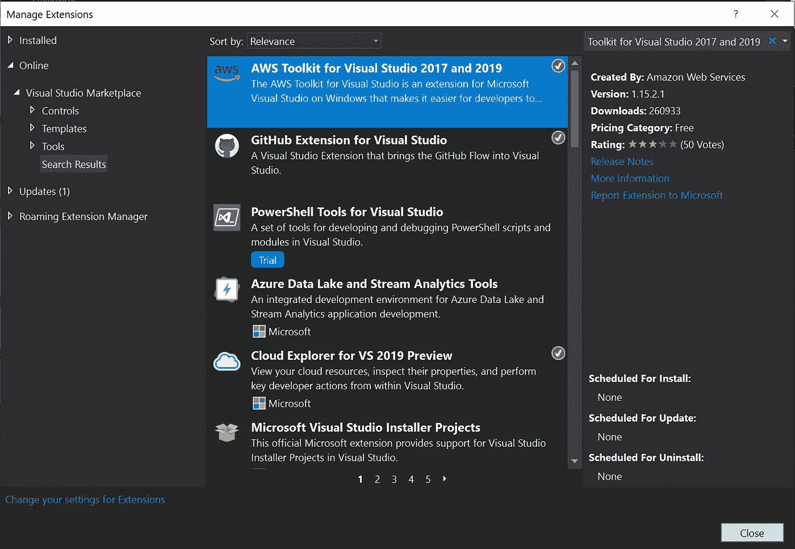

VS 的 AWS 扩展

安装完扩展后(如果不受影响，请重启)，右键单击您的应用程序项目，然后单击“发布到 AWS Elastic Beanstalk”

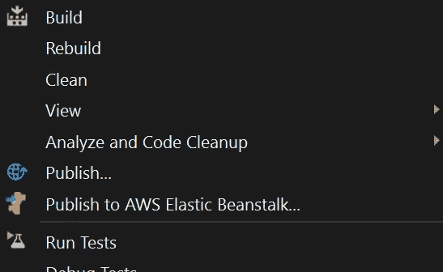

下面的屏幕将询问您如何创建一个概要文件。如果您有相关权限，您可以从 AWS 控制台获得所有信息。如果您不知道，请咨询您的 AWS 管理员。

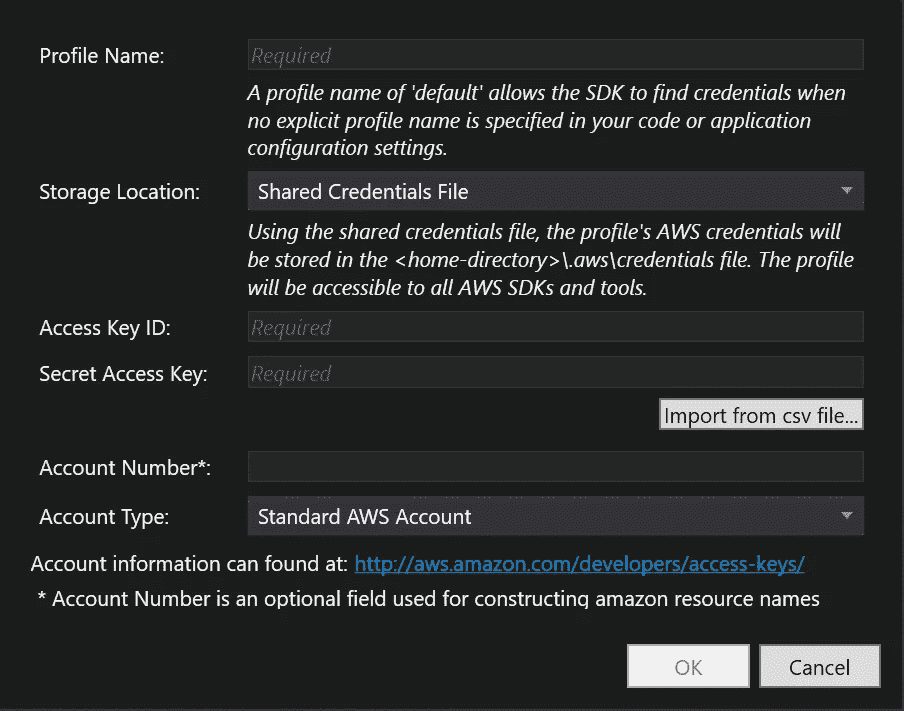

填写表格后，您将看到您的环境已列出。单击我们刚才创建的环境，然后单击“Next”。

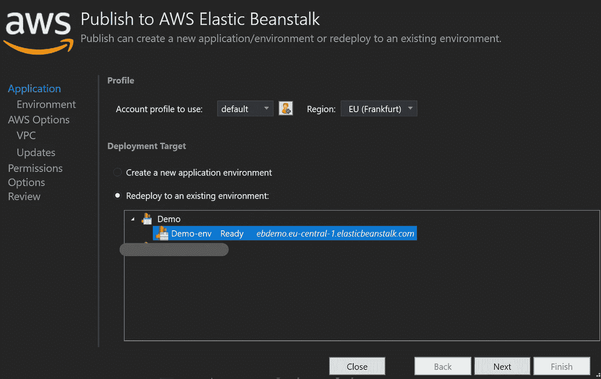

在以下屏幕中，为您的应用选择合适的参数。我为构建配置选择了“发布”,并启用了 32 位应用程序。

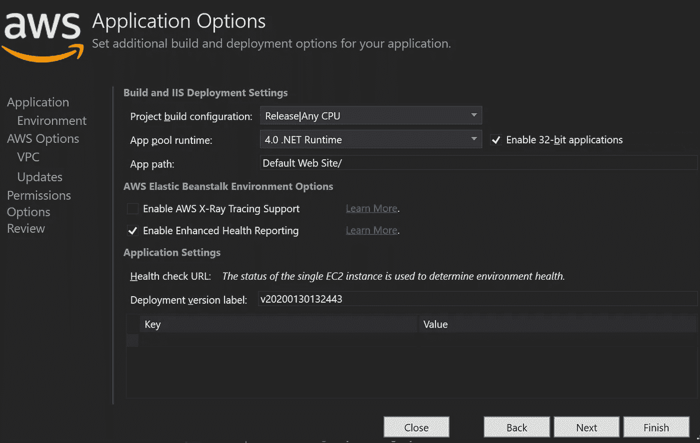

如果您点击“下一步”,您将看到部署前的摘要。点击“完成”，这样可以节省时间:)

您可以从输出窗口观察操作。该过程完成后，您可以浏览您的应用程序。

现在，我想指出我花了一些时间解决的一些问题:

**1 —文件夹访问**

ASP。Net MVC 为所有人做捆绑。js 和。css 在启动时，但当我试图浏览应用程序时，AWS 不允许它写捆绑文件。这也取消了所有的**文件上传**和将这些文件写入文件夹。

要允许应用程序写入 AWS 中的特定文件夹，您需要创建一个名为`.ebextensions`的文件夹，并在该文件夹中创建一个名为`permissions.config`的文件。该文件应该是 JSON 或 YAML 格式。数字代表执行的顺序。

我的配置如下所示:我选择了 JSON，并输入了设置相关权限的命令。要了解更多信息，请查看'[**EB extensions**](https://docs.aws.amazon.com/elasticbeanstalk/latest/dg/ebextensions.html)**'。**

```
{
 "container_commands": {
  "01": {
   "command": "icacls \"C:/inetpub/wwwroot/Content/cache\" /grant DefaultAppPool:(OI)(CI)F"
  },
  "02": {
   "command": "icacls \"C:/inetpub/wwwroot/Scripts/cache\" /grant DefaultAppPool:(OI)(CI)F"
  },
  "03": {
   "command": "icacls \"C:/inetpub/wwwroot/Content/uploads\" /grant DefaultAppPool:(OI)(CI)F"
  }
 }
}
```

还有一个小小的建议；如果你想上传文件到 AWS，使用 [S3 桶](https://aws.amazon.com/s3/)。

**2 —设置域**

首先，我试着在 AWS 中做这件事，但是多亏了我的同事，他们通过我们 ICT 团队的域导航处理了这种情况。所以，我避免做领域工作。

**3 —配置 SSL**

当您获得为您的域准备的 SSL 证书时，您需要将它上传到 AWS。导航到证书管理器。你的证书应该是 PEM 编码的。上传您的证书，复制您的证书内容并粘贴到**导入证书**菜单中的框中。

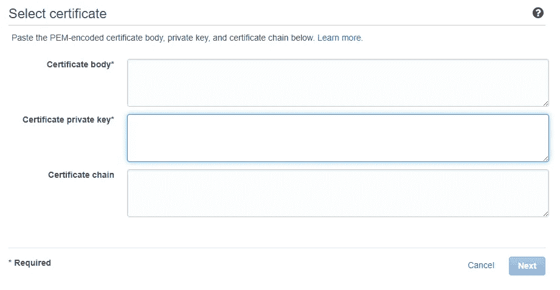

上传证书后，创建一个负载平衡器来设置证书。在控制台中搜索 EC2。单击“负载平衡器”并创建一个新的。

选择经典款

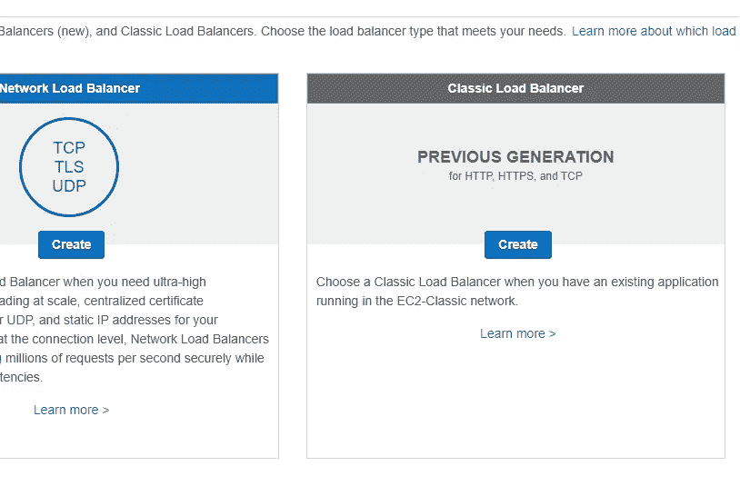

给你的 LB 取一个名字，点击 next 直到 **Add EC2 Instances** 按钮。在**添加 EC2 实例中，**选择您的 env

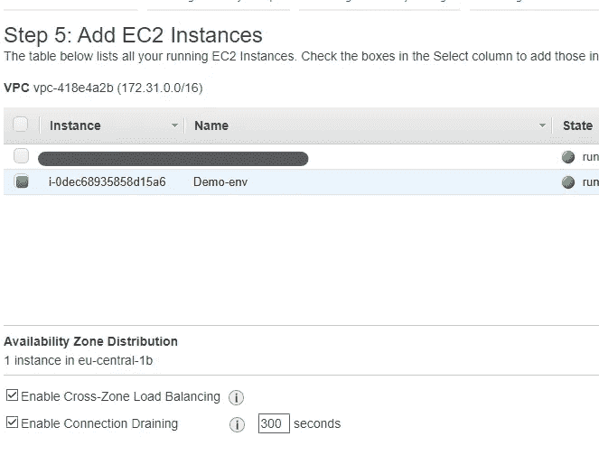

然后在检查您的设置后完成向导。

创建 LB 后，检查实例的状态。如果它显示'**0/1 实例正在服务'**'，请检查中同名的*健康检查*配置。之后，一切都应该会好起来。

现在，为了设置我们之前上传的 SSL 证书，切换到**监听器**选项卡并添加一个新的监听器。

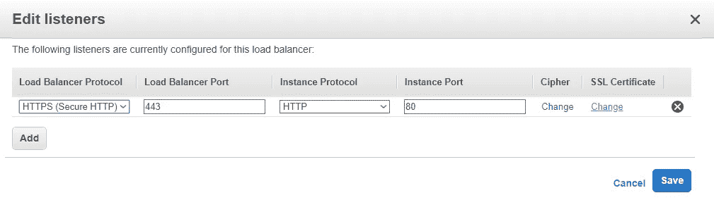

首先，为负载平衡器协议设置 HTTPS。然后，从右边的列中，选择您刚才上传的 SSL 证书。

在这些步骤的最后，你应该在 **https** 中浏览你的应用。

在本教程中，我跳过了大部分配置部分，因为我不是 AWS 工程师。我只是想向您展示，您可以在 AWS 上轻松地将您的 ASP.NET 应用程序投入生产。