# 弹性堆栈:概述和 ELK 在 Ubuntu 20.04 上的安装

> 原文：<https://itnext.io/elastic-stack-an-overview-and-elk-installation-on-ubuntu-20-04-e4bc61c69c7b?source=collection_archive---------9----------------------->


我最后一次与麋鹿栈合作是在大约 7 年前，参见[麋鹿:установкаelastic search+Logstash+ki BanaнаCentOS](https://rtfm.co.ua/centos-ustanovka-elasticsearch-logstash-kibana-elk/)。

目前，我们正在使用 [Logz.io](http://Logz.io) ，但是它的成本越来越高，所以我们开始寻找在我们的 AWS 弹性 Kubernetes 服务集群上运行的自托管 ELK 解决方案。

因此，目前的任务是旋转弹性堆栈，检查如何将其安装在 Ubuntu 20.04 上，使用 Filebeat 配置日志收集，使用 Logstash 进行转换，保存到 Elasticsearch 数据库，使用 Kibana 显示，并查看所有这些组件如何在幕后协同工作。

主要目标是检查它们的配置，并了解它们是如何协同工作的。这将“像一个生产设置”，所以我们不会检查一些 Kinaa 设置，如用户认证，而是我们会看看`grok`，弹性搜索索引，等等。

尽管如此，像往常一样，我会在帖子的末尾添加一些链接。

请记住:“ ***10 个小时的调试和尝试，看看它是如何工作的，将为您节省 10 分钟阅读文档的时间”*** 。

# 内容

*   [弹性堆栈:组件概述](https://rtfm.co.ua/en/elastic-stack-an-overview-and-elk-installation-on-ubuntu-20-04/#Elastic_Stack_components_overview)
*   [创建 AWSес2](https://rtfm.co.ua/en/elastic-stack-an-overview-and-elk-installation-on-ubuntu-20-04/#Create_an_AWS_%D0%95%D0%A12)
*   [Ubuntu 20.04 上的弹性堆栈/ELK 安装](https://rtfm.co.ua/en/elastic-stack-an-overview-and-elk-installation-on-ubuntu-20-04/#Elastic_StackELK_installation_on_Ubuntu_2004)
*   [弹性搜索装置](https://rtfm.co.ua/en/elastic-stack-an-overview-and-elk-installation-on-ubuntu-20-04/#Elasticsearch_installation)
*   [弹性搜索指数](https://rtfm.co.ua/en/elastic-stack-an-overview-and-elk-installation-on-ubuntu-20-04/#Elasticsearch_Index)
*   [查看索引](https://rtfm.co.ua/en/elastic-stack-an-overview-and-elk-installation-on-ubuntu-20-04/#View_an_Index)
*   [创建一个索引](https://rtfm.co.ua/en/elastic-stack-an-overview-and-elk-installation-on-ubuntu-20-04/#Create_an_Index)
*   [在索引中创建文档](https://rtfm.co.ua/en/elastic-stack-an-overview-and-elk-installation-on-ubuntu-20-04/#Create_a_document_in_an_index)
*   [搜索索引](https://rtfm.co.ua/en/elastic-stack-an-overview-and-elk-installation-on-ubuntu-20-04/#Searching_an_index)
*   [删除一个索引](https://rtfm.co.ua/en/elastic-stack-an-overview-and-elk-installation-on-ubuntu-20-04/#Delete_an_index)
*   [日志存储安装](https://rtfm.co.ua/en/elastic-stack-an-overview-and-elk-installation-on-ubuntu-20-04/#Logstash_installation)
*   [使用 Logstash 管道](https://rtfm.co.ua/en/elastic-stack-an-overview-and-elk-installation-on-ubuntu-20-04/#Working_with_Logstash_pipelines)
*   [Logstash 输入和输出](https://rtfm.co.ua/en/elastic-stack-an-overview-and-elk-installation-on-ubuntu-20-04/#Logstash_Input_and_Output)
*   [日志存储过滤器:grok](https://rtfm.co.ua/en/elastic-stack-an-overview-and-elk-installation-on-ubuntu-20-04/#Logstash_Filter_grok)
*   [日志存储输入:文件](https://rtfm.co.ua/en/elastic-stack-an-overview-and-elk-installation-on-ubuntu-20-04/#Logstash_Input_file)
*   [Logstash 输出:elasticsearch](https://rtfm.co.ua/en/elastic-stack-an-overview-and-elk-installation-on-ubuntu-20-04/#Logstash_output_elasticsearch)
*   [Filebeat 安装](https://rtfm.co.ua/en/elastic-stack-an-overview-and-elk-installation-on-ubuntu-20-04/#Filebeat_installation)
*   [基巴纳装置](https://rtfm.co.ua/en/elastic-stack-an-overview-and-elk-installation-on-ubuntu-20-04/#Kibana_installation)
*   [Logstash、Filebeat 和 NGINX:配置示例](https://rtfm.co.ua/en/elastic-stack-an-overview-and-elk-installation-on-ubuntu-20-04/#Logstash_Filebeat_and_NGINX_configuration_example)
*   [Filebeat 输入配置](https://rtfm.co.ua/en/elastic-stack-an-overview-and-elk-installation-on-ubuntu-20-04/#Filebeat_Inputs_configguration)
*   [日志存储配置](https://rtfm.co.ua/en/elastic-stack-an-overview-and-elk-installation-on-ubuntu-20-04/#Logstash_configuration)
*   [有用的链接](https://rtfm.co.ua/en/elastic-stack-an-overview-and-elk-installation-on-ubuntu-20-04/#Useful_links)
*   [弹性栈](https://rtfm.co.ua/en/elastic-stack-an-overview-and-elk-installation-on-ubuntu-20-04/#Elastic_Stack)
*   [弹性搜索](https://rtfm.co.ua/en/elastic-stack-an-overview-and-elk-installation-on-ubuntu-20-04/#Elasticsearch)
*   [日志存储](https://rtfm.co.ua/en/elastic-stack-an-overview-and-elk-installation-on-ubuntu-20-04/#Logstash)
*   [Filebeat](https://rtfm.co.ua/en/elastic-stack-an-overview-and-elk-installation-on-ubuntu-20-04/#Filebeat)

# 弹性堆栈:组件概述

Elastic Stack，以前被称为 ELK(elastic search+Logstash+Kibana ),是最著名和最广泛使用的日志收集和聚合系统之一。此外，它还可以用来显示来自服务的指标—云、服务器等。

弹性堆栈由三个主要组件组成:

*   [**elastic search**](https://www.elastic.co/):使用 [Elasticsearch Index](https://opster.com/guides/elasticsearch/glossary/elasticsearch-index/) 的具有快速搜索功能的数据库

*   [**Kibana**](https://www.elastic.co/kibana/) :显示来自 Elasticsearch 的数据的 web 界面

另外，ELK 还有一套叫做 ***Beats*** 的附加工具用来收集数据。其中，值得一提的是用于收集日志的 Filebeat 和用于收集 CPU、内存、磁盘等信息的 Metricbeat。另请参见 [Logz.io:来自 Kubernetes 的收集日志— fluentd 与 filebeat](https://rtfm.co.ua/en/logz-io-collection-logs-from-kubernetes-fluentd-vs-filebeat/) 。

因此，堆栈的工作流程如下:

1.  服务器生成数据，例如日志
2.  然后由本地 Beat 应用程序收集数据，对于日志，这将是 Filebeat(虽然这不是强制性的，日志可以由 Logstash 本身收集)，然后将数据发送到 Logstash 或直接发送到 Elastisearch 数据库
3.  Logstash 从各种来源收集数据(从 Beats，或通过直接收集数据)，进行必要的转换，如添加/删除字段，然后将数据传递给 Elastisearch 数据库
4.  Elasticsearch 用于存储数据和快速搜索
5.  Kibana 用于通过 web 界面显示来自 Elastisearch 数据库的数据


# 创建 AWSес2

因此，让我们继续安装过程。

将使用 Ubuntu 20.04，运行在 AWS EC2 实例上。

将使用一个“清晰”的系统——没有任何 Docker 或 Kubernetes 集成，一切都将直接在主机上完成。

所使用的方案对于栈来说是常见的:Elasticsearch 用于存储数据，Filebeat 用于从日志中收集数据，Logstash 用于处理数据并将数据推送到弹性索引，Kibana 用于可视化。

进入 *AWS 控制台> EC2 >实例*，新建一个，选择 Ubuntu OS:


让我们选择`c5.2xlarge`实例 type - 4 vCPU，9 GB RAM，因为 Elasticsaerch 在热爱内存和 CPU 的 Java 上工作，Logstash 用 [JRuby](https://www.jruby.org/) 编写:


网络设置可以保留默认设置，因为这也是一种概念验证，所以无需深入探究:


稍后，我们将添加一个弹性 IP。

将实例的磁盘大小增加到 50 GB:

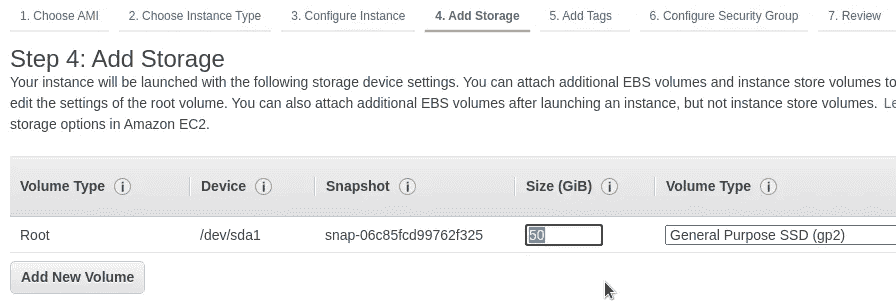

在安全组中，从您的 IP 打开 SSH 和端口 5601 (Kibana ):

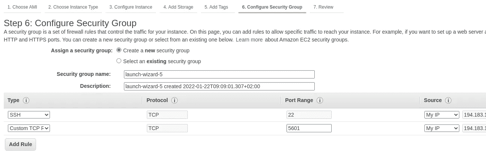

在更像生产的设置中，我们将不得不在使用 SSL 的 Kibana 之前拥有一些 NGINX 或入口资源。现在，按“原样”运行它。

创建一个新的 RSA 密钥对( ***提示*** *:在其名称*中包含一个密钥的 AWS 区域是一个好主意，保存它:

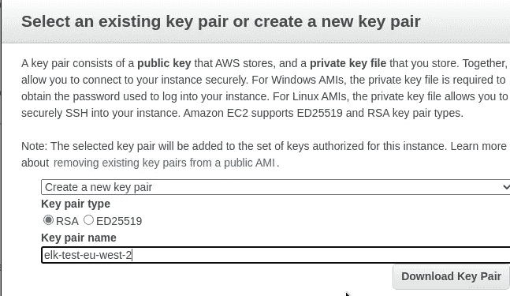

转到弹性 IP 地址，获取新的 EIP:


将其附加到 EC2 实例:

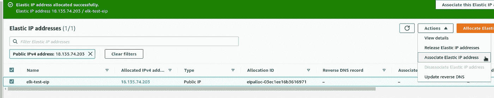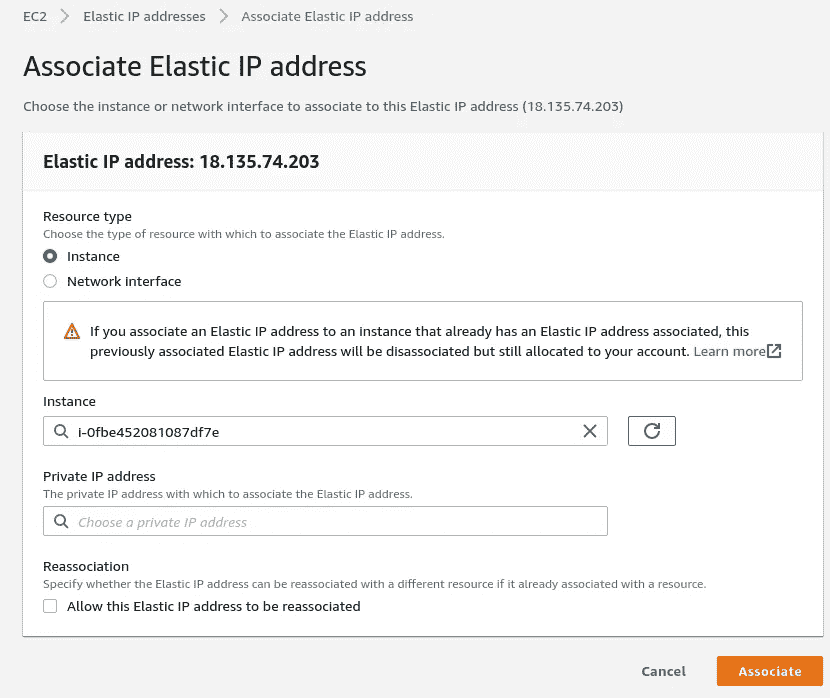

在您的工作站上，更改密钥的权限，使其仅对您的用户可读:

```
$ chmod 600 ~/Temp/elk-test-eu-west-2.pem
```

检查连接:

```
$ ssh -i ~/Temp/elk-test-eu-west-2.pem ubuntu@18.135.74.203
…
ubuntu@ip-172–31–43–4:~$
```

升级系统:

```
ubuntu@ip-172–31–43–4:~$ sudo -s
root@ip-172–31–43–4:/home/ubuntu# apt update && apt -y upgrade
```

升级后重新启动它以加载新的内核:

```
root@ip-172–31–43–4:/home/ubuntu# reboot
```

并转到 ELK 组件安装。

# Ubuntu 20.04 上的弹性堆栈/ELK 安装

添加弹性搜索存储库:

```
root@ip-172–31–43–4:/home/ubuntu# wget -qO — [https://artifacts.elastic.co/GPG-KEY-elasticsearch](https://artifacts.elastic.co/GPG-KEY-elasticsearch) | sudo apt-key add -
OKroot@ip-172–31–43–4:/home/ubuntu# apt -y install apt-transport-httpsroot@ip-172–31–43–4:/home/ubuntu# sh -c 'echo "deb [https://artifacts.elastic.co/packages/7.x/apt](https://artifacts.elastic.co/packages/7.x/apt) stable main" > /etc/apt/sources.list.d/elastic-7.x.list'
```

## 弹性搜索装置

安装`elasticsearch`包:

```
root@ip-172–31–43–4:/home/ubuntu# apt update && apt -y install elasticsearch
```

Elastic 的配置文件— `/etc/elasticsearch/elasticsearch.yml`。

添加一个新参数— `[discovery.type: single-node](https://www.elastic.co/guide/en/elasticsearch/reference/current/modules-discovery-settings.html)`，因为我们的 Elasticsearch 将作为单个节点工作，而不是作为一个集群。

如果需要更新 JVM 选项，请使用`/etc/elasticsearch/jvm.options`。

[中描述的用户和认证为 Elasticsearch](https://www.elastic.co/guide/en/elasticsearch/reference/7.16/security-minimal-setup.html) 设置了最低限度的安全性，但是现在我们将跳过这一步——对于测试，我们已经在 EC2 的 AWS SecurityGroup 中设置了限制就足够了。

启动服务，将其添加到自动启动:

```
root@ip-172–31–43–4:/home/ubuntu# systemctl start elasticsearch
root@ip-172–31–43–4:/home/ubuntu# systemctl enable elasticsearch
```

检查对 [Elasticseacrh API](https://www.elastic.co/guide/en/elasticsearch/reference/current/rest-apis.html) 的访问:

```
root@ip-172–31–43–4:/home/ubuntu# curl -X GET "localhost:9200"
{
“name” : “ip-172–31–43–4”,
“cluster_name” : “elasticsearch”,
“cluster_uuid” : “8kVCdVRySfKutRjPkkVr5w”,
“version” : {
“number” : “7.16.3”,
“build_flavor” : “default”,
“build_type” : “deb”,
“build_hash” : “4e6e4eab2297e949ec994e688dad46290d018022”,
“build_date” : “2022–01–06T23:43:02.825887787Z”,
“build_snapshot” : false,
“lucene_version” : “8.10.1”,
“minimum_wire_compatibility_version” : “6.8.0”,
“minimum_index_compatibility_version” : “6.0.0-beta1”
},
“tagline” : “You Know, for Search”
}
```

日志在`/var/log/elasticsearch`中可用，数据存储在`/var/lib/elasticsearch`目录中。

## 弹性搜索指数

让我们简短地概述一下 Elastiseacrh 中的索引，以及如何通过 API 访问它们。

事实上，你可以把它们想象成像 MySQL 一样的 RDBMS 系统中的数据库。数据库存储*文档*，这些文档是特定*类型*的 JSON 对象。

索引被分成碎片——存储在一个或多个 Elastisearch 节点上的数据段，但是碎片和聚类不在本文的讨论范围之内。

## 查看索引

要查看所有索引，请使用`GET _cat/indices?v`请求:

```
root@ip-172–31–43–4:/home/ubuntu# curl localhost:9200/_cat/indices?v
health status index uuid pri rep docs.count docs.deleted store.size pri.store.size
green open .geoip_databases 2E8sIYX0RaiqyZWzPHYHfQ 1 0 42 0 40.4mb 40.4mb
```

目前，我们只能看到 Elastic 自己的名为`.geoip_databases`的索引，其中包含 IP 块和相关区域的列表。稍后，它可以用来将访问者的信息添加到 NGINX 访问日志的数据中。

## 创建索引

添加新的空索引:

```
root@ip-172–31–43–4:/home/ubuntu# curl -X PUT localhost:9200/example_index?pretty
{
“acknowledged” : true,
“shards_acknowledged” : true,
“index” : “example_index”
}
```

检查一下:

```
root@ip-172–31–43–4:/home/ubuntu# curl localhost:9200/_cat/indices?v
health status index uuid pri rep docs.count docs.deleted store.size pri.store.size
green open .geoip_databases 2E8sIYX0RaiqyZWzPHYHfQ 1 0 42 0 40.4mb 40.4mb
yellow open example_index akWscE7MQKy_fceS9ZMGGA 1 1 0 0 226b 226b
```

`example_index`——这是我们的新索引。

并检查索引本身:

```
root@ip-172–31–43–4:/home/ubuntu# curl localhost:9200/example_index?pretty
{
“example_index” : {
“aliases” : { },
“mappings” : { },
“settings” : {
“index” : {
“routing” : {
“allocation” : {
“include” : {
“_tier_preference” : “data_content”
}
}
},
“number_of_shards” : “1”,
“provided_name” : “example_index”,
“creation_date” : “1642848658111”,
“number_of_replicas” : “1”,
“uuid” : “akWscE7MQKy_fceS9ZMGGA”,
“version” : {
“created” : “7160399”
}
}
}
}
}
```

## 在索引中创建文档

让我们向上面创建的索引添加一个简单的文档:

```
root@ip-172–31–43–4:/home/ubuntu# curl -H 'Content-Type: application/json' -X POST localhost:9200/example_index/document1?pretty -d ‘{ “name”: “Just an example doc” }’
{
“_index” : “example_index”,
“_type” : “document1”,
“_id” : “rhF0gX4Bbs_W8ADHlfFY”,
“_version” : 1,
“result” : “created”,
“_shards” : {
“total” : 2,
“successful” : 1,
“failed” : 0
},
“_seq_no” : 2,
“_primary_term” : 1
}
```

使用`_search`操作检查索引的所有内容:

```
root@ip-172–31–43–4:/home/ubuntu# curl localhost:9200/example_index/_search?pretty
{
“took” : 3,
“timed_out” : false,
“_shards” : {
“total” : 1,
“successful” : 1,
“skipped” : 0,
“failed” : 0
},
“hits” : {
“total” : {
“value” : 2,
“relation” : “eq”
},
“max_score” : 1.0,
“hits” : [
{
“_index” : “example_index”,
“_type” : “document1”,
“_id” : “qxFzgX4Bbs_W8ADHTfGi”,
“_score” : 1.0,
“_source” : {
“name” : “Just an example doc”
}
},
{
“_index” : “example_index”,
“_type” : “document1”,
“_id” : “rhF0gX4Bbs_W8ADHlfFY”,
“_score” : 1.0,
“_source” : {
“name” : “Just an example doc”
}
}
]
}
}
```

使用文档 ID —获取其内容:

```
root@ip-172–31–43–4:/home/ubuntu# curl -X GET 'localhost:9200/example_index/document1/qxFzgX4Bbs_W8ADHTfGi?pretty'
{
“_index” : “example_index”,
“_type” : “document1”,
“_id” : “qxFzgX4Bbs_W8ADHTfGi”,
“_version” : 1,
“_seq_no” : 0,
“_primary_term” : 1,
“found” : true,
“_source” : {
“name” : “Just an example doc”
}
}
```

## 搜索索引

此外，我们可以在索引中进行快速搜索。

让我们寻找由`name`字段和文档的部分内容组成的"*doc*word:

```
root@ip-172–31–43–4:/home/ubuntu# curl -H 'Content-Type: application/json' -X GET 'localhost:9200/example_index/_search?pretty' -d { “query”: { "match": { "name": "doc" } } }'
{
“took” : 2,
“timed_out” : false,
“_shards” : {
“total” : 1,
“successful” : 1,
“skipped” : 0,
“failed” : 0
},
“hits” : {
“total” : {
“value” : 2,
“relation” : “eq”
},
“max_score” : 0.18232156,
“hits” : [
{
“_index” : “example_index”,
“_type” : “document1”,
“_id” : “qxFzgX4Bbs_W8ADHTfGi”,
“_score” : 0.18232156,
“_source” : {
“name” : “Just an example doc”
}
},
{
“_index” : “example_index”,
“_type” : “document1”,
“_id” : “rhF0gX4Bbs_W8ADHlfFY”,
“_score” : 0.18232156,
“_source” : {
“name” : “Just an example doc”
}
}
]
}
}
```

## 删除索引

使用`DELETE`并指定要删除的索引名称:

```
root@ip-172–31–43–4:/home/ubuntu# curl -X DELETE localhost:9200/example_index
{“acknowledged”:true}
```

好了，现在，我们已经了解了什么是索引，以及如何使用它们。

让我们继续安装 Logstash。

## Logstash 安装

安装 Logstash，它已经存在于我们之前添加的弹性存储库中:

```
root@ip-172–31–43–4:/home/ubuntu# apt -y install logstash
```

运行服务:

```
root@ip-172–31–43–4:/home/ubuntu# systemctl start logstash
root@ip-172–31–43–4:/home/ubuntu# systemctl enable logstash
Created symlink /etc/systemd/system/multi-user.target.wants/logstash.service → /etc/systemd/system/logstash.service.
```

主配置文件— `/etc/logstash/logstash.yml`，对于我们的配置文件，我们将使用`/etc/logstash/conf.d/`目录。

它的输出(stdout) Logstash 将写入`/var/logs/syslog`。

## 使用 Logstash 管道

参见[log stash 如何工作](https://www.elastic.co/guide/en/logstash/current/pipeline.html)。

Logstash 中的管道描述了一个链:输入>过滤>输出。

在输入中，我们可以使用例如`file`、`stdin`或`beats`这样的输入。

## 输入和输出

为了了解 Logstash 一般是如何工作的，让我们创建一个最简单的管道，通过它的`stdin`接收数据，并通过`stdout`将数据打印到终端。

测试 Logstash 最简单的方法是直接运行它的 bin 文件，并通过`-e`传递配置选项:

```
root@ip-172–31–43–4:/home/ubuntu# /usr/share/logstash/bin/logstash -e 'input { stdin { } } output { stdout {} }'
…
The stdin plugin is now waiting for input:
Hello, World!
{
“message” => “Hello, World!”,
“@version” => “1”,
“@timestamp” => 2022–01–22T11:30:33.971Z,
“host” => “ip-172–31–43–4”
}
```

## 日志存储过滤器:`grok`

还有一个很基础的`[grok](https://logz.io/blog/logstash-grok/)`例子。

创建一个名为`logstash-test.conf`的文件:

```
input { stdin { } }

filter {
    grok {
      match => { "message" => "%{GREEDYDATA}" }
    }
}

output {
  stdout { }
}
```

这里，在`filter`中我们使用了`grok`，它将在消息文本中搜索匹配。

对于这样的搜索，`grok`使用正则表达式模式。在上面的例子中，我们使用了`[GREEDYDATA](https://github.com/logstash-plugins/logstash-patterns-core/blob/main/patterns/legacy/grok-patterns#L17)`过滤器，它对应于`.*`正则表达式，即任何符号。

再次运行 Logstash，但是这次使用`-f`而不是`-e`并传递文件名:

```
root@ip-172–31–43–4:/home/ubuntu# /usr/share/logstash/bin/logstash -f logstash-test.conf
…
The stdin plugin is now waiting for input:
Hello, Grok!
{
“message” => “Hello, Grok!”,
“@timestamp” => 2022–01–22T11:33:49.797Z,
“@version” => “1”,
“host” => “ip-172–31–43–4”
}
```

好吧。

让我们尝试做一些数据转换，例如，让我们添加一个名为" *Example* "的新标签和两个新字段:一个将只包含一个文本" *Example value* "，在第二个字段中，我们将添加收到消息的时间:

```
input { stdin { } }
filter {
    grok {
      match => { "message" => "%{GREEDYDATA:my_message}" }
      add_tag => ["Example"]
      add_field => [ "example_field", "Example value" ]
      add_field => [ "received_at", "%{@timestamp}" ]
    }
}
output {
  stdout { }
}
```

运行它:

```
root@ip-172–31–43–4:/home/ubuntu# /usr/share/logstash/bin/logstash -f logstash-test.conf
…
Hello again, Grok!
{
“message” => “Hello again, Grok!”,
“host” => “ip-172–31–43–4”,
“tags” => [
[0] “Example”
],
“received_at” => “2022–01–22T11:36:46.893Z”,
“my_message” => “Hello again, Grok!”,
“@timestamp” => 2022–01–22T11:36:46.893Z,
“example_field” => “Example value”,
“@version” => “1”
}
```

## Logstash 输入:`file`

好的，现在让我们尝试一些不同的东西，例如，让我们从`/var/log/syslog`日志文件中读取数据。

首先，检查文件的内容:

```
root@ip-172–31–43–4:/home/ubuntu# tail -1 /var/log/syslog
Jan 22 11:41:49 ip-172–31–43–4 logstash[8099]: [2022–01–22T11:41:49,476][INFO ][logstash.agent ] Successfully started Logstash API endpoint {:port=>9601, :ssl_enabled=>false}
```

这是什么？

1.  数据和时间— `Jan 22 11:41:49`
2.  主持人— `ip-172-31-43-4`
3.  程序名— `logstash`
4.  一个过程 PID — `8099`
5.  和信息本身

在我们的过滤器中，让我们再次使用`grok`，并在它的`match`中指定模式和字段:让我们添加`[SYSLOGTIMESTAMP](https://github.com/logstash-plugins/logstash-patterns-core/blob/main/patterns/legacy/grok-patterns#L81)`，而不是将所有数据保存在“消息”字段中的`GREEDYDATA`，它将在值*1 月 21 日 14:06:23* 时被触发，并且该值将被保存到`syslog_timestamp`字段，而`SYSLOGHOST`、`DATA`、`POSINT`以及我们将使用已知的`GREEDYDATA`获得的其余数据，并将被保存

同样，让我们添加两个额外的字段— `received_at`和`received_from`，并将使用在`macth`中解析的数据，然后让我们删除原来的`message`字段，因为我们已经在`syslog_message`中保存了必要的数据:

```
input { 
  file {
    path => "/var/log/syslog"
  }
}

filter {
    grok {
      match => { "message" => "%{SYSLOGTIMESTAMP:syslog_timestamp} %{SYSLOGHOST:syslog_hostname} %{DATA:syslog_program}(?:\[%{POSINT:syslog_pid}\])?: %{GREEDYDATA:syslog_message}" }
      add_field => [ "received_at", "%{@timestamp}" ]
      add_field => [ "received_from", "%{host}" ]
      remove_field => "message"
    }
}

output {
  stdout { }
}
```

运行它:

```
root@ip-172–31–43–4:/home/ubuntu# /usr/share/logstash/bin/logstash -f logstash-test.conf
…
{
“host” => “ip-172–31–43–4”,
“path” => “/var/log/syslog”,
“received_at” => “2022–01–22T11:48:27.582Z”,
“syslog_message” => “#011at usr.share.logstash.lib.bootstrap.environment.<main>(/usr/share/logstash/lib/bootstrap/environment.rb:94) ~[?:?]”,
“syslog_timestamp” => “Jan 22 11:48:27”,
“syslog_program” => “logstash”,
“syslog_hostname” => “ip-172–31–43–4”,
“@timestamp” => 2022–01–22T11:48:27.582Z,
“syslog_pid” => “9655”,
“@version” => “1”,
“received_from” => “ip-172–31–43–4”
}
…
```

嗯，不错！

## Logstash 输出:`elasticsearch`

在上面的例子中，我们已经在终端上打印了所有内容。

现在，让我们尝试将数据保存到一个 Elastisearch 索引中:

```
input {
  file {
    path => "/var/log/syslog"
  }
}

filter {
    grok {
      match => { "message" => "%{SYSLOGTIMESTAMP:syslog_timestamp} %{SYSLOGHOST:syslog_hostname} %{DATA:syslog_program}(?:\[%{POSINT:syslog_pid}\])?: %{GREEDYDATA:syslog_message}" }
      add_field => [ "received_at", "%{@timestamp}" ]
      add_field => [ "received_from", "%{host}" ]
      remove_field => "message"
    }
}

output {
  elasticsearch {
    hosts => ["localhost:9200"]
  }
  stdout { }
}
```

运行它，并检查弹性指数——log stash 必须在这里创建一个新的指数:

```
root@ip-172–31–43–4:/home/ubuntu# curl localhost:9200/_cat/indices?v
health status index uuid pri rep docs.count docs.deleted store.size pri.store.size
green open .geoip_databases 2E8sIYX0RaiqyZWzPHYHfQ 1 0 42 0 40.4mb 40.4mb
yellow open logstash-2022.01.22–000001 ekf_ntRxRiitIRcmYI2TOg 1 1 0 0 226b 226b
yellow open example_index akWscE7MQKy_fceS9ZMGGA 1 1 2 1 8.1kb 8.1kb
```

啊哈，我们到了！

让我们对其进行一些搜索，例如，关于`logstash`流程，因为它将其输出保存到`/var/log/syslog`文件中:

```
root@ip-172–31–43–4:/home/ubuntu# curl -H 'Content-Type: application/json' localhost:9200/logstash-2022.01.22–000001/_search?pretty -d '{ "query": { "match": { "syslog_program: "logstash" } } }'
{
“took” : 3,
“timed_out” : false,
“_shards” : {
“total” : 1,
“successful” : 1,
“skipped” : 0,
“failed” : 0
},
“hits” : {
“total” : {
“value” : 36,
“relation” : “eq”
},
“max_score” : 0.33451337,
“hits” : [
{
“_index” : “logstash-2022.01.22–000001”,
“_type” : “_doc”,
“_id” : “9BGogX4Bbs_W8ADHCvJl”,
“_score” : 0.33451337,
“_source” : {
“syslog_program” : “logstash”,
“received_from” : “ip-172–31–43–4”,
“syslog_timestamp” : “Jan 22 11:57:18”,
“syslog_hostname” : “ip-172–31–43–4”,
“syslog_message” : “[2022–01–22T11:57:18,474][INFO ][logstash.runner ] Starting Logstash {\”logstash.version\”=>\”7.16.3\”, \”jruby.version\”=>\”jruby 9.2.20.1 (2.5.8) 2021–11–30 2a2962fbd1 OpenJDK 64-Bit Server VM 11.0.13+8 on 11.0.13+8 +indy +jit [linux-x86_64]\”}”,
“host” : “ip-172–31–43–4”,
“@timestamp” : “2022–01–22T11:59:40.444Z”,
“path” : “/var/log/syslog”,
“@version” : “1”,
“syslog_pid” : “11873”,
“received_at” : “2022–01–22T11:59:40.444Z”
}
},
…
```

耶！有用！

我们继续吧。

## Filebeat 安装

安装软件包:

```
root@ip-172–31–43–4:/home/ubuntu# apt -y install filebeat
```

配置文件— `/etc/filebeat/filebeat.yml`。

默认情况下，Filebeat 会将数据直接传递给 Elasticsearch 实例:

```
...
# ================================== Outputs ===================================
# Configure what output to use when sending the data collected by the beat.
# ---------------------------- Elasticsearch Output ----------------------------
output.elasticsearch:
  # Array of hosts to connect to.
  hosts: ["localhost:9200"]
  # Protocol - either `http` (default) or `https`.
  #protocol: "https"
  # Authentication credentials - either API key or username/password.
  #api_key: "id:api_key"
  #username: "elastic"
  #password: "changeme"
...
```

更新文件:添加`/var/log/syslog`文件解析，让我们将数据放入 Logstash，而不是 Elastic。

配置`filestream`输入，现在不要忘记用`enabled: true`启用它:

```
...
filebeat.inputs:
...
- type: filestream
  ...
  enabled: true
  ...
  paths:
    - /var/log/syslog
...
```

注释`output.elasticsearch`块，取消注释`output.logstash`:

```
...
# ---------------------------- Elasticsearch Output ----------------------------
#output.elasticsearch:
  # Array of hosts to connect to.
  #  hosts: ["localhost:9200"]
  ...
# ------------------------------ Logstash Output -------------------------------
output.logstash:
  ...
  hosts: ["localhost:5044"]
...
```

为日志存储创建一个新的配置文件`/etc/logstash/conf.d/beats.conf`:

```
input {
  beats {
    port => 5044
  }
}
output {
  elasticsearch {
    hosts => ["http://localhost:9200"]
    index => "%{[@metadata][beat]}-%{[@metadata][version]}-%{+YYYY.MM.dd}"
  }
}
```

在`elasticsearch`中指定用于保存数据的主机和索引名称。

运行日志存储:

```
root@ip-172–31–43–4:/home/ubuntu# systemctl start logstash
```

检查`/var/log/syslog`:

```
Jan 22 12:10:34 ip-172–31–43–4 logstash[12406]: [2022–01–22T12:10:34,054][INFO ][org.logstash.beats.Server][main][e3ccc6e9edc43cf62f935b6b4b9cf44b76d887bb01e30240cbc15ab5103fe4b6] Starting server on port: 5044
```

运行 Filebeat:

```
root@ip-172–31–43–4:/home/ubuntu# systemctl start filebeat
```

检查弹性指数:

```
root@ip-172–31–43–4:/home/ubuntu# curl localhost:9200/_cat/indices?v
health status index uuid pri rep docs.count docs.deleted store.size pri.store.size
green open .geoip_databases 2E8sIYX0RaiqyZWzPHYHfQ 1 0 42 0 40.4mb 40.4mb
yellow open filebeat-7.16.3–2022.01.22 fTUTzKmKTXisHUlfNbobPw 1 1 7084 0 14.3mb 14.3mb
yellow open logstash-2022.01.22–000001 ekf_ntRxRiitIRcmYI2TOg 1 1 50 0 62.8kb 62.8kb
yellow open example_index akWscE7MQKy_fceS9ZMGGA 1 1 2 1 8.1kb 8.1kb
```

`filebeat-7.16.3-2022.01.22`——在这里。

## 基巴纳装置

安装软件包:

```
root@ip-172–31–43–4:/home/ubuntu# apt -y install kibana
```

编辑它的配置文件`/etc/kibana/kibana.yml`，设置`server.host==0.0.0.0`使它可以通过互联网访问。

运行服务:

```
root@ip-172–31–43–4:/home/ubuntu# systemctl start kibana
root@ip-172–31–43–4:/home/ubuntu# systemctl enable kibana
```

用浏览器检查:


其地位——`/status`:

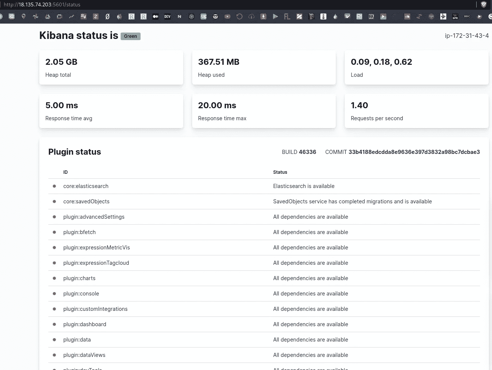

点击*自行探索*，进入*管理>堆栈管理*:


转到*索引图案*，使用`filebeat-*`蒙版为基巴纳创建一个新图案，在右侧会看到，基巴纳已经找到了相应的弹性搜索索引:

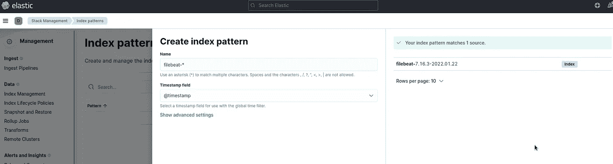

我们可以看到所有字段，已经由 Kibana 索引:


转到*可观察性—日志* s:

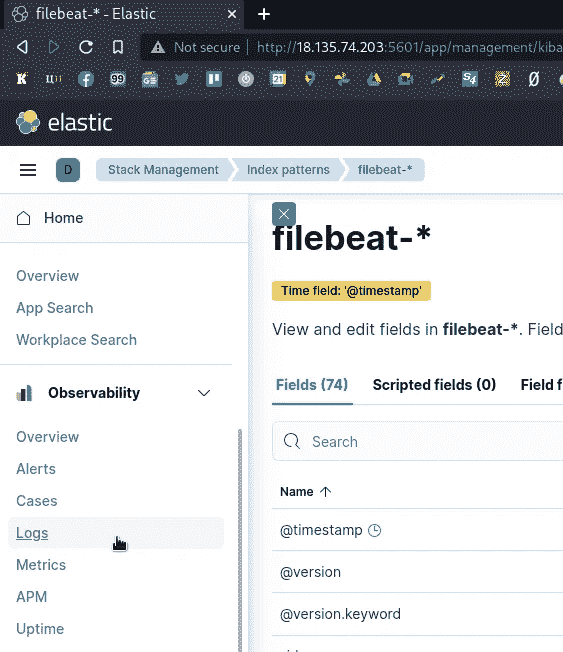

并且可以看到我们的`/var/log/syslog`:


# Logstash、Filebeat 和 NGINX:配置示例

现在，让我们从现实世界中做一些事情:

1.  安装 NGINX
2.  配置 Filebeat 来收集 NGINX 的日志
3.  配置 Logstash 以接受它们并将数据保存到弹性域
4.  并将检查基巴纳

安装 NGINX:

```
root@ip-172–31–43–4:/home/ubuntu# apt -y install nginx
```

检查其日志文件:

```
root@ip-172–31–43–4:/home/ubuntu# ll /var/log/nginx/
access.log error.log
```

检查 web 服务器是否工作正常:

```
root@ip-172–31–43–4:/home/ubuntu# curl localhost:80
<!DOCTYPE html>
<html>
<head>
<title>Welcome to nginx!</title>
…
```

и`access.log`:

```
root@ip-172–31–43–4:/home/ubuntu# tail -1 /var/log/nginx/access.log
127.0.0.1 — — [26/Jan/2022:11:33:21 +0000] “GET / HTTP/1.1” 200 612 “-” “curl/7.68.0”
```

好吧。

## Filebeat 输入配置

文档— [配置输入](https://www.elastic.co/guide/en/beats/filebeat/current/configuration-filebeat-options.html)，而[配置通用设置](https://www.elastic.co/guide/en/beats/filebeat/current/configuration-general-options.html)。

编辑`filebeat.inputs`块，向`/var/log/syslog`输入添加两个新的-用于 NGINX 的访问和错误日志:

```
...
# ============================== Filebeat inputs ===============================

filebeat.inputs:

- type: filestream
  enabled: true
  paths:
    - /var/log/syslog
  fields:
    type: syslog
  fields_under_root: true
  scan_frequency: 5s

- type: log
  enabled: true
  paths:
      - /var/log/nginx/access.log
  fields:
    type: nginx_access
  fields_under_root: true
  scan_frequency: 5s

- type: log
  enabled: true
  paths:
      - /var/log/nginx/error.log
  fields:
    type: nginx_error
  fields_under_root: true
  scan_frequency: 5s
...
```

这里，我们使用的是`log`类型的输入，并将添加一个新的字段——`type: nginx_access/nginx_error`。

## 日志存储配置

删除我们之前创建的 Logstash 的配置文件`/etc/logstash/conf.d/beats.conf`，并改写它:

```
input {
  beats {
    port => 5044
  }
}

filter {
  if [type] == "syslog" {
    grok {
      match => { "message" => "%{SYSLOGTIMESTAMP:syslog_timestamp} %{SYSLOGHOST:syslog_hostname} %{DATA:syslog_program}(?:\[%{POSINT:syslog_pid}\])?: %{GREEDYDATA:syslog_message}" }
      add_field => [ "received_at", "%{@timestamp}" ]
      add_field => [ "received_from", "%{host}" ]
      remove_field => "message"
    }
  }
}

filter {
 if [type] == "nginx_access" {
    grok {
        match => { "message" => "%{IPORHOST:remote_ip} - %{DATA:user} \[%{HTTPDATE:access_time}\] \"%{WORD:http_method} %{DATA:url} HTTP/%{NUMBER:http_version}\" %{NUMBER:response_code} %{NUMBER:body_sent_bytes} \"%{DATA:referrer}\" \"%{DATA:agent}\"" }
    }
  }
  date {
        match => [ "timestamp" , "dd/MMM/YYYY:HH:mm:ss Z" ]
  }
  geoip {
         source => "remote_ip"
         target => "geoip"
         add_tag => [ "nginx-geoip" ]
  } 
} 

output {

  if [type] == "syslog" {
    elasticsearch {
      hosts => ["localhost:9200"]
      index => "logstash-%{+YYYY.MM.dd}"
    }
  }

  if [type] == "nginx_access" {
    elasticsearch { 
      hosts => ["localhost:9200"]
      index => "nginx-%{+YYYY.MM.dd}"
    }
  }

  stdout { }
}
```

这里我们设置了:

1.  `input`上的 5044 端口为`filebeat`
2.  两个`filter`:
3.  第一个:将检查`type`字段，如果它的值== *syslog* ，那么 Logstash 将解析它的数据
4.  第二个:将检查`type`字段，如果它的值== *nginx_access* ，那么 Logstash 将把它的数据解析为 NGINX access-log
5.  `outout`使用两个`if`条件，并根据结果将数据传递给索引`logstash-%{+YYYY.MM.dd}`(用于 syslog)或`nginx-%{+YYYY.MM.dd}`(用于 NGINX)

重新启动 Logstash 和 Filebeat:

```
root@ip-172–31–43–4:/home/ubuntu# systemctl restart logstash
root@ip-172–31–43–4:/home/ubuntu# systemctl restart filebeat
```

循环运行`curl`,在 NGINX access-log 中生成一些数据:

```
ubuntu@ip-172–31–43–4:~$ watch -n 1 curl -I localhost
```

检查弹性搜索指数:

```
root@ip-172–31–43–4:/home/ubuntu# curl localhost:9200/_cat/indices?v
health status index uuid pri rep docs.count docs.deleted store.size pri.store.size
…
yellow open logstash-2022.01.28 bYLp_kI3TwW3sPfh7XpcuA 1 1 213732 0 159mb 159mb
…
yellow open nginx-2022.01.28 0CwH4hBhT2C1sMcPzCQ9Pg 1 1 1 0 32.4kb 32.4kb
```

这是我们新的 NGINX 指数。

转到 Kibana，添加另一个索引模式`logstash-*`:

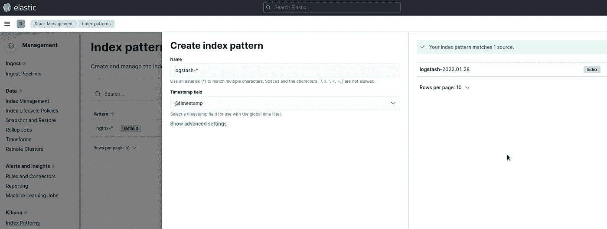

转到*分析>发现*，选择一个指数，并查看您的数据:

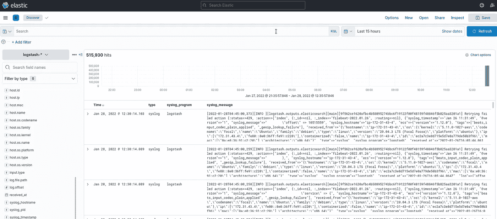

同样，对于 NGINX 日志:

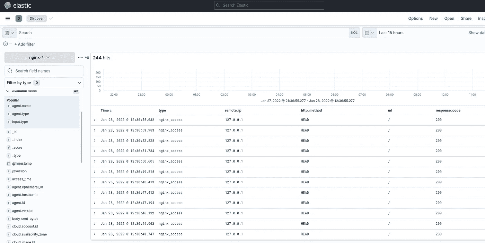

完成了。

# 有用的链接

## 弹性堆叠

*   [Kubernetes 1.15 上使用 Helm v3 的弹性堆栈](/deploy-elastic-stack-on-kubernetes-1-15-using-helm-v3-9105653c7c8)
*   [麋鹿栈教程:Elasticsearch、Logstash、Kibana、& Beats](https://phoenixnap.com/kb/elk-stack) 入门
*   [如何在 Ubuntu 18.04 / 20.04 上安装 ELK Stack (Elasticsearch、Logstash 和 Kibana)](https://phoenixnap.com/kb/how-to-install-elk-stack-on-ubuntu)
*   [更新了 2022 年的 ELK 堆栈指南](https://logit.io/blog/post/elk-stack-guide)
*   [如何在 Ubuntu 18.04 上安装 Elasticsearch、Logstash 和 Kibana(弹性堆栈)](https://www.digitalocean.com/community/tutorials/how-to-install-elasticsearch-logstash-and-kibana-elastic-stack-on-ubuntu-18-04)

## 弹性搜索

*   [弹性搜索指数](https://opster.com/guides/elasticsearch/glossary/elasticsearch-index/#)

## Logstash

*   Logstash 是如何工作的
*   [过滤器插件](https://www.elastic.co/guide/en/logstash/current/filter-plugins.html)
*   [Logstash 实用介绍](https://www.elastic.co/blog/a-practical-introduction-to-logstash)
*   [开始使用 logstash](http://logstash-docs.elasticsearch.org.s3.amazonaws.com/logstash-reference.html)
*   [教程:带示例的 Logstash Grok 模式](https://coralogix.com/blog/logstash-grok-tutorial-with-examples/)
*   Logstash Grok 初学者指南
*   [Beats 输入插件](https://www.elastic.co/guide/en/logstash/current/plugins-inputs-beats.html)

## Filebeat

*   【Filebeat 入门

*最初发布于* [*RTFM: Linux、DevOps、系统管理*](https://rtfm.co.ua/en/elastic-stack-an-overview-and-elk-installation-on-ubuntu-20-04/) *。*