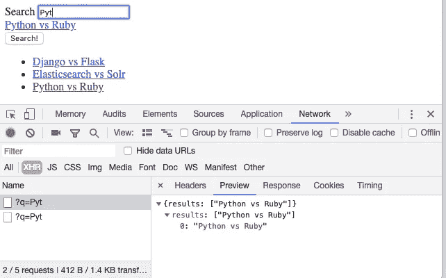

# Django 的 Elasticsearch 自动完成

> 原文：<https://itnext.io/elasticsearch-autocomplete-for-django-9dffef1d3afb?source=collection_archive---------0----------------------->

你知道什么是 Elasticsearch，想知道如何用它来改进你的网站搜索？

让我们从[上一篇文章](https://medium.com/@s.lyapustin/django-polls-app-with-elasticsearch-ffc02b9e79d9)更新我们的搜索，使其具有自动完成功能。

# 什么是自动完成？

自动完成是你的搜索表单的一个很好的特性，当用户试图在你的网站上写搜索查询时，你可以用建议来引导他。


# N-Grams

为了使用自动完成，我们会将用户输入发送到我们的后端，因为他们在输入字段中键入它。该输入通常包括各种组合的短语。

为了得到最好的结果，我们需要使用[*n-grams*](https://medium.com/programming-tid-bits/weekend-hacks-n-grams-f4398fc9d554)*到对原文中的单词组合生成有效的索引。*

*我们将在搜索索引上创建一个额外的 **EdgeNgramField** 字段来存储基于问题 **question_text** 字段的数据:*

```
***class** QuestionIndex(indexes.SearchIndex, indexes.Indexable):
    ...
    text_auto = indexes.EdgeNgramField(model_attr=**'question_text'**)
    ...*
```

*由于我们已经更改了索引模式，因此需要重建索引:*

```
*./manage.py rebuild_index*
```

*现在我们可以使用 Haystack[autocomplete()](https://django-haystack.readthedocs.io/en/latest/searchqueryset_api.html#autocomplete)方法进行查询:*

```
*SearchQuerySet().autocomplete(text_auto='old')*
```

*另外，让我们稍微改变一下 Haystack 设置，这样我们的模型中的任何更新都会在出现时立即发送到 Elasticsearch。因此，如果您添加、更新或删除问题，他们会立即发送到 Elasticsearch:*

```
*# Update Search index in realtime (using models.db.signals)
HAYSTACK_SIGNAL_PROCESSOR = **'haystack.signals.RealtimeSignalProcessor'***
```

*这基本上是我们在弹性搜索/干草堆方面需要做的所有事情。*

# *自动完成视图*

*为了处理自动完成请求，让我们创建一个端点`/autocomplete?q=<>``，它将响应与用户输入相匹配的问题的 JSON 列表。*

*因此，如果用户输入 query `elastic djan`，它将使用适当问题列表的 JSON 列表进行响应。为了前任。：*

```
*{
  "results": 
    [
      "Django Elasticsearch",
      "Poll App with Elastcisearch and Django"
]*
```

*视图非常简单，它接受`q` GET 查询，进行自动完成搜索，并返回 5 个最相关问题的字符串表示作为 JSON 响应:*

```
***def** autocomplete(request):
    max_items = 5
    q = request.GET.get(**'q'**)
    **if** q:
        sqs = SearchQuerySet().autocomplete(text_auto=q)
        results = [str(result.object) **for** result **in** sqs[:max_items]]
    **else**:
        results = []

    **return** JsonResponse({
        **'results'**: results
    })*
```

*让我们将该视图添加到`urls.py`文件中的`urlpatterns`:*

```
*urlpatterns = [
    ...
    path(**'autocomplete/'**, views.autocomplete, name=**'autocomplete'**),
]*
```

*后端就是这样。*

# *在前端处理自动完成*

*有很多 JS 助手会这样做。我们将重用 jQuery [从草堆中自动完成](https://github.com/inoks/django-polls-elasticsearch/blob/master/app/polls/static/polls/js/autocomplete.js)[示例](https://django-haystack.readthedocs.io/en/latest/autocomplete.html#example-implementation):*

```
*<**form action="****" class="autocomplete"**>
  <**label for="q"**>Search</**label**>
  <**input id="q" name="q" type="text" autocomplete="off"**>
  <**input type="submit" value="Search!"**>
</**form**>

<**script src="https://code.jquery.com/jquery-3.3.1.min.js"**></**script**>
<**script src="****"**></**script**>

<**script type="text/javascript"**>
  **$**(**function** () {
    ***window***.**autocomplete** = **new** *Autocomplete*({
      **form_selector**: **'.autocomplete'**,
      **url**: **'****'** });
    ***window***.**autocomplete**.setup()
  });
</**script**>*
```

*我们在这里做什么？我们有一个带有输入字段的表单，这是我们的自动完成查询的来源。*

*一旦用户输入的查询字符串超过 3 个符号，我们就向我们的`/autocomplete`端点发送一个请求，以便找到相关的内容。*

*如果我们找到了什么—我们会将它显示在输入字段下，可以选择该字段进行搜索查询。*

**

*就是这样。*